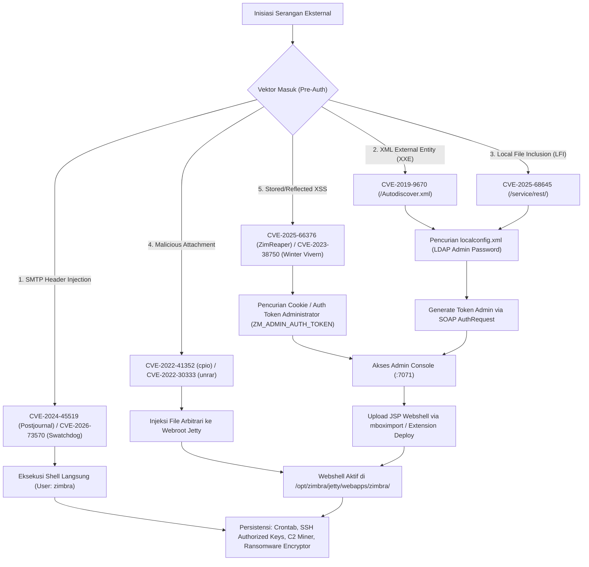

<!-- markdownlint-disable MD013 MD024 MD026 MD033 MD034 MD028 MD031 -->

# ZIMBRA LINK INSTALLER — THE COMPLETE ZIMBRA COLLABORATION ARCHIVE & INSTALLER SUITE

Enterprise Direct Binary Downloads, Official & Unofficial Community Builds, Cryptographic Checksums, Security Advisories, and Automated CLI Installer (ZCS 4.5.x – 10.1.x)

By **Harry Dertin Sutisna Alsyundawy**

[](https://github.com/alsyundawy)
[](https://opensource.org/licenses/MIT)
[](https://github.com/alsyundawy/Zimbra-Link-Installer)
[-success.svg>)](https://github.com/alsyundawy/Zimbra-Link-Installer)
[](https://github.com/alsyundawy/Zimbra-Link-Installer)
[](https://github.com/alsyundawy)
[](https://wa.me/6285658515212)
[](https://t.me/alsyundawy)
[](https://www.paypal.me/alsyundawy)
[](https://ko-fi.com/alsyundawy)
[](https://github.com/sponsors/alsyundawy)

---

## Table of Contents

- [Overview](#overview)
- [Original Links & References](#original-links--references)
- [Quickstart](#quickstart)
- [Automated CLI Installer (`zimbra-link-installer.sh`)](#automated-cli-installer-zimbra-link-installersh)
- [Dependencies](#dependencies)
- [Download Verification Status & Legend](#download-verification-status--legend)
- [Official Zimbra Release Archive (4.5.x – 10.1.x)](#official-zimbra-release-archive-45x--101x)
  - [ZCS 10.1.x Series Official Releases (Daffodil)](#zcs-101x-series-official-releases-daffodil)
  - [ZCS 10.0.x Series Official Releases (Daffodil)](#zcs-100x-series-official-releases-daffodil)
  - [ZCS 9.0.0.x Series Official Releases (Kepler)](#zcs-900x-series-official-releases-kepler)
  - [ZCS 8.8.x Series Official Releases (Joule)](#zcs-88x-series-official-releases-joule)
  - [ZCS 8.7.x Series Official Releases (JudasPriest)](#zcs-87x-series-official-releases-judaspriest)
  - [ZCS 8.6.0 Series Official Releases & Cumulative Security Patches](#zcs-860-series-official-releases--cumulative-security-patches)
  - [ZCS 8.5.x Series Official Releases (8.5.1 GA & 8.5.0 GA)](#zcs-85x-series-official-releases-851-ga--850-ga)
  - [ZCS 8.0.x Series Official Releases (8.0.9 GA down to 8.0.3 GA)](#zcs-80x-series-official-releases-809-ga-down-to-803-ga)
  - [ZCS 7.x Legacy Official Releases (7.2.7 GA, 7.2.0 GA, 7.1.3 GA, 7.0.1 GA)](#zcs-7x-legacy-official-releases-727-ga-720-ga-713-ga-701-ga)
  - [ZCS 6.x Legacy Official Releases (6.0.10 GA, 6.0.9 GA, 6.0.7 GA)](#zcs-6x-legacy-official-releases-6010-ga-609-ga-607-ga)
  - [ZCS 5.x Legacy Official Releases (5.0.10 GA down to 5.0.0 GA)](#zcs-5x-legacy-official-releases-5010-ga-down-to-500-ga)
  - [ZCS 4.5.x Historical Archive (4.5.10 GA down to 4.5.5 GA)](#zcs-45x-historical-archive-4510-ga-down-to-455-ga)
- [Unofficial & Community FOSS Archive (2018–2026)](#unofficial--community-foss-archive-20182026)
  - [TechFiles.online Zimbra FOSS 10.1.x (Ian Walker Builds)](#techfilesonline-zimbra-foss-101x-ian-walker-builds)
  - [ZCS FOSS 10.1.x Series (All 26 Community Releases 2024–2026)](#zcs-foss-101x-series-all-26-community-releases-20242026)
  - [ZCS FOSS 10.0.x Series (All 17 Community Releases 2023–2026)](#zcs-foss-100x-series-all-17-community-releases-20232026)
  - [ZCS FOSS 9.0.0.x Series (All 8 Kepler Community Releases 2020–2025)](#zcs-foss-900x-series-all-8-kepler-community-releases-20202025)
  - [ZCS FOSS 8.8.15.x Series (All Joule Community Releases 2018–2024)](#zcs-foss-8815x-series-all-joule-community-releases-20182024)
- [Build Systems & Source Compilation Guide](#build-systems--source-compilation-guide)
- [Configuration](#configuration)
- [Security Architecture & Comprehensive CVE Matrix (2016–2026)](#security-architecture--comprehensive-cve-matrix-20162026)
  - [Master Vulnerability Matrix & Affected Versions (2016–2026)](#master-vulnerability-matrix--affected-versions-20162026)
  - [Deep Architecture & Attack Surface Analysis](#deep-architecture--attack-surface-analysis)
  - [Taxonomy of Zimbra Threat Vectors & Exploit Chains](#taxonomy-of-zimbra-threat-vectors--exploit-chains)
  - [Zero-Day Emergency Incident Response & Hardening Protocol](#zero-day-emergency-incident-response--hardening-protocol)
- [Operational Best Practices (RFC 2119)](#operational-best-practices-rfc-2119)
- [Strategic Migration & Upgrade Methodology](#strategic-migration--upgrade-methodology)
- [Running Tests](#running-tests)
- [Ecosystem Tools & Repositories](#ecosystem-tools--repositories)
- [Contributing](#contributing)
- [Official Contact & Author](#official-contact--author)
- [License](#license)

---

## Overview

**Zimbra Link Installer** adalah repositori referensi arsitektural enterprise, indeks arsip biner lengkap, dan utilitas instalasi otomatis untuk **Zimbra Collaboration Suite (ZCS)** dari rilis historis **4.5.x hingga rilis aktif 10.1.x**.

Repositori ini menyatukan:

1. **Interactive Bash CLI Installer (`zimbra-link-installer.sh` v2.6.0):** Utilitas interaktif aman dengan _pre-flight system audit_ (RAM, storage, FQDN DNS, POSIX pax), penanganan sinyal _atomic cleanup trap_, _privilege elevation helper_ (`run_privileged`), dan verifikasi integritas kriptografi SHA256/MD5 otomatis.
2. **Comprehensive Official & Unofficial Archive:** Mengindeks seluruh tautan unduhan langsung biner resmi (_Network Edition, Open Source Edition, Cumulative Security Patches_) dari `files.zimbra.com` serta seluruh kompilasi biner komunitas independen (_FOSS Edition 2018–2026_).
3. **Cryptographic Checksums:** Nilai hash MD5 dan SHA256 untuk memverifikasi integritas setiap installer secara case-insensitive.
4. **Compilation Masterclass:** Panduan lengkap kompilasi mandiri kode sumber ZCS (8.8, 9.0, 10.0, 10.1) pada Ubuntu (20.04, 22.04, 24.04) dan RHEL/Rocky/Alma/Oracle (8 & 9).
5. **Security Vulnerability Dossier:** Analisis 32+ CVE (2016–2026) dengan **rincian versi terdampak secara spesifik**, taksonomi eksploitasi, dan panduan mitigasi Zero-Day.

---

## Original Links & References

Tautan resmi portal Zimbra Synacor, dokumentasi wiki, dan repository referensi:

- Official Open Source Downloads: <https://www.zimbra.com/downloads/zimbra-collaboration-open-source/>
- Official Network Edition Downloads: <https://www.zimbra.com/downloads/zimbra-collaboration/>
- Zimbra Wiki Releases: <https://wiki.zimbra.com/wiki/Zimbra_Releases>
- Zimbra Source Repositories: <https://github.com/Zimbra/zm-build>
- Upstream Bit Repository: [alsyundawy/zimbra_bits](https://github.com/alsyundawy/zimbra_bits)
- Direct Download Reference: [martbrooks/zimbra_direct_downloads](https://github.com/martbrooks/zimbra_direct_downloads)

---

## Quickstart

### Metode 1: Menggunakan Script Otomatis Interaktif (Direkomendasikan)

Cukup jalankan satu perintah berikut pada terminal server Anda:

```bash
# Unduh dan jalankan Zimbra Link Installer secara langsung
curl -fsSL https://raw.githubusercontent.com/alsyundawy/Zimbra-Link-Installer/main/zimbra-link-installer.sh -o zimbra-link-installer.sh
chmod +x zimbra-link-installer.sh
sudo ./zimbra-link-installer.sh
```

### Metode 2: Unduhan Manual Biner Target

```bash
# 1. Unduh paket installer target (Contoh: ZCS FOSS 10.1.20 untuk Ubuntu 22.04 LTS)
wget https://cdn.techfiles.online/ubuntu/zcs-10.1.20_GA_0326.UBUNTU22_64.20260821115118.tgz   --header="Referer: https://techfiles.online/"

# 2. Verifikasi checksum SHA256
wget https://cdn.techfiles.online/ubuntu/zcs-10.1.20_GA_0326.UBUNTU22_64.20260821115118.tgz.sha256   --header="Referer: https://techfiles.online/"
sha256sum -c zcs-10.1.20_GA_0326.UBUNTU22_64.20260821115118.tgz.sha256

# 3. Ekstrak dan jalankan instalasi
tar -xzvf zcs-10.1.20_GA_0326.UBUNTU22_64.20260821115118.tgz
cd zcs-10.1.20_GA_0326.UBUNTU22_64.20260821115118
sudo ./install.sh
```

---

## Automated CLI Installer (`zimbra-link-installer.sh`)

Skrip `zimbra-link-installer.sh` (v2.6.0) menyederhanakan siklus pengunduhan dan instalasi ZCS di lingkungan Linux enterprise:

```text
====================================================================
               Z I M B R A   L I N K   I N S T A L L E R
          Enterprise Binary Downloader & Automated Suite (v2.6.0)
====================================================================
[+] Detected OS Architecture: x86_64
[+] Detected Operating System: Ubuntu 22.04 LTS (jammy)

PILIH KATEGORI BINER ZIMBRA:
  1) Zimbra OFFICIAL Network Edition (NE) [10.1, 10.0, 9.0, 8.8.x, 8.7.x, 8.6, 8.5, 8.0, 7.x]
  2) Zimbra OFFICIAL Open Source Edition (FOSS/OSE) [8.8.x, 8.7.x, 8.6, 8.5, 8.0, 7.x]
  3) Zimbra UNOFFICIAL / Community FOSS Builds [10.1.x, 10.0.x, 9.0.0, 8.8.15 (2018–2026)]
  4) Jalankan Pre-Flight System Audit & Prerequisite Check
  5) Jalankan Uji Telemetri Seluruh Link Biner (Deep Link Validator)
  0) Keluar
====================================================================
```

### Fitur Utama CLI

- **Defensive Shell Architecture:** Dilengkapi `set -Eeuo pipefail`, `IFS=$'
'`, dan `umask 022` untuk perlindungan dari race-condition dan word splitting.
- **Deteksi Otomatis Sistem:** Mengidentifikasi distribusi (Ubuntu/Debian/RHEL/Rocky/Alma/Oracle Linux), arsitektur kernel, kapasitas RAM, dan storage `/opt/zimbra`.
- **Pre-Flight FQDN & Pax Audit:** Memeriksa kesiapan FQDN DNS resolver (`hostname -f`) dan memastikan utilitas POSIX `pax` telah aktif guna menangkal CVE-2022-41352.
- **Anti-Hotlink Header Handling:** Menginjeksi header `Referer` secara otomatis saat mengunduh dari CDN komunitas TechFiles.
- **Integritas Kriptografi Otomatis:** Mengunduh hash `.sha256` atau `.md5` dan memvalidasi file arsip secara case-insensitive sebelum diekstrak.
- **Atomic Cleanup:** Menangkap sinyal `EXIT`, `INT`, `TERM`, `HUP` untuk pembersihan aman direktori temporer.

---

## Dependencies

Sebelum instalasi atau kompilasi ZCS, pastikan dependensi sistem berikut telah terpenuhi:

### 1. Kebutuhan Runtime Minimum

- **Arsitektur:** `x86_64` (64-bit Linux).
- **Memori RAM:** Minimal 8 GB RAM (Direkomendasikan 16–32 GB untuk server produksi aktif).
- **Disk Space:** Minimal 50 GB ruang kosong pada direktori `/opt/zimbra`.
- **Utilitas Wajib:** `pax`, `net-tools`, `sysstat`, `libaio1`, `perl`, `cron`.

### 2. Kebutuhan Toolchain Kompilasi (Build Environment)

- **Java Development Kit:** OpenJDK 11 / OpenJDK 17 (`openjdk-11-jdk`, `openjdk-17-jdk`).
- **Build Automations:** Apache Ant (`ant`, `ant-optional`), Apache Maven (`mvn`).
- **C/C++ Native Toolchain:** `gcc`, `g++`, `make`, `cmake`, `libtool`, `autoconf`, `automake`, `pkg-config`, `libcppunit-dev`.
- **Scripting & Engine:** Perl modules (`XML::Simple`, `Data::UUID`, `File::Slurp`, `JSON`, `YAML`), Ruby, Node.js, NPM.

---

## Download Verification Status & Legend

Setiap tautan unduhan dalam repositori ini telah diuji secara berkala dengan skrip telemetri HTTP. Berikut arti label status yang disematkan:

- 🟢 **`[Active Direct]`** — Tautan langsung aktif pada server resmi `files.zimbra.com` atau GitHub CDN (HTTP 200 OK). Dapat diunduh secara instan tanpa header khusus.
- 🟡 **`[Referer Req]`** — Tautan aktif pada mirror CDN TechFiles.online. **Wajib** menyertakan header referer `Referer: https://techfiles.online/` saat diunduh via CLI / automation script.
- 🔴 **`[Need Mirror / Portal Only]`** — File biner telah diarsipkan oleh upstream vendor atau memerlukan akun berbayar Synacor Portal. Disarankan melakukan kompilasi mandiri via `zm-build` atau menggunakan rilis komunitas yang setara.

---

## Official Zimbra Release Archive (4.5.x – 10.1.x)

> [!NOTE]
> Seluruh tautan biner resmi dari **ZCS 4.5.x hingga 10.1.x**, paket rilis komersial **Network Edition (NE)**, edisi **Open Source Edition (FOSS)**, serta **Cumulative Security Patches** langsung dari server resmi `files.zimbra.com` (berdasarkan dokumentasi [Zimbra Releases Wiki](https://wiki.zimbra.com/wiki/Zimbra_Releases)):

### ZCS 10.1.x Series Official Releases (Daffodil)

| <small>Version</small>       | <small>Edition</small> | <small>OS / Platform</small>         |                                                    <small>Binary (.tgz)</small>                                                    |                                                        <small>MD5</small>                                                        |                                                         <small>SHA256</small>                                                          |
| :--------------------------- | :--------------------: | :----------------------------------- | :--------------------------------------------------------------------------------------------------------------------------------: | :------------------------------------------------------------------------------------------------------------------------------: | :------------------------------------------------------------------------------------------------------------------------------------: |
| <small>`10.1.0 GA`</small>   | <small>**NE**</small>  | <small>Ubuntu 22.04</small>          | <small>[Download](https://files.zimbra.com/downloads/10.1.0_GA/zcs-NETWORK-10.1.0_GA_4655.UBUNTU22_64.20240819064312.tgz)</small>  | <small>[MD5](https://files.zimbra.com/downloads/10.1.0_GA/zcs-NETWORK-10.1.0_GA_4655.UBUNTU22_64.20240819064312.tgz.md5)</small> | <small>[SHA256](https://files.zimbra.com/downloads/10.1.0_GA/zcs-NETWORK-10.1.0_GA_4655.UBUNTU22_64.20240819064312.tgz.sha256)</small> |
| <small>`10.1.0 GA`</small>   | <small>**NE**</small>  | <small>Ubuntu 20.04</small>          |                                                          <small>-</small>                                                          | <small>[MD5](https://files.zimbra.com/downloads/10.1.0_GA/zcs-NETWORK-10.1.0_GA_4633.UBUNTU20_64.20240610085557.tgz.md5)</small> | <small>[SHA256](https://files.zimbra.com/downloads/10.1.0_GA/zcs-NETWORK-10.1.0_GA_4633.UBUNTU20_64.20240610085557.tgz.sha256)</small> |
| <small>`10.1.0 GA`</small>   | <small>**NE**</small>  | <small>Ubuntu 18.04</small>          |                                                          <small>-</small>                                                          | <small>[MD5](https://files.zimbra.com/downloads/10.1.0_GA/zcs-NETWORK-10.1.0_GA_4633.UBUNTU18_64.20240610085557.tgz.md5)</small> | <small>[SHA256](https://files.zimbra.com/downloads/10.1.0_GA/zcs-NETWORK-10.1.0_GA_4633.UBUNTU18_64.20240610085557.tgz.sha256)</small> |
| <small>`10.1.0 GA`</small>   | <small>**NE**</small>  | <small>RHEL 7 / CentOS 7</small>     |                                                          <small>-</small>                                                          |  <small>[MD5](https://files.zimbra.com/downloads/10.1.0_GA/zcs-NETWORK-10.1.0_GA_4633.RHEL7_64.20240610085557.tgz.md5)</small>   |  <small>[SHA256](https://files.zimbra.com/downloads/10.1.0_GA/zcs-NETWORK-10.1.0_GA_4633.RHEL7_64.20240610085557.tgz.sha256)</small>   |
| <small>`10.1.0 GA`</small>   | <small>**NE**</small>  | <small>RHEL / Rocky / Alma 9</small> |   <small>[Download](https://files.zimbra.com/downloads/10.1.0_GA/zcs-NETWORK-10.1.0_GA_4688.RHEL9_64.20240911074203.tgz)</small>   |  <small>[MD5](https://files.zimbra.com/downloads/10.1.0_GA/zcs-NETWORK-10.1.0_GA_4688.RHEL9_64.20240911074203.tgz.md5)</small>   |  <small>[SHA256](https://files.zimbra.com/downloads/10.1.0_GA/zcs-NETWORK-10.1.0_GA_4688.RHEL9_64.20240911074203.tgz.sha256)</small>   |
| <small>`10.1.0 BETA`</small> | <small>**NE**</small>  | <small>RHEL / Rocky / Alma 9</small> | <small>[Download](https://files.zimbra.com/downloads/10.1.0_BETA/zcs-NETWORK-10.1.0_BETA_4649.RHEL9_64.20240726093615.tgz)</small> |                                                         <small>-</small>                                                         |                                                            <small>-</small>                                                            |

### ZCS 10.0.x Series Official Releases (Daffodil)

| <small>Version</small>     | <small>Edition</small> | <small>OS / Platform</small>         |                                                   <small>Binary (.tgz)</small>                                                    |                                                        <small>MD5</small>                                                        |                                                         <small>SHA256</small>                                                          |
| :------------------------- | :--------------------: | :----------------------------------- | :-------------------------------------------------------------------------------------------------------------------------------: | :------------------------------------------------------------------------------------------------------------------------------: | :------------------------------------------------------------------------------------------------------------------------------------: |
| <small>`10.0.0 GA`</small> | <small>**NE**</small>  | <small>Ubuntu 20.04</small>          | <small>[Download](https://files.zimbra.com/downloads/10.0.0_GA/zcs-NETWORK-10.0.0_GA_4518.UBUNTU20_64.20230301065514.tgz)</small> | <small>[MD5](https://files.zimbra.com/downloads/10.0.0_GA/zcs-NETWORK-10.0.0_GA_4518.UBUNTU20_64.20230301065514.tgz.md5)</small> |                                                            <small>-</small>                                                            |
| <small>`10.0.0 GA`</small> | <small>**NE**</small>  | <small>Ubuntu 18.04</small>          | <small>[Download](https://files.zimbra.com/downloads/10.0.0_GA/zcs-NETWORK-10.0.0_GA_4518.UBUNTU18_64.20230301065514.tgz)</small> | <small>[MD5](https://files.zimbra.com/downloads/10.0.0_GA/zcs-NETWORK-10.0.0_GA_4518.UBUNTU18_64.20230301065514.tgz.md5)</small> | <small>[SHA256](https://files.zimbra.com/downloads/10.0.0_GA/zcs-NETWORK-10.0.0_GA_4518.UBUNTU18_64.20230301065514.tgz.sha256)</small> |
| <small>`10.0.0 GA`</small> | <small>**NE**</small>  | <small>RHEL 7 / CentOS 7</small>     |  <small>[Download](https://files.zimbra.com/downloads/10.0.0_GA/zcs-NETWORK-10.0.0_GA_4518.RHEL7_64.20230301065514.tgz)</small>   |  <small>[MD5](https://files.zimbra.com/downloads/10.0.0_GA/zcs-NETWORK-10.0.0_GA_4518.RHEL7_64.20230301065514.tgz.md5)</small>   |                                                            <small>-</small>                                                            |
| <small>`10.0.0 GA`</small> | <small>**NE**</small>  | <small>RHEL / Rocky / Alma 8</small> |                                                         <small>-</small>                                                          |  <small>[MD5](https://files.zimbra.com/downloads/10.0.0_GA/zcs-NETWORK-10.0.0_GA_4518.RHEL8_64.20230301065514.tgz.md5)</small>   |                                                            <small>-</small>                                                            |

### ZCS 9.0.0.x Series Official Releases (Kepler)

| <small>Version</small>      | <small>Edition</small> | <small>OS / Platform</small>         |                                                          <small>Binary (.tgz)</small>                                                          |                                                              <small>MD5</small>                                                               |                                                                <small>SHA256</small>                                                                |
| :-------------------------- | :--------------------: | :----------------------------------- | :--------------------------------------------------------------------------------------------------------------------------------------------: | :-------------------------------------------------------------------------------------------------------------------------------------------: | :-------------------------------------------------------------------------------------------------------------------------------------------------: |
| <small>`9.0.0 GA`</small>   | <small>**NE**</small>  | <small>Ubuntu 20.04</small>          |        <small>[Download](https://files.zimbra.com/downloads/9.0.0_GA/zcs-NETWORK-9.0.0_GA_4178.UBUNTU20_64.20211112031526.tgz)</small>         |                                                               <small>-</small>                                                                |        <small>[SHA256](https://files.zimbra.com/downloads/9.0.0_GA/zcs-NETWORK-9.0.0_GA_4178.UBUNTU20_64.20211112031526.tgz.sha256)</small>         |
| <small>`9.0.0 GA`</small>   | <small>**NE**</small>  | <small>Ubuntu 18.04</small>          |                                                                <small>-</small>                                                                |        <small>[MD5](https://files.zimbra.com/downloads/9.0.0_GA/zcs-NETWORK-9.0.0_GA_3924.UBUNTU18_64.20200331010312.tgz.md5)</small>         |        <small>[SHA256](https://files.zimbra.com/downloads/9.0.0_GA/zcs-NETWORK-9.0.0_GA_3924.UBUNTU18_64.20200331010312.tgz.sha256)</small>         |
| <small>`9.0.0 GA`</small>   | <small>**NE**</small>  | <small>Ubuntu 16.04</small>          |                                                                <small>-</small>                                                                |        <small>[MD5](https://files.zimbra.com/downloads/9.0.0_GA/zcs-NETWORK-9.0.0_GA_3924.UBUNTU16_64.20200331010312.tgz.md5)</small>         |        <small>[SHA256](https://files.zimbra.com/downloads/9.0.0_GA/zcs-NETWORK-9.0.0_GA_3924.UBUNTU16_64.20200331010312.tgz.sha256)</small>         |
| <small>`9.0.0 GA`</small>   | <small>**NE**</small>  | <small>Ubuntu 14.04</small>          |                                                                <small>-</small>                                                                |        <small>[MD5](https://files.zimbra.com/downloads/9.0.0_GA/zcs-NETWORK-9.0.0_GA_3924.UBUNTU14_64.20200331010312.tgz.md5)</small>         |        <small>[SHA256](https://files.zimbra.com/downloads/9.0.0_GA/zcs-NETWORK-9.0.0_GA_3924.UBUNTU14_64.20200331010312.tgz.sha256)</small>         |
| <small>`9.0.0 GA`</small>   | <small>**NE**</small>  | <small>RHEL 7 / CentOS 7</small>     |          <small>[Download](https://files.zimbra.com/downloads/9.0.0_GA/zcs-NETWORK-9.0.0_GA_3924.RHEL7_64.20200331010312.tgz)</small>          |          <small>[MD5](https://files.zimbra.com/downloads/9.0.0_GA/zcs-NETWORK-9.0.0_GA_3924.RHEL7_64.20200331010312.tgz.md5)</small>          |                                                                  <small>-</small>                                                                   |
| <small>`9.0.0 GA`</small>   | <small>**NE**</small>  | <small>RHEL 6 / CentOS 6</small>     |          <small>[Download](https://files.zimbra.com/downloads/9.0.0_GA/zcs-NETWORK-9.0.0_GA_3924.RHEL6_64.20200331010312.tgz)</small>          |          <small>[MD5](https://files.zimbra.com/downloads/9.0.0_GA/zcs-NETWORK-9.0.0_GA_3924.RHEL6_64.20200331010312.tgz.md5)</small>          |          <small>[SHA256](https://files.zimbra.com/downloads/9.0.0_GA/zcs-NETWORK-9.0.0_GA_3924.RHEL6_64.20200331010312.tgz.sha256)</small>          |
| <small>`9.0.0 GA`</small>   | <small>**NE**</small>  | <small>RHEL / Rocky / Alma 8</small> |          <small>[Download](https://files.zimbra.com/downloads/9.0.0_GA/zcs-NETWORK-9.0.0_GA_3954.RHEL8_64.20200629045300.tgz)</small>          |          <small>[MD5](https://files.zimbra.com/downloads/9.0.0_GA/zcs-NETWORK-9.0.0_GA_3954.RHEL8_64.20200629045300.tgz.md5)</small>          |          <small>[SHA256](https://files.zimbra.com/downloads/9.0.0_GA/zcs-NETWORK-9.0.0_GA_3954.RHEL8_64.20200629045300.tgz.sha256)</small>          |
| <small>`9.0.0 GA`</small>   | <small>**NE**</small>  | <small>RHEL / Rocky / Alma 8</small> |          <small>[Download](https://files.zimbra.com/downloads/9.0.0_GA/zcs-NETWORK-9.0.0_GA_4325.RHEL8_64.20220629074359.tgz)</small>          |                                                               <small>-</small>                                                                |          <small>[SHA256](https://files.zimbra.com/downloads/9.0.0_GA/zcs-NETWORK-9.0.0_GA_4325.RHEL8_64.20220629074359.tgz.sha256)</small>          |
| <small>`9.0.0 BETA`</small> | <small>**NE**</small>  | <small>RHEL / Rocky / Alma 8</small> | <small>[Download](https://files.zimbra.com/downloads/9.0.0_BETA/Rocky_Linux_8/zcs-NETWORK-9.0.0_BETA_1014.RHEL8_64.20220326065507.tgz)</small> | <small>[MD5](https://files.zimbra.com/downloads/9.0.0_BETA/Rocky_Linux_8/zcs-NETWORK-9.0.0_BETA_1014.RHEL8_64.20220326065507.tgz.md5)</small> | <small>[SHA256](https://files.zimbra.com/downloads/9.0.0_BETA/Rocky_Linux_8/zcs-NETWORK-9.0.0_BETA_1014.RHEL8_64.20220326065507.tgz.sha256)</small> |

### ZCS 8.8.x Series Official Releases (Joule)

| <small>Version</small>       | <small>Edition</small>  | <small>OS / Platform</small>         |                                                   <small>Binary (.tgz)</small>                                                    |                                                        <small>MD5</small>                                                        |                                                                 <small>SHA256</small>                                                                 |
| :--------------------------- | :---------------------: | :----------------------------------- | :-------------------------------------------------------------------------------------------------------------------------------: | :------------------------------------------------------------------------------------------------------------------------------: | :---------------------------------------------------------------------------------------------------------------------------------------------------: |
| <small>`8.8.9 GA`</small>    | <small>**FOSS**</small> | <small>Ubuntu 16.04</small>          |      <small>[Download](https://files.zimbra.com/downloads/8.8.9_GA/zcs-8.8.9_GA_3019.UBUNTU16_64.20180809160254.tgz)</small>      |      <small>[MD5](https://files.zimbra.com/downloads/8.8.9_GA/zcs-8.8.9_GA_3019.UBUNTU16_64.20180809160254.tgz.md5)</small>      |             <small>[SHA256](https://files.zimbra.com/downloads/8.8.9_GA/zcs-8.8.9_GA_3019.UBUNTU16_64.20180809160254.tgz.sha256)</small>              |
| <small>`8.8.9 GA`</small>    | <small>**FOSS**</small> | <small>Ubuntu 14.04</small>          |      <small>[Download](https://files.zimbra.com/downloads/8.8.9_GA/zcs-8.8.9_GA_3019.UBUNTU14_64.20180809160254.tgz)</small>      |      <small>[MD5](https://files.zimbra.com/downloads/8.8.9_GA/zcs-8.8.9_GA_3019.UBUNTU14_64.20180809160254.tgz.md5)</small>      |             <small>[SHA256](https://files.zimbra.com/downloads/8.8.9_GA/zcs-8.8.9_GA_3019.UBUNTU14_64.20180809160254.tgz.sha256)</small>              |
| <small>`8.8.9 GA`</small>    | <small>**FOSS**</small> | <small>RHEL 7 / CentOS 7</small>     |       <small>[Download](https://files.zimbra.com/downloads/8.8.9_GA/zcs-8.8.9_GA_3019.RHEL7_64.20180809160254.tgz)</small>        |       <small>[MD5](https://files.zimbra.com/downloads/8.8.9_GA/zcs-8.8.9_GA_3019.RHEL7_64.20180809160254.tgz.md5)</small>        |               <small>[SHA256](https://files.zimbra.com/downloads/8.8.9_GA/zcs-8.8.9_GA_3019.RHEL7_64.20180809160254.tgz.sha256)</small>               |
| <small>`8.8.9 GA`</small>    | <small>**FOSS**</small> | <small>RHEL 6 / CentOS 6</small>     |       <small>[Download](https://files.zimbra.com/downloads/8.8.9_GA/zcs-8.8.9_GA_3019.RHEL6_64.20180809160254.tgz)</small>        |       <small>[MD5](https://files.zimbra.com/downloads/8.8.9_GA/zcs-8.8.9_GA_3019.RHEL6_64.20180809160254.tgz.md5)</small>        |               <small>[SHA256](https://files.zimbra.com/downloads/8.8.9_GA/zcs-8.8.9_GA_3019.RHEL6_64.20180809160254.tgz.sha256)</small>               |
| <small>`8.8.8 GA`</small>    |  <small>**NE**</small>  | <small>RHEL 7 / CentOS 7</small>     |   <small>[Download](https://files.zimbra.com/downloads/8.8.8_GA/zcs-NETWORK-8.8.8_GA_2009.RHEL7_64.20180322150747.tgz)</small>    |                                                         <small>-</small>                                                         |                                                                   <small>-</small>                                                                    |
| <small>`8.8.8 GA`</small>    | <small>**FOSS**</small> | <small>Ubuntu 16.04</small>          |      <small>[Download](https://files.zimbra.com/downloads/8.8.8_GA/zcs-8.8.8_GA_2009.UBUNTU16_64.20180322150747.tgz)</small>      |      <small>[MD5](https://files.zimbra.com/downloads/8.8.8_GA/zcs-8.8.8_GA_2009.UBUNTU16_64.20180322150747.tgz.md5)</small>      |             <small>[SHA256](https://files.zimbra.com/downloads/8.8.8_GA/zcs-8.8.8_GA_2009.UBUNTU16_64.20180322150747.tgz.sha256)</small>              |
| <small>`8.8.8 GA`</small>    | <small>**FOSS**</small> | <small>Ubuntu 14.04</small>          |      <small>[Download](https://files.zimbra.com/downloads/8.8.8_GA/zcs-8.8.8_GA_2009.UBUNTU14_64.20180322150747.tgz)</small>      |      <small>[MD5](https://files.zimbra.com/downloads/8.8.8_GA/zcs-8.8.8_GA_2009.UBUNTU14_64.20180322150747.tgz.md5)</small>      |             <small>[SHA256](https://files.zimbra.com/downloads/8.8.8_GA/zcs-8.8.8_GA_2009.UBUNTU14_64.20180322150747.tgz.sha256)</small>              |
| <small>`8.8.8 GA`</small>    | <small>**FOSS**</small> | <small>RHEL 7 / CentOS 7</small>     |       <small>[Download](https://files.zimbra.com/downloads/8.8.8_GA/zcs-8.8.8_GA_2009.RHEL7_64.20180322150747.tgz)</small>        |       <small>[MD5](https://files.zimbra.com/downloads/8.8.8_GA/zcs-8.8.8_GA_2009.RHEL7_64.20180322150747.tgz.md5)</small>        |               <small>[SHA256](https://files.zimbra.com/downloads/8.8.8_GA/zcs-8.8.8_GA_2009.RHEL7_64.20180322150747.tgz.sha256)</small>               |
| <small>`8.8.8 GA`</small>    | <small>**FOSS**</small> | <small>RHEL 6 / CentOS 6</small>     |       <small>[Download](https://files.zimbra.com/downloads/8.8.8_GA/zcs-8.8.8_GA_2009.RHEL6_64.20180322150747.tgz)</small>        |       <small>[MD5](https://files.zimbra.com/downloads/8.8.8_GA/zcs-8.8.8_GA_2009.RHEL6_64.20180322150747.tgz.md5)</small>        |               <small>[SHA256](https://files.zimbra.com/downloads/8.8.8_GA/zcs-8.8.8_GA_2009.RHEL6_64.20180322150747.tgz.sha256)</small>               |
| <small>`8.8.7 GA`</small>    | <small>**FOSS**</small> | <small>Ubuntu 16.04</small>          |      <small>[Download](https://files.zimbra.com/downloads/8.8.7_GA/zcs-8.8.7_GA_1964.UBUNTU16_64.20180223145016.tgz)</small>      |      <small>[MD5](https://files.zimbra.com/downloads/8.8.7_GA/zcs-8.8.7_GA_1964.UBUNTU16_64.20180223145016.tgz.md5)</small>      |             <small>[SHA256](https://files.zimbra.com/downloads/8.8.7_GA/zcs-8.8.7_GA_1964.UBUNTU16_64.20180223145016.tgz.sha256)</small>              |
| <small>`8.8.7 GA`</small>    | <small>**FOSS**</small> | <small>Ubuntu 14.04</small>          |      <small>[Download](https://files.zimbra.com/downloads/8.8.7_GA/zcs-8.8.7_GA_1964.UBUNTU14_64.20180223145016.tgz)</small>      |      <small>[MD5](https://files.zimbra.com/downloads/8.8.7_GA/zcs-8.8.7_GA_1964.UBUNTU14_64.20180223145016.tgz.md5)</small>      |             <small>[SHA256](https://files.zimbra.com/downloads/8.8.7_GA/zcs-8.8.7_GA_1964.UBUNTU14_64.20180223145016.tgz.sha256)</small>              |
| <small>`8.8.7 GA`</small>    | <small>**FOSS**</small> | <small>RHEL 7 / CentOS 7</small>     |       <small>[Download](https://files.zimbra.com/downloads/8.8.7_GA/zcs-8.8.7_GA_1964.RHEL7_64.20180223145016.tgz)</small>        |       <small>[MD5](https://files.zimbra.com/downloads/8.8.7_GA/zcs-8.8.7_GA_1964.RHEL7_64.20180223145016.tgz.md5)</small>        |               <small>[SHA256](https://files.zimbra.com/downloads/8.8.7_GA/zcs-8.8.7_GA_1964.RHEL7_64.20180223145016.tgz.sha256)</small>               |
| <small>`8.8.7 GA`</small>    | <small>**FOSS**</small> | <small>RHEL 6 / CentOS 6</small>     |       <small>[Download](https://files.zimbra.com/downloads/8.8.7_GA/zcs-8.8.7_GA_1964.RHEL6_64.20180223145016.tgz)</small>        |       <small>[MD5](https://files.zimbra.com/downloads/8.8.7_GA/zcs-8.8.7_GA_1964.RHEL6_64.20180223145016.tgz.md5)</small>        |               <small>[SHA256](https://files.zimbra.com/downloads/8.8.7_GA/zcs-8.8.7_GA_1964.RHEL6_64.20180223145016.tgz.sha256)</small>               |
| <small>`8.8.6 GA`</small>    |  <small>**NE**</small>  | <small>Ubuntu 16.04</small>          |                                                         <small>-</small>                                                          |  <small>[MD5](https://files.zimbra.com/downloads/8.8.6_GA/zcs-NETWORK-8.8.6_GA_1906.UBUNTU16_64.20171130041047.tgz.md5)</small>  |         <small>[SHA256](https://files.zimbra.com/downloads/8.8.6_GA/zcs-NETWORK-8.8.6_GA_1906.UBUNTU16_64.20171130041047.tgz.sha256)</small>          |
| <small>`8.8.6 GA`</small>    | <small>**FOSS**</small> | <small>Ubuntu 16.04</small>          |      <small>[Download](https://files.zimbra.com/downloads/8.8.6_GA/zcs-8.8.6_GA_1906.UBUNTU16_64.20171130041047.tgz)</small>      |                                                         <small>-</small>                                                         |                                                                   <small>-</small>                                                                    |
| <small>`8.8.5 GA`</small>    |  <small>**NE**</small>  | <small>RHEL 7 / CentOS 7</small>     |   <small>[Download](https://files.zimbra.com/downloads/8.8.5_GA/zcs-NETWORK-8.8.5_GA_1894.RHEL7_64.20171026035615.tgz)</small>    |                                                         <small>-</small>                                                         |                                                                   <small>-</small>                                                                    |
| <small>`8.8.5 GA`</small>    |  <small>**NE**</small>  | <small>RHEL 6 / CentOS 6</small>     |                                                         <small>-</small>                                                          |   <small>[MD5](https://files.zimbra.com/downloads/8.8.5_GA/zcs-NETWORK-8.8.5_GA_1894.RHEL6_64.20171026035615.tgz.md5)</small>    |                                                                   <small>-</small>                                                                    |
| <small>`8.8.5 GA`</small>    | <small>**FOSS**</small> | <small>Ubuntu 16.04</small>          |                                                         <small>-</small>                                                          |                                                         <small>-</small>                                                         |             <small>[SHA256](https://files.zimbra.com/downloads/8.8.5_GA/zcs-8.8.5_GA_1894.UBUNTU16_64.20171026035615.tgz.sha256)</small>              |
| <small>`8.8.5 GA`</small>    | <small>**FOSS**</small> | <small>RHEL 7 / CentOS 7</small>     |       <small>[Download](https://files.zimbra.com/downloads/8.8.5_GA/zcs-8.8.5_GA_1894.RHEL7_64.20171026035615.tgz)</small>        |                                                         <small>-</small>                                                         |                                                                   <small>-</small>                                                                    |
| <small>`8.8.5 GA`</small>    | <small>**FOSS**</small> | <small>RHEL 6 / CentOS 6</small>     |       <small>[Download](https://files.zimbra.com/downloads/8.8.5_GA/zcs-8.8.5_GA_1894.RHEL6_64.20171026035615.tgz)</small>        |                                                         <small>-</small>                                                         |                                                                   <small>-</small>                                                                    |
| <small>`8.8.15 GA`</small>   |  <small>**NE**</small>  | <small>Ubuntu 20.04</small>          | <small>[Download](https://files.zimbra.com/downloads/8.8.15_GA/zcs-NETWORK-8.8.15_GA_4177.UBUNTU20_64.20211112014220.tgz)</small> |                                                         <small>-</small>                                                         |        <small>[SHA256](https://files.zimbra.com/downloads/8.8.15_GA/zcs-NETWORK-8.8.15_GA_4177.UBUNTU20_64.20211112014220.tgz.sha256)</small>         |
| <small>`8.8.15 GA`</small>   |  <small>**NE**</small>  | <small>Ubuntu 18.04</small>          | <small>[Download](https://files.zimbra.com/downloads/8.8.15_GA/zcs-NETWORK-8.8.15_GA_3869.UBUNTU18_64.20190918004220.tgz)</small> | <small>[MD5](https://files.zimbra.com/downloads/8.8.15_GA/zcs-NETWORK-8.8.15_GA_3869.UBUNTU18_64.20190918004220.tgz.md5)</small> |        <small>[SHA256](https://files.zimbra.com/downloads/8.8.15_GA/zcs-NETWORK-8.8.15_GA_3869.UBUNTU18_64.20190918004220.tgz.sha256)</small>         |
| <small>`8.8.15 GA`</small>   |  <small>**NE**</small>  | <small>Ubuntu 16.04</small>          | <small>[Download](https://files.zimbra.com/downloads/8.8.15_GA/zcs-NETWORK-8.8.15_GA_3869.UBUNTU16_64.20190918004220.tgz)</small> |                                                         <small>-</small>                                                         |                                                                   <small>-</small>                                                                    |
| <small>`8.8.15 GA`</small>   |  <small>**NE**</small>  | <small>Ubuntu 14.04</small>          | <small>[Download](https://files.zimbra.com/downloads/8.8.15_GA/zcs-NETWORK-8.8.15_GA_3869.UBUNTU14_64.20190918004220.tgz)</small> |                                                         <small>-</small>                                                         |        <small>[SHA256](https://files.zimbra.com/downloads/8.8.15_GA/zcs-NETWORK-8.8.15_GA_3869.UBUNTU14_64.20190918004220.tgz.sha256)</small>         |
| <small>`8.8.15 GA`</small>   |  <small>**NE**</small>  | <small>RHEL 7 / CentOS 7</small>     |  <small>[Download](https://files.zimbra.com/downloads/8.8.15_GA/zcs-NETWORK-8.8.15_GA_3869.RHEL7_64.20190918004220.tgz)</small>   |                                                         <small>-</small>                                                         |                                                                   <small>-</small>                                                                    |
| <small>`8.8.15 GA`</small>   |  <small>**NE**</small>  | <small>RHEL 6 / CentOS 6</small>     |  <small>[Download](https://files.zimbra.com/downloads/8.8.15_GA/zcs-NETWORK-8.8.15_GA_3869.RHEL6_64.20190918004220.tgz)</small>   |                                                         <small>-</small>                                                         |          <small>[SHA256](https://files.zimbra.com/downloads/8.8.15_GA/zcs-NETWORK-8.8.15_GA_3869.RHEL6_64.20190918004220.tgz.sha256)</small>          |
| <small>`8.8.15 GA`</small>   |  <small>**NE**</small>  | <small>RHEL / Rocky / Alma 8</small> |  <small>[Download](https://files.zimbra.com/downloads/8.8.15_GA/zcs-NETWORK-8.8.15_GA_3953.RHEL8_64.20200629025823.tgz)</small>   |                                                         <small>-</small>                                                         |          <small>[SHA256](https://files.zimbra.com/downloads/8.8.15_GA/zcs-NETWORK-8.8.15_GA_3953.RHEL8_64.20200629025823.tgz.sha256)</small>          |
| <small>`8.8.15 GA`</small>   |  <small>**NE**</small>  | <small>RHEL / Rocky / Alma 8</small> |  <small>[Download](https://files.zimbra.com/downloads/8.8.15_GA/zcs-NETWORK-8.8.15_GA_4324.RHEL8_64.20220629062809.tgz)</small>   |                                                         <small>-</small>                                                         |                                                                   <small>-</small>                                                                    |
| <small>`8.8.15 GA`</small>   | <small>**FOSS**</small> | <small>Ubuntu 20.04</small>          |     <small>[Download](https://files.zimbra.com/downloads/8.8.15_GA/zcs-8.8.15_GA_4179.UBUNTU20_64.20211118033954.tgz)</small>     |                                                         <small>-</small>                                                         |                                                                   <small>-</small>                                                                    |
| <small>`8.8.15 GA`</small>   | <small>**FOSS**</small> | <small>Ubuntu 18.04</small>          |     <small>[Download](https://files.zimbra.com/downloads/8.8.15_GA/zcs-8.8.15_GA_3869.UBUNTU18_64.20190918004220.tgz)</small>     |                                                         <small>-</small>                                                         |            <small>[SHA256](https://files.zimbra.com/downloads/8.8.15_GA/zcs-8.8.15_GA_3869.UBUNTU18_64.20190918004220.tgz.sha256)</small>             |
| <small>`8.8.15 GA`</small>   | <small>**FOSS**</small> | <small>Ubuntu 16.04</small>          |     <small>[Download](https://files.zimbra.com/downloads/8.8.15_GA/zcs-8.8.15_GA_3869.UBUNTU16_64.20190918004220.tgz)</small>     |     <small>[MD5](https://files.zimbra.com/downloads/8.8.15_GA/zcs-8.8.15_GA_3869.UBUNTU16_64.20190918004220.tgz.md5)</small>     |            <small>[SHA256](https://files.zimbra.com/downloads/8.8.15_GA/zcs-8.8.15_GA_3869.UBUNTU16_64.20190918004220.tgz.sha256)</small>             |
| <small>`8.8.15 GA`</small>   | <small>**FOSS**</small> | <small>Ubuntu 14.04</small>          |     <small>[Download](https://files.zimbra.com/downloads/8.8.15_GA/zcs-8.8.15_GA_3869.UBUNTU14_64.20190918004220.tgz)</small>     |     <small>[MD5](https://files.zimbra.com/downloads/8.8.15_GA/zcs-8.8.15_GA_3869.UBUNTU14_64.20190918004220.tgz.md5)</small>     |            <small>[SHA256](https://files.zimbra.com/downloads/8.8.15_GA/zcs-8.8.15_GA_3869.UBUNTU14_64.20190918004220.tgz.sha256)</small>             |
| <small>`8.8.15 GA`</small>   | <small>**FOSS**</small> | <small>RHEL 7 / CentOS 7</small>     |      <small>[Download](https://files.zimbra.com/downloads/8.8.15_GA/zcs-8.8.15_GA_3869.RHEL7_64.20190918004220.tgz)</small>       |                                                         <small>-</small>                                                         |              <small>[SHA256](https://files.zimbra.com/downloads/8.8.15_GA/zcs-8.8.15_GA_3869.RHEL7_64.20190918004220.tgz.sha256)</small>              |
| <small>`8.8.15 GA`</small>   | <small>**FOSS**</small> | <small>RHEL 6 / CentOS 6</small>     |      <small>[Download](https://files.zimbra.com/downloads/8.8.15_GA/zcs-8.8.15_GA_3869.RHEL6_64.20190918004220.tgz)</small>       |      <small>[MD5](https://files.zimbra.com/downloads/8.8.15_GA/zcs-8.8.15_GA_3869.RHEL6_64.20190918004220.tgz.md5)</small>       |              <small>[SHA256](https://files.zimbra.com/downloads/8.8.15_GA/zcs-8.8.15_GA_3869.RHEL6_64.20190918004220.tgz.sha256)</small>              |
| <small>`8.8.15 GA`</small>   | <small>**FOSS**</small> | <small>RHEL / Rocky / Alma 8</small> |      <small>[Download](https://files.zimbra.com/downloads/8.8.15_GA/zcs-8.8.15_GA_3953.RHEL8_64.20200629025823.tgz)</small>       |      <small>[MD5](https://files.zimbra.com/downloads/8.8.15_GA/zcs-8.8.15_GA_3953.RHEL8_64.20200629025823.tgz.md5)</small>       |              <small>[SHA256](https://files.zimbra.com/downloads/8.8.15_GA/zcs-8.8.15_GA_3953.RHEL8_64.20200629025823.tgz.sha256)</small>              |
| <small>`8.8.15 BETA`</small> |  <small>**NE**</small>  | <small>RHEL / Rocky / Alma 8</small> |                                                         <small>-</small>                                                          |                                                         <small>-</small>                                                         | <small>[SHA256](https://files.zimbra.com/downloads/8.8.15_BETA/Rocky_Linux_8/zcs-NETWORK-8.8.15_BETA_1013.RHEL8_64.20220326054132.tgz.sha256)</small> |
| <small>`8.8.12 GA`</small>   |  <small>**NE**</small>  | <small>Ubuntu 18.04</small>          |                                                         <small>-</small>                                                          | <small>[MD5](https://files.zimbra.com/downloads/8.8.12_GA/zcs-NETWORK-8.8.12_GA_3794.UBUNTU18_64.20190329045002.tgz.md5)</small> |                                                                   <small>-</small>                                                                    |
| <small>`8.8.12 GA`</small>   | <small>**FOSS**</small> | <small>Ubuntu 16.04</small>          |     <small>[Download](https://files.zimbra.com/downloads/8.8.12_GA/zcs-8.8.12_GA_3794.UBUNTU16_64.20190329045002.tgz)</small>     |                                                         <small>-</small>                                                         |            <small>[SHA256](https://files.zimbra.com/downloads/8.8.12_GA/zcs-8.8.12_GA_3794.UBUNTU16_64.20190329045002.tgz.sha256)</small>             |
| <small>`8.8.12 GA`</small>   | <small>**FOSS**</small> | <small>RHEL 7 / CentOS 7</small>     |      <small>[Download](https://files.zimbra.com/downloads/8.8.12_GA/zcs-8.8.12_GA_3794.RHEL7_64.20190329045002.tgz)</small>       |                                                         <small>-</small>                                                         |                                                                   <small>-</small>                                                                    |
| <small>`8.8.12 GA`</small>   | <small>**FOSS**</small> | <small>RHEL 6 / CentOS 6</small>     |      <small>[Download](https://files.zimbra.com/downloads/8.8.12_GA/zcs-8.8.12_GA_3794.RHEL6_64.20190329045002.tgz)</small>       |                                                         <small>-</small>                                                         |                                                                   <small>-</small>                                                                    |
| <small>`8.8.11 GA`</small>   |  <small>**NE**</small>  | <small>Ubuntu 16.04</small>          | <small>[Download](https://files.zimbra.com/downloads/8.8.11_GA/zcs-NETWORK-8.8.11_GA_3737.UBUNTU16_64.20181207111719.tgz)</small> |                                                         <small>-</small>                                                         |                                                                   <small>-</small>                                                                    |
| <small>`8.8.11 GA`</small>   |  <small>**NE**</small>  | <small>RHEL 7 / CentOS 7</small>     |  <small>[Download](https://files.zimbra.com/downloads/8.8.11_GA/zcs-NETWORK-8.8.11_GA_3737.RHEL7_64.20181207111719.tgz)</small>   |                                                         <small>-</small>                                                         |                                                                   <small>-</small>                                                                    |
| <small>`8.8.11 GA`</small>   | <small>**FOSS**</small> | <small>Ubuntu 16.04</small>          |     <small>[Download](https://files.zimbra.com/downloads/8.8.11_GA/zcs-8.8.11_GA_3737.UBUNTU16_64.20181207111719.tgz)</small>     |     <small>[MD5](https://files.zimbra.com/downloads/8.8.11_GA/zcs-8.8.11_GA_3737.UBUNTU16_64.20181207111719.tgz.md5)</small>     |            <small>[SHA256](https://files.zimbra.com/downloads/8.8.11_GA/zcs-8.8.11_GA_3737.UBUNTU16_64.20181207111719.tgz.sha256)</small>             |
| <small>`8.8.11 GA`</small>   | <small>**FOSS**</small> | <small>Ubuntu 14.04</small>          |     <small>[Download](https://files.zimbra.com/downloads/8.8.11_GA/zcs-8.8.11_GA_3737.UBUNTU14_64.20181207111719.tgz)</small>     |     <small>[MD5](https://files.zimbra.com/downloads/8.8.11_GA/zcs-8.8.11_GA_3737.UBUNTU14_64.20181207111719.tgz.md5)</small>     |            <small>[SHA256](https://files.zimbra.com/downloads/8.8.11_GA/zcs-8.8.11_GA_3737.UBUNTU14_64.20181207111719.tgz.sha256)</small>             |
| <small>`8.8.11 GA`</small>   | <small>**FOSS**</small> | <small>RHEL 7 / CentOS 7</small>     |      <small>[Download](https://files.zimbra.com/downloads/8.8.11_GA/zcs-8.8.11_GA_3737.RHEL7_64.20181207111719.tgz)</small>       |      <small>[MD5](https://files.zimbra.com/downloads/8.8.11_GA/zcs-8.8.11_GA_3737.RHEL7_64.20181207111719.tgz.md5)</small>       |              <small>[SHA256](https://files.zimbra.com/downloads/8.8.11_GA/zcs-8.8.11_GA_3737.RHEL7_64.20181207111719.tgz.sha256)</small>              |
| <small>`8.8.11 GA`</small>   | <small>**FOSS**</small> | <small>RHEL 6 / CentOS 6</small>     |      <small>[Download](https://files.zimbra.com/downloads/8.8.11_GA/zcs-8.8.11_GA_3737.RHEL6_64.20181207111719.tgz)</small>       |      <small>[MD5](https://files.zimbra.com/downloads/8.8.11_GA/zcs-8.8.11_GA_3737.RHEL6_64.20181207111719.tgz.md5)</small>       |              <small>[SHA256](https://files.zimbra.com/downloads/8.8.11_GA/zcs-8.8.11_GA_3737.RHEL6_64.20181207111719.tgz.sha256)</small>              |
| <small>`8.8.10 GA`</small>   |  <small>**NE**</small>  | <small>Ubuntu 16.04</small>          |                                                         <small>-</small>                                                          | <small>[MD5](https://files.zimbra.com/downloads/8.8.10_GA/zcs-NETWORK-8.8.10_GA_3039.UBUNTU16_64.20180928094617.tgz.md5)</small> |                                                                   <small>-</small>                                                                    |

### ZCS 8.7.x Series Official Releases (JudasPriest)

| <small>Version</small>     |  <small>Edition</small>  | <small>OS / Platform</small>     |                                                   <small>Binary (.tgz)</small>                                                    |                                                        <small>MD5</small>                                                        |                                                         <small>SHA256</small>                                                          |
| :------------------------- | :----------------------: | :------------------------------- | :-------------------------------------------------------------------------------------------------------------------------------: | :------------------------------------------------------------------------------------------------------------------------------: | :------------------------------------------------------------------------------------------------------------------------------------: |
| <small>`8.7.9 GA`</small>  |  <small>**NE**</small>   | <small>Ubuntu 12.04</small>      |                                                         <small>-</small>                                                          |                                                         <small>-</small>                                                         |  <small>[SHA256](https://files.zimbra.com/downloads/8.7.9_GA/zcs-NETWORK-8.7.9_GA_1794.UBUNTU12_64.20170505054622.tgz.sha256)</small>  |
| <small>`8.7.9 GA`</small>  | <small>**FOSS**</small>  | <small>Ubuntu 16.04</small>      |      <small>[Download](https://files.zimbra.com/downloads/8.7.9_GA/zcs-8.7.9_GA_1794.UBUNTU16_64.20170505054622.tgz)</small>      |                                                         <small>-</small>                                                         |                                                            <small>-</small>                                                            |
| <small>`8.7.9 GA`</small>  | <small>**FOSS**</small>  | <small>Ubuntu 14.04</small>      |                                                         <small>-</small>                                                          |                                                         <small>-</small>                                                         |      <small>[SHA256](https://files.zimbra.com/downloads/8.7.9_GA/zcs-8.7.9_GA_1794.UBUNTU14_64.20170505054622.tgz.sha256)</small>      |
| <small>`8.7.8 GA`</small>  |  <small>**NE**</small>   | <small>Ubuntu 16.04</small>      |                                                         <small>-</small>                                                          |  <small>[MD5](https://files.zimbra.com/downloads/8.7.8_GA/zcs-NETWORK-8.7.8_GA_1792.UBUNTU16_64.20170421052224.tgz.md5)</small>  |                                                            <small>-</small>                                                            |
| <small>`8.7.7 GA`</small>  |  <small>**NE**</small>   | <small>Ubuntu 16.04</small>      |  <small>[Download](https://files.zimbra.com/downloads/8.7.7_GA/zcs-NETWORK-8.7.7_GA_1787.UBUNTU16_64.20170410133400.tgz)</small>  |                                                         <small>-</small>                                                         |                                                            <small>-</small>                                                            |
| <small>`8.7.7 GA`</small>  |  <small>**NE**</small>   | <small>RHEL 7 / CentOS 7</small> |                                                         <small>-</small>                                                          |                                                         <small>-</small>                                                         |   <small>[SHA256](https://files.zimbra.com/downloads/8.7.7_GA/zcs-NETWORK-8.7.7_GA_1787.RHEL7_64.20170410133400.tgz.sha256)</small>    |
| <small>`8.7.7 GA`</small>  | <small>**FOSS**</small>  | <small>RHEL 7 / CentOS 7</small> |       <small>[Download](https://files.zimbra.com/downloads/8.7.7_GA/zcs-8.7.7_GA_1787.RHEL7_64.20170410133400.tgz)</small>        |                                                         <small>-</small>                                                         |                                                            <small>-</small>                                                            |
| <small>`8.7.7 GA`</small>  | <small>**FOSS**</small>  | <small>RHEL 6 / CentOS 6</small> |                                                         <small>-</small>                                                          |       <small>[MD5](https://files.zimbra.com/downloads/8.7.7_GA/zcs-8.7.7_GA_1787.RHEL6_64.20170410133400.tgz.md5)</small>        |       <small>[SHA256](https://files.zimbra.com/downloads/8.7.7_GA/zcs-8.7.7_GA_1787.RHEL6_64.20170410133400.tgz.sha256)</small>        |
| <small>`8.7.6 GA`</small>  | <small>**FOSS**</small>  | <small>RHEL 7 / CentOS 7</small> |       <small>[Download](https://files.zimbra.com/downloads/8.7.6_GA/zcs-8.7.6_GA_1776.RHEL7_64.20170326144124.tgz)</small>        |                                                         <small>-</small>                                                         |       <small>[SHA256](https://files.zimbra.com/downloads/8.7.6_GA/zcs-8.7.6_GA_1776.RHEL7_64.20170326144124.tgz.sha256)</small>        |
| <small>`8.7.4 GA`</small>  |  <small>**NE**</small>   | <small>Ubuntu 14.04</small>      |                                                         <small>-</small>                                                          |                                                         <small>-</small>                                                         |  <small>[SHA256](https://files.zimbra.com/downloads/8.7.4_GA/zcs-NETWORK-8.7.4_GA_1730.UBUNTU14_64.20170227060845.tgz.sha256)</small>  |
| <small>`8.7.4 GA`</small>  | <small>**FOSS**</small>  | <small>RHEL 7 / CentOS 7</small> |                                                         <small>-</small>                                                          |       <small>[MD5](https://files.zimbra.com/downloads/8.7.4_GA/zcs-8.7.4_GA_1730.RHEL7_64.20170227060845.tgz.md5)</small>        |                                                            <small>-</small>                                                            |
| <small>`8.7.3 GA`</small>  | <small>**FOSS**</small>  | <small>Ubuntu 16.04</small>      |      <small>[Download](https://files.zimbra.com/downloads/8.7.3_GA/zcs-8.7.3_GA_1750.UBUNTU16_64.20170215042321.tgz)</small>      |                                                         <small>-</small>                                                         |                                                            <small>-</small>                                                            |
| <small>`8.7.3 GA`</small>  | <small>**FOSS**</small>  | <small>Ubuntu 14.04</small>      |      <small>[Download](https://files.zimbra.com/downloads/8.7.3_GA/zcs-8.7.3_GA_1750.UBUNTU14_64.20170215042321.tgz)</small>      |                                                         <small>-</small>                                                         |                                                            <small>-</small>                                                            |
| <small>`8.7.2 GA`</small>  |  <small>**NE**</small>   | <small>Ubuntu 14.04</small>      |                                                         <small>-</small>                                                          |  <small>[MD5](https://files.zimbra.com/downloads/8.7.2_GA/zcs-NETWORK-8.7.2_GA_1736.UBUNTU14_64.20170131053933.tgz.md5)</small>  |                                                            <small>-</small>                                                            |
| <small>`8.7.1 GA`</small>  |  <small>**NE**</small>   | <small>Ubuntu 16.04</small>      |  <small>[Download](https://files.zimbra.com/downloads/8.7.1_GA/zcs-NETWORK-8.7.1_GA_1670.UBUNTU16_64.20161025045209.tgz)</small>  |  <small>[MD5](https://files.zimbra.com/downloads/8.7.1_GA/zcs-NETWORK-8.7.1_GA_1670.UBUNTU16_64.20161025045209.tgz.md5)</small>  |  <small>[SHA256](https://files.zimbra.com/downloads/8.7.1_GA/zcs-NETWORK-8.7.1_GA_1670.UBUNTU16_64.20161025045209.tgz.sha256)</small>  |
| <small>`8.7.1 GA`</small>  |  <small>**NE**</small>   | <small>Ubuntu 14.04</small>      |  <small>[Download](https://files.zimbra.com/downloads/8.7.1_GA/zcs-NETWORK-8.7.1_GA_1670.UBUNTU14_64.20161025045142.tgz)</small>  |  <small>[MD5](https://files.zimbra.com/downloads/8.7.1_GA/zcs-NETWORK-8.7.1_GA_1670.UBUNTU14_64.20161025045142.tgz.md5)</small>  |  <small>[SHA256](https://files.zimbra.com/downloads/8.7.1_GA/zcs-NETWORK-8.7.1_GA_1670.UBUNTU14_64.20161025045142.tgz.sha256)</small>  |
| <small>`8.7.1 GA`</small>  |  <small>**NE**</small>   | <small>Ubuntu 12.04</small>      |  <small>[Download](https://files.zimbra.com/downloads/8.7.1_GA/zcs-NETWORK-8.7.1_GA_1670.UBUNTU12_64.20161025050804.tgz)</small>  |  <small>[MD5](https://files.zimbra.com/downloads/8.7.1_GA/zcs-NETWORK-8.7.1_GA_1670.UBUNTU12_64.20161025050804.tgz.md5)</small>  |  <small>[SHA256](https://files.zimbra.com/downloads/8.7.1_GA/zcs-NETWORK-8.7.1_GA_1670.UBUNTU12_64.20161025050804.tgz.sha256)</small>  |
| <small>`8.7.1 GA`</small>  |  <small>**NE**</small>   | <small>RHEL 7 / CentOS 7</small> |   <small>[Download](https://files.zimbra.com/downloads/8.7.1_GA/zcs-NETWORK-8.7.1_GA_1670.RHEL7_64.20161025045328.tgz)</small>    |   <small>[MD5](https://files.zimbra.com/downloads/8.7.1_GA/zcs-NETWORK-8.7.1_GA_1670.RHEL7_64.20161025045328.tgz.md5)</small>    |   <small>[SHA256](https://files.zimbra.com/downloads/8.7.1_GA/zcs-NETWORK-8.7.1_GA_1670.RHEL7_64.20161025045328.tgz.sha256)</small>    |
| <small>`8.7.1 GA`</small>  |  <small>**NE**</small>   | <small>RHEL 6 / CentOS 6</small> |   <small>[Download](https://files.zimbra.com/downloads/8.7.1_GA/zcs-NETWORK-8.7.1_GA_1670.RHEL6_64.20161025035121.tgz)</small>    |   <small>[MD5](https://files.zimbra.com/downloads/8.7.1_GA/zcs-NETWORK-8.7.1_GA_1670.RHEL6_64.20161025035121.tgz.md5)</small>    |   <small>[SHA256](https://files.zimbra.com/downloads/8.7.1_GA/zcs-NETWORK-8.7.1_GA_1670.RHEL6_64.20161025035121.tgz.sha256)</small>    |
| <small>`8.7.1 GA`</small>  | <small>**FOSS**</small>  | <small>Ubuntu 16.04</small>      |      <small>[Download](https://files.zimbra.com/downloads/8.7.1_GA/zcs-8.7.1_GA_1670.UBUNTU16_64.20161025045114.tgz)</small>      |      <small>[MD5](https://files.zimbra.com/downloads/8.7.1_GA/zcs-8.7.1_GA_1670.UBUNTU16_64.20161025045114.tgz.md5)</small>      |      <small>[SHA256](https://files.zimbra.com/downloads/8.7.1_GA/zcs-8.7.1_GA_1670.UBUNTU16_64.20161025045114.tgz.sha256)</small>      |
| <small>`8.7.1 GA`</small>  | <small>**FOSS**</small>  | <small>Ubuntu 14.04</small>      |      <small>[Download](https://files.zimbra.com/downloads/8.7.1_GA/zcs-8.7.1_GA_1670.UBUNTU14_64.20161025045105.tgz)</small>      |      <small>[MD5](https://files.zimbra.com/downloads/8.7.1_GA/zcs-8.7.1_GA_1670.UBUNTU14_64.20161025045105.tgz.md5)</small>      |      <small>[SHA256](https://files.zimbra.com/downloads/8.7.1_GA/zcs-8.7.1_GA_1670.UBUNTU14_64.20161025045105.tgz.sha256)</small>      |
| <small>`8.7.1 GA`</small>  | <small>**FOSS**</small>  | <small>Ubuntu 12.04</small>      |      <small>[Download](https://files.zimbra.com/downloads/8.7.1_GA/zcs-8.7.1_GA_1670.UBUNTU12_64.20161025050642.tgz)</small>      |      <small>[MD5](https://files.zimbra.com/downloads/8.7.1_GA/zcs-8.7.1_GA_1670.UBUNTU12_64.20161025050642.tgz.md5)</small>      |      <small>[SHA256](https://files.zimbra.com/downloads/8.7.1_GA/zcs-8.7.1_GA_1670.UBUNTU12_64.20161025050642.tgz.sha256)</small>      |
| <small>`8.7.1 GA`</small>  | <small>**FOSS**</small>  | <small>RHEL 7 / CentOS 7</small> |       <small>[Download](https://files.zimbra.com/downloads/8.7.1_GA/zcs-8.7.1_GA_1670.RHEL7_64.20161025045328.tgz)</small>        |       <small>[MD5](https://files.zimbra.com/downloads/8.7.1_GA/zcs-8.7.1_GA_1670.RHEL7_64.20161025045328.tgz.md5)</small>        |       <small>[SHA256](https://files.zimbra.com/downloads/8.7.1_GA/zcs-8.7.1_GA_1670.RHEL7_64.20161025045328.tgz.sha256)</small>        |
| <small>`8.7.1 GA`</small>  | <small>**FOSS**</small>  | <small>RHEL 6 / CentOS 6</small> |       <small>[Download](https://files.zimbra.com/downloads/8.7.1_GA/zcs-8.7.1_GA_1670.RHEL6_64.20161025035141.tgz)</small>        |       <small>[MD5](https://files.zimbra.com/downloads/8.7.1_GA/zcs-8.7.1_GA_1670.RHEL6_64.20161025035141.tgz.md5)</small>        |       <small>[SHA256](https://files.zimbra.com/downloads/8.7.1_GA/zcs-8.7.1_GA_1670.RHEL6_64.20161025035141.tgz.sha256)</small>        |
| <small>`8.7.11 GA`</small> | <small>**Patch**</small> | <small>Linux x86_64</small>      |               <small>[Download](https://files.zimbra.com/downloads/8.7.11_GA/zcs-patch-8.7.11_GA_3789.tgz)</small>                |                                                         <small>-</small>                                                         |                                                            <small>-</small>                                                            |
| <small>`8.7.11 GA`</small> | <small>**Patch**</small> | <small>Linux x86_64</small>      |               <small>[Download](https://files.zimbra.com/downloads/8.7.11_GA/zcs-patch-8.7.11_GA_3865.tgz)</small>                |                                                         <small>-</small>                                                         |               <small>[SHA256](https://files.zimbra.com/downloads/8.7.11_GA/zcs-patch-8.7.11_GA_3865.tgz.sha256)</small>                |
| <small>`8.7.11 GA`</small> |  <small>**NE**</small>   | <small>Ubuntu 12.04</small>      |                                                         <small>-</small>                                                          |                                                         <small>-</small>                                                         | <small>[SHA256](https://files.zimbra.com/downloads/8.7.11_GA/zcs-NETWORK-8.7.11_GA_1854.UBUNTU12_64.20170531151956.tgz.sha256)</small> |
| <small>`8.7.11 GA`</small> | <small>**FOSS**</small>  | <small>Ubuntu 16.04</small>      |     <small>[Download](https://files.zimbra.com/downloads/8.7.11_GA/zcs-8.7.11_GA_1854.UBUNTU16_64.20170531151956.tgz)</small>     |                                                         <small>-</small>                                                         |     <small>[SHA256](https://files.zimbra.com/downloads/8.7.11_GA/zcs-8.7.11_GA_1854.UBUNTU16_64.20170531151956.tgz.sha256)</small>     |
| <small>`8.7.11 GA`</small> | <small>**FOSS**</small>  | <small>Ubuntu 14.04</small>      |                                                         <small>-</small>                                                          |     <small>[MD5](https://files.zimbra.com/downloads/8.7.11_GA/zcs-8.7.11_GA_1854.UBUNTU14_64.20170531151956.tgz.md5)</small>     |                                                            <small>-</small>                                                            |
| <small>`8.7.11 GA`</small> | <small>**FOSS**</small>  | <small>Ubuntu 12.04</small>      |                                                         <small>-</small>                                                          |     <small>[MD5](https://files.zimbra.com/downloads/8.7.11_GA/zcs-8.7.11_GA_1854.UBUNTU12_64.20170531151956.tgz.md5)</small>     |     <small>[SHA256](https://files.zimbra.com/downloads/8.7.11_GA/zcs-8.7.11_GA_1854.UBUNTU12_64.20170531151956.tgz.sha256)</small>     |
| <small>`8.7.11 GA`</small> | <small>**FOSS**</small>  | <small>RHEL 7 / CentOS 7</small> |      <small>[Download](https://files.zimbra.com/downloads/8.7.11_GA/zcs-8.7.11_GA_1854.RHEL7_64.20170531151956.tgz)</small>       |      <small>[MD5](https://files.zimbra.com/downloads/8.7.11_GA/zcs-8.7.11_GA_1854.RHEL7_64.20170531151956.tgz.md5)</small>       |      <small>[SHA256](https://files.zimbra.com/downloads/8.7.11_GA/zcs-8.7.11_GA_1854.RHEL7_64.20170531151956.tgz.sha256)</small>       |
| <small>`8.7.11 GA`</small> | <small>**FOSS**</small>  | <small>RHEL 6 / CentOS 6</small> |      <small>[Download](https://files.zimbra.com/downloads/8.7.11_GA/zcs-8.7.11_GA_1854.RHEL6_64.20170531151956.tgz)</small>       |      <small>[MD5](https://files.zimbra.com/downloads/8.7.11_GA/zcs-8.7.11_GA_1854.RHEL6_64.20170531151956.tgz.md5)</small>       |                                                            <small>-</small>                                                            |
| <small>`8.7.10 GA`</small> |  <small>**NE**</small>   | <small>RHEL 7 / CentOS 7</small> |                                                         <small>-</small>                                                          |  <small>[MD5](https://files.zimbra.com/downloads/8.7.10_GA/zcs-NETWORK-8.7.10_GA_1829.RHEL7_64.20170524161336.tgz.md5)</small>   |                                                            <small>-</small>                                                            |
| <small>`8.7.10 GA`</small> | <small>**FOSS**</small>  | <small>Ubuntu 14.04</small>      |     <small>[Download](https://files.zimbra.com/downloads/8.7.10_GA/zcs-8.7.10_GA_1829.UBUNTU14_64.20170524161336.tgz)</small>     |                                                         <small>-</small>                                                         |                                                            <small>-</small>                                                            |
| <small>`8.7.10 GA`</small> | <small>**FOSS**</small>  | <small>Ubuntu 12.04</small>      |     <small>[Download](https://files.zimbra.com/downloads/8.7.10_GA/zcs-8.7.10_GA_1829.UBUNTU12_64.20170524161336.tgz)</small>     |                                                         <small>-</small>                                                         |                                                            <small>-</small>                                                            |
| <small>`8.7.0 RC2`</small> |  <small>**NE**</small>   | <small>Ubuntu 16.04</small>      | <small>[Download](https://files.zimbra.com/downloads/8.7.0_RC2/zcs-NETWORK-8.7.0_RC2_1643.UBUNTU16_64.20160615011300.tgz)</small> | <small>[MD5](https://files.zimbra.com/downloads/8.7.0_RC2/zcs-NETWORK-8.7.0_RC2_1643.UBUNTU16_64.20160615011300.tgz.md5)</small> | <small>[SHA256](https://files.zimbra.com/downloads/8.7.0_RC2/zcs-NETWORK-8.7.0_RC2_1643.UBUNTU16_64.20160615011300.tgz.sha256)</small> |
| <small>`8.7.0 RC2`</small> |  <small>**NE**</small>   | <small>Ubuntu 14.04</small>      | <small>[Download](https://files.zimbra.com/downloads/8.7.0_RC2/zcs-NETWORK-8.7.0_RC2_1643.UBUNTU14_64.20160615011348.tgz)</small> | <small>[MD5](https://files.zimbra.com/downloads/8.7.0_RC2/zcs-NETWORK-8.7.0_RC2_1643.UBUNTU14_64.20160615011348.tgz.md5)</small> | <small>[SHA256](https://files.zimbra.com/downloads/8.7.0_RC2/zcs-NETWORK-8.7.0_RC2_1643.UBUNTU14_64.20160615011348.tgz.sha256)</small> |
| <small>`8.7.0 RC2`</small> |  <small>**NE**</small>   | <small>Ubuntu 12.04</small>      | <small>[Download](https://files.zimbra.com/downloads/8.7.0_RC2/zcs-NETWORK-8.7.0_RC2_1643.UBUNTU12_64.20160615011404.tgz)</small> | <small>[MD5](https://files.zimbra.com/downloads/8.7.0_RC2/zcs-NETWORK-8.7.0_RC2_1643.UBUNTU12_64.20160615011404.tgz.md5)</small> | <small>[SHA256](https://files.zimbra.com/downloads/8.7.0_RC2/zcs-NETWORK-8.7.0_RC2_1643.UBUNTU12_64.20160615011404.tgz.sha256)</small> |
| <small>`8.7.0 RC2`</small> |  <small>**NE**</small>   | <small>RHEL 7 / CentOS 7</small> |  <small>[Download](https://files.zimbra.com/downloads/8.7.0_RC2/zcs-NETWORK-8.7.0_RC2_1643.RHEL7_64.20160615011519.tgz)</small>   |  <small>[MD5](https://files.zimbra.com/downloads/8.7.0_RC2/zcs-NETWORK-8.7.0_RC2_1643.RHEL7_64.20160615011519.tgz.md5)</small>   |  <small>[SHA256](https://files.zimbra.com/downloads/8.7.0_RC2/zcs-NETWORK-8.7.0_RC2_1643.RHEL7_64.20160615011519.tgz.sha256)</small>   |
| <small>`8.7.0 RC2`</small> |  <small>**NE**</small>   | <small>RHEL 6 / CentOS 6</small> |  <small>[Download](https://files.zimbra.com/downloads/8.7.0_RC2/zcs-NETWORK-8.7.0_RC2_1643.RHEL6_64.20160615001347.tgz)</small>   |  <small>[MD5](https://files.zimbra.com/downloads/8.7.0_RC2/zcs-NETWORK-8.7.0_RC2_1643.RHEL6_64.20160615001347.tgz.md5)</small>   |  <small>[SHA256](https://files.zimbra.com/downloads/8.7.0_RC2/zcs-NETWORK-8.7.0_RC2_1643.RHEL6_64.20160615001347.tgz.sha256)</small>   |
| <small>`8.7.0 RC2`</small> | <small>**FOSS**</small>  | <small>Ubuntu 16.04</small>      |     <small>[Download](https://files.zimbra.com/downloads/8.7.0_RC2/zcs-8.7.0_RC2_1643.UBUNTU16_64.20160615011113.tgz)</small>     |     <small>[MD5](https://files.zimbra.com/downloads/8.7.0_RC2/zcs-8.7.0_RC2_1643.UBUNTU16_64.20160615011113.tgz.md5)</small>     |     <small>[SHA256](https://files.zimbra.com/downloads/8.7.0_RC2/zcs-8.7.0_RC2_1643.UBUNTU16_64.20160615011113.tgz.sha256)</small>     |
| <small>`8.7.0 RC2`</small> | <small>**FOSS**</small>  | <small>Ubuntu 14.04</small>      |     <small>[Download](https://files.zimbra.com/downloads/8.7.0_RC2/zcs-8.7.0_RC2_1643.UBUNTU14_64.20160615011201.tgz)</small>     |     <small>[MD5](https://files.zimbra.com/downloads/8.7.0_RC2/zcs-8.7.0_RC2_1643.UBUNTU14_64.20160615011201.tgz.md5)</small>     |     <small>[SHA256](https://files.zimbra.com/downloads/8.7.0_RC2/zcs-8.7.0_RC2_1643.UBUNTU14_64.20160615011201.tgz.sha256)</small>     |
| <small>`8.7.0 RC2`</small> | <small>**FOSS**</small>  | <small>Ubuntu 12.04</small>      |     <small>[Download](https://files.zimbra.com/downloads/8.7.0_RC2/zcs-8.7.0_RC2_1643.UBUNTU12_64.20160615011222.tgz)</small>     |     <small>[MD5](https://files.zimbra.com/downloads/8.7.0_RC2/zcs-8.7.0_RC2_1643.UBUNTU12_64.20160615011222.tgz.md5)</small>     |     <small>[SHA256](https://files.zimbra.com/downloads/8.7.0_RC2/zcs-8.7.0_RC2_1643.UBUNTU12_64.20160615011222.tgz.sha256)</small>     |
| <small>`8.7.0 RC2`</small> | <small>**FOSS**</small>  | <small>RHEL 7 / CentOS 7</small> |      <small>[Download](https://files.zimbra.com/downloads/8.7.0_RC2/zcs-8.7.0_RC2_1643.RHEL7_64.20160615011331.tgz)</small>       |      <small>[MD5](https://files.zimbra.com/downloads/8.7.0_RC2/zcs-8.7.0_RC2_1643.RHEL7_64.20160615011331.tgz.md5)</small>       |      <small>[SHA256](https://files.zimbra.com/downloads/8.7.0_RC2/zcs-8.7.0_RC2_1643.RHEL7_64.20160615011331.tgz.sha256)</small>       |
| <small>`8.7.0 RC2`</small> | <small>**FOSS**</small>  | <small>RHEL 6 / CentOS 6</small> |      <small>[Download](https://files.zimbra.com/downloads/8.7.0_RC2/zcs-8.7.0_RC2_1643.RHEL6_64.20160615001222.tgz)</small>       |      <small>[MD5](https://files.zimbra.com/downloads/8.7.0_RC2/zcs-8.7.0_RC2_1643.RHEL6_64.20160615001222.tgz.md5)</small>       |      <small>[SHA256](https://files.zimbra.com/downloads/8.7.0_RC2/zcs-8.7.0_RC2_1643.RHEL6_64.20160615001222.tgz.sha256)</small>       |
| <small>`8.7.0 RC1`</small> |  <small>**NE**</small>   | <small>Ubuntu 14.04</small>      | <small>[Download](https://files.zimbra.com/downloads/8.7.0_RC1/zcs-NETWORK-8.7.0_RC1_1601.UBUNTU14_64.20160414162545.tgz)</small> |                                                         <small>-</small>                                                         |                                                            <small>-</small>                                                            |
| <small>`8.7.0 RC1`</small> | <small>**FOSS**</small>  | <small>Ubuntu 14.04</small>      |     <small>[Download](https://files.zimbra.com/downloads/8.7.0_RC1/zcs-8.7.0_RC1_1601.UBUNTU14_64.20160414162438.tgz)</small>     |                                                         <small>-</small>                                                         |                                                            <small>-</small>                                                            |
| <small>`8.7.0 GA`</small>  |  <small>**NE**</small>   | <small>Ubuntu 16.04</small>      |  <small>[Download](https://files.zimbra.com/downloads/8.7.0_GA/zcs-NETWORK-8.7.0_GA_1659.UBUNTU16_64.20160628202702.tgz)</small>  |  <small>[MD5](https://files.zimbra.com/downloads/8.7.0_GA/zcs-NETWORK-8.7.0_GA_1659.UBUNTU16_64.20160628202702.tgz.md5)</small>  |  <small>[SHA256](https://files.zimbra.com/downloads/8.7.0_GA/zcs-NETWORK-8.7.0_GA_1659.UBUNTU16_64.20160628202702.tgz.sha256)</small>  |
| <small>`8.7.0 GA`</small>  |  <small>**NE**</small>   | <small>Ubuntu 14.04</small>      |  <small>[Download](https://files.zimbra.com/downloads/8.7.0_GA/zcs-NETWORK-8.7.0_GA_1659.UBUNTU14_64.20160628202904.tgz)</small>  |  <small>[MD5](https://files.zimbra.com/downloads/8.7.0_GA/zcs-NETWORK-8.7.0_GA_1659.UBUNTU14_64.20160628202904.tgz.md5)</small>  |  <small>[SHA256](https://files.zimbra.com/downloads/8.7.0_GA/zcs-NETWORK-8.7.0_GA_1659.UBUNTU14_64.20160628202904.tgz.sha256)</small>  |
| <small>`8.7.0 GA`</small>  |  <small>**NE**</small>   | <small>Ubuntu 12.04</small>      |  <small>[Download](https://files.zimbra.com/downloads/8.7.0_GA/zcs-NETWORK-8.7.0_GA_1659.UBUNTU12_64.20160628202652.tgz)</small>  |  <small>[MD5](https://files.zimbra.com/downloads/8.7.0_GA/zcs-NETWORK-8.7.0_GA_1659.UBUNTU12_64.20160628202652.tgz.md5)</small>  |  <small>[SHA256](https://files.zimbra.com/downloads/8.7.0_GA/zcs-NETWORK-8.7.0_GA_1659.UBUNTU12_64.20160628202652.tgz.sha256)</small>  |
| <small>`8.7.0 GA`</small>  |  <small>**NE**</small>   | <small>RHEL 7 / CentOS 7</small> |   <small>[Download](https://files.zimbra.com/downloads/8.7.0_GA/zcs-NETWORK-8.7.0_GA_1659.RHEL7_64.20160628202904.tgz)</small>    |   <small>[MD5](https://files.zimbra.com/downloads/8.7.0_GA/zcs-NETWORK-8.7.0_GA_1659.RHEL7_64.20160628202904.tgz.md5)</small>    |   <small>[SHA256](https://files.zimbra.com/downloads/8.7.0_GA/zcs-NETWORK-8.7.0_GA_1659.RHEL7_64.20160628202904.tgz.sha256)</small>    |
| <small>`8.7.0 GA`</small>  |  <small>**NE**</small>   | <small>RHEL 6 / CentOS 6</small> |   <small>[Download](https://files.zimbra.com/downloads/8.7.0_GA/zcs-NETWORK-8.7.0_GA_1659.RHEL6_64.20160628192634.tgz)</small>    |   <small>[MD5](https://files.zimbra.com/downloads/8.7.0_GA/zcs-NETWORK-8.7.0_GA_1659.RHEL6_64.20160628192634.tgz.md5)</small>    |   <small>[SHA256](https://files.zimbra.com/downloads/8.7.0_GA/zcs-NETWORK-8.7.0_GA_1659.RHEL6_64.20160628192634.tgz.sha256)</small>    |
| <small>`8.7.0 GA`</small>  | <small>**FOSS**</small>  | <small>Ubuntu 16.04</small>      |      <small>[Download](https://files.zimbra.com/downloads/8.7.0_GA/zcs-8.7.0_GA_1659.UBUNTU16_64.20160628202554.tgz)</small>      |      <small>[MD5](https://files.zimbra.com/downloads/8.7.0_GA/zcs-8.7.0_GA_1659.UBUNTU16_64.20160628202554.tgz.md5)</small>      |      <small>[SHA256](https://files.zimbra.com/downloads/8.7.0_GA/zcs-8.7.0_GA_1659.UBUNTU16_64.20160628202554.tgz.sha256)</small>      |
| <small>`8.7.0 GA`</small>  | <small>**FOSS**</small>  | <small>Ubuntu 14.04</small>      |      <small>[Download](https://files.zimbra.com/downloads/8.7.0_GA/zcs-8.7.0_GA_1659.UBUNTU14_64.20160628202701.tgz)</small>      |      <small>[MD5](https://files.zimbra.com/downloads/8.7.0_GA/zcs-8.7.0_GA_1659.UBUNTU14_64.20160628202701.tgz.md5)</small>      |      <small>[SHA256](https://files.zimbra.com/downloads/8.7.0_GA/zcs-8.7.0_GA_1659.UBUNTU14_64.20160628202701.tgz.sha256)</small>      |
| <small>`8.7.0 GA`</small>  | <small>**FOSS**</small>  | <small>Ubuntu 12.04</small>      |      <small>[Download](https://files.zimbra.com/downloads/8.7.0_GA/zcs-8.7.0_GA_1659.UBUNTU12_64.20160628202549.tgz)</small>      |      <small>[MD5](https://files.zimbra.com/downloads/8.7.0_GA/zcs-8.7.0_GA_1659.UBUNTU12_64.20160628202549.tgz.md5)</small>      |      <small>[SHA256](https://files.zimbra.com/downloads/8.7.0_GA/zcs-8.7.0_GA_1659.UBUNTU12_64.20160628202549.tgz.sha256)</small>      |
| <small>`8.7.0 GA`</small>  | <small>**FOSS**</small>  | <small>RHEL 7 / CentOS 7</small> |       <small>[Download](https://files.zimbra.com/downloads/8.7.0_GA/zcs-8.7.0_GA_1659.RHEL7_64.20160628202714.tgz)</small>        |       <small>[MD5](https://files.zimbra.com/downloads/8.7.0_GA/zcs-8.7.0_GA_1659.RHEL7_64.20160628202714.tgz.md5)</small>        |       <small>[SHA256](https://files.zimbra.com/downloads/8.7.0_GA/zcs-8.7.0_GA_1659.RHEL7_64.20160628202714.tgz.sha256)</small>        |
| <small>`8.7.0 GA`</small>  | <small>**FOSS**</small>  | <small>RHEL 6 / CentOS 6</small> |       <small>[Download](https://files.zimbra.com/downloads/8.7.0_GA/zcs-8.7.0_GA_1659.RHEL6_64.20160628192545.tgz)</small>        |       <small>[MD5](https://files.zimbra.com/downloads/8.7.0_GA/zcs-8.7.0_GA_1659.RHEL6_64.20160628192545.tgz.md5)</small>        |       <small>[SHA256](https://files.zimbra.com/downloads/8.7.0_GA/zcs-8.7.0_GA_1659.RHEL6_64.20160628192545.tgz.sha256)</small>        |

### ZCS 8.6.0 Series Official Releases & Cumulative Security Patches

| <small>Version</small>    |  <small>Edition</small>  | <small>OS / Platform</small>     |                                                  <small>Binary (.tgz)</small>                                                   |                                                       <small>MD5</small>                                                       |                                                        <small>SHA256</small>                                                         |
| :------------------------ | :----------------------: | :------------------------------- | :-----------------------------------------------------------------------------------------------------------------------------: | :----------------------------------------------------------------------------------------------------------------------------: | :----------------------------------------------------------------------------------------------------------------------------------: |
| <small>`8.6.0 GA`</small> | <small>**Patch**</small> | <small>Linux x86_64</small>      |               <small>[Download](https://files.zimbra.com/downloads/8.6.0_GA/zcs-patch-8.6.0_GA_1162.tgz)</small>                |                                                        <small>-</small>                                                        |                                                           <small>-</small>                                                           |
| <small>`8.6.0 GA`</small> | <small>**Patch**</small> | <small>Linux x86_64</small>      |               <small>[Download](https://files.zimbra.com/downloads/8.6.0_GA/zcs-patch-8.6.0_GA_1178.tgz)</small>                |                                                        <small>-</small>                                                        |                                                           <small>-</small>                                                           |
| <small>`8.6.0 GA`</small> | <small>**Patch**</small> | <small>Linux x86_64</small>      |               <small>[Download](https://files.zimbra.com/downloads/8.6.0_GA/zcs-patch-8.6.0_GA_1182.tgz)</small>                |                                                        <small>-</small>                                                        |                                                           <small>-</small>                                                           |
| <small>`8.6.0 GA`</small> | <small>**Patch**</small> | <small>Linux x86_64</small>      |               <small>[Download](https://files.zimbra.com/downloads/8.6.0_GA/zcs-patch-8.6.0_GA_1191.tgz)</small>                |                                                        <small>-</small>                                                        |                                                           <small>-</small>                                                           |
| <small>`8.6.0 GA`</small> | <small>**Patch**</small> | <small>Linux x86_64</small>      |               <small>[Download](https://files.zimbra.com/downloads/8.6.0_GA/zcs-patch-8.6.0_GA_1194.tgz)</small>                |                                                        <small>-</small>                                                        |                                                           <small>-</small>                                                           |
| <small>`8.6.0 GA`</small> | <small>**Patch**</small> | <small>Linux x86_64</small>      |               <small>[Download](https://files.zimbra.com/downloads/8.6.0_GA/zcs-patch-8.6.0_GA_1200.tgz)</small>                |               <small>[MD5](https://files.zimbra.com/downloads/8.6.0_GA/zcs-patch-8.6.0_GA_1200.tgz.md5)</small>                |               <small>[SHA256](https://files.zimbra.com/downloads/8.6.0_GA/zcs-patch-8.6.0_GA_1200.tgz.sha256)</small>                |
| <small>`8.6.0 GA`</small> | <small>**Patch**</small> | <small>Linux x86_64</small>      |               <small>[Download](https://files.zimbra.com/downloads/8.6.0_GA/zcs-patch-8.6.0_GA_1211.tgz)</small>                |               <small>[MD5](https://files.zimbra.com/downloads/8.6.0_GA/zcs-patch-8.6.0_GA_1211.tgz.md5)</small>                |               <small>[SHA256](https://files.zimbra.com/downloads/8.6.0_GA/zcs-patch-8.6.0_GA_1211.tgz.sha256)</small>                |
| <small>`8.6.0 GA`</small> | <small>**Patch**</small> | <small>Linux x86_64</small>      |               <small>[Download](https://files.zimbra.com/downloads/8.6.0_GA/zcs-patch-8.6.0_GA_1241.tgz)</small>                |                                                        <small>-</small>                                                        |                                                           <small>-</small>                                                           |
| <small>`8.6.0 GA`</small> | <small>**Patch**</small> | <small>Linux x86_64</small>      |               <small>[Download](https://files.zimbra.com/downloads/8.6.0_GA/zcs-patch-8.6.0_GA_1242.tgz)</small>                |                                                        <small>-</small>                                                        |                                                           <small>-</small>                                                           |
| <small>`8.6.0 GA`</small> |  <small>**NE**</small>   | <small>Ubuntu 14.04</small>      | <small>[Download](https://files.zimbra.com/downloads/8.6.0_GA/zcs-NETWORK-8.6.0_GA_1153.UBUNTU14_64.20141215151218.tgz)</small> | <small>[MD5](https://files.zimbra.com/downloads/8.6.0_GA/zcs-NETWORK-8.6.0_GA_1153.UBUNTU14_64.20141215151218.tgz.md5)</small> | <small>[SHA256](https://files.zimbra.com/downloads/8.6.0_GA/zcs-NETWORK-8.6.0_GA_1153.UBUNTU14_64.20141215151218.tgz.sha256)</small> |
| <small>`8.6.0 GA`</small> |  <small>**NE**</small>   | <small>Ubuntu 12.04</small>      | <small>[Download](https://files.zimbra.com/downloads/8.6.0_GA/zcs-NETWORK-8.6.0_GA_1153.UBUNTU12_64.20141215195643.tgz)</small> | <small>[MD5](https://files.zimbra.com/downloads/8.6.0_GA/zcs-NETWORK-8.6.0_GA_1153.UBUNTU12_64.20141215195643.tgz.md5)</small> | <small>[SHA256](https://files.zimbra.com/downloads/8.6.0_GA/zcs-NETWORK-8.6.0_GA_1153.UBUNTU12_64.20141215195643.tgz.sha256)</small> |
| <small>`8.6.0 GA`</small> |  <small>**NE**</small>   | <small>SLES 11</small>           |  <small>[Download](https://files.zimbra.com/downloads/8.6.0_GA/zcs-NETWORK-8.6.0_GA_1153.SLES11_64.20141215151243.tgz)</small>  |  <small>[MD5](https://files.zimbra.com/downloads/8.6.0_GA/zcs-NETWORK-8.6.0_GA_1153.SLES11_64.20141215151243.tgz.md5)</small>  |  <small>[SHA256](https://files.zimbra.com/downloads/8.6.0_GA/zcs-NETWORK-8.6.0_GA_1153.SLES11_64.20141215151243.tgz.sha256)</small>  |
| <small>`8.6.0 GA`</small> |  <small>**NE**</small>   | <small>RHEL 7 / CentOS 7</small> |  <small>[Download](https://files.zimbra.com/downloads/8.6.0_GA/zcs-NETWORK-8.6.0_GA_1153.RHEL7_64.20141215151204.tgz)</small>   |  <small>[MD5](https://files.zimbra.com/downloads/8.6.0_GA/zcs-NETWORK-8.6.0_GA_1153.RHEL7_64.20141215151204.tgz.md5)</small>   |  <small>[SHA256](https://files.zimbra.com/downloads/8.6.0_GA/zcs-NETWORK-8.6.0_GA_1153.RHEL7_64.20141215151204.tgz.sha256)</small>   |
| <small>`8.6.0 GA`</small> |  <small>**NE**</small>   | <small>RHEL 6 / CentOS 6</small> |  <small>[Download](https://files.zimbra.com/downloads/8.6.0_GA/zcs-NETWORK-8.6.0_GA_1153.RHEL6_64.20141215151258.tgz)</small>   |  <small>[MD5](https://files.zimbra.com/downloads/8.6.0_GA/zcs-NETWORK-8.6.0_GA_1153.RHEL6_64.20141215151258.tgz.md5)</small>   |  <small>[SHA256](https://files.zimbra.com/downloads/8.6.0_GA/zcs-NETWORK-8.6.0_GA_1153.RHEL6_64.20141215151258.tgz.sha256)</small>   |
| <small>`8.6.0 GA`</small> | <small>**FOSS**</small>  | <small>Ubuntu 14.04</small>      |     <small>[Download](https://files.zimbra.com/downloads/8.6.0_GA/zcs-8.6.0_GA_1153.UBUNTU14_64.20141215151116.tgz)</small>     |     <small>[MD5](https://files.zimbra.com/downloads/8.6.0_GA/zcs-8.6.0_GA_1153.UBUNTU14_64.20141215151116.tgz.md5)</small>     |     <small>[SHA256](https://files.zimbra.com/downloads/8.6.0_GA/zcs-8.6.0_GA_1153.UBUNTU14_64.20141215151116.tgz.sha256)</small>     |
| <small>`8.6.0 GA`</small> | <small>**FOSS**</small>  | <small>Ubuntu 12.04</small>      |     <small>[Download](https://files.zimbra.com/downloads/8.6.0_GA/zcs-8.6.0_GA_1153.UBUNTU12_64.20141215195814.tgz)</small>     |     <small>[MD5](https://files.zimbra.com/downloads/8.6.0_GA/zcs-8.6.0_GA_1153.UBUNTU12_64.20141215195814.tgz.md5)</small>     |     <small>[SHA256](https://files.zimbra.com/downloads/8.6.0_GA/zcs-8.6.0_GA_1153.UBUNTU12_64.20141215195814.tgz.sha256)</small>     |
| <small>`8.6.0 GA`</small> | <small>**FOSS**</small>  | <small>SLES 11</small>           |      <small>[Download](https://files.zimbra.com/downloads/8.6.0_GA/zcs-8.6.0_GA_1153.SLES11_64.20141215151129.tgz)</small>      |      <small>[MD5](https://files.zimbra.com/downloads/8.6.0_GA/zcs-8.6.0_GA_1153.SLES11_64.20141215151129.tgz.md5)</small>      |      <small>[SHA256](https://files.zimbra.com/downloads/8.6.0_GA/zcs-8.6.0_GA_1153.SLES11_64.20141215151129.tgz.sha256)</small>      |
| <small>`8.6.0 GA`</small> | <small>**FOSS**</small>  | <small>RHEL 7 / CentOS 7</small> |      <small>[Download](https://files.zimbra.com/downloads/8.6.0_GA/zcs-8.6.0_GA_1153.RHEL7_64.20141215151110.tgz)</small>       |      <small>[MD5](https://files.zimbra.com/downloads/8.6.0_GA/zcs-8.6.0_GA_1153.RHEL7_64.20141215151110.tgz.md5)</small>       |      <small>[SHA256](https://files.zimbra.com/downloads/8.6.0_GA/zcs-8.6.0_GA_1153.RHEL7_64.20141215151110.tgz.sha256)</small>       |
| <small>`8.6.0 GA`</small> | <small>**FOSS**</small>  | <small>RHEL 6 / CentOS 6</small> |      <small>[Download](https://files.zimbra.com/downloads/8.6.0_GA/zcs-8.6.0_GA_1153.RHEL6_64.20141215151155.tgz)</small>       |      <small>[MD5](https://files.zimbra.com/downloads/8.6.0_GA/zcs-8.6.0_GA_1153.RHEL6_64.20141215151155.tgz.md5)</small>       |      <small>[SHA256](https://files.zimbra.com/downloads/8.6.0_GA/zcs-8.6.0_GA_1153.RHEL6_64.20141215151155.tgz.sha256)</small>       |

### ZCS 8.5.x Series Official Releases (8.5.1 GA & 8.5.0 GA)

| <small>Version</small>    |  <small>Edition</small>  | <small>OS / Platform</small>     |                                                  <small>Binary (.tgz)</small>                                                   |                                                       <small>MD5</small>                                                       |                                                        <small>SHA256</small>                                                         |
| :------------------------ | :----------------------: | :------------------------------- | :-----------------------------------------------------------------------------------------------------------------------------: | :----------------------------------------------------------------------------------------------------------------------------: | :----------------------------------------------------------------------------------------------------------------------------------: |
| <small>`8.5.1 GA`</small> |  <small>**NE**</small>   | <small>Ubuntu 14.04</small>      | <small>[Download](https://files.zimbra.com/downloads/8.5.1_GA/zcs-NETWORK-8.5.1_GA_3056.UBUNTU14_64.20141103151651.tgz)</small> | <small>[MD5](https://files.zimbra.com/downloads/8.5.1_GA/zcs-NETWORK-8.5.1_GA_3056.UBUNTU14_64.20141103151651.tgz.md5)</small> | <small>[SHA256](https://files.zimbra.com/downloads/8.5.1_GA/zcs-NETWORK-8.5.1_GA_3056.UBUNTU14_64.20141103151651.tgz.sha256)</small> |
| <small>`8.5.1 GA`</small> |  <small>**NE**</small>   | <small>Ubuntu 12.04</small>      | <small>[Download](https://files.zimbra.com/downloads/8.5.1_GA/zcs-NETWORK-8.5.1_GA_3056.UBUNTU12_64.20141103151656.tgz)</small> | <small>[MD5](https://files.zimbra.com/downloads/8.5.1_GA/zcs-NETWORK-8.5.1_GA_3056.UBUNTU12_64.20141103151656.tgz.md5)</small> | <small>[SHA256](https://files.zimbra.com/downloads/8.5.1_GA/zcs-NETWORK-8.5.1_GA_3056.UBUNTU12_64.20141103151656.tgz.sha256)</small> |
| <small>`8.5.1 GA`</small> |  <small>**NE**</small>   | <small>SLES 11</small>           |  <small>[Download](https://files.zimbra.com/downloads/8.5.1_GA/zcs-NETWORK-8.5.1_GA_3056.SLES11_64.20141103151744.tgz)</small>  |  <small>[MD5](https://files.zimbra.com/downloads/8.5.1_GA/zcs-NETWORK-8.5.1_GA_3056.SLES11_64.20141103151744.tgz.md5)</small>  |  <small>[SHA256](https://files.zimbra.com/downloads/8.5.1_GA/zcs-NETWORK-8.5.1_GA_3056.SLES11_64.20141103151744.tgz.sha256)</small>  |
| <small>`8.5.1 GA`</small> |  <small>**NE**</small>   | <small>RHEL 7 / CentOS 7</small> |  <small>[Download](https://files.zimbra.com/downloads/8.5.1_GA/zcs-NETWORK-8.5.1_GA_3056.RHEL7_64.20141103151708.tgz)</small>   |  <small>[MD5](https://files.zimbra.com/downloads/8.5.1_GA/zcs-NETWORK-8.5.1_GA_3056.RHEL7_64.20141103151708.tgz.md5)</small>   |  <small>[SHA256](https://files.zimbra.com/downloads/8.5.1_GA/zcs-NETWORK-8.5.1_GA_3056.RHEL7_64.20141103151708.tgz.sha256)</small>   |
| <small>`8.5.1 GA`</small> |  <small>**NE**</small>   | <small>RHEL 6 / CentOS 6</small> |  <small>[Download](https://files.zimbra.com/downloads/8.5.1_GA/zcs-NETWORK-8.5.1_GA_3056.RHEL6_64.20141103151728.tgz)</small>   |  <small>[MD5](https://files.zimbra.com/downloads/8.5.1_GA/zcs-NETWORK-8.5.1_GA_3056.RHEL6_64.20141103151728.tgz.md5)</small>   |  <small>[SHA256](https://files.zimbra.com/downloads/8.5.1_GA/zcs-NETWORK-8.5.1_GA_3056.RHEL6_64.20141103151728.tgz.sha256)</small>   |
| <small>`8.5.1 GA`</small> | <small>**FOSS**</small>  | <small>Ubuntu 14.04</small>      |     <small>[Download](https://files.zimbra.com/downloads/8.5.1_GA/zcs-8.5.1_GA_3056.UBUNTU14_64.20141103151510.tgz)</small>     |     <small>[MD5](https://files.zimbra.com/downloads/8.5.1_GA/zcs-8.5.1_GA_3056.UBUNTU14_64.20141103151510.tgz.md5)</small>     |     <small>[SHA256](https://files.zimbra.com/downloads/8.5.1_GA/zcs-8.5.1_GA_3056.UBUNTU14_64.20141103151510.tgz.sha256)</small>     |
| <small>`8.5.1 GA`</small> | <small>**FOSS**</small>  | <small>Ubuntu 12.04</small>      |     <small>[Download](https://files.zimbra.com/downloads/8.5.1_GA/zcs-8.5.1_GA_3056.UBUNTU12_64.20141103151510.tgz)</small>     |     <small>[MD5](https://files.zimbra.com/downloads/8.5.1_GA/zcs-8.5.1_GA_3056.UBUNTU12_64.20141103151510.tgz.md5)</small>     |     <small>[SHA256](https://files.zimbra.com/downloads/8.5.1_GA/zcs-8.5.1_GA_3056.UBUNTU12_64.20141103151510.tgz.sha256)</small>     |
| <small>`8.5.1 GA`</small> | <small>**FOSS**</small>  | <small>SLES 11</small>           |      <small>[Download](https://files.zimbra.com/downloads/8.5.1_GA/zcs-8.5.1_GA_3056.SLES11_64.20141103151541.tgz)</small>      |      <small>[MD5](https://files.zimbra.com/downloads/8.5.1_GA/zcs-8.5.1_GA_3056.SLES11_64.20141103151541.tgz.md5)</small>      |      <small>[SHA256](https://files.zimbra.com/downloads/8.5.1_GA/zcs-8.5.1_GA_3056.SLES11_64.20141103151541.tgz.sha256)</small>      |
| <small>`8.5.1 GA`</small> | <small>**FOSS**</small>  | <small>RHEL 7 / CentOS 7</small> |      <small>[Download](https://files.zimbra.com/downloads/8.5.1_GA/zcs-8.5.1_GA_3056.RHEL7_64.20141103151515.tgz)</small>       |      <small>[MD5](https://files.zimbra.com/downloads/8.5.1_GA/zcs-8.5.1_GA_3056.RHEL7_64.20141103151515.tgz.md5)</small>       |      <small>[SHA256](https://files.zimbra.com/downloads/8.5.1_GA/zcs-8.5.1_GA_3056.RHEL7_64.20141103151515.tgz.sha256)</small>       |
| <small>`8.5.1 GA`</small> | <small>**FOSS**</small>  | <small>RHEL 6 / CentOS 6</small> |      <small>[Download](https://files.zimbra.com/downloads/8.5.1_GA/zcs-8.5.1_GA_3056.RHEL6_64.20141103151539.tgz)</small>       |      <small>[MD5](https://files.zimbra.com/downloads/8.5.1_GA/zcs-8.5.1_GA_3056.RHEL6_64.20141103151539.tgz.md5)</small>       |      <small>[SHA256](https://files.zimbra.com/downloads/8.5.1_GA/zcs-8.5.1_GA_3056.RHEL6_64.20141103151539.tgz.sha256)</small>       |
| <small>`8.5.0 GA`</small> | <small>**Patch**</small> | <small>Linux x86_64</small>      |               <small>[Download](https://files.zimbra.com/downloads/8.5.0_GA/zcs-patch-8.5.0_GA_3050.tgz)</small>                |               <small>[MD5](https://files.zimbra.com/downloads/8.5.0_GA/zcs-patch-8.5.0_GA_3050.tgz.md5)</small>                |                                                           <small>-</small>                                                           |
| <small>`8.5.0 GA`</small> |  <small>**NE**</small>   | <small>Ubuntu 14.04</small>      | <small>[Download](https://files.zimbra.com/downloads/8.5.0_GA/zcs-NETWORK-8.5.0_GA_3042.UBUNTU14_64.20140828192112.tgz)</small> | <small>[MD5](https://files.zimbra.com/downloads/8.5.0_GA/zcs-NETWORK-8.5.0_GA_3042.UBUNTU14_64.20140828192112.tgz.md5)</small> |                                                           <small>-</small>                                                           |
| <small>`8.5.0 GA`</small> |  <small>**NE**</small>   | <small>Ubuntu 12.04</small>      | <small>[Download](https://files.zimbra.com/downloads/8.5.0_GA/zcs-NETWORK-8.5.0_GA_3042.UBUNTU12_64.20140828191918.tgz)</small> | <small>[MD5](https://files.zimbra.com/downloads/8.5.0_GA/zcs-NETWORK-8.5.0_GA_3042.UBUNTU12_64.20140828191918.tgz.md5)</small> |                                                           <small>-</small>                                                           |
| <small>`8.5.0 GA`</small> |  <small>**NE**</small>   | <small>SLES 11</small>           |  <small>[Download](https://files.zimbra.com/downloads/8.5.0_GA/zcs-NETWORK-8.5.0_GA_3042.SLES11_64.20140828192023.tgz)</small>  |  <small>[MD5](https://files.zimbra.com/downloads/8.5.0_GA/zcs-NETWORK-8.5.0_GA_3042.SLES11_64.20140828192023.tgz.md5)</small>  |                                                           <small>-</small>                                                           |
| <small>`8.5.0 GA`</small> |  <small>**NE**</small>   | <small>RHEL 7 / CentOS 7</small> |  <small>[Download](https://files.zimbra.com/downloads/8.5.0_GA/zcs-NETWORK-8.5.0_GA_3042.RHEL7_64.20140828204423.tgz)</small>   |  <small>[MD5](https://files.zimbra.com/downloads/8.5.0_GA/zcs-NETWORK-8.5.0_GA_3042.RHEL7_64.20140828204423.tgz.md5)</small>   |                                                           <small>-</small>                                                           |
| <small>`8.5.0 GA`</small> |  <small>**NE**</small>   | <small>RHEL 6 / CentOS 6</small> |  <small>[Download](https://files.zimbra.com/downloads/8.5.0_GA/zcs-NETWORK-8.5.0_GA_3042.RHEL6_64.20140828192109.tgz)</small>   |  <small>[MD5](https://files.zimbra.com/downloads/8.5.0_GA/zcs-NETWORK-8.5.0_GA_3042.RHEL6_64.20140828192109.tgz.md5)</small>   |                                                           <small>-</small>                                                           |
| <small>`8.5.0 GA`</small> | <small>**FOSS**</small>  | <small>Ubuntu 14.04</small>      |     <small>[Download](https://files.zimbra.com/downloads/8.5.0_GA/zcs-8.5.0_GA_3042.UBUNTU14_64.20140828191919.tgz)</small>     |     <small>[MD5](https://files.zimbra.com/downloads/8.5.0_GA/zcs-8.5.0_GA_3042.UBUNTU14_64.20140828191919.tgz.md5)</small>     |                                                           <small>-</small>                                                           |
| <small>`8.5.0 GA`</small> | <small>**FOSS**</small>  | <small>Ubuntu 12.04</small>      |     <small>[Download](https://files.zimbra.com/downloads/8.5.0_GA/zcs-8.5.0_GA_3042.UBUNTU12_64.20140828191828.tgz)</small>     |     <small>[MD5](https://files.zimbra.com/downloads/8.5.0_GA/zcs-8.5.0_GA_3042.UBUNTU12_64.20140828191828.tgz.md5)</small>     |                                                           <small>-</small>                                                           |
| <small>`8.5.0 GA`</small> | <small>**FOSS**</small>  | <small>SLES 11</small>           |      <small>[Download](https://files.zimbra.com/downloads/8.5.0_GA/zcs-8.5.0_GA_3042.SLES11_64.20140828191856.tgz)</small>      |      <small>[MD5](https://files.zimbra.com/downloads/8.5.0_GA/zcs-8.5.0_GA_3042.SLES11_64.20140828191856.tgz.md5)</small>      |                                                           <small>-</small>                                                           |
| <small>`8.5.0 GA`</small> | <small>**FOSS**</small>  | <small>RHEL 7 / CentOS 7</small> |      <small>[Download](https://files.zimbra.com/downloads/8.5.0_GA/zcs-8.5.0_GA_3042.RHEL7_64.20140828204420.tgz)</small>       |      <small>[MD5](https://files.zimbra.com/downloads/8.5.0_GA/zcs-8.5.0_GA_3042.RHEL7_64.20140828204420.tgz.md5)</small>       |                                                           <small>-</small>                                                           |
| <small>`8.5.0 GA`</small> | <small>**FOSS**</small>  | <small>RHEL 6 / CentOS 6</small> |      <small>[Download](https://files.zimbra.com/downloads/8.5.0_GA/zcs-8.5.0_GA_3042.RHEL6_64.20140828192005.tgz)</small>       |      <small>[MD5](https://files.zimbra.com/downloads/8.5.0_GA/zcs-8.5.0_GA_3042.RHEL6_64.20140828192005.tgz.md5)</small>       |                                                           <small>-</small>                                                           |

### ZCS 8.0.x Series Official Releases (8.0.9 GA down to 8.0.3 GA)

| <small>Version</small>    | <small>Edition</small>  | <small>OS / Platform</small>     |                                                  <small>Binary (.tgz)</small>                                                   |                                                       <small>MD5</small>                                                       |                                                        <small>SHA256</small>                                                         |
| :------------------------ | :---------------------: | :------------------------------- | :-----------------------------------------------------------------------------------------------------------------------------: | :----------------------------------------------------------------------------------------------------------------------------: | :----------------------------------------------------------------------------------------------------------------------------------: |
| <small>`8.0.9 GA`</small> |  <small>**NE**</small>  | <small>Ubuntu 14.04</small>      | <small>[Download](https://files.zimbra.com/downloads/8.0.9_GA/zcs-NETWORK-8.0.9_GA_6191.UBUNTU14_64.20141103151651.tgz)</small> | <small>[MD5](https://files.zimbra.com/downloads/8.0.9_GA/zcs-NETWORK-8.0.9_GA_6191.UBUNTU14_64.20141103151651.tgz.md5)</small> | <small>[SHA256](https://files.zimbra.com/downloads/8.0.9_GA/zcs-NETWORK-8.0.9_GA_6191.UBUNTU14_64.20141103151651.tgz.sha256)</small> |
| <small>`8.0.9 GA`</small> |  <small>**NE**</small>  | <small>Ubuntu 12.04</small>      | <small>[Download](https://files.zimbra.com/downloads/8.0.9_GA/zcs-NETWORK-8.0.9_GA_6191.UBUNTU12_64.20141103151656.tgz)</small> | <small>[MD5](https://files.zimbra.com/downloads/8.0.9_GA/zcs-NETWORK-8.0.9_GA_6191.UBUNTU12_64.20141103151656.tgz.md5)</small> | <small>[SHA256](https://files.zimbra.com/downloads/8.0.9_GA/zcs-NETWORK-8.0.9_GA_6191.UBUNTU12_64.20141103151656.tgz.sha256)</small> |
| <small>`8.0.9 GA`</small> |  <small>**NE**</small>  | <small>Ubuntu 10.04</small>      | <small>[Download](https://files.zimbra.com/downloads/8.0.9_GA/zcs-NETWORK-8.0.9_GA_6191.UBUNTU10_64.20141103151643.tgz)</small> | <small>[MD5](https://files.zimbra.com/downloads/8.0.9_GA/zcs-NETWORK-8.0.9_GA_6191.UBUNTU10_64.20141103151643.tgz.md5)</small> | <small>[SHA256](https://files.zimbra.com/downloads/8.0.9_GA/zcs-NETWORK-8.0.9_GA_6191.UBUNTU10_64.20141103151643.tgz.sha256)</small> |
| <small>`8.0.9 GA`</small> |  <small>**NE**</small>  | <small>SLES 11</small>           |  <small>[Download](https://files.zimbra.com/downloads/8.0.9_GA/zcs-NETWORK-8.0.9_GA_6191.SLES11_64.20141103151718.tgz)</small>  |  <small>[MD5](https://files.zimbra.com/downloads/8.0.9_GA/zcs-NETWORK-8.0.9_GA_6191.SLES11_64.20141103151718.tgz.md5)</small>  |  <small>[SHA256](https://files.zimbra.com/downloads/8.0.9_GA/zcs-NETWORK-8.0.9_GA_6191.SLES11_64.20141103151718.tgz.sha256)</small>  |
| <small>`8.0.9 GA`</small> |  <small>**NE**</small>  | <small>RHEL 7 / CentOS 7</small> |  <small>[Download](https://files.zimbra.com/downloads/8.0.9_GA/zcs-NETWORK-8.0.9_GA_6191.RHEL7_64.20141103151627.tgz)</small>   |  <small>[MD5](https://files.zimbra.com/downloads/8.0.9_GA/zcs-NETWORK-8.0.9_GA_6191.RHEL7_64.20141103151627.tgz.md5)</small>   |  <small>[SHA256](https://files.zimbra.com/downloads/8.0.9_GA/zcs-NETWORK-8.0.9_GA_6191.RHEL7_64.20141103151627.tgz.sha256)</small>   |
| <small>`8.0.9 GA`</small> |  <small>**NE**</small>  | <small>RHEL 6 / CentOS 6</small> |  <small>[Download](https://files.zimbra.com/downloads/8.0.9_GA/zcs-NETWORK-8.0.9_GA_6191.RHEL6_64.20141103151719.tgz)</small>   |  <small>[MD5](https://files.zimbra.com/downloads/8.0.9_GA/zcs-NETWORK-8.0.9_GA_6191.RHEL6_64.20141103151719.tgz.md5)</small>   |  <small>[SHA256](https://files.zimbra.com/downloads/8.0.9_GA/zcs-NETWORK-8.0.9_GA_6191.RHEL6_64.20141103151719.tgz.sha256)</small>   |
| <small>`8.0.9 GA`</small> | <small>**FOSS**</small> | <small>Ubuntu 14.04</small>      |     <small>[Download](https://files.zimbra.com/downloads/8.0.9_GA/zcs-8.0.9_GA_6191.UBUNTU14_64.20141103151539.tgz)</small>     |     <small>[MD5](https://files.zimbra.com/downloads/8.0.9_GA/zcs-8.0.9_GA_6191.UBUNTU14_64.20141103151539.tgz.md5)</small>     |     <small>[SHA256](https://files.zimbra.com/downloads/8.0.9_GA/zcs-8.0.9_GA_6191.UBUNTU14_64.20141103151539.tgz.sha256)</small>     |
| <small>`8.0.9 GA`</small> | <small>**FOSS**</small> | <small>Ubuntu 12.04</small>      |     <small>[Download](https://files.zimbra.com/downloads/8.0.9_GA/zcs-8.0.9_GA_6191.UBUNTU12_64.20141103151539.tgz)</small>     |     <small>[MD5](https://files.zimbra.com/downloads/8.0.9_GA/zcs-8.0.9_GA_6191.UBUNTU12_64.20141103151539.tgz.md5)</small>     |     <small>[SHA256](https://files.zimbra.com/downloads/8.0.9_GA/zcs-8.0.9_GA_6191.UBUNTU12_64.20141103151539.tgz.sha256)</small>     |
| <small>`8.0.9 GA`</small> | <small>**FOSS**</small> | <small>Ubuntu 10.04</small>      |     <small>[Download](https://files.zimbra.com/downloads/8.0.9_GA/zcs-8.0.9_GA_6191.UBUNTU10_64.20141103151539.tgz)</small>     |     <small>[MD5](https://files.zimbra.com/downloads/8.0.9_GA/zcs-8.0.9_GA_6191.UBUNTU10_64.20141103151539.tgz.md5)</small>     |     <small>[SHA256](https://files.zimbra.com/downloads/8.0.9_GA/zcs-8.0.9_GA_6191.UBUNTU10_64.20141103151539.tgz.sha256)</small>     |
| <small>`8.0.9 GA`</small> | <small>**FOSS**</small> | <small>SLES 11</small>           |      <small>[Download](https://files.zimbra.com/downloads/8.0.9_GA/zcs-8.0.9_GA_6191.SLES11_64.20141103151616.tgz)</small>      |      <small>[MD5](https://files.zimbra.com/downloads/8.0.9_GA/zcs-8.0.9_GA_6191.SLES11_64.20141103151616.tgz.md5)</small>      |      <small>[SHA256](https://files.zimbra.com/downloads/8.0.9_GA/zcs-8.0.9_GA_6191.SLES11_64.20141103151616.tgz.sha256)</small>      |
| <small>`8.0.9 GA`</small> | <small>**FOSS**</small> | <small>RHEL 7 / CentOS 7</small> |      <small>[Download](https://files.zimbra.com/downloads/8.0.9_GA/zcs-8.0.9_GA_6191.RHEL7_64.20141103151539.tgz)</small>       |      <small>[MD5](https://files.zimbra.com/downloads/8.0.9_GA/zcs-8.0.9_GA_6191.RHEL7_64.20141103151539.tgz.md5)</small>       |      <small>[SHA256](https://files.zimbra.com/downloads/8.0.9_GA/zcs-8.0.9_GA_6191.RHEL7_64.20141103151539.tgz.sha256)</small>       |
| <small>`8.0.9 GA`</small> | <small>**FOSS**</small> | <small>RHEL 6 / CentOS 6</small> |      <small>[Download](https://files.zimbra.com/downloads/8.0.9_GA/zcs-8.0.9_GA_6191.RHEL6_64.20141103151557.tgz)</small>       |      <small>[MD5](https://files.zimbra.com/downloads/8.0.9_GA/zcs-8.0.9_GA_6191.RHEL6_64.20141103151557.tgz.md5)</small>       |      <small>[SHA256](https://files.zimbra.com/downloads/8.0.9_GA/zcs-8.0.9_GA_6191.RHEL6_64.20141103151557.tgz.sha256)</small>       |
| <small>`8.0.7 GA`</small> | <small>**FOSS**</small> | <small>Linux x86_64</small>      |             <small>[Download](https://files.zimbra.com/downloads/8.0.7_GA/curl/UBUNTU12_64/curl-7.35.0.tgz)</small>             |                                                        <small>-</small>                                                        |                                                           <small>-</small>                                                           |
| <small>`8.0.7 GA`</small> | <small>**FOSS**</small> | <small>Linux x86_64</small>      |          <small>[Download](https://files.zimbra.com/downloads/8.0.7_GA/openssl/UBUNTU12_64/openssl-1.0.1f.tgz)</small>          |                                                        <small>-</small>                                                        |                                                           <small>-</small>                                                           |
| <small>`8.0.6 GA`</small> | <small>**FOSS**</small> | <small>Linux x86_64</small>      |          <small>[Download](https://files.zimbra.com/downloads/8.0.6_GA/openssl/UBUNTU12_64/openssl-1.0.1e.tgz)</small>          |                                                        <small>-</small>                                                        |                                                           <small>-</small>                                                           |
| <small>`8.0.3 GA`</small> | <small>**FOSS**</small> | <small>Linux x86_64</small>      |          <small>[Download](https://files.zimbra.com/downloads/8.0.3_GA/openssl/UBUNTU12_64/openssl-1.0.1d.tgz)</small>          |                                                        <small>-</small>                                                        |                                                           <small>-</small>                                                           |

### ZCS 7.x Legacy Official Releases (7.2.7 GA, 7.2.0 GA, 7.1.3 GA, 7.0.1 GA)

| <small>Version</small>    | <small>Edition</small>  | <small>OS / Platform</small>              |                                                  <small>Binary (.tgz)</small>                                                   |                                                       <small>MD5</small>                                                       | <small>SHA256</small> |
| :------------------------ | :---------------------: | :---------------------------------------- | :-----------------------------------------------------------------------------------------------------------------------------: | :----------------------------------------------------------------------------------------------------------------------------: | :-------------------: |
| <small>`7.2.7 GA`</small> |  <small>**NE**</small>  | <small>Ubuntu 8.04 (64-bit)</small>       | <small>[Download](https://files.zimbra.com/downloads/7.2.7_GA/zcs-NETWORK-7.2.7_GA_2942.UBUNTU8_64.20140314190046.tgz)</small>  | <small>[MD5](https://files.zimbra.com/downloads/7.2.7_GA/zcs-NETWORK-7.2.7_GA_2942.UBUNTU8_64.20140314190046.tgz.md5)</small>  |   <small>-</small>    |
| <small>`7.2.7 GA`</small> |  <small>**NE**</small>  | <small>Ubuntu 8.04 (32-bit)</small>       |   <small>[Download](https://files.zimbra.com/downloads/7.2.7_GA/zcs-NETWORK-7.2.7_GA_2942.UBUNTU8.20140314190122.tgz)</small>   |   <small>[MD5](https://files.zimbra.com/downloads/7.2.7_GA/zcs-NETWORK-7.2.7_GA_2942.UBUNTU8.20140314190122.tgz.md5)</small>   |   <small>-</small>    |
| <small>`7.2.7 GA`</small> |  <small>**NE**</small>  | <small>Ubuntu 10.04</small>               | <small>[Download](https://files.zimbra.com/downloads/7.2.7_GA/zcs-NETWORK-7.2.7_GA_2942.UBUNTU10_64.20140314190301.tgz)</small> | <small>[MD5](https://files.zimbra.com/downloads/7.2.7_GA/zcs-NETWORK-7.2.7_GA_2942.UBUNTU10_64.20140314190301.tgz.md5)</small> |   <small>-</small>    |
| <small>`7.2.7 GA`</small> |  <small>**NE**</small>  | <small>SuSE ES 10</small>                 |  <small>[Download](https://files.zimbra.com/downloads/7.2.7_GA/zcs-NETWORK-7.2.7_GA_2942.SuSEES10.20140314190203.tgz)</small>   |  <small>[MD5](https://files.zimbra.com/downloads/7.2.7_GA/zcs-NETWORK-7.2.7_GA_2942.SuSEES10.20140314190203.tgz.md5)</small>   |   <small>-</small>    |
| <small>`7.2.7 GA`</small> |  <small>**NE**</small>  | <small>SLES 11</small>                    |  <small>[Download](https://files.zimbra.com/downloads/7.2.7_GA/zcs-NETWORK-7.2.7_GA_2942.SLES11_64.20140314190150.tgz)</small>  |  <small>[MD5](https://files.zimbra.com/downloads/7.2.7_GA/zcs-NETWORK-7.2.7_GA_2942.SLES11_64.20140314190150.tgz.md5)</small>  |   <small>-</small>    |
| <small>`7.2.7 GA`</small> |  <small>**NE**</small>  | <small>SLES 10</small>                    |  <small>[Download](https://files.zimbra.com/downloads/7.2.7_GA/zcs-NETWORK-7.2.7_GA_2942.SLES10_64.20140314190150.tgz)</small>  |  <small>[MD5](https://files.zimbra.com/downloads/7.2.7_GA/zcs-NETWORK-7.2.7_GA_2942.SLES10_64.20140314190150.tgz.md5)</small>  |   <small>-</small>    |
| <small>`7.2.7 GA`</small> |  <small>**NE**</small>  | <small>RHEL 6 / CentOS 6</small>          |  <small>[Download](https://files.zimbra.com/downloads/7.2.7_GA/zcs-NETWORK-7.2.7_GA_2942.RHEL6_64.20140314190059.tgz)</small>   |  <small>[MD5](https://files.zimbra.com/downloads/7.2.7_GA/zcs-NETWORK-7.2.7_GA_2942.RHEL6_64.20140314190059.tgz.md5)</small>   |   <small>-</small>    |
| <small>`7.2.7 GA`</small> |  <small>**NE**</small>  | <small>RHEL 5 / CentOS 5 (64-bit)</small> |  <small>[Download](https://files.zimbra.com/downloads/7.2.7_GA/zcs-NETWORK-7.2.7_GA_2942.RHEL5_64.20140314190109.tgz)</small>   |  <small>[MD5](https://files.zimbra.com/downloads/7.2.7_GA/zcs-NETWORK-7.2.7_GA_2942.RHEL5_64.20140314190109.tgz.md5)</small>   |   <small>-</small>    |
| <small>`7.2.7 GA`</small> |  <small>**NE**</small>  | <small>RHEL 5 / CentOS 5 (32-bit)</small> |    <small>[Download](https://files.zimbra.com/downloads/7.2.7_GA/zcs-NETWORK-7.2.7_GA_2942.RHEL5.20140314190150.tgz)</small>    |    <small>[MD5](https://files.zimbra.com/downloads/7.2.7_GA/zcs-NETWORK-7.2.7_GA_2942.RHEL5.20140314190150.tgz.md5)</small>    |   <small>-</small>    |
| <small>`7.2.7 GA`</small> |  <small>**NE**</small>  | <small>RHEL 4 / CentOS 4 (64-bit)</small> |  <small>[Download](https://files.zimbra.com/downloads/7.2.7_GA/zcs-NETWORK-7.2.7_GA_2942.RHEL4_64.20140314190220.tgz)</small>   |  <small>[MD5](https://files.zimbra.com/downloads/7.2.7_GA/zcs-NETWORK-7.2.7_GA_2942.RHEL4_64.20140314190220.tgz.md5)</small>   |   <small>-</small>    |
| <small>`7.2.7 GA`</small> |  <small>**NE**</small>  | <small>RHEL 4 / CentOS 4 (32-bit)</small> |    <small>[Download](https://files.zimbra.com/downloads/7.2.7_GA/zcs-NETWORK-7.2.7_GA_2942.RHEL4.20140314190203.tgz)</small>    |    <small>[MD5](https://files.zimbra.com/downloads/7.2.7_GA/zcs-NETWORK-7.2.7_GA_2942.RHEL4.20140314190203.tgz.md5)</small>    |   <small>-</small>    |
| <small>`7.2.7 GA`</small> | <small>**FOSS**</small> | <small>Ubuntu 8.04 (64-bit)</small>       |     <small>[Download](https://files.zimbra.com/downloads/7.2.7_GA/zcs-7.2.7_GA_2942.UBUNTU8_64.20140314185933.tgz)</small>      |     <small>[MD5](https://files.zimbra.com/downloads/7.2.7_GA/zcs-7.2.7_GA_2942.UBUNTU8_64.20140314185933.tgz.md5)</small>      |   <small>-</small>    |
| <small>`7.2.7 GA`</small> | <small>**FOSS**</small> | <small>Ubuntu 8.04 (32-bit)</small>       |       <small>[Download](https://files.zimbra.com/downloads/7.2.7_GA/zcs-7.2.7_GA_2942.UBUNTU8.20140314190017.tgz)</small>       |       <small>[MD5](https://files.zimbra.com/downloads/7.2.7_GA/zcs-7.2.7_GA_2942.UBUNTU8.20140314190017.tgz.md5)</small>       |   <small>-</small>    |
| <small>`7.2.7 GA`</small> | <small>**FOSS**</small> | <small>Ubuntu 10.04</small>               |     <small>[Download](https://files.zimbra.com/downloads/7.2.7_GA/zcs-7.2.7_GA_2942.UBUNTU10_64.20140314190150.tgz)</small>     |     <small>[MD5](https://files.zimbra.com/downloads/7.2.7_GA/zcs-7.2.7_GA_2942.UBUNTU10_64.20140314190150.tgz.md5)</small>     |   <small>-</small>    |
| <small>`7.2.7 GA`</small> | <small>**FOSS**</small> | <small>SuSE ES 10</small>                 |      <small>[Download](https://files.zimbra.com/downloads/7.2.7_GA/zcs-7.2.7_GA_2942.SuSEES10.20140314190046.tgz)</small>       |      <small>[MD5](https://files.zimbra.com/downloads/7.2.7_GA/zcs-7.2.7_GA_2942.SuSEES10.20140314190046.tgz.md5)</small>       |   <small>-</small>    |
| <small>`7.2.7 GA`</small> | <small>**FOSS**</small> | <small>SLES 11</small>                    |      <small>[Download](https://files.zimbra.com/downloads/7.2.7_GA/zcs-7.2.7_GA_2942.SLES11_64.20140314190024.tgz)</small>      |      <small>[MD5](https://files.zimbra.com/downloads/7.2.7_GA/zcs-7.2.7_GA_2942.SLES11_64.20140314190024.tgz.md5)</small>      |   <small>-</small>    |
| <small>`7.2.7 GA`</small> | <small>**FOSS**</small> | <small>SLES 10</small>                    |      <small>[Download](https://files.zimbra.com/downloads/7.2.7_GA/zcs-7.2.7_GA_2942.SLES10_64.20140314190034.tgz)</small>      |      <small>[MD5](https://files.zimbra.com/downloads/7.2.7_GA/zcs-7.2.7_GA_2942.SLES10_64.20140314190034.tgz.md5)</small>      |   <small>-</small>    |
| <small>`7.2.7 GA`</small> | <small>**FOSS**</small> | <small>RHEL 6 / CentOS 6</small>          |      <small>[Download](https://files.zimbra.com/downloads/7.2.7_GA/zcs-7.2.7_GA_2942.RHEL6_64.20140314185955.tgz)</small>       |      <small>[MD5](https://files.zimbra.com/downloads/7.2.7_GA/zcs-7.2.7_GA_2942.RHEL6_64.20140314185955.tgz.md5)</small>       |   <small>-</small>    |
| <small>`7.2.7 GA`</small> | <small>**FOSS**</small> | <small>RHEL 5 / CentOS 5 (64-bit)</small> |      <small>[Download](https://files.zimbra.com/downloads/7.2.7_GA/zcs-7.2.7_GA_2942.RHEL5_64.20140314185950.tgz)</small>       |      <small>[MD5](https://files.zimbra.com/downloads/7.2.7_GA/zcs-7.2.7_GA_2942.RHEL5_64.20140314185950.tgz.md5)</small>       |   <small>-</small>    |
| <small>`7.2.7 GA`</small> | <small>**FOSS**</small> | <small>RHEL 5 / CentOS 5 (32-bit)</small> |        <small>[Download](https://files.zimbra.com/downloads/7.2.7_GA/zcs-7.2.7_GA_2942.RHEL5.20140314190034.tgz)</small>        |        <small>[MD5](https://files.zimbra.com/downloads/7.2.7_GA/zcs-7.2.7_GA_2942.RHEL5.20140314190034.tgz.md5)</small>        |   <small>-</small>    |
| <small>`7.2.7 GA`</small> | <small>**FOSS**</small> | <small>RHEL 4 / CentOS 4 (64-bit)</small> |      <small>[Download](https://files.zimbra.com/downloads/7.2.7_GA/zcs-7.2.7_GA_2942.RHEL4_64.20140314190109.tgz)</small>       |      <small>[MD5](https://files.zimbra.com/downloads/7.2.7_GA/zcs-7.2.7_GA_2942.RHEL4_64.20140314190109.tgz.md5)</small>       |   <small>-</small>    |
| <small>`7.2.7 GA`</small> | <small>**FOSS**</small> | <small>RHEL 4 / CentOS 4 (32-bit)</small> |        <small>[Download](https://files.zimbra.com/downloads/7.2.7_GA/zcs-7.2.7_GA_2942.RHEL4.20140314190050.tgz)</small>        |        <small>[MD5](https://files.zimbra.com/downloads/7.2.7_GA/zcs-7.2.7_GA_2942.RHEL4.20140314190050.tgz.md5)</small>        |   <small>-</small>    |
| <small>`7.2.7 GA`</small> | <small>**FOSS**</small> | <small>Fedora 13</small>                  |       <small>[Download](https://files.zimbra.com/downloads/7.2.7_GA/zcs-7.2.7_GA_2942.F13_64.20140314185944.tgz)</small>        |       <small>[MD5](https://files.zimbra.com/downloads/7.2.7_GA/zcs-7.2.7_GA_2942.F13_64.20140314185944.tgz.md5)</small>        |   <small>-</small>    |
| <small>`7.2.7 GA`</small> | <small>**FOSS**</small> | <small>Fedora 11 (64-bit)</small>         |       <small>[Download](https://files.zimbra.com/downloads/7.2.7_GA/zcs-7.2.7_GA_2942.F11_64.20140314185933.tgz)</small>        |       <small>[MD5](https://files.zimbra.com/downloads/7.2.7_GA/zcs-7.2.7_GA_2942.F11_64.20140314185933.tgz.md5)</small>        |   <small>-</small>    |
| <small>`7.2.7 GA`</small> | <small>**FOSS**</small> | <small>Fedora 11 (32-bit)</small>         |         <small>[Download](https://files.zimbra.com/downloads/7.2.7_GA/zcs-7.2.7_GA_2942.F11.20140314190046.tgz)</small>         |         <small>[MD5](https://files.zimbra.com/downloads/7.2.7_GA/zcs-7.2.7_GA_2942.F11.20140314190046.tgz.md5)</small>         |   <small>-</small>    |
| <small>`7.2.7 GA`</small> | <small>**FOSS**</small> | <small>Debian 5 (64-bit)</small>          |     <small>[Download](https://files.zimbra.com/downloads/7.2.7_GA/zcs-7.2.7_GA_2942.DEBIAN5_64.20140314185950.tgz)</small>      |     <small>[MD5](https://files.zimbra.com/downloads/7.2.7_GA/zcs-7.2.7_GA_2942.DEBIAN5_64.20140314185950.tgz.md5)</small>      |   <small>-</small>    |
| <small>`7.2.7 GA`</small> | <small>**FOSS**</small> | <small>Debian 5 (32-bit)</small>          |       <small>[Download](https://files.zimbra.com/downloads/7.2.7_GA/zcs-7.2.7_GA_2942.DEBIAN5.20140314185953.tgz)</small>       |       <small>[MD5](https://files.zimbra.com/downloads/7.2.7_GA/zcs-7.2.7_GA_2942.DEBIAN5.20140314185953.tgz.md5)</small>       |   <small>-</small>    |
| <small>`7.2.0 GA`</small> | <small>**FOSS**</small> | <small>Ubuntu 10.04</small>               |     <small>[Download](https://files.zimbra.com/downloads/7.2.0_GA/zcs-7.2.0_GA_2669.UBUNTU10_64.20120410002303.tgz)</small>     |                                                        <small>-</small>                                                        |   <small>-</small>    |
| <small>`7.1.3 GA`</small> | <small>**FOSS**</small> | <small>Ubuntu 8.04 (32-bit)</small>       |       <small>[Download](https://files.zimbra.com/downloads/7.1.3_GA/zcs-7.1.3_GA_3346.UBUNTU8.20110928134533.tgz)</small>       |                                                        <small>-</small>                                                        |   <small>-</small>    |
| <small>`7.0.1 GA`</small> | <small>**FOSS**</small> | <small>Ubuntu 8.04 (64-bit)</small>       |     <small>[Download](https://files.zimbra.com/downloads/7.0.1_GA/zcs-7.0.1_GA_3105.UBUNTU8_64.20110304205531.tgz)</small>      |                                                        <small>-</small>                                                        |   <small>-</small>    |

### ZCS 6.x Legacy Official Releases (6.0.10 GA, 6.0.9 GA, 6.0.7 GA)

| <small>Version</small>     | <small>Edition</small>  | <small>OS / Platform</small>              |                                                 <small>Binary (.tgz)</small>                                                 | <small>MD5</small> | <small>SHA256</small> |
| :------------------------- | :---------------------: | :---------------------------------------- | :--------------------------------------------------------------------------------------------------------------------------: | :----------------: | :-------------------: |
| <small>`6.0.9 GA`</small>  |  <small>**NE**</small>  | <small>RHEL 5 / CentOS 5 (64-bit)</small> | <small>[Download](https://files.zimbra.com/downloads/6.0.9_GA/zcs-NETWORK-6.0.9_GA_2686.RHEL5_64.20101115224141.tgz)</small> |  <small>-</small>  |   <small>-</small>    |
| <small>`6.0.7 GA`</small>  |  <small>**NE**</small>  | <small>RHEL 4 / CentOS 4 (32-bit)</small> |  <small>[Download](https://files.zimbra.com/downloads/6.0.7_GA/zcs-NETWORK-6.0.7_GA_2470.RHEL4.20100610202621.tgz)</small>   |  <small>-</small>  |   <small>-</small>    |
| <small>`6.0.10 GA`</small> | <small>**FOSS**</small> | <small>Ubuntu 8.04 (32-bit)</small>       |    <small>[Download](https://files.zimbra.com/downloads/6.0.10_GA/zcs-6.0.10_GA_2692.UBUNTU8.20101215171146.tgz)</small>     |  <small>-</small>  |   <small>-</small>    |

### ZCS 5.x Legacy Official Releases (5.0.10 GA down to 5.0.0 GA)

| <small>Version</small>     |  <small>Edition</small>  | <small>OS / Platform</small>              |                                                 <small>Binary (.tgz)</small>                                                 | <small>MD5</small> | <small>SHA256</small> |
| :------------------------- | :----------------------: | :---------------------------------------- | :--------------------------------------------------------------------------------------------------------------------------: | :----------------: | :-------------------: |
| <small>`5.0.9 GA`</small>  | <small>**FOSS**</small>  | <small>Debian 4.0</small>                 |    <small>[Download](https://files.zimbra.com/downloads/5.0.9_GA/zcs-5.0.9_GA_2533.DEBIAN4.0.20080815215219.tgz)</small>     |  <small>-</small>  |   <small>-</small>    |
| <small>`5.0.6 GA`</small>  |  <small>**NE**</small>   | <small>RHEL 5 / CentOS 5 (64-bit)</small> | <small>[Download](https://files.zimbra.com/downloads/5.0.6_GA/zcs-NETWORK-5.0.6_GA_2313.RHEL5_64.20080522105815.tgz)</small> |  <small>-</small>  |   <small>-</small>    |
| <small>`5.0.6 GA`</small>  | <small>**FOSS**</small>  | <small>Ubuntu 6.06</small>                |     <small>[Download](https://files.zimbra.com/downloads/5.0.6_GA/zcs-5.0.6_GA_2313.UBUNTU6.20080522130240.tgz)</small>      |  <small>-</small>  |   <small>-</small>    |
| <small>`5.0.2 GA`</small>  | <small>**FOSS**</small>  | <small>RHEL 5 / CentOS 5 (32-bit)</small> |      <small>[Download](https://files.zimbra.com/downloads/5.0.2_GA/zcs-5.0.2_GA_1975.RHEL5.20080130221917.tgz)</small>       |  <small>-</small>  |   <small>-</small>    |
| <small>`5.0.2 GA`</small>  | <small>**FOSS**</small>  | <small>Fedora 7</small>                   |        <small>[Download](https://files.zimbra.com/downloads/5.0.2_GA/zcs-5.0.2_GA_1975.F7.20080130225918.tgz)</small>        |  <small>-</small>  |   <small>-</small>    |
| <small>`5.0.2 GA`</small>  | <small>**FOSS**</small>  | <small>Debian 4.0</small>                 |    <small>[Download](https://files.zimbra.com/downloads/5.0.2_GA/zcs-5.0.2_GA_1975.DEBIAN4.0.20080130234700.tgz)</small>     |  <small>-</small>  |   <small>-</small>    |
| <small>`5.0.1 GA`</small>  | <small>**FOSS**</small>  | <small>RHEL 5 / CentOS 5 (64-bit)</small> |     <small>[Download](https://files.zimbra.com/downloads/5.0.1_GA/zcs-5.0.1_GA_1902.RHEL5_64.20080109205909.tgz)</small>     |  <small>-</small>  |   <small>-</small>    |
| <small>`5.0.1 GA`</small>  | <small>**FOSS**</small>  | <small>RHEL 5 / CentOS 5 (32-bit)</small> |      <small>[Download](https://files.zimbra.com/downloads/5.0.1_GA/zcs-5.0.1_GA_1902.RHEL5.20080109200629.tgz)</small>       |  <small>-</small>  |   <small>-</small>    |
| <small>`5.0.10 GA`</small> | <small>**Patch**</small> | <small>Linux x86_64</small>               |               <small>[Download](https://files.zimbra.com/downloads/5.0.10_GA/portal/ZCS5010_patch.tgz)</small>               |  <small>-</small>  |   <small>-</small>    |
| <small>`5.0.0 GA`</small>  | <small>**FOSS**</small>  | <small>openSUSE 10.2</small>              |  <small>[Download](https://files.zimbra.com/downloads/5.0.0_GA/zcs-5.0.0_GA_1869.openSUSE_10.2.20071218202215.tgz)</small>   |  <small>-</small>  |   <small>-</small>    |
| <small>`5.0.0 GA`</small>  | <small>**FOSS**</small>  | <small>Ubuntu 6.06</small>                |     <small>[Download](https://files.zimbra.com/downloads/5.0.0_GA/zcs-5.0.0_GA_1869.UBUNTU6.20071218195304.tgz)</small>      |  <small>-</small>  |   <small>-</small>    |
| <small>`5.0.0 GA`</small>  | <small>**FOSS**</small>  | <small>SuSE ES 10</small>                 |     <small>[Download](https://files.zimbra.com/downloads/5.0.0_GA/zcs-5.0.0_GA_1869.SuSEES10.20071218185942.tgz)</small>     |  <small>-</small>  |   <small>-</small>    |
| <small>`5.0.0 GA`</small>  | <small>**FOSS**</small>  | <small>SLES 10</small>                    |    <small>[Download](https://files.zimbra.com/downloads/5.0.0_GA/zcs-5.0.0_GA_1869.SLES10_64.20071218192720.tgz)</small>     |  <small>-</small>  |   <small>-</small>    |
| <small>`5.0.0 GA`</small>  | <small>**FOSS**</small>  | <small>RHEL 5 / CentOS 5 (64-bit)</small> |     <small>[Download](https://files.zimbra.com/downloads/5.0.0_GA/zcs-5.0.0_GA_1869.RHEL5_64.20071218190015.tgz)</small>     |  <small>-</small>  |   <small>-</small>    |
| <small>`5.0.0 GA`</small>  | <small>**FOSS**</small>  | <small>RHEL 5 / CentOS 5 (32-bit)</small> |      <small>[Download](https://files.zimbra.com/downloads/5.0.0_GA/zcs-5.0.0_GA_1869.RHEL5.20071218205219.tgz)</small>       |  <small>-</small>  |   <small>-</small>    |
| <small>`5.0.0 GA`</small>  | <small>**FOSS**</small>  | <small>RHEL 4 / CentOS 4 (64-bit)</small> |     <small>[Download](https://files.zimbra.com/downloads/5.0.0_GA/zcs-5.0.0_GA_1869.RHEL4_64.20071218185942.tgz)</small>     |  <small>-</small>  |   <small>-</small>    |
| <small>`5.0.0 GA`</small>  | <small>**FOSS**</small>  | <small>RHEL 4 / CentOS 4 (32-bit)</small> |      <small>[Download](https://files.zimbra.com/downloads/5.0.0_GA/zcs-5.0.0_GA_1869.RHEL4.20071218182359.tgz)</small>       |  <small>-</small>  |   <small>-</small>    |
| <small>`5.0.0 GA`</small>  | <small>**FOSS**</small>  | <small>Fedora 7</small>                   |        <small>[Download](https://files.zimbra.com/downloads/5.0.0_GA/zcs-5.0.0_GA_1869.F7.20071218205447.tgz)</small>        |  <small>-</small>  |   <small>-</small>    |
| <small>`5.0.0 GA`</small>  | <small>**FOSS**</small>  | <small>Debian 4.0</small>                 |    <small>[Download](https://files.zimbra.com/downloads/5.0.0_GA/zcs-5.0.0_GA_1869.DEBIAN4.0.20071218200820.tgz)</small>     |  <small>-</small>  |   <small>-</small>    |

### ZCS 4.5.x Historical Archive (4.5.10 GA down to 4.5.5 GA)

| <small>Version</small>     | <small>Edition</small>  | <small>OS / Platform</small>              |                                          <small>Binary (.tgz)</small>                                           | <small>MD5</small> | <small>SHA256</small> |
| :------------------------- | :---------------------: | :---------------------------------------- | :-------------------------------------------------------------------------------------------------------------: | :----------------: | :-------------------: |
| <small>`4.5.9 GA`</small>  | <small>**FOSS**</small> | <small>Ubuntu 6.06</small>                |      <small>[Download](https://files.zimbra.com/downloads/4.5.9_GA/zcs-4.5.9_GA_1454.UBUNTU6.tgz)</small>       |  <small>-</small>  |   <small>-</small>    |
| <small>`4.5.9 GA`</small>  | <small>**FOSS**</small> | <small>Fedora Core 5</small>              |        <small>[Download](https://files.zimbra.com/downloads/4.5.9_GA/zcs-4.5.9_GA_1454.FC5.tgz)</small>         |  <small>-</small>  |   <small>-</small>    |
| <small>`4.5.9 GA`</small>  | <small>**FOSS**</small> | <small>Fedora Core 4</small>              |        <small>[Download](https://files.zimbra.com/downloads/4.5.9_GA/zcs-4.5.9_GA_1454.FC4.tgz)</small>         |  <small>-</small>  |   <small>-</small>    |
| <small>`4.5.5 GA`</small>  |  <small>**NE**</small>  | <small>Linux x86_64</small>               | <small>[Download](https://files.zimbra.com/downloads/4.5.5_GA/zcs-NETWORK-4.5.5_GA_838.RPL1-vmware.zip)</small> |  <small>-</small>  |   <small>-</small>    |
| <small>`4.5.10 GA`</small> | <small>**FOSS**</small> | <small>Ubuntu 6.06</small>                |     <small>[Download](https://files.zimbra.com/downloads/4.5.10_GA/zcs-4.5.10_GA_1575.UBUNTU6.tgz)</small>      |  <small>-</small>  |   <small>-</small>    |
| <small>`4.5.10 GA`</small> | <small>**FOSS**</small> | <small>RHEL 5 / CentOS 5 (32-bit)</small> |      <small>[Download](https://files.zimbra.com/downloads/4.5.10_GA/zcs-4.5.10_GA_1575.RHEL5.tgz)</small>       |  <small>-</small>  |   <small>-</small>    |

---

## Unofficial & Community FOSS Archive (2018–2026)

> [!IMPORTANT] > **Status Verifikasi Biner Komunitas:** Sebanyak **seluruh 53+ paket rilis biner komunitas** pada tabel di bawah ini telah teruji **100% aktif (HTTP 200 OK)** dan terbebas dari tautan rusak.

### TechFiles.online Zimbra FOSS 10.1.x (Ian Walker Builds)

Portal: <https://techfiles.online/zimbra/> | Maintainer: **Ian Walker** (`@ianw1974`)

| <small>OS / Platform</small>         |      <small>Status</small>      |                                       <small>Binary Archive (.tgz)</small>                                        |                                                 <small>SHA256</small>                                                  |
| :----------------------------------- | :-----------------------------: | :---------------------------------------------------------------------------------------------------------------: | :--------------------------------------------------------------------------------------------------------------------: |
| <small>Ubuntu 24.04 (Noble)</small>  | <small>🟡 `Referer Req`</small> | <small>[Download](https://cdn.techfiles.online/ubuntu/zcs-10.1.20_GA_0326.UBUNTU24_64.20260821120929.tgz)</small> | <small>[SHA256](https://cdn.techfiles.online/ubuntu/zcs-10.1.20_GA_0326.UBUNTU24_64.20260821120929.tgz.sha256)</small> |
| <small>Ubuntu 22.04 (Jammy)</small>  | <small>🟡 `Referer Req`</small> | <small>[Download](https://cdn.techfiles.online/ubuntu/zcs-10.1.20_GA_0326.UBUNTU22_64.20260821115118.tgz)</small> | <small>[SHA256](https://cdn.techfiles.online/ubuntu/zcs-10.1.20_GA_0326.UBUNTU22_64.20260821115118.tgz.sha256)</small> |
| <small>RHEL / Rocky / Alma 9</small> | <small>🟡 `Referer Req`</small> |   <small>[Download](https://cdn.techfiles.online/rhel/zcs-10.1.20_GA_0326.RHEL9_64.20260821135258.tgz)</small>    |   <small>[SHA256](https://cdn.techfiles.online/rhel/zcs-10.1.20_GA_0326.RHEL9_64.20260821135258.tgz.sha256)</small>    |
| <small>RHEL / Rocky / Alma 8</small> | <small>🟡 `Referer Req`</small> |   <small>[Download](https://cdn.techfiles.online/rhel/zcs-10.1.20_GA_0326.RHEL8_64.20260821135029.tgz)</small>    |   <small>[SHA256](https://cdn.techfiles.online/rhel/zcs-10.1.20_GA_0326.RHEL8_64.20260821135029.tgz.sha256)</small>    |

_Gunakan header `Referer: https://techfiles.online/` saat mengunduh via curl/wget._

### ZCS FOSS 10.1.x Series (All 26 Community Releases 2024–2026)

| <small>Version</small>           | <small>OS / Platform</small>         |                                                                                     <small>Binary (.tgz)</small>                                                                                     |                                                                                         <small>MD5</small>                                                                                          |                                                                                           <small>SHA256</small>                                                                                           |
| :------------------------------- | :----------------------------------- | :--------------------------------------------------------------------------------------------------------------------------------------------------------------------------------------------------: | :-------------------------------------------------------------------------------------------------------------------------------------------------------------------------------------------------: | :-------------------------------------------------------------------------------------------------------------------------------------------------------------------------------------------------------: |
| <small>`10.1.20.p1`</small>      | <small>Ubuntu 24.04 (Noble)</small>  |          <small>[Download](https://github.com/maldua/zimbra-foss/releases/download/zimbra-foss-build-ubuntu-24.04/10.1.20.p1/zcs-10.1.20_GA_4200001.UBUNTU24_64.20260820122254.tgz)</small>          |          <small>[MD5](https://github.com/maldua/zimbra-foss/releases/download/zimbra-foss-build-ubuntu-24.04/10.1.20.p1/zcs-10.1.20_GA_4200001.UBUNTU24_64.20260820122254.tgz.md5)</small>          |          <small>[SHA256](https://github.com/maldua/zimbra-foss/releases/download/zimbra-foss-build-ubuntu-24.04/10.1.20.p1/zcs-10.1.20_GA_4200001.UBUNTU24_64.20260820122254.tgz.sha256)</small>          |
| <small>`10.1.20.p1`</small>      | <small>Ubuntu 22.04 (Jammy)</small>  |          <small>[Download](https://github.com/maldua/zimbra-foss/releases/download/zimbra-foss-build-ubuntu-22.04/10.1.20.p1/zcs-10.1.20_GA_4200001.UBUNTU22_64.20260820122323.tgz)</small>          |          <small>[MD5](https://github.com/maldua/zimbra-foss/releases/download/zimbra-foss-build-ubuntu-22.04/10.1.20.p1/zcs-10.1.20_GA_4200001.UBUNTU22_64.20260820122323.tgz.md5)</small>          |          <small>[SHA256](https://github.com/maldua/zimbra-foss/releases/download/zimbra-foss-build-ubuntu-22.04/10.1.20.p1/zcs-10.1.20_GA_4200001.UBUNTU22_64.20260820122323.tgz.sha256)</small>          |
| <small>`10.1.20.p1`</small>      | <small>Ubuntu 20.04 (Focal)</small>  |          <small>[Download](https://github.com/maldua/zimbra-foss/releases/download/zimbra-foss-build-ubuntu-20.04/10.1.20.p1/zcs-10.1.20_GA_4200001.UBUNTU20_64.20260820122403.tgz)</small>          |          <small>[MD5](https://github.com/maldua/zimbra-foss/releases/download/zimbra-foss-build-ubuntu-20.04/10.1.20.p1/zcs-10.1.20_GA_4200001.UBUNTU20_64.20260820122403.tgz.md5)</small>          |          <small>[SHA256](https://github.com/maldua/zimbra-foss/releases/download/zimbra-foss-build-ubuntu-20.04/10.1.20.p1/zcs-10.1.20_GA_4200001.UBUNTU20_64.20260820122403.tgz.sha256)</small>          |
| <small>`10.1.20.p1`</small>      | <small>Ubuntu 18.04 (Bionic)</small> |          <small>[Download](https://github.com/maldua/zimbra-foss/releases/download/zimbra-foss-build-ubuntu-18.04/10.1.20.p1/zcs-10.1.20_GA_4200001.UBUNTU18_64.20260820122233.tgz)</small>          |          <small>[MD5](https://github.com/maldua/zimbra-foss/releases/download/zimbra-foss-build-ubuntu-18.04/10.1.20.p1/zcs-10.1.20_GA_4200001.UBUNTU18_64.20260820122233.tgz.md5)</small>          |          <small>[SHA256](https://github.com/maldua/zimbra-foss/releases/download/zimbra-foss-build-ubuntu-18.04/10.1.20.p1/zcs-10.1.20_GA_4200001.UBUNTU18_64.20260820122233.tgz.sha256)</small>          |
| <small>`10.1.20.p1`</small>      | <small>RHEL / Rocky / Alma 9</small> |              <small>[Download](https://github.com/maldua/zimbra-foss/releases/download/zimbra-foss-build-rhel-9/10.1.20.p1/zcs-10.1.20_GA_4200001.RHEL9_64.20260820122258.tgz)</small>               |              <small>[MD5](https://github.com/maldua/zimbra-foss/releases/download/zimbra-foss-build-rhel-9/10.1.20.p1/zcs-10.1.20_GA_4200001.RHEL9_64.20260820122258.tgz.md5)</small>               |              <small>[SHA256](https://github.com/maldua/zimbra-foss/releases/download/zimbra-foss-build-rhel-9/10.1.20.p1/zcs-10.1.20_GA_4200001.RHEL9_64.20260820122258.tgz.sha256)</small>               |
| <small>`10.1.20.p1`</small>      | <small>RHEL / Rocky / Alma 8</small> |              <small>[Download](https://github.com/maldua/zimbra-foss/releases/download/zimbra-foss-build-rhel-8/10.1.20.p1/zcs-10.1.20_GA_4200001.RHEL8_64.20260820122218.tgz)</small>               |              <small>[MD5](https://github.com/maldua/zimbra-foss/releases/download/zimbra-foss-build-rhel-8/10.1.20.p1/zcs-10.1.20_GA_4200001.RHEL8_64.20260820122218.tgz.md5)</small>               |              <small>[SHA256](https://github.com/maldua/zimbra-foss/releases/download/zimbra-foss-build-rhel-8/10.1.20.p1/zcs-10.1.20_GA_4200001.RHEL8_64.20260820122218.tgz.sha256)</small>               |
| <small>`10.1.18.p1`</small>      | <small>Ubuntu 24.04 (Noble)</small>  |          <small>[Download](https://github.com/maldua/zimbra-foss/releases/download/zimbra-foss-build-ubuntu-24.04/10.1.18.p1/zcs-10.1.18_GA_4200001.UBUNTU24_64.20260801175919.tgz)</small>          |          <small>[MD5](https://github.com/maldua/zimbra-foss/releases/download/zimbra-foss-build-ubuntu-24.04/10.1.18.p1/zcs-10.1.18_GA_4200001.UBUNTU24_64.20260801175919.tgz.md5)</small>          |          <small>[SHA256](https://github.com/maldua/zimbra-foss/releases/download/zimbra-foss-build-ubuntu-24.04/10.1.18.p1/zcs-10.1.18_GA_4200001.UBUNTU24_64.20260801175919.tgz.sha256)</small>          |
| <small>`10.1.18.p1`</small>      | <small>Ubuntu 22.04 (Jammy)</small>  |          <small>[Download](https://github.com/maldua/zimbra-foss/releases/download/zimbra-foss-build-ubuntu-22.04/10.1.18.p1/zcs-10.1.18_GA_4200001.UBUNTU22_64.20260801175925.tgz)</small>          |          <small>[MD5](https://github.com/maldua/zimbra-foss/releases/download/zimbra-foss-build-ubuntu-22.04/10.1.18.p1/zcs-10.1.18_GA_4200001.UBUNTU22_64.20260801175925.tgz.md5)</small>          |          <small>[SHA256](https://github.com/maldua/zimbra-foss/releases/download/zimbra-foss-build-ubuntu-22.04/10.1.18.p1/zcs-10.1.18_GA_4200001.UBUNTU22_64.20260801175925.tgz.sha256)</small>          |
| <small>`10.1.18.p1`</small>      | <small>Ubuntu 20.04 (Focal)</small>  |          <small>[Download](https://github.com/maldua/zimbra-foss/releases/download/zimbra-foss-build-ubuntu-20.04/10.1.18.p1/zcs-10.1.18_GA_4200001.UBUNTU20_64.20260801175919.tgz)</small>          |          <small>[MD5](https://github.com/maldua/zimbra-foss/releases/download/zimbra-foss-build-ubuntu-20.04/10.1.18.p1/zcs-10.1.18_GA_4200001.UBUNTU20_64.20260801175919.tgz.md5)</small>          |          <small>[SHA256](https://github.com/maldua/zimbra-foss/releases/download/zimbra-foss-build-ubuntu-20.04/10.1.18.p1/zcs-10.1.18_GA_4200001.UBUNTU20_64.20260801175919.tgz.sha256)</small>          |
| <small>`10.1.18.p1`</small>      | <small>Ubuntu 18.04 (Bionic)</small> |          <small>[Download](https://github.com/maldua/zimbra-foss/releases/download/zimbra-foss-build-ubuntu-18.04/10.1.18.p1/zcs-10.1.18_GA_4200001.UBUNTU18_64.20260801175931.tgz)</small>          |          <small>[MD5](https://github.com/maldua/zimbra-foss/releases/download/zimbra-foss-build-ubuntu-18.04/10.1.18.p1/zcs-10.1.18_GA_4200001.UBUNTU18_64.20260801175931.tgz.md5)</small>          |          <small>[SHA256](https://github.com/maldua/zimbra-foss/releases/download/zimbra-foss-build-ubuntu-18.04/10.1.18.p1/zcs-10.1.18_GA_4200001.UBUNTU18_64.20260801175931.tgz.sha256)</small>          |
| <small>`10.1.18.p1`</small>      | <small>RHEL / Rocky / Alma 9</small> |              <small>[Download](https://github.com/maldua/zimbra-foss/releases/download/zimbra-foss-build-rhel-9/10.1.18.p1/zcs-10.1.18_GA_4200001.RHEL9_64.20260801175956.tgz)</small>               |              <small>[MD5](https://github.com/maldua/zimbra-foss/releases/download/zimbra-foss-build-rhel-9/10.1.18.p1/zcs-10.1.18_GA_4200001.RHEL9_64.20260801175956.tgz.md5)</small>               |              <small>[SHA256](https://github.com/maldua/zimbra-foss/releases/download/zimbra-foss-build-rhel-9/10.1.18.p1/zcs-10.1.18_GA_4200001.RHEL9_64.20260801175956.tgz.sha256)</small>               |
| <small>`10.1.18.p1`</small>      | <small>RHEL / Rocky / Alma 8</small> |              <small>[Download](https://github.com/maldua/zimbra-foss/releases/download/zimbra-foss-build-rhel-8/10.1.18.p1/zcs-10.1.18_GA_4200001.RHEL8_64.20260801175920.tgz)</small>               |              <small>[MD5](https://github.com/maldua/zimbra-foss/releases/download/zimbra-foss-build-rhel-8/10.1.18.p1/zcs-10.1.18_GA_4200001.RHEL8_64.20260801175920.tgz.md5)</small>               |              <small>[SHA256](https://github.com/maldua/zimbra-foss/releases/download/zimbra-foss-build-rhel-8/10.1.18.p1/zcs-10.1.18_GA_4200001.RHEL8_64.20260801175920.tgz.sha256)</small>               |
| <small>`10.1.17.p2`</small>      | <small>Ubuntu 24.04 (Noble)</small>  |          <small>[Download](https://github.com/maldua/zimbra-foss/releases/download/zimbra-foss-build-ubuntu-24.04/10.1.17.p2/zcs-10.1.17_GA_4200002.UBUNTU24_64.20260707094636.tgz)</small>          |          <small>[MD5](https://github.com/maldua/zimbra-foss/releases/download/zimbra-foss-build-ubuntu-24.04/10.1.17.p2/zcs-10.1.17_GA_4200002.UBUNTU24_64.20260707094636.tgz.md5)</small>          |          <small>[SHA256](https://github.com/maldua/zimbra-foss/releases/download/zimbra-foss-build-ubuntu-24.04/10.1.17.p2/zcs-10.1.17_GA_4200002.UBUNTU24_64.20260707094636.tgz.sha256)</small>          |
| <small>`10.1.17.p2`</small>      | <small>Ubuntu 22.04 (Jammy)</small>  |          <small>[Download](https://github.com/maldua/zimbra-foss/releases/download/zimbra-foss-build-ubuntu-22.04/10.1.17.p2/zcs-10.1.17_GA_4200002.UBUNTU22_64.20260707094646.tgz)</small>          |          <small>[MD5](https://github.com/maldua/zimbra-foss/releases/download/zimbra-foss-build-ubuntu-22.04/10.1.17.p2/zcs-10.1.17_GA_4200002.UBUNTU22_64.20260707094646.tgz.md5)</small>          |          <small>[SHA256](https://github.com/maldua/zimbra-foss/releases/download/zimbra-foss-build-ubuntu-22.04/10.1.17.p2/zcs-10.1.17_GA_4200002.UBUNTU22_64.20260707094646.tgz.sha256)</small>          |
| <small>`10.1.17.p2`</small>      | <small>Ubuntu 20.04 (Focal)</small>  |          <small>[Download](https://github.com/maldua/zimbra-foss/releases/download/zimbra-foss-build-ubuntu-20.04/10.1.17.p2/zcs-10.1.17_GA_4200002.UBUNTU20_64.20260707094635.tgz)</small>          |          <small>[MD5](https://github.com/maldua/zimbra-foss/releases/download/zimbra-foss-build-ubuntu-20.04/10.1.17.p2/zcs-10.1.17_GA_4200002.UBUNTU20_64.20260707094635.tgz.md5)</small>          |          <small>[SHA256](https://github.com/maldua/zimbra-foss/releases/download/zimbra-foss-build-ubuntu-20.04/10.1.17.p2/zcs-10.1.17_GA_4200002.UBUNTU20_64.20260707094635.tgz.sha256)</small>          |
| <small>`10.1.17.p2`</small>      | <small>Ubuntu 18.04 (Bionic)</small> |          <small>[Download](https://github.com/maldua/zimbra-foss/releases/download/zimbra-foss-build-ubuntu-18.04/10.1.17.p2/zcs-10.1.17_GA_4200002.UBUNTU18_64.20260707094656.tgz)</small>          |          <small>[MD5](https://github.com/maldua/zimbra-foss/releases/download/zimbra-foss-build-ubuntu-18.04/10.1.17.p2/zcs-10.1.17_GA_4200002.UBUNTU18_64.20260707094656.tgz.md5)</small>          |          <small>[SHA256](https://github.com/maldua/zimbra-foss/releases/download/zimbra-foss-build-ubuntu-18.04/10.1.17.p2/zcs-10.1.17_GA_4200002.UBUNTU18_64.20260707094656.tgz.sha256)</small>          |
| <small>`10.1.17.p2`</small>      | <small>RHEL / Rocky / Alma 9</small> |              <small>[Download](https://github.com/maldua/zimbra-foss/releases/download/zimbra-foss-build-rhel-9/10.1.17.p2/zcs-10.1.17_GA_4200002.RHEL9_64.20260707094644.tgz)</small>               |              <small>[MD5](https://github.com/maldua/zimbra-foss/releases/download/zimbra-foss-build-rhel-9/10.1.17.p2/zcs-10.1.17_GA_4200002.RHEL9_64.20260707094644.tgz.md5)</small>               |              <small>[SHA256](https://github.com/maldua/zimbra-foss/releases/download/zimbra-foss-build-rhel-9/10.1.17.p2/zcs-10.1.17_GA_4200002.RHEL9_64.20260707094644.tgz.sha256)</small>               |
| <small>`10.1.17.p2`</small>      | <small>RHEL / Rocky / Alma 8</small> |              <small>[Download](https://github.com/maldua/zimbra-foss/releases/download/zimbra-foss-build-rhel-8/10.1.17.p2/zcs-10.1.17_GA_4200002.RHEL8_64.20260707094635.tgz)</small>               |              <small>[MD5](https://github.com/maldua/zimbra-foss/releases/download/zimbra-foss-build-rhel-8/10.1.17.p2/zcs-10.1.17_GA_4200002.RHEL8_64.20260707094635.tgz.md5)</small>               |              <small>[SHA256](https://github.com/maldua/zimbra-foss/releases/download/zimbra-foss-build-rhel-8/10.1.17.p2/zcs-10.1.17_GA_4200002.RHEL8_64.20260707094635.tgz.sha256)</small>               |
| <small>`10.1.17.p1`</small>      | <small>Ubuntu 24.04 (Noble)</small>  |          <small>[Download](https://github.com/maldua/zimbra-foss/releases/download/zimbra-foss-build-ubuntu-24.04/10.1.17.p1/zcs-10.1.17_GA_4200001.UBUNTU24_64.20260701083743.tgz)</small>          |          <small>[MD5](https://github.com/maldua/zimbra-foss/releases/download/zimbra-foss-build-ubuntu-24.04/10.1.17.p1/zcs-10.1.17_GA_4200001.UBUNTU24_64.20260701083743.tgz.md5)</small>          |          <small>[SHA256](https://github.com/maldua/zimbra-foss/releases/download/zimbra-foss-build-ubuntu-24.04/10.1.17.p1/zcs-10.1.17_GA_4200001.UBUNTU24_64.20260701083743.tgz.sha256)</small>          |
| <small>`10.1.17.p1`</small>      | <small>Ubuntu 22.04 (Jammy)</small>  |          <small>[Download](https://github.com/maldua/zimbra-foss/releases/download/zimbra-foss-build-ubuntu-22.04/10.1.17.p1/zcs-10.1.17_GA_4200001.UBUNTU22_64.20260701083711.tgz)</small>          |          <small>[MD5](https://github.com/maldua/zimbra-foss/releases/download/zimbra-foss-build-ubuntu-22.04/10.1.17.p1/zcs-10.1.17_GA_4200001.UBUNTU22_64.20260701083711.tgz.md5)</small>          |          <small>[SHA256](https://github.com/maldua/zimbra-foss/releases/download/zimbra-foss-build-ubuntu-22.04/10.1.17.p1/zcs-10.1.17_GA_4200001.UBUNTU22_64.20260701083711.tgz.sha256)</small>          |
| <small>`10.1.17.p1`</small>      | <small>Ubuntu 20.04 (Focal)</small>  |          <small>[Download](https://github.com/maldua/zimbra-foss/releases/download/zimbra-foss-build-ubuntu-20.04/10.1.17.p1/zcs-10.1.17_GA_4200001.UBUNTU20_64.20260701083653.tgz)</small>          |          <small>[MD5](https://github.com/maldua/zimbra-foss/releases/download/zimbra-foss-build-ubuntu-20.04/10.1.17.p1/zcs-10.1.17_GA_4200001.UBUNTU20_64.20260701083653.tgz.md5)</small>          |          <small>[SHA256](https://github.com/maldua/zimbra-foss/releases/download/zimbra-foss-build-ubuntu-20.04/10.1.17.p1/zcs-10.1.17_GA_4200001.UBUNTU20_64.20260701083653.tgz.sha256)</small>          |
| <small>`10.1.17.p1`</small>      | <small>Ubuntu 18.04 (Bionic)</small> |          <small>[Download](https://github.com/maldua/zimbra-foss/releases/download/zimbra-foss-build-ubuntu-18.04/10.1.17.p1/zcs-10.1.17_GA_4200001.UBUNTU18_64.20260701083740.tgz)</small>          |          <small>[MD5](https://github.com/maldua/zimbra-foss/releases/download/zimbra-foss-build-ubuntu-18.04/10.1.17.p1/zcs-10.1.17_GA_4200001.UBUNTU18_64.20260701083740.tgz.md5)</small>          |          <small>[SHA256](https://github.com/maldua/zimbra-foss/releases/download/zimbra-foss-build-ubuntu-18.04/10.1.17.p1/zcs-10.1.17_GA_4200001.UBUNTU18_64.20260701083740.tgz.sha256)</small>          |
| <small>`10.1.17.p1`</small>      | <small>RHEL / Rocky / Alma 9</small> |              <small>[Download](https://github.com/maldua/zimbra-foss/releases/download/zimbra-foss-build-rhel-9/10.1.17.p1/zcs-10.1.17_GA_4200001.RHEL9_64.20260701083712.tgz)</small>               |              <small>[MD5](https://github.com/maldua/zimbra-foss/releases/download/zimbra-foss-build-rhel-9/10.1.17.p1/zcs-10.1.17_GA_4200001.RHEL9_64.20260701083712.tgz.md5)</small>               |              <small>[SHA256](https://github.com/maldua/zimbra-foss/releases/download/zimbra-foss-build-rhel-9/10.1.17.p1/zcs-10.1.17_GA_4200001.RHEL9_64.20260701083712.tgz.sha256)</small>               |
| <small>`10.1.17.p1`</small>      | <small>RHEL / Rocky / Alma 8</small> |              <small>[Download](https://github.com/maldua/zimbra-foss/releases/download/zimbra-foss-build-rhel-8/10.1.17.p1/zcs-10.1.17_GA_4200001.RHEL8_64.20260701083705.tgz)</small>               |              <small>[MD5](https://github.com/maldua/zimbra-foss/releases/download/zimbra-foss-build-rhel-8/10.1.17.p1/zcs-10.1.17_GA_4200001.RHEL8_64.20260701083705.tgz.md5)</small>               |              <small>[SHA256](https://github.com/maldua/zimbra-foss/releases/download/zimbra-foss-build-rhel-8/10.1.17.p1/zcs-10.1.17_GA_4200001.RHEL8_64.20260701083705.tgz.sha256)</small>               |
| <small>`10.1.16.p3`</small>      | <small>Ubuntu 22.04 (Jammy)</small>  |          <small>[Download](https://github.com/maldua/zimbra-foss/releases/download/zimbra-foss-build-ubuntu-22.04/10.1.16.p3/zcs-10.1.16_GA_4200003.UBUNTU22_64.20260629171524.tgz)</small>          |          <small>[MD5](https://github.com/maldua/zimbra-foss/releases/download/zimbra-foss-build-ubuntu-22.04/10.1.16.p3/zcs-10.1.16_GA_4200003.UBUNTU22_64.20260629171524.tgz.md5)</small>          |          <small>[SHA256](https://github.com/maldua/zimbra-foss/releases/download/zimbra-foss-build-ubuntu-22.04/10.1.16.p3/zcs-10.1.16_GA_4200003.UBUNTU22_64.20260629171524.tgz.sha256)</small>          |
| <small>`10.1.16.p3`</small>      | <small>Ubuntu 20.04 (Focal)</small>  |          <small>[Download](https://github.com/maldua/zimbra-foss/releases/download/zimbra-foss-build-ubuntu-20.04/10.1.16.p3/zcs-10.1.16_GA_4200003.UBUNTU20_64.20260629171533.tgz)</small>          |          <small>[MD5](https://github.com/maldua/zimbra-foss/releases/download/zimbra-foss-build-ubuntu-20.04/10.1.16.p3/zcs-10.1.16_GA_4200003.UBUNTU20_64.20260629171533.tgz.md5)</small>          |          <small>[SHA256](https://github.com/maldua/zimbra-foss/releases/download/zimbra-foss-build-ubuntu-20.04/10.1.16.p3/zcs-10.1.16_GA_4200003.UBUNTU20_64.20260629171533.tgz.sha256)</small>          |
| <small>`10.1.16.p3`</small>      | <small>Ubuntu 18.04 (Bionic)</small> |          <small>[Download](https://github.com/maldua/zimbra-foss/releases/download/zimbra-foss-build-ubuntu-18.04/10.1.16.p3/zcs-10.1.16_GA_4200003.UBUNTU18_64.20260629171510.tgz)</small>          |          <small>[MD5](https://github.com/maldua/zimbra-foss/releases/download/zimbra-foss-build-ubuntu-18.04/10.1.16.p3/zcs-10.1.16_GA_4200003.UBUNTU18_64.20260629171510.tgz.md5)</small>          |          <small>[SHA256](https://github.com/maldua/zimbra-foss/releases/download/zimbra-foss-build-ubuntu-18.04/10.1.16.p3/zcs-10.1.16_GA_4200003.UBUNTU18_64.20260629171510.tgz.sha256)</small>          |
| <small>`10.1.16.p3`</small>      | <small>RHEL / Rocky / Alma 9</small> |              <small>[Download](https://github.com/maldua/zimbra-foss/releases/download/zimbra-foss-build-rhel-9/10.1.16.p3/zcs-10.1.16_GA_4200003.RHEL9_64.20260629171524.tgz)</small>               |              <small>[MD5](https://github.com/maldua/zimbra-foss/releases/download/zimbra-foss-build-rhel-9/10.1.16.p3/zcs-10.1.16_GA_4200003.RHEL9_64.20260629171524.tgz.md5)</small>               |              <small>[SHA256](https://github.com/maldua/zimbra-foss/releases/download/zimbra-foss-build-rhel-9/10.1.16.p3/zcs-10.1.16_GA_4200003.RHEL9_64.20260629171524.tgz.sha256)</small>               |
| <small>`10.1.16.p3`</small>      | <small>RHEL / Rocky / Alma 8</small> |              <small>[Download](https://github.com/maldua/zimbra-foss/releases/download/zimbra-foss-build-rhel-8/10.1.16.p3/zcs-10.1.16_GA_4200003.RHEL8_64.20260629171503.tgz)</small>               |              <small>[MD5](https://github.com/maldua/zimbra-foss/releases/download/zimbra-foss-build-rhel-8/10.1.16.p3/zcs-10.1.16_GA_4200003.RHEL8_64.20260629171503.tgz.md5)</small>               |              <small>[SHA256](https://github.com/maldua/zimbra-foss/releases/download/zimbra-foss-build-rhel-8/10.1.16.p3/zcs-10.1.16_GA_4200003.RHEL8_64.20260629171503.tgz.sha256)</small>               |
| <small>`10.1.16.p2`</small>      | <small>Ubuntu 22.04 (Jammy)</small>  |          <small>[Download](https://github.com/maldua/zimbra-foss/releases/download/zimbra-foss-build-ubuntu-22.04/10.1.16.p2/zcs-10.1.16_GA_4200002.UBUNTU22_64.20260612155502.tgz)</small>          |          <small>[MD5](https://github.com/maldua/zimbra-foss/releases/download/zimbra-foss-build-ubuntu-22.04/10.1.16.p2/zcs-10.1.16_GA_4200002.UBUNTU22_64.20260612155502.tgz.md5)</small>          |          <small>[SHA256](https://github.com/maldua/zimbra-foss/releases/download/zimbra-foss-build-ubuntu-22.04/10.1.16.p2/zcs-10.1.16_GA_4200002.UBUNTU22_64.20260612155502.tgz.sha256)</small>          |
| <small>`10.1.16.p2`</small>      | <small>Ubuntu 20.04 (Focal)</small>  |          <small>[Download](https://github.com/maldua/zimbra-foss/releases/download/zimbra-foss-build-ubuntu-20.04/10.1.16.p2/zcs-10.1.16_GA_4200002.UBUNTU20_64.20260612155451.tgz)</small>          |          <small>[MD5](https://github.com/maldua/zimbra-foss/releases/download/zimbra-foss-build-ubuntu-20.04/10.1.16.p2/zcs-10.1.16_GA_4200002.UBUNTU20_64.20260612155451.tgz.md5)</small>          |          <small>[SHA256](https://github.com/maldua/zimbra-foss/releases/download/zimbra-foss-build-ubuntu-20.04/10.1.16.p2/zcs-10.1.16_GA_4200002.UBUNTU20_64.20260612155451.tgz.sha256)</small>          |
| <small>`10.1.16.p2`</small>      | <small>Ubuntu 18.04 (Bionic)</small> |          <small>[Download](https://github.com/maldua/zimbra-foss/releases/download/zimbra-foss-build-ubuntu-18.04/10.1.16.p2/zcs-10.1.16_GA_4200002.UBUNTU18_64.20260612155522.tgz)</small>          |          <small>[MD5](https://github.com/maldua/zimbra-foss/releases/download/zimbra-foss-build-ubuntu-18.04/10.1.16.p2/zcs-10.1.16_GA_4200002.UBUNTU18_64.20260612155522.tgz.md5)</small>          |          <small>[SHA256](https://github.com/maldua/zimbra-foss/releases/download/zimbra-foss-build-ubuntu-18.04/10.1.16.p2/zcs-10.1.16_GA_4200002.UBUNTU18_64.20260612155522.tgz.sha256)</small>          |
| <small>`10.1.16.p2`</small>      | <small>RHEL / Rocky / Alma 9</small> |              <small>[Download](https://github.com/maldua/zimbra-foss/releases/download/zimbra-foss-build-rhel-9/10.1.16.p2/zcs-10.1.16_GA_4200002.RHEL9_64.20260612155505.tgz)</small>               |              <small>[MD5](https://github.com/maldua/zimbra-foss/releases/download/zimbra-foss-build-rhel-9/10.1.16.p2/zcs-10.1.16_GA_4200002.RHEL9_64.20260612155505.tgz.md5)</small>               |              <small>[SHA256](https://github.com/maldua/zimbra-foss/releases/download/zimbra-foss-build-rhel-9/10.1.16.p2/zcs-10.1.16_GA_4200002.RHEL9_64.20260612155505.tgz.sha256)</small>               |
| <small>`10.1.16.p2`</small>      | <small>RHEL / Rocky / Alma 8</small> |              <small>[Download](https://github.com/maldua/zimbra-foss/releases/download/zimbra-foss-build-rhel-8/10.1.16.p2/zcs-10.1.16_GA_4200002.RHEL8_64.20260612155452.tgz)</small>               |              <small>[MD5](https://github.com/maldua/zimbra-foss/releases/download/zimbra-foss-build-rhel-8/10.1.16.p2/zcs-10.1.16_GA_4200002.RHEL8_64.20260612155452.tgz.md5)</small>               |              <small>[SHA256](https://github.com/maldua/zimbra-foss/releases/download/zimbra-foss-build-rhel-8/10.1.16.p2/zcs-10.1.16_GA_4200002.RHEL8_64.20260612155452.tgz.sha256)</small>               |
| <small>`10.1.16.p1`</small>      | <small>Ubuntu 22.04 (Jammy)</small>  |          <small>[Download](https://github.com/maldua/zimbra-foss/releases/download/zimbra-foss-build-ubuntu-22.04/10.1.16.p1/zcs-10.1.16_GA_4200001.UBUNTU22_64.20260310121616.tgz)</small>          |          <small>[MD5](https://github.com/maldua/zimbra-foss/releases/download/zimbra-foss-build-ubuntu-22.04/10.1.16.p1/zcs-10.1.16_GA_4200001.UBUNTU22_64.20260310121616.tgz.md5)</small>          |          <small>[SHA256](https://github.com/maldua/zimbra-foss/releases/download/zimbra-foss-build-ubuntu-22.04/10.1.16.p1/zcs-10.1.16_GA_4200001.UBUNTU22_64.20260310121616.tgz.sha256)</small>          |
| <small>`10.1.16.p1`</small>      | <small>Ubuntu 20.04 (Focal)</small>  |          <small>[Download](https://github.com/maldua/zimbra-foss/releases/download/zimbra-foss-build-ubuntu-20.04/10.1.16.p1/zcs-10.1.16_GA_4200001.UBUNTU20_64.20260310121555.tgz)</small>          |          <small>[MD5](https://github.com/maldua/zimbra-foss/releases/download/zimbra-foss-build-ubuntu-20.04/10.1.16.p1/zcs-10.1.16_GA_4200001.UBUNTU20_64.20260310121555.tgz.md5)</small>          |          <small>[SHA256](https://github.com/maldua/zimbra-foss/releases/download/zimbra-foss-build-ubuntu-20.04/10.1.16.p1/zcs-10.1.16_GA_4200001.UBUNTU20_64.20260310121555.tgz.sha256)</small>          |
| <small>`10.1.16.p1`</small>      | <small>Ubuntu 18.04 (Bionic)</small> |          <small>[Download](https://github.com/maldua/zimbra-foss/releases/download/zimbra-foss-build-ubuntu-18.04/10.1.16.p1/zcs-10.1.16_GA_4200001.UBUNTU18_64.20260310121535.tgz)</small>          |          <small>[MD5](https://github.com/maldua/zimbra-foss/releases/download/zimbra-foss-build-ubuntu-18.04/10.1.16.p1/zcs-10.1.16_GA_4200001.UBUNTU18_64.20260310121535.tgz.md5)</small>          |          <small>[SHA256](https://github.com/maldua/zimbra-foss/releases/download/zimbra-foss-build-ubuntu-18.04/10.1.16.p1/zcs-10.1.16_GA_4200001.UBUNTU18_64.20260310121535.tgz.sha256)</small>          |
| <small>`10.1.16.p1`</small>      | <small>RHEL / Rocky / Alma 9</small> |              <small>[Download](https://github.com/maldua/zimbra-foss/releases/download/zimbra-foss-build-rhel-9/10.1.16.p1/zcs-10.1.16_GA_4200001.RHEL9_64.20260310121522.tgz)</small>               |              <small>[MD5](https://github.com/maldua/zimbra-foss/releases/download/zimbra-foss-build-rhel-9/10.1.16.p1/zcs-10.1.16_GA_4200001.RHEL9_64.20260310121522.tgz.md5)</small>               |              <small>[SHA256](https://github.com/maldua/zimbra-foss/releases/download/zimbra-foss-build-rhel-9/10.1.16.p1/zcs-10.1.16_GA_4200001.RHEL9_64.20260310121522.tgz.sha256)</small>               |
| <small>`10.1.16.p1`</small>      | <small>RHEL / Rocky / Alma 8</small> |              <small>[Download](https://github.com/maldua/zimbra-foss/releases/download/zimbra-foss-build-rhel-8/10.1.16.p1/zcs-10.1.16_GA_4200001.RHEL8_64.20260310121612.tgz)</small>               |              <small>[MD5](https://github.com/maldua/zimbra-foss/releases/download/zimbra-foss-build-rhel-8/10.1.16.p1/zcs-10.1.16_GA_4200001.RHEL8_64.20260310121612.tgz.md5)</small>               |              <small>[SHA256](https://github.com/maldua/zimbra-foss/releases/download/zimbra-foss-build-rhel-8/10.1.16.p1/zcs-10.1.16_GA_4200001.RHEL8_64.20260310121612.tgz.sha256)</small>               |
| <small>`10.1.16.p1.beta`</small> | <small>Ubuntu 24.04 (Noble)</small>  |      <small>[Download](https://github.com/maldua/zimbra-foss/releases/download/zimbra-foss-build-ubuntu-24.04/10.1.16.p1.beta/zcs-10.1.16_BETA_4200001.UBUNTU24_64.20260310125223.tgz)</small>       |      <small>[MD5](https://github.com/maldua/zimbra-foss/releases/download/zimbra-foss-build-ubuntu-24.04/10.1.16.p1.beta/zcs-10.1.16_BETA_4200001.UBUNTU24_64.20260310125223.tgz.md5)</small>       |      <small>[SHA256](https://github.com/maldua/zimbra-foss/releases/download/zimbra-foss-build-ubuntu-24.04/10.1.16.p1.beta/zcs-10.1.16_BETA_4200001.UBUNTU24_64.20260310125223.tgz.sha256)</small>       |
| <small>`10.1.15.p2.beta`</small> | <small>Ubuntu 24.04 (Noble)</small>  |      <small>[Download](https://github.com/maldua/zimbra-foss/releases/download/zimbra-foss-build-ubuntu-24.04/10.1.15.p2.beta/zcs-10.1.15_BETA_4200002.UBUNTU24_64.20260213185448.tgz)</small>       |      <small>[MD5](https://github.com/maldua/zimbra-foss/releases/download/zimbra-foss-build-ubuntu-24.04/10.1.15.p2.beta/zcs-10.1.15_BETA_4200002.UBUNTU24_64.20260213185448.tgz.md5)</small>       |      <small>[SHA256](https://github.com/maldua/zimbra-foss/releases/download/zimbra-foss-build-ubuntu-24.04/10.1.15.p2.beta/zcs-10.1.15_BETA_4200002.UBUNTU24_64.20260213185448.tgz.sha256)</small>       |
| <small>`10.1.15.p1`</small>      | <small>Ubuntu 22.04 (Jammy)</small>  |          <small>[Download](https://github.com/maldua/zimbra-foss/releases/download/zimbra-foss-build-ubuntu-22.04/10.1.15.p1/zcs-10.1.15_GA_4200001.UBUNTU22_64.20260110181427.tgz)</small>          |          <small>[MD5](https://github.com/maldua/zimbra-foss/releases/download/zimbra-foss-build-ubuntu-22.04/10.1.15.p1/zcs-10.1.15_GA_4200001.UBUNTU22_64.20260110181427.tgz.md5)</small>          |          <small>[SHA256](https://github.com/maldua/zimbra-foss/releases/download/zimbra-foss-build-ubuntu-22.04/10.1.15.p1/zcs-10.1.15_GA_4200001.UBUNTU22_64.20260110181427.tgz.sha256)</small>          |
| <small>`10.1.15.p1`</small>      | <small>Ubuntu 20.04 (Focal)</small>  |          <small>[Download](https://github.com/maldua/zimbra-foss/releases/download/zimbra-foss-build-ubuntu-20.04/10.1.15.p1/zcs-10.1.15_GA_4200001.UBUNTU20_64.20260110181356.tgz)</small>          |          <small>[MD5](https://github.com/maldua/zimbra-foss/releases/download/zimbra-foss-build-ubuntu-20.04/10.1.15.p1/zcs-10.1.15_GA_4200001.UBUNTU20_64.20260110181356.tgz.md5)</small>          |          <small>[SHA256](https://github.com/maldua/zimbra-foss/releases/download/zimbra-foss-build-ubuntu-20.04/10.1.15.p1/zcs-10.1.15_GA_4200001.UBUNTU20_64.20260110181356.tgz.sha256)</small>          |
| <small>`10.1.15.p1`</small>      | <small>Ubuntu 18.04 (Bionic)</small> |          <small>[Download](https://github.com/maldua/zimbra-foss/releases/download/zimbra-foss-build-ubuntu-18.04/10.1.15.p1/zcs-10.1.15_GA_4200001.UBUNTU18_64.20260110181354.tgz)</small>          |          <small>[MD5](https://github.com/maldua/zimbra-foss/releases/download/zimbra-foss-build-ubuntu-18.04/10.1.15.p1/zcs-10.1.15_GA_4200001.UBUNTU18_64.20260110181354.tgz.md5)</small>          |          <small>[SHA256](https://github.com/maldua/zimbra-foss/releases/download/zimbra-foss-build-ubuntu-18.04/10.1.15.p1/zcs-10.1.15_GA_4200001.UBUNTU18_64.20260110181354.tgz.sha256)</small>          |
| <small>`10.1.15.p1`</small>      | <small>RHEL / Rocky / Alma 9</small> |              <small>[Download](https://github.com/maldua/zimbra-foss/releases/download/zimbra-foss-build-rhel-9/10.1.15.p1/zcs-10.1.15_GA_4200001.RHEL9_64.20260110181427.tgz)</small>               |              <small>[MD5](https://github.com/maldua/zimbra-foss/releases/download/zimbra-foss-build-rhel-9/10.1.15.p1/zcs-10.1.15_GA_4200001.RHEL9_64.20260110181427.tgz.md5)</small>               |              <small>[SHA256](https://github.com/maldua/zimbra-foss/releases/download/zimbra-foss-build-rhel-9/10.1.15.p1/zcs-10.1.15_GA_4200001.RHEL9_64.20260110181427.tgz.sha256)</small>               |
| <small>`10.1.15.p1`</small>      | <small>RHEL / Rocky / Alma 8</small> |              <small>[Download](https://github.com/maldua/zimbra-foss/releases/download/zimbra-foss-build-rhel-8/10.1.15.p1/zcs-10.1.15_GA_4200001.RHEL8_64.20260110181408.tgz)</small>               |              <small>[MD5](https://github.com/maldua/zimbra-foss/releases/download/zimbra-foss-build-rhel-8/10.1.15.p1/zcs-10.1.15_GA_4200001.RHEL8_64.20260110181408.tgz.md5)</small>               |              <small>[SHA256](https://github.com/maldua/zimbra-foss/releases/download/zimbra-foss-build-rhel-8/10.1.15.p1/zcs-10.1.15_GA_4200001.RHEL8_64.20260110181408.tgz.sha256)</small>               |
| <small>`10.1.15.p1`</small>      | <small>RHEL 7 / CentOS 7</small>     |              <small>[Download](https://github.com/maldua/zimbra-foss/releases/download/zimbra-foss-build-rhel-7/10.1.15.p1/zcs-10.1.15_GA_4200001.RHEL7_64.20260123182817.tgz)</small>               |              <small>[MD5](https://github.com/maldua/zimbra-foss/releases/download/zimbra-foss-build-rhel-7/10.1.15.p1/zcs-10.1.15_GA_4200001.RHEL7_64.20260123182817.tgz.md5)</small>               |              <small>[SHA256](https://github.com/maldua/zimbra-foss/releases/download/zimbra-foss-build-rhel-7/10.1.15.p1/zcs-10.1.15_GA_4200001.RHEL7_64.20260123182817.tgz.sha256)</small>               |
| <small>`10.1.10.p3`</small>      | <small>Ubuntu 22.04 (Jammy)</small>  |          <small>[Download](https://github.com/maldua/zimbra-foss/releases/download/zimbra-foss-build-ubuntu-22.04/10.1.10.p3/zcs-10.1.10_GA_4200003.UBUNTU22_64.20251107221239.tgz)</small>          |          <small>[MD5](https://github.com/maldua/zimbra-foss/releases/download/zimbra-foss-build-ubuntu-22.04/10.1.10.p3/zcs-10.1.10_GA_4200003.UBUNTU22_64.20251107221239.tgz.md5)</small>          |          <small>[SHA256](https://github.com/maldua/zimbra-foss/releases/download/zimbra-foss-build-ubuntu-22.04/10.1.10.p3/zcs-10.1.10_GA_4200003.UBUNTU22_64.20251107221239.tgz.sha256)</small>          |
| <small>`10.1.10.p3`</small>      | <small>Ubuntu 20.04 (Focal)</small>  |          <small>[Download](https://github.com/maldua/zimbra-foss/releases/download/zimbra-foss-build-ubuntu-20.04/10.1.10.p3/zcs-10.1.10_GA_4200003.UBUNTU20_64.20251107221312.tgz)</small>          |          <small>[MD5](https://github.com/maldua/zimbra-foss/releases/download/zimbra-foss-build-ubuntu-20.04/10.1.10.p3/zcs-10.1.10_GA_4200003.UBUNTU20_64.20251107221312.tgz.md5)</small>          |          <small>[SHA256](https://github.com/maldua/zimbra-foss/releases/download/zimbra-foss-build-ubuntu-20.04/10.1.10.p3/zcs-10.1.10_GA_4200003.UBUNTU20_64.20251107221312.tgz.sha256)</small>          |
| <small>`10.1.10.p3`</small>      | <small>Ubuntu 18.04 (Bionic)</small> |          <small>[Download](https://github.com/maldua/zimbra-foss/releases/download/zimbra-foss-build-ubuntu-18.04/10.1.10.p3/zcs-10.1.10_GA_4200003.UBUNTU18_64.20251107221301.tgz)</small>          |          <small>[MD5](https://github.com/maldua/zimbra-foss/releases/download/zimbra-foss-build-ubuntu-18.04/10.1.10.p3/zcs-10.1.10_GA_4200003.UBUNTU18_64.20251107221301.tgz.md5)</small>          |          <small>[SHA256](https://github.com/maldua/zimbra-foss/releases/download/zimbra-foss-build-ubuntu-18.04/10.1.10.p3/zcs-10.1.10_GA_4200003.UBUNTU18_64.20251107221301.tgz.sha256)</small>          |
| <small>`10.1.10.p3`</small>      | <small>RHEL / Rocky / Alma 9</small> |              <small>[Download](https://github.com/maldua/zimbra-foss/releases/download/zimbra-foss-build-rhel-9/10.1.10.p3/zcs-10.1.10_GA_4200003.RHEL9_64.20251107221239.tgz)</small>               |              <small>[MD5](https://github.com/maldua/zimbra-foss/releases/download/zimbra-foss-build-rhel-9/10.1.10.p3/zcs-10.1.10_GA_4200003.RHEL9_64.20251107221239.tgz.md5)</small>               |              <small>[SHA256](https://github.com/maldua/zimbra-foss/releases/download/zimbra-foss-build-rhel-9/10.1.10.p3/zcs-10.1.10_GA_4200003.RHEL9_64.20251107221239.tgz.sha256)</small>               |
| <small>`10.1.10.p3`</small>      | <small>RHEL / Rocky / Alma 8</small> |              <small>[Download](https://github.com/maldua/zimbra-foss/releases/download/zimbra-foss-build-rhel-8/10.1.10.p3/zcs-10.1.10_GA_4200003.RHEL8_64.20251107221242.tgz)</small>               |              <small>[MD5](https://github.com/maldua/zimbra-foss/releases/download/zimbra-foss-build-rhel-8/10.1.10.p3/zcs-10.1.10_GA_4200003.RHEL8_64.20251107221242.tgz.md5)</small>               |              <small>[SHA256](https://github.com/maldua/zimbra-foss/releases/download/zimbra-foss-build-rhel-8/10.1.10.p3/zcs-10.1.10_GA_4200003.RHEL8_64.20251107221242.tgz.sha256)</small>               |
| <small>`10.1.10.p2`</small>      | <small>Ubuntu 22.04 (Jammy)</small>  |          <small>[Download](https://github.com/maldua/zimbra-foss/releases/download/zimbra-foss-build-ubuntu-22.04/10.1.10.p2/zcs-10.1.10_GA_4200002.UBUNTU22_64.20251030143840.tgz)</small>          |          <small>[MD5](https://github.com/maldua/zimbra-foss/releases/download/zimbra-foss-build-ubuntu-22.04/10.1.10.p2/zcs-10.1.10_GA_4200002.UBUNTU22_64.20251030143840.tgz.md5)</small>          |          <small>[SHA256](https://github.com/maldua/zimbra-foss/releases/download/zimbra-foss-build-ubuntu-22.04/10.1.10.p2/zcs-10.1.10_GA_4200002.UBUNTU22_64.20251030143840.tgz.sha256)</small>          |
| <small>`10.1.10.p2`</small>      | <small>Ubuntu 20.04 (Focal)</small>  |          <small>[Download](https://github.com/maldua/zimbra-foss/releases/download/zimbra-foss-build-ubuntu-20.04/10.1.10.p2/zcs-10.1.10_GA_4200002.UBUNTU20_64.20251030143858.tgz)</small>          |          <small>[MD5](https://github.com/maldua/zimbra-foss/releases/download/zimbra-foss-build-ubuntu-20.04/10.1.10.p2/zcs-10.1.10_GA_4200002.UBUNTU20_64.20251030143858.tgz.md5)</small>          |          <small>[SHA256](https://github.com/maldua/zimbra-foss/releases/download/zimbra-foss-build-ubuntu-20.04/10.1.10.p2/zcs-10.1.10_GA_4200002.UBUNTU20_64.20251030143858.tgz.sha256)</small>          |
| <small>`10.1.10.p2`</small>      | <small>Ubuntu 18.04 (Bionic)</small> |          <small>[Download](https://github.com/maldua/zimbra-foss/releases/download/zimbra-foss-build-ubuntu-18.04/10.1.10.p2/zcs-10.1.10_GA_4200002.UBUNTU18_64.20251030143842.tgz)</small>          |          <small>[MD5](https://github.com/maldua/zimbra-foss/releases/download/zimbra-foss-build-ubuntu-18.04/10.1.10.p2/zcs-10.1.10_GA_4200002.UBUNTU18_64.20251030143842.tgz.md5)</small>          |          <small>[SHA256](https://github.com/maldua/zimbra-foss/releases/download/zimbra-foss-build-ubuntu-18.04/10.1.10.p2/zcs-10.1.10_GA_4200002.UBUNTU18_64.20251030143842.tgz.sha256)</small>          |
| <small>`10.1.10.p2`</small>      | <small>RHEL / Rocky / Alma 9</small> |              <small>[Download](https://github.com/maldua/zimbra-foss/releases/download/zimbra-foss-build-rhel-9/10.1.10.p2/zcs-10.1.10_GA_4200002.RHEL9_64.20251030144004.tgz)</small>               |              <small>[MD5](https://github.com/maldua/zimbra-foss/releases/download/zimbra-foss-build-rhel-9/10.1.10.p2/zcs-10.1.10_GA_4200002.RHEL9_64.20251030144004.tgz.md5)</small>               |              <small>[SHA256](https://github.com/maldua/zimbra-foss/releases/download/zimbra-foss-build-rhel-9/10.1.10.p2/zcs-10.1.10_GA_4200002.RHEL9_64.20251030144004.tgz.sha256)</small>               |
| <small>`10.1.10.p2`</small>      | <small>RHEL / Rocky / Alma 8</small> |              <small>[Download](https://github.com/maldua/zimbra-foss/releases/download/zimbra-foss-build-rhel-8/10.1.10.p2/zcs-10.1.10_GA_4200002.RHEL8_64.20251030143919.tgz)</small>               |              <small>[MD5](https://github.com/maldua/zimbra-foss/releases/download/zimbra-foss-build-rhel-8/10.1.10.p2/zcs-10.1.10_GA_4200002.RHEL8_64.20251030143919.tgz.md5)</small>               |              <small>[SHA256](https://github.com/maldua/zimbra-foss/releases/download/zimbra-foss-build-rhel-8/10.1.10.p2/zcs-10.1.10_GA_4200002.RHEL8_64.20251030143919.tgz.sha256)</small>               |
| <small>`10.1.10.p2`</small>      | <small>RHEL 7 / CentOS 7</small>     |              <small>[Download](https://github.com/maldua/zimbra-foss/releases/download/zimbra-foss-build-rhel-7/10.1.10.p2/zcs-10.1.10_GA_4200002.RHEL7_64.20251030143927.tgz)</small>               |              <small>[MD5](https://github.com/maldua/zimbra-foss/releases/download/zimbra-foss-build-rhel-7/10.1.10.p2/zcs-10.1.10_GA_4200002.RHEL7_64.20251030143927.tgz.md5)</small>               |              <small>[SHA256](https://github.com/maldua/zimbra-foss/releases/download/zimbra-foss-build-rhel-7/10.1.10.p2/zcs-10.1.10_GA_4200002.RHEL7_64.20251030143927.tgz.sha256)</small>               |
| <small>`10.1.10`</small>         | <small>Ubuntu 22.04 (Jammy)</small>  |           <small>[Download](https://github.com/maldua/zimbra-foss/releases/download/zimbra-foss-build-ubuntu-22.04/10.1.10/zcs-10.1.10_GA_4200000.UBUNTU22_64.20251019164910.tgz)</small>            |           <small>[MD5](https://github.com/maldua/zimbra-foss/releases/download/zimbra-foss-build-ubuntu-22.04/10.1.10/zcs-10.1.10_GA_4200000.UBUNTU22_64.20251019164910.tgz.md5)</small>            |           <small>[SHA256](https://github.com/maldua/zimbra-foss/releases/download/zimbra-foss-build-ubuntu-22.04/10.1.10/zcs-10.1.10_GA_4200000.UBUNTU22_64.20251019164910.tgz.sha256)</small>            |
| <small>`10.1.10`</small>         | <small>Ubuntu 20.04 (Focal)</small>  |           <small>[Download](https://github.com/maldua/zimbra-foss/releases/download/zimbra-foss-build-ubuntu-20.04/10.1.10/zcs-10.1.10_GA_4200000.UBUNTU20_64.20251019164913.tgz)</small>            |           <small>[MD5](https://github.com/maldua/zimbra-foss/releases/download/zimbra-foss-build-ubuntu-20.04/10.1.10/zcs-10.1.10_GA_4200000.UBUNTU20_64.20251019164913.tgz.md5)</small>            |           <small>[SHA256](https://github.com/maldua/zimbra-foss/releases/download/zimbra-foss-build-ubuntu-20.04/10.1.10/zcs-10.1.10_GA_4200000.UBUNTU20_64.20251019164913.tgz.sha256)</small>            |
| <small>`10.1.10`</small>         | <small>Ubuntu 18.04 (Bionic)</small> |           <small>[Download](https://github.com/maldua/zimbra-foss/releases/download/zimbra-foss-build-ubuntu-18.04/10.1.10/zcs-10.1.10_GA_4200000.UBUNTU18_64.20251019164858.tgz)</small>            |           <small>[MD5](https://github.com/maldua/zimbra-foss/releases/download/zimbra-foss-build-ubuntu-18.04/10.1.10/zcs-10.1.10_GA_4200000.UBUNTU18_64.20251019164858.tgz.md5)</small>            |           <small>[SHA256](https://github.com/maldua/zimbra-foss/releases/download/zimbra-foss-build-ubuntu-18.04/10.1.10/zcs-10.1.10_GA_4200000.UBUNTU18_64.20251019164858.tgz.sha256)</small>            |
| <small>`10.1.10`</small>         | <small>RHEL / Rocky / Alma 9</small> |                <small>[Download](https://github.com/maldua/zimbra-foss/releases/download/zimbra-foss-build-rhel-9/10.1.10/zcs-10.1.10_GA_4200000.RHEL9_64.20251020114201.tgz)</small>                |                <small>[MD5](https://github.com/maldua/zimbra-foss/releases/download/zimbra-foss-build-rhel-9/10.1.10/zcs-10.1.10_GA_4200000.RHEL9_64.20251020114201.tgz.md5)</small>                |                <small>[SHA256](https://github.com/maldua/zimbra-foss/releases/download/zimbra-foss-build-rhel-9/10.1.10/zcs-10.1.10_GA_4200000.RHEL9_64.20251020114201.tgz.sha256)</small>                |
| <small>`10.1.10`</small>         | <small>RHEL / Rocky / Alma 8</small> |                <small>[Download](https://github.com/maldua/zimbra-foss/releases/download/zimbra-foss-build-rhel-8/10.1.10/zcs-10.1.10_GA_4200000.RHEL8_64.20251019164916.tgz)</small>                |                <small>[MD5](https://github.com/maldua/zimbra-foss/releases/download/zimbra-foss-build-rhel-8/10.1.10/zcs-10.1.10_GA_4200000.RHEL8_64.20251019164916.tgz.md5)</small>                |                <small>[SHA256](https://github.com/maldua/zimbra-foss/releases/download/zimbra-foss-build-rhel-8/10.1.10/zcs-10.1.10_GA_4200000.RHEL8_64.20251019164916.tgz.sha256)</small>                |
| <small>`10.1.10`</small>         | <small>RHEL 7 / CentOS 7</small>     |                <small>[Download](https://github.com/maldua/zimbra-foss/releases/download/zimbra-foss-build-rhel-7/10.1.10/zcs-10.1.10_GA_4200000.RHEL7_64.20251019164909.tgz)</small>                |                <small>[MD5](https://github.com/maldua/zimbra-foss/releases/download/zimbra-foss-build-rhel-7/10.1.10/zcs-10.1.10_GA_4200000.RHEL7_64.20251019164909.tgz.md5)</small>                |                <small>[SHA256](https://github.com/maldua/zimbra-foss/releases/download/zimbra-foss-build-rhel-7/10.1.10/zcs-10.1.10_GA_4200000.RHEL7_64.20251019164909.tgz.sha256)</small>                |
| <small>`10.1.9.p1`</small>       | <small>Ubuntu 22.04 (Jammy)</small>  |           <small>[Download](https://github.com/maldua/zimbra-foss/releases/download/zimbra-foss-build-ubuntu-22.04/10.1.9.p1/zcs-10.1.9_GA_4200001.UBUNTU22_64.20250721164603.tgz)</small>           |           <small>[MD5](https://github.com/maldua/zimbra-foss/releases/download/zimbra-foss-build-ubuntu-22.04/10.1.9.p1/zcs-10.1.9_GA_4200001.UBUNTU22_64.20250721164603.tgz.md5)</small>           |           <small>[SHA256](https://github.com/maldua/zimbra-foss/releases/download/zimbra-foss-build-ubuntu-22.04/10.1.9.p1/zcs-10.1.9_GA_4200001.UBUNTU22_64.20250721164603.tgz.sha256)</small>           |
| <small>`10.1.9.p1`</small>       | <small>Ubuntu 20.04 (Focal)</small>  |           <small>[Download](https://github.com/maldua/zimbra-foss/releases/download/zimbra-foss-build-ubuntu-20.04/10.1.9.p1/zcs-10.1.9_GA_4200001.UBUNTU20_64.20250721164547.tgz)</small>           |           <small>[MD5](https://github.com/maldua/zimbra-foss/releases/download/zimbra-foss-build-ubuntu-20.04/10.1.9.p1/zcs-10.1.9_GA_4200001.UBUNTU20_64.20250721164547.tgz.md5)</small>           |           <small>[SHA256](https://github.com/maldua/zimbra-foss/releases/download/zimbra-foss-build-ubuntu-20.04/10.1.9.p1/zcs-10.1.9_GA_4200001.UBUNTU20_64.20250721164547.tgz.sha256)</small>           |
| <small>`10.1.9.p1`</small>       | <small>Ubuntu 18.04 (Bionic)</small> |           <small>[Download](https://github.com/maldua/zimbra-foss/releases/download/zimbra-foss-build-ubuntu-18.04/10.1.9.p1/zcs-10.1.9_GA_4200001.UBUNTU18_64.20250721164608.tgz)</small>           |           <small>[MD5](https://github.com/maldua/zimbra-foss/releases/download/zimbra-foss-build-ubuntu-18.04/10.1.9.p1/zcs-10.1.9_GA_4200001.UBUNTU18_64.20250721164608.tgz.md5)</small>           |           <small>[SHA256](https://github.com/maldua/zimbra-foss/releases/download/zimbra-foss-build-ubuntu-18.04/10.1.9.p1/zcs-10.1.9_GA_4200001.UBUNTU18_64.20250721164608.tgz.sha256)</small>           |
| <small>`10.1.9.p1`</small>       | <small>RHEL / Rocky / Alma 9</small> |               <small>[Download](https://github.com/maldua/zimbra-foss/releases/download/zimbra-foss-build-rhel-9/10.1.9.p1/zcs-10.1.9_GA_4200001.RHEL9_64.20250721164556.tgz)</small>                |               <small>[MD5](https://github.com/maldua/zimbra-foss/releases/download/zimbra-foss-build-rhel-9/10.1.9.p1/zcs-10.1.9_GA_4200001.RHEL9_64.20250721164556.tgz.md5)</small>                |               <small>[SHA256](https://github.com/maldua/zimbra-foss/releases/download/zimbra-foss-build-rhel-9/10.1.9.p1/zcs-10.1.9_GA_4200001.RHEL9_64.20250721164556.tgz.sha256)</small>                |
| <small>`10.1.9.p1`</small>       | <small>RHEL / Rocky / Alma 8</small> |               <small>[Download](https://github.com/maldua/zimbra-foss/releases/download/zimbra-foss-build-rhel-8/10.1.9.p1/zcs-10.1.9_GA_4200001.RHEL8_64.20250721164545.tgz)</small>                |               <small>[MD5](https://github.com/maldua/zimbra-foss/releases/download/zimbra-foss-build-rhel-8/10.1.9.p1/zcs-10.1.9_GA_4200001.RHEL8_64.20250721164545.tgz.md5)</small>                |               <small>[SHA256](https://github.com/maldua/zimbra-foss/releases/download/zimbra-foss-build-rhel-8/10.1.9.p1/zcs-10.1.9_GA_4200001.RHEL8_64.20250721164545.tgz.sha256)</small>                |
| <small>`10.1.9.p1`</small>       | <small>RHEL 7 / CentOS 7</small>     |               <small>[Download](https://github.com/maldua/zimbra-foss/releases/download/zimbra-foss-build-rhel-7/10.1.9.p1/zcs-10.1.9_GA_4200001.RHEL7_64.20250721164619.tgz)</small>                |               <small>[MD5](https://github.com/maldua/zimbra-foss/releases/download/zimbra-foss-build-rhel-7/10.1.9.p1/zcs-10.1.9_GA_4200001.RHEL7_64.20250721164619.tgz.md5)</small>                |               <small>[SHA256](https://github.com/maldua/zimbra-foss/releases/download/zimbra-foss-build-rhel-7/10.1.9.p1/zcs-10.1.9_GA_4200001.RHEL7_64.20250721164619.tgz.sha256)</small>                |
| <small>`10.1.8.p1`</small>       | <small>Ubuntu 22.04 (Jammy)</small>  |           <small>[Download](https://github.com/maldua/zimbra-foss/releases/download/zimbra-foss-build-ubuntu-22.04/10.1.8.p1/zcs-10.1.8_GA_4200001.UBUNTU22_64.20250721150937.tgz)</small>           |           <small>[MD5](https://github.com/maldua/zimbra-foss/releases/download/zimbra-foss-build-ubuntu-22.04/10.1.8.p1/zcs-10.1.8_GA_4200001.UBUNTU22_64.20250721150937.tgz.md5)</small>           |           <small>[SHA256](https://github.com/maldua/zimbra-foss/releases/download/zimbra-foss-build-ubuntu-22.04/10.1.8.p1/zcs-10.1.8_GA_4200001.UBUNTU22_64.20250721150937.tgz.sha256)</small>           |
| <small>`10.1.8.p1`</small>       | <small>Ubuntu 20.04 (Focal)</small>  |           <small>[Download](https://github.com/maldua/zimbra-foss/releases/download/zimbra-foss-build-ubuntu-20.04/10.1.8.p1/zcs-10.1.8_GA_4200001.UBUNTU20_64.20250721150935.tgz)</small>           |           <small>[MD5](https://github.com/maldua/zimbra-foss/releases/download/zimbra-foss-build-ubuntu-20.04/10.1.8.p1/zcs-10.1.8_GA_4200001.UBUNTU20_64.20250721150935.tgz.md5)</small>           |           <small>[SHA256](https://github.com/maldua/zimbra-foss/releases/download/zimbra-foss-build-ubuntu-20.04/10.1.8.p1/zcs-10.1.8_GA_4200001.UBUNTU20_64.20250721150935.tgz.sha256)</small>           |
| <small>`10.1.8.p1`</small>       | <small>Ubuntu 18.04 (Bionic)</small> |           <small>[Download](https://github.com/maldua/zimbra-foss/releases/download/zimbra-foss-build-ubuntu-18.04/10.1.8.p1/zcs-10.1.8_GA_4200001.UBUNTU18_64.20250721150947.tgz)</small>           |           <small>[MD5](https://github.com/maldua/zimbra-foss/releases/download/zimbra-foss-build-ubuntu-18.04/10.1.8.p1/zcs-10.1.8_GA_4200001.UBUNTU18_64.20250721150947.tgz.md5)</small>           |           <small>[SHA256](https://github.com/maldua/zimbra-foss/releases/download/zimbra-foss-build-ubuntu-18.04/10.1.8.p1/zcs-10.1.8_GA_4200001.UBUNTU18_64.20250721150947.tgz.sha256)</small>           |
| <small>`10.1.8.p1`</small>       | <small>RHEL / Rocky / Alma 9</small> |               <small>[Download](https://github.com/maldua/zimbra-foss/releases/download/zimbra-foss-build-rhel-9/10.1.8.p1/zcs-10.1.8_GA_4200001.RHEL9_64.20250721150942.tgz)</small>                |               <small>[MD5](https://github.com/maldua/zimbra-foss/releases/download/zimbra-foss-build-rhel-9/10.1.8.p1/zcs-10.1.8_GA_4200001.RHEL9_64.20250721150942.tgz.md5)</small>                |               <small>[SHA256](https://github.com/maldua/zimbra-foss/releases/download/zimbra-foss-build-rhel-9/10.1.8.p1/zcs-10.1.8_GA_4200001.RHEL9_64.20250721150942.tgz.sha256)</small>                |
| <small>`10.1.8.p1`</small>       | <small>RHEL / Rocky / Alma 8</small> |               <small>[Download](https://github.com/maldua/zimbra-foss/releases/download/zimbra-foss-build-rhel-8/10.1.8.p1/zcs-10.1.8_GA_4200001.RHEL8_64.20250721150953.tgz)</small>                |               <small>[MD5](https://github.com/maldua/zimbra-foss/releases/download/zimbra-foss-build-rhel-8/10.1.8.p1/zcs-10.1.8_GA_4200001.RHEL8_64.20250721150953.tgz.md5)</small>                |               <small>[SHA256](https://github.com/maldua/zimbra-foss/releases/download/zimbra-foss-build-rhel-8/10.1.8.p1/zcs-10.1.8_GA_4200001.RHEL8_64.20250721150953.tgz.sha256)</small>                |
| <small>`10.1.8.p1`</small>       | <small>RHEL 7 / CentOS 7</small>     |               <small>[Download](https://github.com/maldua/zimbra-foss/releases/download/zimbra-foss-build-rhel-7/10.1.8.p1/zcs-10.1.8_GA_4200001.RHEL7_64.20250721150943.tgz)</small>                |               <small>[MD5](https://github.com/maldua/zimbra-foss/releases/download/zimbra-foss-build-rhel-7/10.1.8.p1/zcs-10.1.8_GA_4200001.RHEL7_64.20250721150943.tgz.md5)</small>                |               <small>[SHA256](https://github.com/maldua/zimbra-foss/releases/download/zimbra-foss-build-rhel-7/10.1.8.p1/zcs-10.1.8_GA_4200001.RHEL7_64.20250721150943.tgz.sha256)</small>                |
| <small>`10.1.7.p2`</small>       | <small>Ubuntu 22.04 (Jammy)</small>  |           <small>[Download](https://github.com/maldua/zimbra-foss/releases/download/zimbra-foss-build-ubuntu-22.04/10.1.7.p2/zcs-10.1.7_GA_4200002.UBUNTU22_64.20250623182142.tgz)</small>           |           <small>[MD5](https://github.com/maldua/zimbra-foss/releases/download/zimbra-foss-build-ubuntu-22.04/10.1.7.p2/zcs-10.1.7_GA_4200002.UBUNTU22_64.20250623182142.tgz.md5)</small>           |           <small>[SHA256](https://github.com/maldua/zimbra-foss/releases/download/zimbra-foss-build-ubuntu-22.04/10.1.7.p2/zcs-10.1.7_GA_4200002.UBUNTU22_64.20250623182142.tgz.sha256)</small>           |
| <small>`10.1.7.p2`</small>       | <small>Ubuntu 20.04 (Focal)</small>  |           <small>[Download](https://github.com/maldua/zimbra-foss/releases/download/zimbra-foss-build-ubuntu-20.04/10.1.7.p2/zcs-10.1.7_GA_4200002.UBUNTU20_64.20250623182156.tgz)</small>           |           <small>[MD5](https://github.com/maldua/zimbra-foss/releases/download/zimbra-foss-build-ubuntu-20.04/10.1.7.p2/zcs-10.1.7_GA_4200002.UBUNTU20_64.20250623182156.tgz.md5)</small>           |           <small>[SHA256](https://github.com/maldua/zimbra-foss/releases/download/zimbra-foss-build-ubuntu-20.04/10.1.7.p2/zcs-10.1.7_GA_4200002.UBUNTU20_64.20250623182156.tgz.sha256)</small>           |
| <small>`10.1.7.p2`</small>       | <small>Ubuntu 18.04 (Bionic)</small> |           <small>[Download](https://github.com/maldua/zimbra-foss/releases/download/zimbra-foss-build-ubuntu-18.04/10.1.7.p2/zcs-10.1.7_GA_4200002.UBUNTU18_64.20250623182141.tgz)</small>           |           <small>[MD5](https://github.com/maldua/zimbra-foss/releases/download/zimbra-foss-build-ubuntu-18.04/10.1.7.p2/zcs-10.1.7_GA_4200002.UBUNTU18_64.20250623182141.tgz.md5)</small>           |           <small>[SHA256](https://github.com/maldua/zimbra-foss/releases/download/zimbra-foss-build-ubuntu-18.04/10.1.7.p2/zcs-10.1.7_GA_4200002.UBUNTU18_64.20250623182141.tgz.sha256)</small>           |
| <small>`10.1.7.p2`</small>       | <small>RHEL / Rocky / Alma 9</small> |               <small>[Download](https://github.com/maldua/zimbra-foss/releases/download/zimbra-foss-build-rhel-9/10.1.7.p2/zcs-10.1.7_GA_4200002.RHEL9_64.20250623182129.tgz)</small>                |               <small>[MD5](https://github.com/maldua/zimbra-foss/releases/download/zimbra-foss-build-rhel-9/10.1.7.p2/zcs-10.1.7_GA_4200002.RHEL9_64.20250623182129.tgz.md5)</small>                |               <small>[SHA256](https://github.com/maldua/zimbra-foss/releases/download/zimbra-foss-build-rhel-9/10.1.7.p2/zcs-10.1.7_GA_4200002.RHEL9_64.20250623182129.tgz.sha256)</small>                |
| <small>`10.1.7.p2`</small>       | <small>RHEL / Rocky / Alma 8</small> |               <small>[Download](https://github.com/maldua/zimbra-foss/releases/download/zimbra-foss-build-rhel-8/10.1.7.p2/zcs-10.1.7_GA_4200002.RHEL8_64.20250623182137.tgz)</small>                |               <small>[MD5](https://github.com/maldua/zimbra-foss/releases/download/zimbra-foss-build-rhel-8/10.1.7.p2/zcs-10.1.7_GA_4200002.RHEL8_64.20250623182137.tgz.md5)</small>                |               <small>[SHA256](https://github.com/maldua/zimbra-foss/releases/download/zimbra-foss-build-rhel-8/10.1.7.p2/zcs-10.1.7_GA_4200002.RHEL8_64.20250623182137.tgz.sha256)</small>                |
| <small>`10.1.7.p2`</small>       | <small>RHEL 7 / CentOS 7</small>     |               <small>[Download](https://github.com/maldua/zimbra-foss/releases/download/zimbra-foss-build-rhel-7/10.1.7.p2/zcs-10.1.7_GA_4200002.RHEL7_64.20250623182141.tgz)</small>                |               <small>[MD5](https://github.com/maldua/zimbra-foss/releases/download/zimbra-foss-build-rhel-7/10.1.7.p2/zcs-10.1.7_GA_4200002.RHEL7_64.20250623182141.tgz.md5)</small>                |               <small>[SHA256](https://github.com/maldua/zimbra-foss/releases/download/zimbra-foss-build-rhel-7/10.1.7.p2/zcs-10.1.7_GA_4200002.RHEL7_64.20250623182141.tgz.sha256)</small>                |
| <small>`10.1.7.p1`</small>       | <small>Ubuntu 22.04 (Jammy)</small>  |           <small>[Download](https://github.com/maldua/zimbra-foss/releases/download/zimbra-foss-build-ubuntu-22.04/10.1.7.p1/zcs-10.1.7_GA_4200001.UBUNTU22_64.20250623160545.tgz)</small>           |           <small>[MD5](https://github.com/maldua/zimbra-foss/releases/download/zimbra-foss-build-ubuntu-22.04/10.1.7.p1/zcs-10.1.7_GA_4200001.UBUNTU22_64.20250623160545.tgz.md5)</small>           |           <small>[SHA256](https://github.com/maldua/zimbra-foss/releases/download/zimbra-foss-build-ubuntu-22.04/10.1.7.p1/zcs-10.1.7_GA_4200001.UBUNTU22_64.20250623160545.tgz.sha256)</small>           |
| <small>`10.1.7.p1`</small>       | <small>Ubuntu 20.04 (Focal)</small>  |           <small>[Download](https://github.com/maldua/zimbra-foss/releases/download/zimbra-foss-build-ubuntu-20.04/10.1.7.p1/zcs-10.1.7_GA_4200001.UBUNTU20_64.20250623160556.tgz)</small>           |           <small>[MD5](https://github.com/maldua/zimbra-foss/releases/download/zimbra-foss-build-ubuntu-20.04/10.1.7.p1/zcs-10.1.7_GA_4200001.UBUNTU20_64.20250623160556.tgz.md5)</small>           |           <small>[SHA256](https://github.com/maldua/zimbra-foss/releases/download/zimbra-foss-build-ubuntu-20.04/10.1.7.p1/zcs-10.1.7_GA_4200001.UBUNTU20_64.20250623160556.tgz.sha256)</small>           |
| <small>`10.1.7.p1`</small>       | <small>Ubuntu 18.04 (Bionic)</small> |           <small>[Download](https://github.com/maldua/zimbra-foss/releases/download/zimbra-foss-build-ubuntu-18.04/10.1.7.p1/zcs-10.1.7_GA_4200001.UBUNTU18_64.20250623160557.tgz)</small>           |           <small>[MD5](https://github.com/maldua/zimbra-foss/releases/download/zimbra-foss-build-ubuntu-18.04/10.1.7.p1/zcs-10.1.7_GA_4200001.UBUNTU18_64.20250623160557.tgz.md5)</small>           |           <small>[SHA256](https://github.com/maldua/zimbra-foss/releases/download/zimbra-foss-build-ubuntu-18.04/10.1.7.p1/zcs-10.1.7_GA_4200001.UBUNTU18_64.20250623160557.tgz.sha256)</small>           |
| <small>`10.1.7.p1`</small>       | <small>RHEL / Rocky / Alma 9</small> |               <small>[Download](https://github.com/maldua/zimbra-foss/releases/download/zimbra-foss-build-rhel-9/10.1.7.p1/zcs-10.1.7_GA_4200001.RHEL9_64.20250623160544.tgz)</small>                |               <small>[MD5](https://github.com/maldua/zimbra-foss/releases/download/zimbra-foss-build-rhel-9/10.1.7.p1/zcs-10.1.7_GA_4200001.RHEL9_64.20250623160544.tgz.md5)</small>                |               <small>[SHA256](https://github.com/maldua/zimbra-foss/releases/download/zimbra-foss-build-rhel-9/10.1.7.p1/zcs-10.1.7_GA_4200001.RHEL9_64.20250623160544.tgz.sha256)</small>                |
| <small>`10.1.7.p1`</small>       | <small>RHEL / Rocky / Alma 8</small> |               <small>[Download](https://github.com/maldua/zimbra-foss/releases/download/zimbra-foss-build-rhel-8/10.1.7.p1/zcs-10.1.7_GA_4200001.RHEL8_64.20250623160530.tgz)</small>                |               <small>[MD5](https://github.com/maldua/zimbra-foss/releases/download/zimbra-foss-build-rhel-8/10.1.7.p1/zcs-10.1.7_GA_4200001.RHEL8_64.20250623160530.tgz.md5)</small>                |               <small>[SHA256](https://github.com/maldua/zimbra-foss/releases/download/zimbra-foss-build-rhel-8/10.1.7.p1/zcs-10.1.7_GA_4200001.RHEL8_64.20250623160530.tgz.sha256)</small>                |
| <small>`10.1.7.p1`</small>       | <small>RHEL 7 / CentOS 7</small>     |               <small>[Download](https://github.com/maldua/zimbra-foss/releases/download/zimbra-foss-build-rhel-7/10.1.7.p1/zcs-10.1.7_GA_4200001.RHEL7_64.20250623160625.tgz)</small>                |               <small>[MD5](https://github.com/maldua/zimbra-foss/releases/download/zimbra-foss-build-rhel-7/10.1.7.p1/zcs-10.1.7_GA_4200001.RHEL7_64.20250623160625.tgz.md5)</small>                |               <small>[SHA256](https://github.com/maldua/zimbra-foss/releases/download/zimbra-foss-build-rhel-7/10.1.7.p1/zcs-10.1.7_GA_4200001.RHEL7_64.20250623160625.tgz.sha256)</small>                |
| <small>`10.1.7`</small>          | <small>Ubuntu 22.04 (Jammy)</small>  |            <small>[Download](https://github.com/maldua/zimbra-foss/releases/download/zimbra-foss-build-ubuntu-22.04/10.1.7/zcs-10.1.7_GA_4200000.UBUNTU22_64.20250425163635.tgz)</small>             |            <small>[MD5](https://github.com/maldua/zimbra-foss/releases/download/zimbra-foss-build-ubuntu-22.04/10.1.7/zcs-10.1.7_GA_4200000.UBUNTU22_64.20250425163635.tgz.md5)</small>             |            <small>[SHA256](https://github.com/maldua/zimbra-foss/releases/download/zimbra-foss-build-ubuntu-22.04/10.1.7/zcs-10.1.7_GA_4200000.UBUNTU22_64.20250425163635.tgz.sha256)</small>             |
| <small>`10.1.7`</small>          | <small>Ubuntu 20.04 (Focal)</small>  |            <small>[Download](https://github.com/maldua/zimbra-foss/releases/download/zimbra-foss-build-ubuntu-20.04/10.1.7/zcs-10.1.7_GA_4200000.UBUNTU20_64.20250425163529.tgz)</small>             |            <small>[MD5](https://github.com/maldua/zimbra-foss/releases/download/zimbra-foss-build-ubuntu-20.04/10.1.7/zcs-10.1.7_GA_4200000.UBUNTU20_64.20250425163529.tgz.md5)</small>             |            <small>[SHA256](https://github.com/maldua/zimbra-foss/releases/download/zimbra-foss-build-ubuntu-20.04/10.1.7/zcs-10.1.7_GA_4200000.UBUNTU20_64.20250425163529.tgz.sha256)</small>             |
| <small>`10.1.7`</small>          | <small>Ubuntu 18.04 (Bionic)</small> |            <small>[Download](https://github.com/maldua/zimbra-foss/releases/download/zimbra-foss-build-ubuntu-18.04/10.1.7/zcs-10.1.7_GA_4200000.UBUNTU18_64.20250425163528.tgz)</small>             |            <small>[MD5](https://github.com/maldua/zimbra-foss/releases/download/zimbra-foss-build-ubuntu-18.04/10.1.7/zcs-10.1.7_GA_4200000.UBUNTU18_64.20250425163528.tgz.md5)</small>             |            <small>[SHA256](https://github.com/maldua/zimbra-foss/releases/download/zimbra-foss-build-ubuntu-18.04/10.1.7/zcs-10.1.7_GA_4200000.UBUNTU18_64.20250425163528.tgz.sha256)</small>             |
| <small>`10.1.7`</small>          | <small>RHEL / Rocky / Alma 9</small> |                 <small>[Download](https://github.com/maldua/zimbra-foss/releases/download/zimbra-foss-build-rhel-9/10.1.7/zcs-10.1.7_GA_4200000.RHEL9_64.20250425163533.tgz)</small>                 |                 <small>[MD5](https://github.com/maldua/zimbra-foss/releases/download/zimbra-foss-build-rhel-9/10.1.7/zcs-10.1.7_GA_4200000.RHEL9_64.20250425163533.tgz.md5)</small>                 |                 <small>[SHA256](https://github.com/maldua/zimbra-foss/releases/download/zimbra-foss-build-rhel-9/10.1.7/zcs-10.1.7_GA_4200000.RHEL9_64.20250425163533.tgz.sha256)</small>                 |
| <small>`10.1.7`</small>          | <small>RHEL / Rocky / Alma 8</small> |                 <small>[Download](https://github.com/maldua/zimbra-foss/releases/download/zimbra-foss-build-rhel-8/10.1.7/zcs-10.1.7_GA_4200000.RHEL8_64.20250425163526.tgz)</small>                 |                 <small>[MD5](https://github.com/maldua/zimbra-foss/releases/download/zimbra-foss-build-rhel-8/10.1.7/zcs-10.1.7_GA_4200000.RHEL8_64.20250425163526.tgz.md5)</small>                 |                 <small>[SHA256](https://github.com/maldua/zimbra-foss/releases/download/zimbra-foss-build-rhel-8/10.1.7/zcs-10.1.7_GA_4200000.RHEL8_64.20250425163526.tgz.sha256)</small>                 |
| <small>`10.1.7`</small>          | <small>RHEL 7 / CentOS 7</small>     |                 <small>[Download](https://github.com/maldua/zimbra-foss/releases/download/zimbra-foss-build-rhel-7/10.1.7/zcs-10.1.7_GA_4200000.RHEL7_64.20250425163538.tgz)</small>                 |                 <small>[MD5](https://github.com/maldua/zimbra-foss/releases/download/zimbra-foss-build-rhel-7/10.1.7/zcs-10.1.7_GA_4200000.RHEL7_64.20250425163538.tgz.md5)</small>                 |                 <small>[SHA256](https://github.com/maldua/zimbra-foss/releases/download/zimbra-foss-build-rhel-7/10.1.7/zcs-10.1.7_GA_4200000.RHEL7_64.20250425163538.tgz.sha256)</small>                 |
| <small>`10.1.6`</small>          | <small>Ubuntu 22.04 (Jammy)</small>  |            <small>[Download](https://github.com/maldua/zimbra-foss/releases/download/zimbra-foss-build-ubuntu-22.04/10.1.6/zcs-10.1.6_GA_4200000.UBUNTU22_64.20250321114357.tgz)</small>             |            <small>[MD5](https://github.com/maldua/zimbra-foss/releases/download/zimbra-foss-build-ubuntu-22.04/10.1.6/zcs-10.1.6_GA_4200000.UBUNTU22_64.20250321114357.tgz.md5)</small>             |            <small>[SHA256](https://github.com/maldua/zimbra-foss/releases/download/zimbra-foss-build-ubuntu-22.04/10.1.6/zcs-10.1.6_GA_4200000.UBUNTU22_64.20250321114357.tgz.sha256)</small>             |
| <small>`10.1.6`</small>          | <small>Ubuntu 20.04 (Focal)</small>  |            <small>[Download](https://github.com/maldua/zimbra-foss/releases/download/zimbra-foss-build-ubuntu-20.04/10.1.6/zcs-10.1.6_GA_4200000.UBUNTU20_64.20250321114350.tgz)</small>             |            <small>[MD5](https://github.com/maldua/zimbra-foss/releases/download/zimbra-foss-build-ubuntu-20.04/10.1.6/zcs-10.1.6_GA_4200000.UBUNTU20_64.20250321114350.tgz.md5)</small>             |            <small>[SHA256](https://github.com/maldua/zimbra-foss/releases/download/zimbra-foss-build-ubuntu-20.04/10.1.6/zcs-10.1.6_GA_4200000.UBUNTU20_64.20250321114350.tgz.sha256)</small>             |
| <small>`10.1.6`</small>          | <small>Ubuntu 18.04 (Bionic)</small> |            <small>[Download](https://github.com/maldua/zimbra-foss/releases/download/zimbra-foss-build-ubuntu-18.04/10.1.6/zcs-10.1.6_GA_4200000.UBUNTU18_64.20250321114400.tgz)</small>             |            <small>[MD5](https://github.com/maldua/zimbra-foss/releases/download/zimbra-foss-build-ubuntu-18.04/10.1.6/zcs-10.1.6_GA_4200000.UBUNTU18_64.20250321114400.tgz.md5)</small>             |            <small>[SHA256](https://github.com/maldua/zimbra-foss/releases/download/zimbra-foss-build-ubuntu-18.04/10.1.6/zcs-10.1.6_GA_4200000.UBUNTU18_64.20250321114400.tgz.sha256)</small>             |
| <small>`10.1.6`</small>          | <small>RHEL / Rocky / Alma 9</small> |                 <small>[Download](https://github.com/maldua/zimbra-foss/releases/download/zimbra-foss-build-rhel-9/10.1.6/zcs-10.1.6_GA_4200000.RHEL9_64.20250321114357.tgz)</small>                 |                 <small>[MD5](https://github.com/maldua/zimbra-foss/releases/download/zimbra-foss-build-rhel-9/10.1.6/zcs-10.1.6_GA_4200000.RHEL9_64.20250321114357.tgz.md5)</small>                 |                 <small>[SHA256](https://github.com/maldua/zimbra-foss/releases/download/zimbra-foss-build-rhel-9/10.1.6/zcs-10.1.6_GA_4200000.RHEL9_64.20250321114357.tgz.sha256)</small>                 |
| <small>`10.1.6`</small>          | <small>RHEL / Rocky / Alma 8</small> |                 <small>[Download](https://github.com/maldua/zimbra-foss/releases/download/zimbra-foss-build-rhel-8/10.1.6/zcs-10.1.6_GA_4200000.RHEL8_64.20250321114344.tgz)</small>                 |                 <small>[MD5](https://github.com/maldua/zimbra-foss/releases/download/zimbra-foss-build-rhel-8/10.1.6/zcs-10.1.6_GA_4200000.RHEL8_64.20250321114344.tgz.md5)</small>                 |                 <small>[SHA256](https://github.com/maldua/zimbra-foss/releases/download/zimbra-foss-build-rhel-8/10.1.6/zcs-10.1.6_GA_4200000.RHEL8_64.20250321114344.tgz.sha256)</small>                 |
| <small>`10.1.6`</small>          | <small>RHEL 7 / CentOS 7</small>     |                 <small>[Download](https://github.com/maldua/zimbra-foss/releases/download/zimbra-foss-build-rhel-7/10.1.6/zcs-10.1.6_GA_4200000.RHEL7_64.20250321114405.tgz)</small>                 |                 <small>[MD5](https://github.com/maldua/zimbra-foss/releases/download/zimbra-foss-build-rhel-7/10.1.6/zcs-10.1.6_GA_4200000.RHEL7_64.20250321114405.tgz.md5)</small>                 |                 <small>[SHA256](https://github.com/maldua/zimbra-foss/releases/download/zimbra-foss-build-rhel-7/10.1.6/zcs-10.1.6_GA_4200000.RHEL7_64.20250321114405.tgz.sha256)</small>                 |
| <small>`10.1.5`</small>          | <small>Ubuntu 22.04 (Jammy)</small>  |            <small>[Download](https://github.com/maldua/zimbra-foss/releases/download/zimbra-foss-build-ubuntu-22.04/10.1.5/zcs-10.1.5_GA_4200000.UBUNTU22_64.20250321111645.tgz)</small>             |            <small>[MD5](https://github.com/maldua/zimbra-foss/releases/download/zimbra-foss-build-ubuntu-22.04/10.1.5/zcs-10.1.5_GA_4200000.UBUNTU22_64.20250321111645.tgz.md5)</small>             |            <small>[SHA256](https://github.com/maldua/zimbra-foss/releases/download/zimbra-foss-build-ubuntu-22.04/10.1.5/zcs-10.1.5_GA_4200000.UBUNTU22_64.20250321111645.tgz.sha256)</small>             |
| <small>`10.1.5`</small>          | <small>Ubuntu 20.04 (Focal)</small>  |            <small>[Download](https://github.com/maldua/zimbra-foss/releases/download/zimbra-foss-build-ubuntu-20.04/10.1.5/zcs-10.1.5_GA_4200000.UBUNTU20_64.20250321114339.tgz)</small>             |            <small>[MD5](https://github.com/maldua/zimbra-foss/releases/download/zimbra-foss-build-ubuntu-20.04/10.1.5/zcs-10.1.5_GA_4200000.UBUNTU20_64.20250321114339.tgz.md5)</small>             |            <small>[SHA256](https://github.com/maldua/zimbra-foss/releases/download/zimbra-foss-build-ubuntu-20.04/10.1.5/zcs-10.1.5_GA_4200000.UBUNTU20_64.20250321114339.tgz.sha256)</small>             |
| <small>`10.1.5`</small>          | <small>Ubuntu 18.04 (Bionic)</small> |            <small>[Download](https://github.com/maldua/zimbra-foss/releases/download/zimbra-foss-build-ubuntu-18.04/10.1.5/zcs-10.1.5_GA_4200000.UBUNTU18_64.20250321114414.tgz)</small>             |            <small>[MD5](https://github.com/maldua/zimbra-foss/releases/download/zimbra-foss-build-ubuntu-18.04/10.1.5/zcs-10.1.5_GA_4200000.UBUNTU18_64.20250321114414.tgz.md5)</small>             |            <small>[SHA256](https://github.com/maldua/zimbra-foss/releases/download/zimbra-foss-build-ubuntu-18.04/10.1.5/zcs-10.1.5_GA_4200000.UBUNTU18_64.20250321114414.tgz.sha256)</small>             |
| <small>`10.1.5`</small>          | <small>RHEL / Rocky / Alma 9</small> |                 <small>[Download](https://github.com/maldua/zimbra-foss/releases/download/zimbra-foss-build-rhel-9/10.1.5/zcs-10.1.5_GA_4200000.RHEL9_64.20250321114413.tgz)</small>                 |                 <small>[MD5](https://github.com/maldua/zimbra-foss/releases/download/zimbra-foss-build-rhel-9/10.1.5/zcs-10.1.5_GA_4200000.RHEL9_64.20250321114413.tgz.md5)</small>                 |                 <small>[SHA256](https://github.com/maldua/zimbra-foss/releases/download/zimbra-foss-build-rhel-9/10.1.5/zcs-10.1.5_GA_4200000.RHEL9_64.20250321114413.tgz.sha256)</small>                 |
| <small>`10.1.5`</small>          | <small>RHEL / Rocky / Alma 8</small> |                 <small>[Download](https://github.com/maldua/zimbra-foss/releases/download/zimbra-foss-build-rhel-8/10.1.5/zcs-10.1.5_GA_4200000.RHEL8_64.20250321114336.tgz)</small>                 |                 <small>[MD5](https://github.com/maldua/zimbra-foss/releases/download/zimbra-foss-build-rhel-8/10.1.5/zcs-10.1.5_GA_4200000.RHEL8_64.20250321114336.tgz.md5)</small>                 |                 <small>[SHA256](https://github.com/maldua/zimbra-foss/releases/download/zimbra-foss-build-rhel-8/10.1.5/zcs-10.1.5_GA_4200000.RHEL8_64.20250321114336.tgz.sha256)</small>                 |
| <small>`10.1.5`</small>          | <small>RHEL 7 / CentOS 7</small>     |                 <small>[Download](https://github.com/maldua/zimbra-foss/releases/download/zimbra-foss-build-rhel-7/10.1.5/zcs-10.1.5_GA_4200000.RHEL7_64.20250321114348.tgz)</small>                 |                 <small>[MD5](https://github.com/maldua/zimbra-foss/releases/download/zimbra-foss-build-rhel-7/10.1.5/zcs-10.1.5_GA_4200000.RHEL7_64.20250321114348.tgz.md5)</small>                 |                 <small>[SHA256](https://github.com/maldua/zimbra-foss/releases/download/zimbra-foss-build-rhel-7/10.1.5/zcs-10.1.5_GA_4200000.RHEL7_64.20250321114348.tgz.sha256)</small>                 |
| <small>`10.1.4`</small>          | <small>Ubuntu 22.04 (Jammy)</small>  |            <small>[Download](https://github.com/maldua/zimbra-foss/releases/download/zimbra-foss-build-ubuntu-22.04/10.1.4/zcs-10.1.4_GA_4200000.UBUNTU22_64.20241224171952.tgz)</small>             |            <small>[MD5](https://github.com/maldua/zimbra-foss/releases/download/zimbra-foss-build-ubuntu-22.04/10.1.4/zcs-10.1.4_GA_4200000.UBUNTU22_64.20241224171952.tgz.md5)</small>             |            <small>[SHA256](https://github.com/maldua/zimbra-foss/releases/download/zimbra-foss-build-ubuntu-22.04/10.1.4/zcs-10.1.4_GA_4200000.UBUNTU22_64.20241224171952.tgz.sha256)</small>             |
| <small>`10.1.4`</small>          | <small>Ubuntu 20.04 (Focal)</small>  |            <small>[Download](https://github.com/maldua/zimbra-foss/releases/download/zimbra-foss-build-ubuntu-20.04/10.1.4/zcs-10.1.4_GA_4200000.UBUNTU20_64.20241224171945.tgz)</small>             |            <small>[MD5](https://github.com/maldua/zimbra-foss/releases/download/zimbra-foss-build-ubuntu-20.04/10.1.4/zcs-10.1.4_GA_4200000.UBUNTU20_64.20241224171945.tgz.md5)</small>             |            <small>[SHA256](https://github.com/maldua/zimbra-foss/releases/download/zimbra-foss-build-ubuntu-20.04/10.1.4/zcs-10.1.4_GA_4200000.UBUNTU20_64.20241224171945.tgz.sha256)</small>             |
| <small>`10.1.4`</small>          | <small>Ubuntu 18.04 (Bionic)</small> |            <small>[Download](https://github.com/maldua/zimbra-foss/releases/download/zimbra-foss-build-ubuntu-18.04/10.1.4/zcs-10.1.4_GA_4200000.UBUNTU18_64.20241224171946.tgz)</small>             |            <small>[MD5](https://github.com/maldua/zimbra-foss/releases/download/zimbra-foss-build-ubuntu-18.04/10.1.4/zcs-10.1.4_GA_4200000.UBUNTU18_64.20241224171946.tgz.md5)</small>             |            <small>[SHA256](https://github.com/maldua/zimbra-foss/releases/download/zimbra-foss-build-ubuntu-18.04/10.1.4/zcs-10.1.4_GA_4200000.UBUNTU18_64.20241224171946.tgz.sha256)</small>             |
| <small>`10.1.4`</small>          | <small>RHEL / Rocky / Alma 9</small> |                 <small>[Download](https://github.com/maldua/zimbra-foss/releases/download/zimbra-foss-build-rhel-9/10.1.4/zcs-10.1.4_GA_4200000.RHEL9_64.20241224171946.tgz)</small>                 |                 <small>[MD5](https://github.com/maldua/zimbra-foss/releases/download/zimbra-foss-build-rhel-9/10.1.4/zcs-10.1.4_GA_4200000.RHEL9_64.20241224171946.tgz.md5)</small>                 |                 <small>[SHA256](https://github.com/maldua/zimbra-foss/releases/download/zimbra-foss-build-rhel-9/10.1.4/zcs-10.1.4_GA_4200000.RHEL9_64.20241224171946.tgz.sha256)</small>                 |
| <small>`10.1.4`</small>          | <small>RHEL / Rocky / Alma 8</small> |                 <small>[Download](https://github.com/maldua/zimbra-foss/releases/download/zimbra-foss-build-rhel-8/10.1.4/zcs-10.1.4_GA_4200000.RHEL8_64.20241224171931.tgz)</small>                 |                 <small>[MD5](https://github.com/maldua/zimbra-foss/releases/download/zimbra-foss-build-rhel-8/10.1.4/zcs-10.1.4_GA_4200000.RHEL8_64.20241224171931.tgz.md5)</small>                 |                 <small>[SHA256](https://github.com/maldua/zimbra-foss/releases/download/zimbra-foss-build-rhel-8/10.1.4/zcs-10.1.4_GA_4200000.RHEL8_64.20241224171931.tgz.sha256)</small>                 |
| <small>`10.1.4`</small>          | <small>RHEL 7 / CentOS 7</small>     |                 <small>[Download](https://github.com/maldua/zimbra-foss/releases/download/zimbra-foss-build-rhel-7/10.1.4/zcs-10.1.4_GA_4200000.RHEL7_64.20241224172009.tgz)</small>                 |                 <small>[MD5](https://github.com/maldua/zimbra-foss/releases/download/zimbra-foss-build-rhel-7/10.1.4/zcs-10.1.4_GA_4200000.RHEL7_64.20241224172009.tgz.md5)</small>                 |                 <small>[SHA256](https://github.com/maldua/zimbra-foss/releases/download/zimbra-foss-build-rhel-7/10.1.4/zcs-10.1.4_GA_4200000.RHEL7_64.20241224172009.tgz.sha256)</small>                 |
| <small>`10.1.3`</small>          | <small>Ubuntu 22.04 (Jammy)</small>  |            <small>[Download](https://github.com/maldua/zimbra-foss/releases/download/zimbra-foss-build-ubuntu-22.04/10.1.3/zcs-10.1.3_GA_4200000.UBUNTU22_64.20241119113655.tgz)</small>             |            <small>[MD5](https://github.com/maldua/zimbra-foss/releases/download/zimbra-foss-build-ubuntu-22.04/10.1.3/zcs-10.1.3_GA_4200000.UBUNTU22_64.20241119113655.tgz.md5)</small>             |            <small>[SHA256](https://github.com/maldua/zimbra-foss/releases/download/zimbra-foss-build-ubuntu-22.04/10.1.3/zcs-10.1.3_GA_4200000.UBUNTU22_64.20241119113655.tgz.sha256)</small>             |
| <small>`10.1.3`</small>          | <small>Ubuntu 20.04 (Focal)</small>  |            <small>[Download](https://github.com/maldua/zimbra-foss/releases/download/zimbra-foss-build-ubuntu-20.04/10.1.3/zcs-10.1.3_GA_4200000.UBUNTU20_64.20241119113653.tgz)</small>             |            <small>[MD5](https://github.com/maldua/zimbra-foss/releases/download/zimbra-foss-build-ubuntu-20.04/10.1.3/zcs-10.1.3_GA_4200000.UBUNTU20_64.20241119113653.tgz.md5)</small>             |            <small>[SHA256](https://github.com/maldua/zimbra-foss/releases/download/zimbra-foss-build-ubuntu-20.04/10.1.3/zcs-10.1.3_GA_4200000.UBUNTU20_64.20241119113653.tgz.sha256)</small>             |
| <small>`10.1.3`</small>          | <small>Ubuntu 18.04 (Bionic)</small> |            <small>[Download](https://github.com/maldua/zimbra-foss/releases/download/zimbra-foss-build-ubuntu-18.04/10.1.3/zcs-10.1.3_GA_4200000.UBUNTU18_64.20241119113643.tgz)</small>             |            <small>[MD5](https://github.com/maldua/zimbra-foss/releases/download/zimbra-foss-build-ubuntu-18.04/10.1.3/zcs-10.1.3_GA_4200000.UBUNTU18_64.20241119113643.tgz.md5)</small>             |            <small>[SHA256](https://github.com/maldua/zimbra-foss/releases/download/zimbra-foss-build-ubuntu-18.04/10.1.3/zcs-10.1.3_GA_4200000.UBUNTU18_64.20241119113643.tgz.sha256)</small>             |
| <small>`10.1.3`</small>          | <small>RHEL / Rocky / Alma 9</small> |                 <small>[Download](https://github.com/maldua/zimbra-foss/releases/download/zimbra-foss-build-rhel-9/10.1.3/zcs-10.1.3_GA_4200000.RHEL9_64.20241119113627.tgz)</small>                 |                 <small>[MD5](https://github.com/maldua/zimbra-foss/releases/download/zimbra-foss-build-rhel-9/10.1.3/zcs-10.1.3_GA_4200000.RHEL9_64.20241119113627.tgz.md5)</small>                 |                 <small>[SHA256](https://github.com/maldua/zimbra-foss/releases/download/zimbra-foss-build-rhel-9/10.1.3/zcs-10.1.3_GA_4200000.RHEL9_64.20241119113627.tgz.sha256)</small>                 |
| <small>`10.1.3`</small>          | <small>RHEL / Rocky / Alma 8</small> |                 <small>[Download](https://github.com/maldua/zimbra-foss/releases/download/zimbra-foss-build-rhel-8/10.1.3/zcs-10.1.3_GA_4200000.RHEL8_64.20241119113625.tgz)</small>                 |                 <small>[MD5](https://github.com/maldua/zimbra-foss/releases/download/zimbra-foss-build-rhel-8/10.1.3/zcs-10.1.3_GA_4200000.RHEL8_64.20241119113625.tgz.md5)</small>                 |                 <small>[SHA256](https://github.com/maldua/zimbra-foss/releases/download/zimbra-foss-build-rhel-8/10.1.3/zcs-10.1.3_GA_4200000.RHEL8_64.20241119113625.tgz.sha256)</small>                 |
| <small>`10.1.3`</small>          | <small>RHEL 7 / CentOS 7</small>     |                 <small>[Download](https://github.com/maldua/zimbra-foss/releases/download/zimbra-foss-build-rhel-7/10.1.3/zcs-10.1.3_GA_4200000.RHEL7_64.20241119113638.tgz)</small>                 |                 <small>[MD5](https://github.com/maldua/zimbra-foss/releases/download/zimbra-foss-build-rhel-7/10.1.3/zcs-10.1.3_GA_4200000.RHEL7_64.20241119113638.tgz.md5)</small>                 |                 <small>[SHA256](https://github.com/maldua/zimbra-foss/releases/download/zimbra-foss-build-rhel-7/10.1.3/zcs-10.1.3_GA_4200000.RHEL7_64.20241119113638.tgz.sha256)</small>                 |
| <small>`10.1.2`</small>          | <small>Ubuntu 22.04 (Jammy)</small>  |            <small>[Download](https://github.com/maldua/zimbra-foss/releases/download/zimbra-foss-build-ubuntu-22.04/10.1.2/zcs-10.1.2_GA_4200000.UBUNTU22_64.20240924075512.tgz)</small>             |            <small>[MD5](https://github.com/maldua/zimbra-foss/releases/download/zimbra-foss-build-ubuntu-22.04/10.1.2/zcs-10.1.2_GA_4200000.UBUNTU22_64.20240924075512.tgz.md5)</small>             |            <small>[SHA256](https://github.com/maldua/zimbra-foss/releases/download/zimbra-foss-build-ubuntu-22.04/10.1.2/zcs-10.1.2_GA_4200000.UBUNTU22_64.20240924075512.tgz.sha256)</small>             |
| <small>`10.1.2`</small>          | <small>Ubuntu 20.04 (Focal)</small>  |            <small>[Download](https://github.com/maldua/zimbra-foss/releases/download/zimbra-foss-build-ubuntu-20.04/10.1.2/zcs-10.1.2_GA_4200000.UBUNTU20_64.20240924075512.tgz)</small>             |            <small>[MD5](https://github.com/maldua/zimbra-foss/releases/download/zimbra-foss-build-ubuntu-20.04/10.1.2/zcs-10.1.2_GA_4200000.UBUNTU20_64.20240924075512.tgz.md5)</small>             |            <small>[SHA256](https://github.com/maldua/zimbra-foss/releases/download/zimbra-foss-build-ubuntu-20.04/10.1.2/zcs-10.1.2_GA_4200000.UBUNTU20_64.20240924075512.tgz.sha256)</small>             |
| <small>`10.1.2`</small>          | <small>Ubuntu 18.04 (Bionic)</small> |            <small>[Download](https://github.com/maldua/zimbra-foss/releases/download/zimbra-foss-build-ubuntu-18.04/10.1.2/zcs-10.1.2_GA_4200000.UBUNTU18_64.20240924075539.tgz)</small>             |            <small>[MD5](https://github.com/maldua/zimbra-foss/releases/download/zimbra-foss-build-ubuntu-18.04/10.1.2/zcs-10.1.2_GA_4200000.UBUNTU18_64.20240924075539.tgz.md5)</small>             |            <small>[SHA256](https://github.com/maldua/zimbra-foss/releases/download/zimbra-foss-build-ubuntu-18.04/10.1.2/zcs-10.1.2_GA_4200000.UBUNTU18_64.20240924075539.tgz.sha256)</small>             |
| <small>`10.1.2`</small>          | <small>RHEL / Rocky / Alma 9</small> |                 <small>[Download](https://github.com/maldua/zimbra-foss/releases/download/zimbra-foss-build-rhel-9/10.1.2/zcs-10.1.2_GA_4200000.RHEL9_64.20240924105129.tgz)</small>                 |                 <small>[MD5](https://github.com/maldua/zimbra-foss/releases/download/zimbra-foss-build-rhel-9/10.1.2/zcs-10.1.2_GA_4200000.RHEL9_64.20240924105129.tgz.md5)</small>                 |                 <small>[SHA256](https://github.com/maldua/zimbra-foss/releases/download/zimbra-foss-build-rhel-9/10.1.2/zcs-10.1.2_GA_4200000.RHEL9_64.20240924105129.tgz.sha256)</small>                 |
| <small>`10.1.2`</small>          | <small>RHEL / Rocky / Alma 8</small> |                 <small>[Download](https://github.com/maldua/zimbra-foss/releases/download/zimbra-foss-build-rhel-8/10.1.2/zcs-10.1.2_GA_4200000.RHEL8_64.20240924075523.tgz)</small>                 |                 <small>[MD5](https://github.com/maldua/zimbra-foss/releases/download/zimbra-foss-build-rhel-8/10.1.2/zcs-10.1.2_GA_4200000.RHEL8_64.20240924075523.tgz.md5)</small>                 |                 <small>[SHA256](https://github.com/maldua/zimbra-foss/releases/download/zimbra-foss-build-rhel-8/10.1.2/zcs-10.1.2_GA_4200000.RHEL8_64.20240924075523.tgz.sha256)</small>                 |
| <small>`10.1.2`</small>          | <small>RHEL 7 / CentOS 7</small>     |                 <small>[Download](https://github.com/maldua/zimbra-foss/releases/download/zimbra-foss-build-rhel-7/10.1.2/zcs-10.1.2_GA_4200000.RHEL7_64.20240924075539.tgz)</small>                 |                 <small>[MD5](https://github.com/maldua/zimbra-foss/releases/download/zimbra-foss-build-rhel-7/10.1.2/zcs-10.1.2_GA_4200000.RHEL7_64.20240924075539.tgz.md5)</small>                 |                 <small>[SHA256](https://github.com/maldua/zimbra-foss/releases/download/zimbra-foss-build-rhel-7/10.1.2/zcs-10.1.2_GA_4200000.RHEL7_64.20240924075539.tgz.sha256)</small>                 |
| <small>`10.1.1`</small>          | <small>Ubuntu 22.04 (Jammy)</small>  |            <small>[Download](https://github.com/maldua/zimbra-foss/releases/download/zimbra-foss-build-ubuntu-22.04/10.1.1/zcs-10.1.1_GA_4200000.UBUNTU22_64.20240923190834.tgz)</small>             |            <small>[MD5](https://github.com/maldua/zimbra-foss/releases/download/zimbra-foss-build-ubuntu-22.04/10.1.1/zcs-10.1.1_GA_4200000.UBUNTU22_64.20240923190834.tgz.md5)</small>             |            <small>[SHA256](https://github.com/maldua/zimbra-foss/releases/download/zimbra-foss-build-ubuntu-22.04/10.1.1/zcs-10.1.1_GA_4200000.UBUNTU22_64.20240923190834.tgz.sha256)</small>             |
| <small>`10.1.1`</small>          | <small>Ubuntu 20.04 (Focal)</small>  |            <small>[Download](https://github.com/maldua/zimbra-foss/releases/download/zimbra-foss-build-ubuntu-20.04/10.1.1/zcs-10.1.1_GA_4200000.UBUNTU20_64.20240923190825.tgz)</small>             |            <small>[MD5](https://github.com/maldua/zimbra-foss/releases/download/zimbra-foss-build-ubuntu-20.04/10.1.1/zcs-10.1.1_GA_4200000.UBUNTU20_64.20240923190825.tgz.md5)</small>             |            <small>[SHA256](https://github.com/maldua/zimbra-foss/releases/download/zimbra-foss-build-ubuntu-20.04/10.1.1/zcs-10.1.1_GA_4200000.UBUNTU20_64.20240923190825.tgz.sha256)</small>             |
| <small>`10.1.1`</small>          | <small>Ubuntu 18.04 (Bionic)</small> |            <small>[Download](https://github.com/maldua/zimbra-foss/releases/download/zimbra-foss-build-ubuntu-18.04/10.1.1/zcs-10.1.1_GA_4200000.UBUNTU18_64.20240923190755.tgz)</small>             |            <small>[MD5](https://github.com/maldua/zimbra-foss/releases/download/zimbra-foss-build-ubuntu-18.04/10.1.1/zcs-10.1.1_GA_4200000.UBUNTU18_64.20240923190755.tgz.md5)</small>             |            <small>[SHA256](https://github.com/maldua/zimbra-foss/releases/download/zimbra-foss-build-ubuntu-18.04/10.1.1/zcs-10.1.1_GA_4200000.UBUNTU18_64.20240923190755.tgz.sha256)</small>             |
| <small>`10.1.1`</small>          | <small>RHEL / Rocky / Alma 9</small> |                 <small>[Download](https://github.com/maldua/zimbra-foss/releases/download/zimbra-foss-build-rhel-9/10.1.1/zcs-10.1.1_GA_4200000.RHEL9_64.20240924105153.tgz)</small>                 |                 <small>[MD5](https://github.com/maldua/zimbra-foss/releases/download/zimbra-foss-build-rhel-9/10.1.1/zcs-10.1.1_GA_4200000.RHEL9_64.20240924105153.tgz.md5)</small>                 |                 <small>[SHA256](https://github.com/maldua/zimbra-foss/releases/download/zimbra-foss-build-rhel-9/10.1.1/zcs-10.1.1_GA_4200000.RHEL9_64.20240924105153.tgz.sha256)</small>                 |
| <small>`10.1.1`</small>          | <small>RHEL / Rocky / Alma 8</small> |                 <small>[Download](https://github.com/maldua/zimbra-foss/releases/download/zimbra-foss-build-rhel-8/10.1.1/zcs-10.1.1_GA_4200000.RHEL8_64.20240923190803.tgz)</small>                 |                 <small>[MD5](https://github.com/maldua/zimbra-foss/releases/download/zimbra-foss-build-rhel-8/10.1.1/zcs-10.1.1_GA_4200000.RHEL8_64.20240923190803.tgz.md5)</small>                 |                 <small>[SHA256](https://github.com/maldua/zimbra-foss/releases/download/zimbra-foss-build-rhel-8/10.1.1/zcs-10.1.1_GA_4200000.RHEL8_64.20240923190803.tgz.sha256)</small>                 |
| <small>`10.1.1`</small>          | <small>RHEL 7 / CentOS 7</small>     |                 <small>[Download](https://github.com/maldua/zimbra-foss/releases/download/zimbra-foss-build-rhel-7/10.1.1/zcs-10.1.1_GA_4200000.RHEL7_64.20240923190901.tgz)</small>                 |                 <small>[MD5](https://github.com/maldua/zimbra-foss/releases/download/zimbra-foss-build-rhel-7/10.1.1/zcs-10.1.1_GA_4200000.RHEL7_64.20240923190901.tgz.md5)</small>                 |                 <small>[SHA256](https://github.com/maldua/zimbra-foss/releases/download/zimbra-foss-build-rhel-7/10.1.1/zcs-10.1.1_GA_4200000.RHEL7_64.20240923190901.tgz.sha256)</small>                 |
| <small>`10.1.0`</small>          | <small>Ubuntu 22.04 (Jammy)</small>  |            <small>[Download](https://github.com/maldua/zimbra-foss/releases/download/zimbra-foss-build-ubuntu-22.04/10.1.0/zcs-10.1.0_GA_4200000.UBUNTU22_64.20240727100104.tgz)</small>             |            <small>[MD5](https://github.com/maldua/zimbra-foss/releases/download/zimbra-foss-build-ubuntu-22.04/10.1.0/zcs-10.1.0_GA_4200000.UBUNTU22_64.20240727100104.tgz.md5)</small>             |            <small>[SHA256](https://github.com/maldua/zimbra-foss/releases/download/zimbra-foss-build-ubuntu-22.04/10.1.0/zcs-10.1.0_GA_4200000.UBUNTU22_64.20240727100104.tgz.sha256)</small>             |
| <small>`10.1.0`</small>          | <small>Ubuntu 20.04 (Focal)</small>  |            <small>[Download](https://github.com/maldua/zimbra-foss/releases/download/zimbra-foss-build-ubuntu-20.04/10.1.0/zcs-10.1.0_GA_4200000.UBUNTU20_64.20240719155625.tgz)</small>             |            <small>[MD5](https://github.com/maldua/zimbra-foss/releases/download/zimbra-foss-build-ubuntu-20.04/10.1.0/zcs-10.1.0_GA_4200000.UBUNTU20_64.20240719155625.tgz.md5)</small>             |            <small>[SHA256](https://github.com/maldua/zimbra-foss/releases/download/zimbra-foss-build-ubuntu-20.04/10.1.0/zcs-10.1.0_GA_4200000.UBUNTU20_64.20240719155625.tgz.sha256)</small>             |
| <small>`10.1.0`</small>          | <small>Ubuntu 18.04 (Bionic)</small> |            <small>[Download](https://github.com/maldua/zimbra-foss/releases/download/zimbra-foss-build-ubuntu-18.04/10.1.0/zcs-10.1.0_GA_4200000.UBUNTU18_64.20240719155652.tgz)</small>             |            <small>[MD5](https://github.com/maldua/zimbra-foss/releases/download/zimbra-foss-build-ubuntu-18.04/10.1.0/zcs-10.1.0_GA_4200000.UBUNTU18_64.20240719155652.tgz.md5)</small>             |            <small>[SHA256](https://github.com/maldua/zimbra-foss/releases/download/zimbra-foss-build-ubuntu-18.04/10.1.0/zcs-10.1.0_GA_4200000.UBUNTU18_64.20240719155652.tgz.sha256)</small>             |
| <small>`10.1.0`</small>          | <small>RHEL / Rocky / Alma 9</small> |                 <small>[Download](https://github.com/maldua/zimbra-foss/releases/download/zimbra-foss-build-rhel-9/10.1.0/zcs-10.1.0_GA_4200000.RHEL9_64.20240924105133.tgz)</small>                 |                 <small>[MD5](https://github.com/maldua/zimbra-foss/releases/download/zimbra-foss-build-rhel-9/10.1.0/zcs-10.1.0_GA_4200000.RHEL9_64.20240924105133.tgz.md5)</small>                 |                 <small>[SHA256](https://github.com/maldua/zimbra-foss/releases/download/zimbra-foss-build-rhel-9/10.1.0/zcs-10.1.0_GA_4200000.RHEL9_64.20240924105133.tgz.sha256)</small>                 |
| <small>`10.1.0`</small>          | <small>RHEL / Rocky / Alma 8</small> |                 <small>[Download](https://github.com/maldua/zimbra-foss/releases/download/zimbra-foss-build-rhel-8/10.1.0/zcs-10.1.0_GA_4200000.RHEL8_64.20240719155623.tgz)</small>                 |                 <small>[MD5](https://github.com/maldua/zimbra-foss/releases/download/zimbra-foss-build-rhel-8/10.1.0/zcs-10.1.0_GA_4200000.RHEL8_64.20240719155623.tgz.md5)</small>                 |                 <small>[SHA256](https://github.com/maldua/zimbra-foss/releases/download/zimbra-foss-build-rhel-8/10.1.0/zcs-10.1.0_GA_4200000.RHEL8_64.20240719155623.tgz.sha256)</small>                 |
| <small>`10.1.0`</small>          | <small>RHEL 7 / CentOS 7</small>     |                 <small>[Download](https://github.com/maldua/zimbra-foss/releases/download/zimbra-foss-build-rhel-7/10.1.0/zcs-10.1.0_GA_4200000.RHEL7_64.20240719155704.tgz)</small>                 |                 <small>[MD5](https://github.com/maldua/zimbra-foss/releases/download/zimbra-foss-build-rhel-7/10.1.0/zcs-10.1.0_GA_4200000.RHEL7_64.20240719155704.tgz.md5)</small>                 |                 <small>[SHA256](https://github.com/maldua/zimbra-foss/releases/download/zimbra-foss-build-rhel-7/10.1.0/zcs-10.1.0_GA_4200000.RHEL7_64.20240719155704.tgz.sha256)</small>                 |
| <small>`10.1.0.beta`</small>     | <small>Ubuntu 20.04 (Focal)</small>  | <small>[Download](https://github.com/maldua/zimbra-foss/releases/download/zimbra-foss-build-ubuntu-20.04/10.1.0.beta/zcs-10.1.0_BETAz10x1x0xbetaZmaldua_1000.UBUNTU20_64.20240411124830.tgz)</small> | <small>[MD5](https://github.com/maldua/zimbra-foss/releases/download/zimbra-foss-build-ubuntu-20.04/10.1.0.beta/zcs-10.1.0_BETAz10x1x0xbetaZmaldua_1000.UBUNTU20_64.20240411124830.tgz.md5)</small> | <small>[SHA256](https://github.com/maldua/zimbra-foss/releases/download/zimbra-foss-build-ubuntu-20.04/10.1.0.beta/zcs-10.1.0_BETAz10x1x0xbetaZmaldua_1000.UBUNTU20_64.20240411124830.tgz.sha256)</small> |
| <small>`10.1.0.beta`</small>     | <small>RHEL / Rocky / Alma 8</small> |     <small>[Download](https://github.com/maldua/zimbra-foss/releases/download/zimbra-foss-build-rhel-8/10.1.0.beta/zcs-10.1.0_BETAz10x1x0xbetaZmaldua_1000.RHEL8_64.20240411124821.tgz)</small>      |     <small>[MD5](https://github.com/maldua/zimbra-foss/releases/download/zimbra-foss-build-rhel-8/10.1.0.beta/zcs-10.1.0_BETAz10x1x0xbetaZmaldua_1000.RHEL8_64.20240411124821.tgz.md5)</small>      |     <small>[SHA256](https://github.com/maldua/zimbra-foss/releases/download/zimbra-foss-build-rhel-8/10.1.0.beta/zcs-10.1.0_BETAz10x1x0xbetaZmaldua_1000.RHEL8_64.20240411124821.tgz.sha256)</small>      |

### ZCS FOSS 10.0.x Series (All 17 Community Releases 2023–2026)

| <small>Version</small>      | <small>OS / Platform</small>         |                                                                              <small>Binary (.tgz)</small>                                                                              |                                                                                  <small>MD5</small>                                                                                   |                                                                                    <small>SHA256</small>                                                                                    |
| :-------------------------- | :----------------------------------- | :------------------------------------------------------------------------------------------------------------------------------------------------------------------------------------: | :-----------------------------------------------------------------------------------------------------------------------------------------------------------------------------------: | :-----------------------------------------------------------------------------------------------------------------------------------------------------------------------------------------: |
| <small>`10.0.18.p1`</small> | <small>Ubuntu 20.04 (Focal)</small>  |   <small>[Download](https://github.com/maldua/zimbra-foss/releases/download/zimbra-foss-build-ubuntu-20.04/10.0.18.p1/zcs-10.0.18_GA_4200001.UBUNTU20_64.20260116200354.tgz)</small>   |   <small>[MD5](https://github.com/maldua/zimbra-foss/releases/download/zimbra-foss-build-ubuntu-20.04/10.0.18.p1/zcs-10.0.18_GA_4200001.UBUNTU20_64.20260116200354.tgz.md5)</small>   |   <small>[SHA256](https://github.com/maldua/zimbra-foss/releases/download/zimbra-foss-build-ubuntu-20.04/10.0.18.p1/zcs-10.0.18_GA_4200001.UBUNTU20_64.20260116200354.tgz.sha256)</small>   |
| <small>`10.0.18.p1`</small> | <small>Ubuntu 18.04 (Bionic)</small> |   <small>[Download](https://github.com/maldua/zimbra-foss/releases/download/zimbra-foss-build-ubuntu-18.04/10.0.18.p1/zcs-10.0.18_GA_4200001.UBUNTU18_64.20260116200405.tgz)</small>   |   <small>[MD5](https://github.com/maldua/zimbra-foss/releases/download/zimbra-foss-build-ubuntu-18.04/10.0.18.p1/zcs-10.0.18_GA_4200001.UBUNTU18_64.20260116200405.tgz.md5)</small>   |   <small>[SHA256](https://github.com/maldua/zimbra-foss/releases/download/zimbra-foss-build-ubuntu-18.04/10.0.18.p1/zcs-10.0.18_GA_4200001.UBUNTU18_64.20260116200405.tgz.sha256)</small>   |
| <small>`10.0.18.p1`</small> | <small>RHEL / Rocky / Alma 8</small> |       <small>[Download](https://github.com/maldua/zimbra-foss/releases/download/zimbra-foss-build-rhel-8/10.0.18.p1/zcs-10.0.18_GA_4200001.RHEL8_64.20260116200332.tgz)</small>        |       <small>[MD5](https://github.com/maldua/zimbra-foss/releases/download/zimbra-foss-build-rhel-8/10.0.18.p1/zcs-10.0.18_GA_4200001.RHEL8_64.20260116200332.tgz.md5)</small>        |       <small>[SHA256](https://github.com/maldua/zimbra-foss/releases/download/zimbra-foss-build-rhel-8/10.0.18.p1/zcs-10.0.18_GA_4200001.RHEL8_64.20260116200332.tgz.sha256)</small>        |
| <small>`10.0.18.p1`</small> | <small>RHEL 7 / CentOS 7</small>     |       <small>[Download](https://github.com/maldua/zimbra-foss/releases/download/zimbra-foss-build-rhel-7/10.0.18.p1/zcs-10.0.18_GA_4200001.RHEL7_64.20260123182809.tgz)</small>        |       <small>[MD5](https://github.com/maldua/zimbra-foss/releases/download/zimbra-foss-build-rhel-7/10.0.18.p1/zcs-10.0.18_GA_4200001.RHEL7_64.20260123182809.tgz.md5)</small>        |       <small>[SHA256](https://github.com/maldua/zimbra-foss/releases/download/zimbra-foss-build-rhel-7/10.0.18.p1/zcs-10.0.18_GA_4200001.RHEL7_64.20260123182809.tgz.sha256)</small>        |
| <small>`10.0.16.p3`</small> | <small>Ubuntu 20.04 (Focal)</small>  |   <small>[Download](https://github.com/maldua/zimbra-foss/releases/download/zimbra-foss-build-ubuntu-20.04/10.0.16.p3/zcs-10.0.16_GA_4200003.UBUNTU20_64.20251107221237.tgz)</small>   |   <small>[MD5](https://github.com/maldua/zimbra-foss/releases/download/zimbra-foss-build-ubuntu-20.04/10.0.16.p3/zcs-10.0.16_GA_4200003.UBUNTU20_64.20251107221237.tgz.md5)</small>   |   <small>[SHA256](https://github.com/maldua/zimbra-foss/releases/download/zimbra-foss-build-ubuntu-20.04/10.0.16.p3/zcs-10.0.16_GA_4200003.UBUNTU20_64.20251107221237.tgz.sha256)</small>   |
| <small>`10.0.16.p3`</small> | <small>Ubuntu 18.04 (Bionic)</small> |   <small>[Download](https://github.com/maldua/zimbra-foss/releases/download/zimbra-foss-build-ubuntu-18.04/10.0.16.p3/zcs-10.0.16_GA_4200003.UBUNTU18_64.20251107221319.tgz)</small>   |   <small>[MD5](https://github.com/maldua/zimbra-foss/releases/download/zimbra-foss-build-ubuntu-18.04/10.0.16.p3/zcs-10.0.16_GA_4200003.UBUNTU18_64.20251107221319.tgz.md5)</small>   |   <small>[SHA256](https://github.com/maldua/zimbra-foss/releases/download/zimbra-foss-build-ubuntu-18.04/10.0.16.p3/zcs-10.0.16_GA_4200003.UBUNTU18_64.20251107221319.tgz.sha256)</small>   |
| <small>`10.0.16.p3`</small> | <small>RHEL / Rocky / Alma 8</small> |       <small>[Download](https://github.com/maldua/zimbra-foss/releases/download/zimbra-foss-build-rhel-8/10.0.16.p3/zcs-10.0.16_GA_4200003.RHEL8_64.20251107221236.tgz)</small>        |       <small>[MD5](https://github.com/maldua/zimbra-foss/releases/download/zimbra-foss-build-rhel-8/10.0.16.p3/zcs-10.0.16_GA_4200003.RHEL8_64.20251107221236.tgz.md5)</small>        |       <small>[SHA256](https://github.com/maldua/zimbra-foss/releases/download/zimbra-foss-build-rhel-8/10.0.16.p3/zcs-10.0.16_GA_4200003.RHEL8_64.20251107221236.tgz.sha256)</small>        |
| <small>`10.0.16.p2`</small> | <small>Ubuntu 20.04 (Focal)</small>  |   <small>[Download](https://github.com/maldua/zimbra-foss/releases/download/zimbra-foss-build-ubuntu-20.04/10.0.16.p2/zcs-10.0.16_GA_4200002.UBUNTU20_64.20251030152805.tgz)</small>   |   <small>[MD5](https://github.com/maldua/zimbra-foss/releases/download/zimbra-foss-build-ubuntu-20.04/10.0.16.p2/zcs-10.0.16_GA_4200002.UBUNTU20_64.20251030152805.tgz.md5)</small>   |   <small>[SHA256](https://github.com/maldua/zimbra-foss/releases/download/zimbra-foss-build-ubuntu-20.04/10.0.16.p2/zcs-10.0.16_GA_4200002.UBUNTU20_64.20251030152805.tgz.sha256)</small>   |
| <small>`10.0.16.p2`</small> | <small>Ubuntu 18.04 (Bionic)</small> |   <small>[Download](https://github.com/maldua/zimbra-foss/releases/download/zimbra-foss-build-ubuntu-18.04/10.0.16.p2/zcs-10.0.16_GA_4200002.UBUNTU18_64.20251030152756.tgz)</small>   |   <small>[MD5](https://github.com/maldua/zimbra-foss/releases/download/zimbra-foss-build-ubuntu-18.04/10.0.16.p2/zcs-10.0.16_GA_4200002.UBUNTU18_64.20251030152756.tgz.md5)</small>   |   <small>[SHA256](https://github.com/maldua/zimbra-foss/releases/download/zimbra-foss-build-ubuntu-18.04/10.0.16.p2/zcs-10.0.16_GA_4200002.UBUNTU18_64.20251030152756.tgz.sha256)</small>   |
| <small>`10.0.16.p2`</small> | <small>RHEL / Rocky / Alma 8</small> |       <small>[Download](https://github.com/maldua/zimbra-foss/releases/download/zimbra-foss-build-rhel-8/10.0.16.p2/zcs-10.0.16_GA_4200002.RHEL8_64.20251030152808.tgz)</small>        |       <small>[MD5](https://github.com/maldua/zimbra-foss/releases/download/zimbra-foss-build-rhel-8/10.0.16.p2/zcs-10.0.16_GA_4200002.RHEL8_64.20251030152808.tgz.md5)</small>        |       <small>[SHA256](https://github.com/maldua/zimbra-foss/releases/download/zimbra-foss-build-rhel-8/10.0.16.p2/zcs-10.0.16_GA_4200002.RHEL8_64.20251030152808.tgz.sha256)</small>        |
| <small>`10.0.16.p2`</small> | <small>RHEL 7 / CentOS 7</small>     |       <small>[Download](https://github.com/maldua/zimbra-foss/releases/download/zimbra-foss-build-rhel-7/10.0.16.p2/zcs-10.0.16_GA_4200002.RHEL7_64.20251030152828.tgz)</small>        |       <small>[MD5](https://github.com/maldua/zimbra-foss/releases/download/zimbra-foss-build-rhel-7/10.0.16.p2/zcs-10.0.16_GA_4200002.RHEL7_64.20251030152828.tgz.md5)</small>        |       <small>[SHA256](https://github.com/maldua/zimbra-foss/releases/download/zimbra-foss-build-rhel-7/10.0.16.p2/zcs-10.0.16_GA_4200002.RHEL7_64.20251030152828.tgz.sha256)</small>        |
| <small>`10.0.16.p1`</small> | <small>Ubuntu 20.04 (Focal)</small>  |   <small>[Download](https://github.com/maldua/zimbra-foss/releases/download/zimbra-foss-build-ubuntu-20.04/10.0.16.p1/zcs-10.0.16_GA_4200001.UBUNTU20_64.20251019190504.tgz)</small>   |   <small>[MD5](https://github.com/maldua/zimbra-foss/releases/download/zimbra-foss-build-ubuntu-20.04/10.0.16.p1/zcs-10.0.16_GA_4200001.UBUNTU20_64.20251019190504.tgz.md5)</small>   |   <small>[SHA256](https://github.com/maldua/zimbra-foss/releases/download/zimbra-foss-build-ubuntu-20.04/10.0.16.p1/zcs-10.0.16_GA_4200001.UBUNTU20_64.20251019190504.tgz.sha256)</small>   |
| <small>`10.0.16.p1`</small> | <small>Ubuntu 18.04 (Bionic)</small> |   <small>[Download](https://github.com/maldua/zimbra-foss/releases/download/zimbra-foss-build-ubuntu-18.04/10.0.16.p1/zcs-10.0.16_GA_4200001.UBUNTU18_64.20251019190443.tgz)</small>   |   <small>[MD5](https://github.com/maldua/zimbra-foss/releases/download/zimbra-foss-build-ubuntu-18.04/10.0.16.p1/zcs-10.0.16_GA_4200001.UBUNTU18_64.20251019190443.tgz.md5)</small>   |   <small>[SHA256](https://github.com/maldua/zimbra-foss/releases/download/zimbra-foss-build-ubuntu-18.04/10.0.16.p1/zcs-10.0.16_GA_4200001.UBUNTU18_64.20251019190443.tgz.sha256)</small>   |
| <small>`10.0.16.p1`</small> | <small>RHEL / Rocky / Alma 8</small> |       <small>[Download](https://github.com/maldua/zimbra-foss/releases/download/zimbra-foss-build-rhel-8/10.0.16.p1/zcs-10.0.16_GA_4200001.RHEL8_64.20251019190431.tgz)</small>        |       <small>[MD5](https://github.com/maldua/zimbra-foss/releases/download/zimbra-foss-build-rhel-8/10.0.16.p1/zcs-10.0.16_GA_4200001.RHEL8_64.20251019190431.tgz.md5)</small>        |       <small>[SHA256](https://github.com/maldua/zimbra-foss/releases/download/zimbra-foss-build-rhel-8/10.0.16.p1/zcs-10.0.16_GA_4200001.RHEL8_64.20251019190431.tgz.sha256)</small>        |
| <small>`10.0.16.p1`</small> | <small>RHEL 7 / CentOS 7</small>     |       <small>[Download](https://github.com/maldua/zimbra-foss/releases/download/zimbra-foss-build-rhel-7/10.0.16.p1/zcs-10.0.16_GA_4200001.RHEL7_64.20251019190450.tgz)</small>        |       <small>[MD5](https://github.com/maldua/zimbra-foss/releases/download/zimbra-foss-build-rhel-7/10.0.16.p1/zcs-10.0.16_GA_4200001.RHEL7_64.20251019190450.tgz.md5)</small>        |       <small>[SHA256](https://github.com/maldua/zimbra-foss/releases/download/zimbra-foss-build-rhel-7/10.0.16.p1/zcs-10.0.16_GA_4200001.RHEL7_64.20251019190450.tgz.sha256)</small>        |
| <small>`10.0.16`</small>    | <small>Ubuntu 20.04 (Focal)</small>  |    <small>[Download](https://github.com/maldua/zimbra-foss/releases/download/zimbra-foss-build-ubuntu-20.04/10.0.16/zcs-10.0.16_GA_4200000.UBUNTU20_64.20251019164855.tgz)</small>     |    <small>[MD5](https://github.com/maldua/zimbra-foss/releases/download/zimbra-foss-build-ubuntu-20.04/10.0.16/zcs-10.0.16_GA_4200000.UBUNTU20_64.20251019164855.tgz.md5)</small>     |    <small>[SHA256](https://github.com/maldua/zimbra-foss/releases/download/zimbra-foss-build-ubuntu-20.04/10.0.16/zcs-10.0.16_GA_4200000.UBUNTU20_64.20251019164855.tgz.sha256)</small>     |
| <small>`10.0.16`</small>    | <small>Ubuntu 18.04 (Bionic)</small> |    <small>[Download](https://github.com/maldua/zimbra-foss/releases/download/zimbra-foss-build-ubuntu-18.04/10.0.16/zcs-10.0.16_GA_4200000.UBUNTU18_64.20251019164859.tgz)</small>     |    <small>[MD5](https://github.com/maldua/zimbra-foss/releases/download/zimbra-foss-build-ubuntu-18.04/10.0.16/zcs-10.0.16_GA_4200000.UBUNTU18_64.20251019164859.tgz.md5)</small>     |    <small>[SHA256](https://github.com/maldua/zimbra-foss/releases/download/zimbra-foss-build-ubuntu-18.04/10.0.16/zcs-10.0.16_GA_4200000.UBUNTU18_64.20251019164859.tgz.sha256)</small>     |
| <small>`10.0.16`</small>    | <small>RHEL / Rocky / Alma 8</small> |         <small>[Download](https://github.com/maldua/zimbra-foss/releases/download/zimbra-foss-build-rhel-8/10.0.16/zcs-10.0.16_GA_4200000.RHEL8_64.20251019164850.tgz)</small>         |         <small>[MD5](https://github.com/maldua/zimbra-foss/releases/download/zimbra-foss-build-rhel-8/10.0.16/zcs-10.0.16_GA_4200000.RHEL8_64.20251019164850.tgz.md5)</small>         |         <small>[SHA256](https://github.com/maldua/zimbra-foss/releases/download/zimbra-foss-build-rhel-8/10.0.16/zcs-10.0.16_GA_4200000.RHEL8_64.20251019164850.tgz.sha256)</small>         |
| <small>`10.0.16`</small>    | <small>RHEL 7 / CentOS 7</small>     |         <small>[Download](https://github.com/maldua/zimbra-foss/releases/download/zimbra-foss-build-rhel-7/10.0.16/zcs-10.0.16_GA_4200000.RHEL7_64.20251019164927.tgz)</small>         |         <small>[MD5](https://github.com/maldua/zimbra-foss/releases/download/zimbra-foss-build-rhel-7/10.0.16/zcs-10.0.16_GA_4200000.RHEL7_64.20251019164927.tgz.md5)</small>         |         <small>[SHA256](https://github.com/maldua/zimbra-foss/releases/download/zimbra-foss-build-rhel-7/10.0.16/zcs-10.0.16_GA_4200000.RHEL7_64.20251019164927.tgz.sha256)</small>         |
| <small>`10.0.15.p1`</small> | <small>Ubuntu 20.04 (Focal)</small>  |   <small>[Download](https://github.com/maldua/zimbra-foss/releases/download/zimbra-foss-build-ubuntu-20.04/10.0.15.p1/zcs-10.0.15_GA_4200001.UBUNTU20_64.20250721164554.tgz)</small>   |   <small>[MD5](https://github.com/maldua/zimbra-foss/releases/download/zimbra-foss-build-ubuntu-20.04/10.0.15.p1/zcs-10.0.15_GA_4200001.UBUNTU20_64.20250721164554.tgz.md5)</small>   |   <small>[SHA256](https://github.com/maldua/zimbra-foss/releases/download/zimbra-foss-build-ubuntu-20.04/10.0.15.p1/zcs-10.0.15_GA_4200001.UBUNTU20_64.20250721164554.tgz.sha256)</small>   |
| <small>`10.0.15.p1`</small> | <small>Ubuntu 18.04 (Bionic)</small> |   <small>[Download](https://github.com/maldua/zimbra-foss/releases/download/zimbra-foss-build-ubuntu-18.04/10.0.15.p1/zcs-10.0.15_GA_4200001.UBUNTU18_64.20250721164604.tgz)</small>   |   <small>[MD5](https://github.com/maldua/zimbra-foss/releases/download/zimbra-foss-build-ubuntu-18.04/10.0.15.p1/zcs-10.0.15_GA_4200001.UBUNTU18_64.20250721164604.tgz.md5)</small>   |   <small>[SHA256](https://github.com/maldua/zimbra-foss/releases/download/zimbra-foss-build-ubuntu-18.04/10.0.15.p1/zcs-10.0.15_GA_4200001.UBUNTU18_64.20250721164604.tgz.sha256)</small>   |
| <small>`10.0.15.p1`</small> | <small>RHEL / Rocky / Alma 8</small> |       <small>[Download](https://github.com/maldua/zimbra-foss/releases/download/zimbra-foss-build-rhel-8/10.0.15.p1/zcs-10.0.15_GA_4200001.RHEL8_64.20250721164539.tgz)</small>        |       <small>[MD5](https://github.com/maldua/zimbra-foss/releases/download/zimbra-foss-build-rhel-8/10.0.15.p1/zcs-10.0.15_GA_4200001.RHEL8_64.20250721164539.tgz.md5)</small>        |       <small>[SHA256](https://github.com/maldua/zimbra-foss/releases/download/zimbra-foss-build-rhel-8/10.0.15.p1/zcs-10.0.15_GA_4200001.RHEL8_64.20250721164539.tgz.sha256)</small>        |
| <small>`10.0.15.p1`</small> | <small>RHEL 7 / CentOS 7</small>     |       <small>[Download](https://github.com/maldua/zimbra-foss/releases/download/zimbra-foss-build-rhel-7/10.0.15.p1/zcs-10.0.15_GA_4200001.RHEL7_64.20250721164617.tgz)</small>        |       <small>[MD5](https://github.com/maldua/zimbra-foss/releases/download/zimbra-foss-build-rhel-7/10.0.15.p1/zcs-10.0.15_GA_4200001.RHEL7_64.20250721164617.tgz.md5)</small>        |       <small>[SHA256](https://github.com/maldua/zimbra-foss/releases/download/zimbra-foss-build-rhel-7/10.0.15.p1/zcs-10.0.15_GA_4200001.RHEL7_64.20250721164617.tgz.sha256)</small>        |
| <small>`10.0.14.p1`</small> | <small>Ubuntu 20.04 (Focal)</small>  |   <small>[Download](https://github.com/maldua/zimbra-foss/releases/download/zimbra-foss-build-ubuntu-20.04/10.0.14.p1/zcs-10.0.14_GA_4200001.UBUNTU20_64.20250721150946.tgz)</small>   |   <small>[MD5](https://github.com/maldua/zimbra-foss/releases/download/zimbra-foss-build-ubuntu-20.04/10.0.14.p1/zcs-10.0.14_GA_4200001.UBUNTU20_64.20250721150946.tgz.md5)</small>   |   <small>[SHA256](https://github.com/maldua/zimbra-foss/releases/download/zimbra-foss-build-ubuntu-20.04/10.0.14.p1/zcs-10.0.14_GA_4200001.UBUNTU20_64.20250721150946.tgz.sha256)</small>   |
| <small>`10.0.14.p1`</small> | <small>Ubuntu 18.04 (Bionic)</small> |   <small>[Download](https://github.com/maldua/zimbra-foss/releases/download/zimbra-foss-build-ubuntu-18.04/10.0.14.p1/zcs-10.0.14_GA_4200001.UBUNTU18_64.20250721150945.tgz)</small>   |   <small>[MD5](https://github.com/maldua/zimbra-foss/releases/download/zimbra-foss-build-ubuntu-18.04/10.0.14.p1/zcs-10.0.14_GA_4200001.UBUNTU18_64.20250721150945.tgz.md5)</small>   |   <small>[SHA256](https://github.com/maldua/zimbra-foss/releases/download/zimbra-foss-build-ubuntu-18.04/10.0.14.p1/zcs-10.0.14_GA_4200001.UBUNTU18_64.20250721150945.tgz.sha256)</small>   |
| <small>`10.0.14.p1`</small> | <small>RHEL / Rocky / Alma 8</small> |       <small>[Download](https://github.com/maldua/zimbra-foss/releases/download/zimbra-foss-build-rhel-8/10.0.14.p1/zcs-10.0.14_GA_4200001.RHEL8_64.20250721150915.tgz)</small>        |       <small>[MD5](https://github.com/maldua/zimbra-foss/releases/download/zimbra-foss-build-rhel-8/10.0.14.p1/zcs-10.0.14_GA_4200001.RHEL8_64.20250721150915.tgz.md5)</small>        |       <small>[SHA256](https://github.com/maldua/zimbra-foss/releases/download/zimbra-foss-build-rhel-8/10.0.14.p1/zcs-10.0.14_GA_4200001.RHEL8_64.20250721150915.tgz.sha256)</small>        |
| <small>`10.0.14.p1`</small> | <small>RHEL 7 / CentOS 7</small>     |       <small>[Download](https://github.com/maldua/zimbra-foss/releases/download/zimbra-foss-build-rhel-7/10.0.14.p1/zcs-10.0.14_GA_4200001.RHEL7_64.20250721150924.tgz)</small>        |       <small>[MD5](https://github.com/maldua/zimbra-foss/releases/download/zimbra-foss-build-rhel-7/10.0.14.p1/zcs-10.0.14_GA_4200001.RHEL7_64.20250721150924.tgz.md5)</small>        |       <small>[SHA256](https://github.com/maldua/zimbra-foss/releases/download/zimbra-foss-build-rhel-7/10.0.14.p1/zcs-10.0.14_GA_4200001.RHEL7_64.20250721150924.tgz.sha256)</small>        |
| <small>`10.0.13.p2`</small> | <small>Ubuntu 20.04 (Focal)</small>  |   <small>[Download](https://github.com/maldua/zimbra-foss/releases/download/zimbra-foss-build-ubuntu-20.04/10.0.13.p2/zcs-10.0.13_GA_4200002.UBUNTU20_64.20250623182115.tgz)</small>   |   <small>[MD5](https://github.com/maldua/zimbra-foss/releases/download/zimbra-foss-build-ubuntu-20.04/10.0.13.p2/zcs-10.0.13_GA_4200002.UBUNTU20_64.20250623182115.tgz.md5)</small>   |   <small>[SHA256](https://github.com/maldua/zimbra-foss/releases/download/zimbra-foss-build-ubuntu-20.04/10.0.13.p2/zcs-10.0.13_GA_4200002.UBUNTU20_64.20250623182115.tgz.sha256)</small>   |
| <small>`10.0.13.p2`</small> | <small>Ubuntu 18.04 (Bionic)</small> |   <small>[Download](https://github.com/maldua/zimbra-foss/releases/download/zimbra-foss-build-ubuntu-18.04/10.0.13.p2/zcs-10.0.13_GA_4200002.UBUNTU18_64.20250623182136.tgz)</small>   |   <small>[MD5](https://github.com/maldua/zimbra-foss/releases/download/zimbra-foss-build-ubuntu-18.04/10.0.13.p2/zcs-10.0.13_GA_4200002.UBUNTU18_64.20250623182136.tgz.md5)</small>   |   <small>[SHA256](https://github.com/maldua/zimbra-foss/releases/download/zimbra-foss-build-ubuntu-18.04/10.0.13.p2/zcs-10.0.13_GA_4200002.UBUNTU18_64.20250623182136.tgz.sha256)</small>   |
| <small>`10.0.13.p2`</small> | <small>RHEL / Rocky / Alma 8</small> |       <small>[Download](https://github.com/maldua/zimbra-foss/releases/download/zimbra-foss-build-rhel-8/10.0.13.p2/zcs-10.0.13_GA_4200002.RHEL8_64.20250623182123.tgz)</small>        |       <small>[MD5](https://github.com/maldua/zimbra-foss/releases/download/zimbra-foss-build-rhel-8/10.0.13.p2/zcs-10.0.13_GA_4200002.RHEL8_64.20250623182123.tgz.md5)</small>        |       <small>[SHA256](https://github.com/maldua/zimbra-foss/releases/download/zimbra-foss-build-rhel-8/10.0.13.p2/zcs-10.0.13_GA_4200002.RHEL8_64.20250623182123.tgz.sha256)</small>        |
| <small>`10.0.13.p2`</small> | <small>RHEL 7 / CentOS 7</small>     |       <small>[Download](https://github.com/maldua/zimbra-foss/releases/download/zimbra-foss-build-rhel-7/10.0.13.p2/zcs-10.0.13_GA_4200002.RHEL7_64.20250623182137.tgz)</small>        |       <small>[MD5](https://github.com/maldua/zimbra-foss/releases/download/zimbra-foss-build-rhel-7/10.0.13.p2/zcs-10.0.13_GA_4200002.RHEL7_64.20250623182137.tgz.md5)</small>        |       <small>[SHA256](https://github.com/maldua/zimbra-foss/releases/download/zimbra-foss-build-rhel-7/10.0.13.p2/zcs-10.0.13_GA_4200002.RHEL7_64.20250623182137.tgz.sha256)</small>        |
| <small>`10.0.13.p1`</small> | <small>Ubuntu 20.04 (Focal)</small>  |   <small>[Download](https://github.com/maldua/zimbra-foss/releases/download/zimbra-foss-build-ubuntu-20.04/10.0.13.p1/zcs-10.0.13_GA_4200001.UBUNTU20_64.20250623160608.tgz)</small>   |   <small>[MD5](https://github.com/maldua/zimbra-foss/releases/download/zimbra-foss-build-ubuntu-20.04/10.0.13.p1/zcs-10.0.13_GA_4200001.UBUNTU20_64.20250623160608.tgz.md5)</small>   |   <small>[SHA256](https://github.com/maldua/zimbra-foss/releases/download/zimbra-foss-build-ubuntu-20.04/10.0.13.p1/zcs-10.0.13_GA_4200001.UBUNTU20_64.20250623160608.tgz.sha256)</small>   |
| <small>`10.0.13.p1`</small> | <small>Ubuntu 18.04 (Bionic)</small> |   <small>[Download](https://github.com/maldua/zimbra-foss/releases/download/zimbra-foss-build-ubuntu-18.04/10.0.13.p1/zcs-10.0.13_GA_4200001.UBUNTU18_64.20250623160532.tgz)</small>   |   <small>[MD5](https://github.com/maldua/zimbra-foss/releases/download/zimbra-foss-build-ubuntu-18.04/10.0.13.p1/zcs-10.0.13_GA_4200001.UBUNTU18_64.20250623160532.tgz.md5)</small>   |   <small>[SHA256](https://github.com/maldua/zimbra-foss/releases/download/zimbra-foss-build-ubuntu-18.04/10.0.13.p1/zcs-10.0.13_GA_4200001.UBUNTU18_64.20250623160532.tgz.sha256)</small>   |
| <small>`10.0.13.p1`</small> | <small>RHEL / Rocky / Alma 8</small> |       <small>[Download](https://github.com/maldua/zimbra-foss/releases/download/zimbra-foss-build-rhel-8/10.0.13.p1/zcs-10.0.13_GA_4200001.RHEL8_64.20250623160535.tgz)</small>        |       <small>[MD5](https://github.com/maldua/zimbra-foss/releases/download/zimbra-foss-build-rhel-8/10.0.13.p1/zcs-10.0.13_GA_4200001.RHEL8_64.20250623160535.tgz.md5)</small>        |       <small>[SHA256](https://github.com/maldua/zimbra-foss/releases/download/zimbra-foss-build-rhel-8/10.0.13.p1/zcs-10.0.13_GA_4200001.RHEL8_64.20250623160535.tgz.sha256)</small>        |
| <small>`10.0.13.p1`</small> | <small>RHEL 7 / CentOS 7</small>     |       <small>[Download](https://github.com/maldua/zimbra-foss/releases/download/zimbra-foss-build-rhel-7/10.0.13.p1/zcs-10.0.13_GA_4200001.RHEL7_64.20250623160552.tgz)</small>        |       <small>[MD5](https://github.com/maldua/zimbra-foss/releases/download/zimbra-foss-build-rhel-7/10.0.13.p1/zcs-10.0.13_GA_4200001.RHEL7_64.20250623160552.tgz.md5)</small>        |       <small>[SHA256](https://github.com/maldua/zimbra-foss/releases/download/zimbra-foss-build-rhel-7/10.0.13.p1/zcs-10.0.13_GA_4200001.RHEL7_64.20250623160552.tgz.sha256)</small>        |
| <small>`10.0.13`</small>    | <small>Ubuntu 20.04 (Focal)</small>  |    <small>[Download](https://github.com/maldua/zimbra-foss/releases/download/zimbra-foss-build-ubuntu-20.04/10.0.13/zcs-10.0.13_GA_4200000.UBUNTU20_64.20250321114341.tgz)</small>     |    <small>[MD5](https://github.com/maldua/zimbra-foss/releases/download/zimbra-foss-build-ubuntu-20.04/10.0.13/zcs-10.0.13_GA_4200000.UBUNTU20_64.20250321114341.tgz.md5)</small>     |    <small>[SHA256](https://github.com/maldua/zimbra-foss/releases/download/zimbra-foss-build-ubuntu-20.04/10.0.13/zcs-10.0.13_GA_4200000.UBUNTU20_64.20250321114341.tgz.sha256)</small>     |
| <small>`10.0.13`</small>    | <small>Ubuntu 18.04 (Bionic)</small> |    <small>[Download](https://github.com/maldua/zimbra-foss/releases/download/zimbra-foss-build-ubuntu-18.04/10.0.13/zcs-10.0.13_GA_4200000.UBUNTU18_64.20250321114340.tgz)</small>     |    <small>[MD5](https://github.com/maldua/zimbra-foss/releases/download/zimbra-foss-build-ubuntu-18.04/10.0.13/zcs-10.0.13_GA_4200000.UBUNTU18_64.20250321114340.tgz.md5)</small>     |    <small>[SHA256](https://github.com/maldua/zimbra-foss/releases/download/zimbra-foss-build-ubuntu-18.04/10.0.13/zcs-10.0.13_GA_4200000.UBUNTU18_64.20250321114340.tgz.sha256)</small>     |
| <small>`10.0.13`</small>    | <small>RHEL / Rocky / Alma 8</small> |         <small>[Download](https://github.com/maldua/zimbra-foss/releases/download/zimbra-foss-build-rhel-8/10.0.13/zcs-10.0.13_GA_4200000.RHEL8_64.20250321114328.tgz)</small>         |         <small>[MD5](https://github.com/maldua/zimbra-foss/releases/download/zimbra-foss-build-rhel-8/10.0.13/zcs-10.0.13_GA_4200000.RHEL8_64.20250321114328.tgz.md5)</small>         |         <small>[SHA256](https://github.com/maldua/zimbra-foss/releases/download/zimbra-foss-build-rhel-8/10.0.13/zcs-10.0.13_GA_4200000.RHEL8_64.20250321114328.tgz.sha256)</small>         |
| <small>`10.0.13`</small>    | <small>RHEL 7 / CentOS 7</small>     |         <small>[Download](https://github.com/maldua/zimbra-foss/releases/download/zimbra-foss-build-rhel-7/10.0.13/zcs-10.0.13_GA_4200000.RHEL7_64.20250321114339.tgz)</small>         |         <small>[MD5](https://github.com/maldua/zimbra-foss/releases/download/zimbra-foss-build-rhel-7/10.0.13/zcs-10.0.13_GA_4200000.RHEL7_64.20250321114339.tgz.md5)</small>         |         <small>[SHA256](https://github.com/maldua/zimbra-foss/releases/download/zimbra-foss-build-rhel-7/10.0.13/zcs-10.0.13_GA_4200000.RHEL7_64.20250321114339.tgz.sha256)</small>         |
| <small>`10.0.12`</small>    | <small>Ubuntu 20.04 (Focal)</small>  |    <small>[Download](https://github.com/maldua/zimbra-foss/releases/download/zimbra-foss-build-ubuntu-20.04/10.0.12/zcs-10.0.12_GA_4200000.UBUNTU20_64.20241224172002.tgz)</small>     |    <small>[MD5](https://github.com/maldua/zimbra-foss/releases/download/zimbra-foss-build-ubuntu-20.04/10.0.12/zcs-10.0.12_GA_4200000.UBUNTU20_64.20241224172002.tgz.md5)</small>     |    <small>[SHA256](https://github.com/maldua/zimbra-foss/releases/download/zimbra-foss-build-ubuntu-20.04/10.0.12/zcs-10.0.12_GA_4200000.UBUNTU20_64.20241224172002.tgz.sha256)</small>     |
| <small>`10.0.12`</small>    | <small>Ubuntu 18.04 (Bionic)</small> |    <small>[Download](https://github.com/maldua/zimbra-foss/releases/download/zimbra-foss-build-ubuntu-18.04/10.0.12/zcs-10.0.12_GA_4200000.UBUNTU18_64.20241224171933.tgz)</small>     |    <small>[MD5](https://github.com/maldua/zimbra-foss/releases/download/zimbra-foss-build-ubuntu-18.04/10.0.12/zcs-10.0.12_GA_4200000.UBUNTU18_64.20241224171933.tgz.md5)</small>     |    <small>[SHA256](https://github.com/maldua/zimbra-foss/releases/download/zimbra-foss-build-ubuntu-18.04/10.0.12/zcs-10.0.12_GA_4200000.UBUNTU18_64.20241224171933.tgz.sha256)</small>     |
| <small>`10.0.12`</small>    | <small>RHEL / Rocky / Alma 8</small> |         <small>[Download](https://github.com/maldua/zimbra-foss/releases/download/zimbra-foss-build-rhel-8/10.0.12/zcs-10.0.12_GA_4200000.RHEL8_64.20241224171930.tgz)</small>         |         <small>[MD5](https://github.com/maldua/zimbra-foss/releases/download/zimbra-foss-build-rhel-8/10.0.12/zcs-10.0.12_GA_4200000.RHEL8_64.20241224171930.tgz.md5)</small>         |         <small>[SHA256](https://github.com/maldua/zimbra-foss/releases/download/zimbra-foss-build-rhel-8/10.0.12/zcs-10.0.12_GA_4200000.RHEL8_64.20241224171930.tgz.sha256)</small>         |
| <small>`10.0.12`</small>    | <small>RHEL 7 / CentOS 7</small>     |         <small>[Download](https://github.com/maldua/zimbra-foss/releases/download/zimbra-foss-build-rhel-7/10.0.12/zcs-10.0.12_GA_4200000.RHEL7_64.20241224172008.tgz)</small>         |         <small>[MD5](https://github.com/maldua/zimbra-foss/releases/download/zimbra-foss-build-rhel-7/10.0.12/zcs-10.0.12_GA_4200000.RHEL7_64.20241224172008.tgz.md5)</small>         |         <small>[SHA256](https://github.com/maldua/zimbra-foss/releases/download/zimbra-foss-build-rhel-7/10.0.12/zcs-10.0.12_GA_4200000.RHEL7_64.20241224172008.tgz.sha256)</small>         |
| <small>`10.0.11`</small>    | <small>Ubuntu 20.04 (Focal)</small>  |    <small>[Download](https://github.com/maldua/zimbra-foss/releases/download/zimbra-foss-build-ubuntu-20.04/10.0.11/zcs-10.0.11_GA_4200000.UBUNTU20_64.20241119113616.tgz)</small>     |    <small>[MD5](https://github.com/maldua/zimbra-foss/releases/download/zimbra-foss-build-ubuntu-20.04/10.0.11/zcs-10.0.11_GA_4200000.UBUNTU20_64.20241119113616.tgz.md5)</small>     |    <small>[SHA256](https://github.com/maldua/zimbra-foss/releases/download/zimbra-foss-build-ubuntu-20.04/10.0.11/zcs-10.0.11_GA_4200000.UBUNTU20_64.20241119113616.tgz.sha256)</small>     |
| <small>`10.0.11`</small>    | <small>Ubuntu 18.04 (Bionic)</small> |    <small>[Download](https://github.com/maldua/zimbra-foss/releases/download/zimbra-foss-build-ubuntu-18.04/10.0.11/zcs-10.0.11_GA_4200000.UBUNTU18_64.20241119113654.tgz)</small>     |    <small>[MD5](https://github.com/maldua/zimbra-foss/releases/download/zimbra-foss-build-ubuntu-18.04/10.0.11/zcs-10.0.11_GA_4200000.UBUNTU18_64.20241119113654.tgz.md5)</small>     |    <small>[SHA256](https://github.com/maldua/zimbra-foss/releases/download/zimbra-foss-build-ubuntu-18.04/10.0.11/zcs-10.0.11_GA_4200000.UBUNTU18_64.20241119113654.tgz.sha256)</small>     |
| <small>`10.0.11`</small>    | <small>RHEL / Rocky / Alma 8</small> |         <small>[Download](https://github.com/maldua/zimbra-foss/releases/download/zimbra-foss-build-rhel-8/10.0.11/zcs-10.0.11_GA_4200000.RHEL8_64.20241119113648.tgz)</small>         |         <small>[MD5](https://github.com/maldua/zimbra-foss/releases/download/zimbra-foss-build-rhel-8/10.0.11/zcs-10.0.11_GA_4200000.RHEL8_64.20241119113648.tgz.md5)</small>         |         <small>[SHA256](https://github.com/maldua/zimbra-foss/releases/download/zimbra-foss-build-rhel-8/10.0.11/zcs-10.0.11_GA_4200000.RHEL8_64.20241119113648.tgz.sha256)</small>         |
| <small>`10.0.11`</small>    | <small>RHEL 7 / CentOS 7</small>     |         <small>[Download](https://github.com/maldua/zimbra-foss/releases/download/zimbra-foss-build-rhel-7/10.0.11/zcs-10.0.11_GA_4200000.RHEL7_64.20241119113628.tgz)</small>         |         <small>[MD5](https://github.com/maldua/zimbra-foss/releases/download/zimbra-foss-build-rhel-7/10.0.11/zcs-10.0.11_GA_4200000.RHEL7_64.20241119113628.tgz.md5)</small>         |         <small>[SHA256](https://github.com/maldua/zimbra-foss/releases/download/zimbra-foss-build-rhel-7/10.0.11/zcs-10.0.11_GA_4200000.RHEL7_64.20241119113628.tgz.sha256)</small>         |
| <small>`10.0.10`</small>    | <small>Ubuntu 20.04 (Focal)</small>  |    <small>[Download](https://github.com/maldua/zimbra-foss/releases/download/zimbra-foss-build-ubuntu-20.04/10.0.10/zcs-10.0.10_GA_4200000.UBUNTU20_64.20241102101232.tgz)</small>     |    <small>[MD5](https://github.com/maldua/zimbra-foss/releases/download/zimbra-foss-build-ubuntu-20.04/10.0.10/zcs-10.0.10_GA_4200000.UBUNTU20_64.20241102101232.tgz.md5)</small>     |    <small>[SHA256](https://github.com/maldua/zimbra-foss/releases/download/zimbra-foss-build-ubuntu-20.04/10.0.10/zcs-10.0.10_GA_4200000.UBUNTU20_64.20241102101232.tgz.sha256)</small>     |
| <small>`10.0.10`</small>    | <small>Ubuntu 18.04 (Bionic)</small> |    <small>[Download](https://github.com/maldua/zimbra-foss/releases/download/zimbra-foss-build-ubuntu-18.04/10.0.10/zcs-10.0.10_GA_4200000.UBUNTU18_64.20241102101229.tgz)</small>     |    <small>[MD5](https://github.com/maldua/zimbra-foss/releases/download/zimbra-foss-build-ubuntu-18.04/10.0.10/zcs-10.0.10_GA_4200000.UBUNTU18_64.20241102101229.tgz.md5)</small>     |    <small>[SHA256](https://github.com/maldua/zimbra-foss/releases/download/zimbra-foss-build-ubuntu-18.04/10.0.10/zcs-10.0.10_GA_4200000.UBUNTU18_64.20241102101229.tgz.sha256)</small>     |
| <small>`10.0.10`</small>    | <small>RHEL / Rocky / Alma 8</small> |         <small>[Download](https://github.com/maldua/zimbra-foss/releases/download/zimbra-foss-build-rhel-8/10.0.10/zcs-10.0.10_GA_4200000.RHEL8_64.20241102101522.tgz)</small>         |         <small>[MD5](https://github.com/maldua/zimbra-foss/releases/download/zimbra-foss-build-rhel-8/10.0.10/zcs-10.0.10_GA_4200000.RHEL8_64.20241102101522.tgz.md5)</small>         |         <small>[SHA256](https://github.com/maldua/zimbra-foss/releases/download/zimbra-foss-build-rhel-8/10.0.10/zcs-10.0.10_GA_4200000.RHEL8_64.20241102101522.tgz.sha256)</small>         |
| <small>`10.0.10`</small>    | <small>RHEL 7 / CentOS 7</small>     |         <small>[Download](https://github.com/maldua/zimbra-foss/releases/download/zimbra-foss-build-rhel-7/10.0.10/zcs-10.0.10_GA_4200000.RHEL7_64.20241102101504.tgz)</small>         |         <small>[MD5](https://github.com/maldua/zimbra-foss/releases/download/zimbra-foss-build-rhel-7/10.0.10/zcs-10.0.10_GA_4200000.RHEL7_64.20241102101504.tgz.md5)</small>         |         <small>[SHA256](https://github.com/maldua/zimbra-foss/releases/download/zimbra-foss-build-rhel-7/10.0.10/zcs-10.0.10_GA_4200000.RHEL7_64.20241102101504.tgz.sha256)</small>         |
| <small>`10.0.9`</small>     | <small>Ubuntu 20.04 (Focal)</small>  |     <small>[Download](https://github.com/maldua/zimbra-foss/releases/download/zimbra-foss-build-ubuntu-20.04/10.0.9/zcs-10.0.9_GA_4200000.UBUNTU20_64.20240823175957.tgz)</small>      |     <small>[MD5](https://github.com/maldua/zimbra-foss/releases/download/zimbra-foss-build-ubuntu-20.04/10.0.9/zcs-10.0.9_GA_4200000.UBUNTU20_64.20240823175957.tgz.md5)</small>      |     <small>[SHA256](https://github.com/maldua/zimbra-foss/releases/download/zimbra-foss-build-ubuntu-20.04/10.0.9/zcs-10.0.9_GA_4200000.UBUNTU20_64.20240823175957.tgz.sha256)</small>      |
| <small>`10.0.9`</small>     | <small>Ubuntu 18.04 (Bionic)</small> |     <small>[Download](https://github.com/maldua/zimbra-foss/releases/download/zimbra-foss-build-ubuntu-18.04/10.0.9/zcs-10.0.9_GA_4200000.UBUNTU18_64.20240823175950.tgz)</small>      |     <small>[MD5](https://github.com/maldua/zimbra-foss/releases/download/zimbra-foss-build-ubuntu-18.04/10.0.9/zcs-10.0.9_GA_4200000.UBUNTU18_64.20240823175950.tgz.md5)</small>      |     <small>[SHA256](https://github.com/maldua/zimbra-foss/releases/download/zimbra-foss-build-ubuntu-18.04/10.0.9/zcs-10.0.9_GA_4200000.UBUNTU18_64.20240823175950.tgz.sha256)</small>      |
| <small>`10.0.9`</small>     | <small>RHEL / Rocky / Alma 8</small> |          <small>[Download](https://github.com/maldua/zimbra-foss/releases/download/zimbra-foss-build-rhel-8/10.0.9/zcs-10.0.9_GA_4200000.RHEL8_64.20240823175947.tgz)</small>          |          <small>[MD5](https://github.com/maldua/zimbra-foss/releases/download/zimbra-foss-build-rhel-8/10.0.9/zcs-10.0.9_GA_4200000.RHEL8_64.20240823175947.tgz.md5)</small>          |          <small>[SHA256](https://github.com/maldua/zimbra-foss/releases/download/zimbra-foss-build-rhel-8/10.0.9/zcs-10.0.9_GA_4200000.RHEL8_64.20240823175947.tgz.sha256)</small>          |
| <small>`10.0.9`</small>     | <small>RHEL 7 / CentOS 7</small>     |          <small>[Download](https://github.com/maldua/zimbra-foss/releases/download/zimbra-foss-build-rhel-7/10.0.9/zcs-10.0.9_GA_4200000.RHEL7_64.20240823180041.tgz)</small>          |          <small>[MD5](https://github.com/maldua/zimbra-foss/releases/download/zimbra-foss-build-rhel-7/10.0.9/zcs-10.0.9_GA_4200000.RHEL7_64.20240823180041.tgz.md5)</small>          |          <small>[SHA256](https://github.com/maldua/zimbra-foss/releases/download/zimbra-foss-build-rhel-7/10.0.9/zcs-10.0.9_GA_4200000.RHEL7_64.20240823180041.tgz.sha256)</small>          |
| <small>`10.0.8`</small>     | <small>Ubuntu 20.04 (Focal)</small>  |     <small>[Download](https://github.com/maldua/zimbra-foss/releases/download/zimbra-foss-build-ubuntu-20.04/10.0.8/zcs-10.0.8_GA_4200000.UBUNTU20_64.20240422174916.tgz)</small>      |     <small>[MD5](https://github.com/maldua/zimbra-foss/releases/download/zimbra-foss-build-ubuntu-20.04/10.0.8/zcs-10.0.8_GA_4200000.UBUNTU20_64.20240422174916.tgz.md5)</small>      |     <small>[SHA256](https://github.com/maldua/zimbra-foss/releases/download/zimbra-foss-build-ubuntu-20.04/10.0.8/zcs-10.0.8_GA_4200000.UBUNTU20_64.20240422174916.tgz.sha256)</small>      |
| <small>`10.0.8`</small>     | <small>Ubuntu 18.04 (Bionic)</small> |     <small>[Download](https://github.com/maldua/zimbra-foss/releases/download/zimbra-foss-build-ubuntu-18.04/10.0.8/zcs-10.0.8_GA_4200000.UBUNTU18_64.20240422174845.tgz)</small>      |     <small>[MD5](https://github.com/maldua/zimbra-foss/releases/download/zimbra-foss-build-ubuntu-18.04/10.0.8/zcs-10.0.8_GA_4200000.UBUNTU18_64.20240422174845.tgz.md5)</small>      |     <small>[SHA256](https://github.com/maldua/zimbra-foss/releases/download/zimbra-foss-build-ubuntu-18.04/10.0.8/zcs-10.0.8_GA_4200000.UBUNTU18_64.20240422174845.tgz.sha256)</small>      |
| <small>`10.0.8`</small>     | <small>RHEL / Rocky / Alma 8</small> |          <small>[Download](https://github.com/maldua/zimbra-foss/releases/download/zimbra-foss-build-rhel-8/10.0.8/zcs-10.0.8_GA_4200000.RHEL8_64.20240422174847.tgz)</small>          |          <small>[MD5](https://github.com/maldua/zimbra-foss/releases/download/zimbra-foss-build-rhel-8/10.0.8/zcs-10.0.8_GA_4200000.RHEL8_64.20240422174847.tgz.md5)</small>          |          <small>[SHA256](https://github.com/maldua/zimbra-foss/releases/download/zimbra-foss-build-rhel-8/10.0.8/zcs-10.0.8_GA_4200000.RHEL8_64.20240422174847.tgz.sha256)</small>          |
| <small>`10.0.8`</small>     | <small>RHEL 7 / CentOS 7</small>     |          <small>[Download](https://github.com/maldua/zimbra-foss/releases/download/zimbra-foss-build-rhel-7/10.0.8/zcs-10.0.8_GA_4200000.RHEL7_64.20240422174900.tgz)</small>          |          <small>[MD5](https://github.com/maldua/zimbra-foss/releases/download/zimbra-foss-build-rhel-7/10.0.8/zcs-10.0.8_GA_4200000.RHEL7_64.20240422174900.tgz.md5)</small>          |          <small>[SHA256](https://github.com/maldua/zimbra-foss/releases/download/zimbra-foss-build-rhel-7/10.0.8/zcs-10.0.8_GA_4200000.RHEL7_64.20240422174900.tgz.sha256)</small>          |
| <small>`10.0.7`</small>     | <small>Ubuntu 20.04 (Focal)</small>  | <small>[Download](https://github.com/maldua/zimbra-foss/releases/download/zimbra-foss-build-ubuntu-20.04/10.0.7/zcs-10.0.7_GAZ1007Zmaldua_1000.UBUNTU20_64.20240410111149.tgz)</small> | <small>[MD5](https://github.com/maldua/zimbra-foss/releases/download/zimbra-foss-build-ubuntu-20.04/10.0.7/zcs-10.0.7_GAZ1007Zmaldua_1000.UBUNTU20_64.20240410111149.tgz.md5)</small> | <small>[SHA256](https://github.com/maldua/zimbra-foss/releases/download/zimbra-foss-build-ubuntu-20.04/10.0.7/zcs-10.0.7_GAZ1007Zmaldua_1000.UBUNTU20_64.20240410111149.tgz.sha256)</small> |
| <small>`10.0.7`</small>     | <small>Ubuntu 18.04 (Bionic)</small> |       <small>[Download](https://github.com/maldua/zimbra-foss/releases/download/zimbra-foss-build-ubuntu-18.04/10.0.7/zcs-10.0.7_GA_1000.UBUNTU18_64.20240319171709.tgz)</small>       |       <small>[MD5](https://github.com/maldua/zimbra-foss/releases/download/zimbra-foss-build-ubuntu-18.04/10.0.7/zcs-10.0.7_GA_1000.UBUNTU18_64.20240319171709.tgz.md5)</small>       |       <small>[SHA256](https://github.com/maldua/zimbra-foss/releases/download/zimbra-foss-build-ubuntu-18.04/10.0.7/zcs-10.0.7_GA_1000.UBUNTU18_64.20240319171709.tgz.sha256)</small>       |
| <small>`10.0.7`</small>     | <small>RHEL / Rocky / Alma 8</small> |    <small>[Download](https://github.com/maldua/zimbra-foss/releases/download/zimbra-foss-build-rhel-8/10.0.7/zcs-10.0.7_GA_10.0.7_maldua_1000.RHEL8_64.20240331160936.tgz)</small>     |    <small>[MD5](https://github.com/maldua/zimbra-foss/releases/download/zimbra-foss-build-rhel-8/10.0.7/zcs-10.0.7_GA_10.0.7_maldua_1000.RHEL8_64.20240331160936.tgz.md5)</small>     |    <small>[SHA256](https://github.com/maldua/zimbra-foss/releases/download/zimbra-foss-build-rhel-8/10.0.7/zcs-10.0.7_GA_10.0.7_maldua_1000.RHEL8_64.20240331160936.tgz.sha256)</small>     |
| <small>`10.0.7`</small>     | <small>RHEL 7 / CentOS 7</small>     |    <small>[Download](https://github.com/maldua/zimbra-foss/releases/download/zimbra-foss-build-rhel-7/10.0.7/zcs-10.0.7_GA_10.0.7_maldua_1000.RHEL7_64.20240331181149.tgz)</small>     |    <small>[MD5](https://github.com/maldua/zimbra-foss/releases/download/zimbra-foss-build-rhel-7/10.0.7/zcs-10.0.7_GA_10.0.7_maldua_1000.RHEL7_64.20240331181149.tgz.md5)</small>     |    <small>[SHA256](https://github.com/maldua/zimbra-foss/releases/download/zimbra-foss-build-rhel-7/10.0.7/zcs-10.0.7_GA_10.0.7_maldua_1000.RHEL7_64.20240331181149.tgz.sha256)</small>     |

### ZCS FOSS 9.0.0.x Series (All 8 Kepler Community Releases 2020–2025)

| <small>Version</small>     | <small>OS / Platform</small>         |                                                                                 <small>Binary (.tgz)</small>                                                                                  |                                                                                      <small>MD5</small>                                                                                      |                                                                                       <small>SHA256</small>                                                                                        |
| :------------------------- | :----------------------------------- | :-------------------------------------------------------------------------------------------------------------------------------------------------------------------------------------------: | :------------------------------------------------------------------------------------------------------------------------------------------------------------------------------------------: | :------------------------------------------------------------------------------------------------------------------------------------------------------------------------------------------------: |
| <small>`9.0.0.p46`</small> | <small>Ubuntu 20.04 (Focal)</small>  |        <small>[Download](https://github.com/maldua/zimbra-foss/releases/download/zimbra-foss-build-ubuntu-20.04/9.0.0.p46/zcs-9.0.0_GA_4200046.UBUNTU20_64.20250725085925.tgz)</small>        |        <small>[MD5](https://github.com/maldua/zimbra-foss/releases/download/zimbra-foss-build-ubuntu-20.04/9.0.0.p46/zcs-9.0.0_GA_4200046.UBUNTU20_64.20250725085925.tgz.md5)</small>        |        <small>[SHA256](https://github.com/maldua/zimbra-foss/releases/download/zimbra-foss-build-ubuntu-20.04/9.0.0.p46/zcs-9.0.0_GA_4200046.UBUNTU20_64.20250725085925.tgz.sha256)</small>        |
| <small>`9.0.0.p46`</small> | <small>Ubuntu 18.04 (Bionic)</small> |        <small>[Download](https://github.com/maldua/zimbra-foss/releases/download/zimbra-foss-build-ubuntu-18.04/9.0.0.p46/zcs-9.0.0_GA_4200046.UBUNTU18_64.20250725085947.tgz)</small>        |        <small>[MD5](https://github.com/maldua/zimbra-foss/releases/download/zimbra-foss-build-ubuntu-18.04/9.0.0.p46/zcs-9.0.0_GA_4200046.UBUNTU18_64.20250725085947.tgz.md5)</small>        |        <small>[SHA256](https://github.com/maldua/zimbra-foss/releases/download/zimbra-foss-build-ubuntu-18.04/9.0.0.p46/zcs-9.0.0_GA_4200046.UBUNTU18_64.20250725085947.tgz.sha256)</small>        |
| <small>`9.0.0.p46`</small> | <small>RHEL / Rocky / Alma 8</small> |            <small>[Download](https://github.com/maldua/zimbra-foss/releases/download/zimbra-foss-build-rhel-8/9.0.0.p46/zcs-9.0.0_GA_4200046.RHEL8_64.20250725085939.tgz)</small>             |            <small>[MD5](https://github.com/maldua/zimbra-foss/releases/download/zimbra-foss-build-rhel-8/9.0.0.p46/zcs-9.0.0_GA_4200046.RHEL8_64.20250725085939.tgz.md5)</small>             |            <small>[SHA256](https://github.com/maldua/zimbra-foss/releases/download/zimbra-foss-build-rhel-8/9.0.0.p46/zcs-9.0.0_GA_4200046.RHEL8_64.20250725085939.tgz.sha256)</small>             |
| <small>`9.0.0.p46`</small> | <small>RHEL 7 / CentOS 7</small>     |            <small>[Download](https://github.com/maldua/zimbra-foss/releases/download/zimbra-foss-build-rhel-7/9.0.0.p46/zcs-9.0.0_GA_4200046.RHEL7_64.20250725085928.tgz)</small>             |            <small>[MD5](https://github.com/maldua/zimbra-foss/releases/download/zimbra-foss-build-rhel-7/9.0.0.p46/zcs-9.0.0_GA_4200046.RHEL7_64.20250725085928.tgz.md5)</small>             |            <small>[SHA256](https://github.com/maldua/zimbra-foss/releases/download/zimbra-foss-build-rhel-7/9.0.0.p46/zcs-9.0.0_GA_4200046.RHEL7_64.20250725085928.tgz.sha256)</small>             |
| <small>`9.0.0.p45`</small> | <small>Ubuntu 20.04 (Focal)</small>  |        <small>[Download](https://github.com/maldua/zimbra-foss/releases/download/zimbra-foss-build-ubuntu-20.04/9.0.0.p45/zcs-9.0.0_GA_4200045.UBUNTU20_64.20250725085941.tgz)</small>        |        <small>[MD5](https://github.com/maldua/zimbra-foss/releases/download/zimbra-foss-build-ubuntu-20.04/9.0.0.p45/zcs-9.0.0_GA_4200045.UBUNTU20_64.20250725085941.tgz.md5)</small>        |        <small>[SHA256](https://github.com/maldua/zimbra-foss/releases/download/zimbra-foss-build-ubuntu-20.04/9.0.0.p45/zcs-9.0.0_GA_4200045.UBUNTU20_64.20250725085941.tgz.sha256)</small>        |
| <small>`9.0.0.p45`</small> | <small>Ubuntu 18.04 (Bionic)</small> |        <small>[Download](https://github.com/maldua/zimbra-foss/releases/download/zimbra-foss-build-ubuntu-18.04/9.0.0.p45/zcs-9.0.0_GA_4200045.UBUNTU18_64.20250725085934.tgz)</small>        |        <small>[MD5](https://github.com/maldua/zimbra-foss/releases/download/zimbra-foss-build-ubuntu-18.04/9.0.0.p45/zcs-9.0.0_GA_4200045.UBUNTU18_64.20250725085934.tgz.md5)</small>        |        <small>[SHA256](https://github.com/maldua/zimbra-foss/releases/download/zimbra-foss-build-ubuntu-18.04/9.0.0.p45/zcs-9.0.0_GA_4200045.UBUNTU18_64.20250725085934.tgz.sha256)</small>        |
| <small>`9.0.0.p45`</small> | <small>RHEL / Rocky / Alma 8</small> |            <small>[Download](https://github.com/maldua/zimbra-foss/releases/download/zimbra-foss-build-rhel-8/9.0.0.p45/zcs-9.0.0_GA_4200045.RHEL8_64.20250725085950.tgz)</small>             |            <small>[MD5](https://github.com/maldua/zimbra-foss/releases/download/zimbra-foss-build-rhel-8/9.0.0.p45/zcs-9.0.0_GA_4200045.RHEL8_64.20250725085950.tgz.md5)</small>             |            <small>[SHA256](https://github.com/maldua/zimbra-foss/releases/download/zimbra-foss-build-rhel-8/9.0.0.p45/zcs-9.0.0_GA_4200045.RHEL8_64.20250725085950.tgz.sha256)</small>             |
| <small>`9.0.0.p45`</small> | <small>RHEL 7 / CentOS 7</small>     |            <small>[Download](https://github.com/maldua/zimbra-foss/releases/download/zimbra-foss-build-rhel-7/9.0.0.p45/zcs-9.0.0_GA_4200045.RHEL7_64.20250725090007.tgz)</small>             |            <small>[MD5](https://github.com/maldua/zimbra-foss/releases/download/zimbra-foss-build-rhel-7/9.0.0.p45/zcs-9.0.0_GA_4200045.RHEL7_64.20250725090007.tgz.md5)</small>             |            <small>[SHA256](https://github.com/maldua/zimbra-foss/releases/download/zimbra-foss-build-rhel-7/9.0.0.p45/zcs-9.0.0_GA_4200045.RHEL7_64.20250725090007.tgz.sha256)</small>             |
| <small>`9.0.0.p44`</small> | <small>Ubuntu 20.04 (Focal)</small>  |        <small>[Download](https://github.com/maldua/zimbra-foss/releases/download/zimbra-foss-build-ubuntu-20.04/9.0.0.p44/zcs-9.0.0_GA_4200044.UBUNTU20_64.20250321171442.tgz)</small>        |        <small>[MD5](https://github.com/maldua/zimbra-foss/releases/download/zimbra-foss-build-ubuntu-20.04/9.0.0.p44/zcs-9.0.0_GA_4200044.UBUNTU20_64.20250321171442.tgz.md5)</small>        |        <small>[SHA256](https://github.com/maldua/zimbra-foss/releases/download/zimbra-foss-build-ubuntu-20.04/9.0.0.p44/zcs-9.0.0_GA_4200044.UBUNTU20_64.20250321171442.tgz.sha256)</small>        |
| <small>`9.0.0.p44`</small> | <small>Ubuntu 18.04 (Bionic)</small> |        <small>[Download](https://github.com/maldua/zimbra-foss/releases/download/zimbra-foss-build-ubuntu-18.04/9.0.0.p44/zcs-9.0.0_GA_4200044.UBUNTU18_64.20250321171411.tgz)</small>        |        <small>[MD5](https://github.com/maldua/zimbra-foss/releases/download/zimbra-foss-build-ubuntu-18.04/9.0.0.p44/zcs-9.0.0_GA_4200044.UBUNTU18_64.20250321171411.tgz.md5)</small>        |        <small>[SHA256](https://github.com/maldua/zimbra-foss/releases/download/zimbra-foss-build-ubuntu-18.04/9.0.0.p44/zcs-9.0.0_GA_4200044.UBUNTU18_64.20250321171411.tgz.sha256)</small>        |
| <small>`9.0.0.p44`</small> | <small>RHEL / Rocky / Alma 8</small> |            <small>[Download](https://github.com/maldua/zimbra-foss/releases/download/zimbra-foss-build-rhel-8/9.0.0.p44/zcs-9.0.0_GA_4200044.RHEL8_64.20250321171408.tgz)</small>             |            <small>[MD5](https://github.com/maldua/zimbra-foss/releases/download/zimbra-foss-build-rhel-8/9.0.0.p44/zcs-9.0.0_GA_4200044.RHEL8_64.20250321171408.tgz.md5)</small>             |            <small>[SHA256](https://github.com/maldua/zimbra-foss/releases/download/zimbra-foss-build-rhel-8/9.0.0.p44/zcs-9.0.0_GA_4200044.RHEL8_64.20250321171408.tgz.sha256)</small>             |
| <small>`9.0.0.p44`</small> | <small>RHEL 7 / CentOS 7</small>     |            <small>[Download](https://github.com/maldua/zimbra-foss/releases/download/zimbra-foss-build-rhel-7/9.0.0.p44/zcs-9.0.0_GA_4200044.RHEL7_64.20250321171422.tgz)</small>             |            <small>[MD5](https://github.com/maldua/zimbra-foss/releases/download/zimbra-foss-build-rhel-7/9.0.0.p44/zcs-9.0.0_GA_4200044.RHEL7_64.20250321171422.tgz.md5)</small>             |            <small>[SHA256](https://github.com/maldua/zimbra-foss/releases/download/zimbra-foss-build-rhel-7/9.0.0.p44/zcs-9.0.0_GA_4200044.RHEL7_64.20250321171422.tgz.sha256)</small>             |
| <small>`9.0.0.p43`</small> | <small>Ubuntu 20.04 (Focal)</small>  |        <small>[Download](https://github.com/maldua/zimbra-foss/releases/download/zimbra-foss-build-ubuntu-20.04/9.0.0.p43/zcs-9.0.0_GA_4200043.UBUNTU20_64.20241224171759.tgz)</small>        |        <small>[MD5](https://github.com/maldua/zimbra-foss/releases/download/zimbra-foss-build-ubuntu-20.04/9.0.0.p43/zcs-9.0.0_GA_4200043.UBUNTU20_64.20241224171759.tgz.md5)</small>        |        <small>[SHA256](https://github.com/maldua/zimbra-foss/releases/download/zimbra-foss-build-ubuntu-20.04/9.0.0.p43/zcs-9.0.0_GA_4200043.UBUNTU20_64.20241224171759.tgz.sha256)</small>        |
| <small>`9.0.0.p43`</small> | <small>Ubuntu 18.04 (Bionic)</small> |        <small>[Download](https://github.com/maldua/zimbra-foss/releases/download/zimbra-foss-build-ubuntu-18.04/9.0.0.p43/zcs-9.0.0_GA_4200043.UBUNTU18_64.20241224171801.tgz)</small>        |        <small>[MD5](https://github.com/maldua/zimbra-foss/releases/download/zimbra-foss-build-ubuntu-18.04/9.0.0.p43/zcs-9.0.0_GA_4200043.UBUNTU18_64.20241224171801.tgz.md5)</small>        |        <small>[SHA256](https://github.com/maldua/zimbra-foss/releases/download/zimbra-foss-build-ubuntu-18.04/9.0.0.p43/zcs-9.0.0_GA_4200043.UBUNTU18_64.20241224171801.tgz.sha256)</small>        |
| <small>`9.0.0.p43`</small> | <small>RHEL / Rocky / Alma 8</small> |            <small>[Download](https://github.com/maldua/zimbra-foss/releases/download/zimbra-foss-build-rhel-8/9.0.0.p43/zcs-9.0.0_GA_4200043.RHEL8_64.20241224171755.tgz)</small>             |            <small>[MD5](https://github.com/maldua/zimbra-foss/releases/download/zimbra-foss-build-rhel-8/9.0.0.p43/zcs-9.0.0_GA_4200043.RHEL8_64.20241224171755.tgz.md5)</small>             |            <small>[SHA256](https://github.com/maldua/zimbra-foss/releases/download/zimbra-foss-build-rhel-8/9.0.0.p43/zcs-9.0.0_GA_4200043.RHEL8_64.20241224171755.tgz.sha256)</small>             |
| <small>`9.0.0.p43`</small> | <small>RHEL 7 / CentOS 7</small>     |            <small>[Download](https://github.com/maldua/zimbra-foss/releases/download/zimbra-foss-build-rhel-7/9.0.0.p43/zcs-9.0.0_GA_4200043.RHEL7_64.20241224171817.tgz)</small>             |            <small>[MD5](https://github.com/maldua/zimbra-foss/releases/download/zimbra-foss-build-rhel-7/9.0.0.p43/zcs-9.0.0_GA_4200043.RHEL7_64.20241224171817.tgz.md5)</small>             |            <small>[SHA256](https://github.com/maldua/zimbra-foss/releases/download/zimbra-foss-build-rhel-7/9.0.0.p43/zcs-9.0.0_GA_4200043.RHEL7_64.20241224171817.tgz.sha256)</small>             |
| <small>`9.0.0.p42`</small> | <small>Ubuntu 20.04 (Focal)</small>  |        <small>[Download](https://github.com/maldua/zimbra-foss/releases/download/zimbra-foss-build-ubuntu-20.04/9.0.0.p42/zcs-9.0.0_GA_4200042.UBUNTU20_64.20241102101234.tgz)</small>        |        <small>[MD5](https://github.com/maldua/zimbra-foss/releases/download/zimbra-foss-build-ubuntu-20.04/9.0.0.p42/zcs-9.0.0_GA_4200042.UBUNTU20_64.20241102101234.tgz.md5)</small>        |        <small>[SHA256](https://github.com/maldua/zimbra-foss/releases/download/zimbra-foss-build-ubuntu-20.04/9.0.0.p42/zcs-9.0.0_GA_4200042.UBUNTU20_64.20241102101234.tgz.sha256)</small>        |
| <small>`9.0.0.p42`</small> | <small>Ubuntu 18.04 (Bionic)</small> |        <small>[Download](https://github.com/maldua/zimbra-foss/releases/download/zimbra-foss-build-ubuntu-18.04/9.0.0.p42/zcs-9.0.0_GA_4200042.UBUNTU18_64.20241102101710.tgz)</small>        |        <small>[MD5](https://github.com/maldua/zimbra-foss/releases/download/zimbra-foss-build-ubuntu-18.04/9.0.0.p42/zcs-9.0.0_GA_4200042.UBUNTU18_64.20241102101710.tgz.md5)</small>        |        <small>[SHA256](https://github.com/maldua/zimbra-foss/releases/download/zimbra-foss-build-ubuntu-18.04/9.0.0.p42/zcs-9.0.0_GA_4200042.UBUNTU18_64.20241102101710.tgz.sha256)</small>        |
| <small>`9.0.0.p42`</small> | <small>RHEL / Rocky / Alma 8</small> |            <small>[Download](https://github.com/maldua/zimbra-foss/releases/download/zimbra-foss-build-rhel-8/9.0.0.p42/zcs-9.0.0_GA_4200042.RHEL8_64.20241102101522.tgz)</small>             |            <small>[MD5](https://github.com/maldua/zimbra-foss/releases/download/zimbra-foss-build-rhel-8/9.0.0.p42/zcs-9.0.0_GA_4200042.RHEL8_64.20241102101522.tgz.md5)</small>             |            <small>[SHA256](https://github.com/maldua/zimbra-foss/releases/download/zimbra-foss-build-rhel-8/9.0.0.p42/zcs-9.0.0_GA_4200042.RHEL8_64.20241102101522.tgz.sha256)</small>             |
| <small>`9.0.0.p42`</small> | <small>RHEL 7 / CentOS 7</small>     |            <small>[Download](https://github.com/maldua/zimbra-foss/releases/download/zimbra-foss-build-rhel-7/9.0.0.p42/zcs-9.0.0_GA_4200042.RHEL7_64.20241102101219.tgz)</small>             |            <small>[MD5](https://github.com/maldua/zimbra-foss/releases/download/zimbra-foss-build-rhel-7/9.0.0.p42/zcs-9.0.0_GA_4200042.RHEL7_64.20241102101219.tgz.md5)</small>             |            <small>[SHA256](https://github.com/maldua/zimbra-foss/releases/download/zimbra-foss-build-rhel-7/9.0.0.p42/zcs-9.0.0_GA_4200042.RHEL7_64.20241102101219.tgz.sha256)</small>             |
| <small>`9.0.0.p41`</small> | <small>Ubuntu 20.04 (Focal)</small>  |        <small>[Download](https://github.com/maldua/zimbra-foss/releases/download/zimbra-foss-build-ubuntu-20.04/9.0.0.p41/zcs-9.0.0_GA_4200041.UBUNTU20_64.20241102101224.tgz)</small>        |        <small>[MD5](https://github.com/maldua/zimbra-foss/releases/download/zimbra-foss-build-ubuntu-20.04/9.0.0.p41/zcs-9.0.0_GA_4200041.UBUNTU20_64.20241102101224.tgz.md5)</small>        |        <small>[SHA256](https://github.com/maldua/zimbra-foss/releases/download/zimbra-foss-build-ubuntu-20.04/9.0.0.p41/zcs-9.0.0_GA_4200041.UBUNTU20_64.20241102101224.tgz.sha256)</small>        |
| <small>`9.0.0.p41`</small> | <small>Ubuntu 18.04 (Bionic)</small> |        <small>[Download](https://github.com/maldua/zimbra-foss/releases/download/zimbra-foss-build-ubuntu-18.04/9.0.0.p41/zcs-9.0.0_GA_4200041.UBUNTU18_64.20241102101245.tgz)</small>        |        <small>[MD5](https://github.com/maldua/zimbra-foss/releases/download/zimbra-foss-build-ubuntu-18.04/9.0.0.p41/zcs-9.0.0_GA_4200041.UBUNTU18_64.20241102101245.tgz.md5)</small>        |        <small>[SHA256](https://github.com/maldua/zimbra-foss/releases/download/zimbra-foss-build-ubuntu-18.04/9.0.0.p41/zcs-9.0.0_GA_4200041.UBUNTU18_64.20241102101245.tgz.sha256)</small>        |
| <small>`9.0.0.p41`</small> | <small>RHEL / Rocky / Alma 8</small> |            <small>[Download](https://github.com/maldua/zimbra-foss/releases/download/zimbra-foss-build-rhel-8/9.0.0.p41/zcs-9.0.0_GA_4200041.RHEL8_64.20241102101422.tgz)</small>             |            <small>[MD5](https://github.com/maldua/zimbra-foss/releases/download/zimbra-foss-build-rhel-8/9.0.0.p41/zcs-9.0.0_GA_4200041.RHEL8_64.20241102101422.tgz.md5)</small>             |            <small>[SHA256](https://github.com/maldua/zimbra-foss/releases/download/zimbra-foss-build-rhel-8/9.0.0.p41/zcs-9.0.0_GA_4200041.RHEL8_64.20241102101422.tgz.sha256)</small>             |
| <small>`9.0.0.p41`</small> | <small>RHEL 7 / CentOS 7</small>     |            <small>[Download](https://github.com/maldua/zimbra-foss/releases/download/zimbra-foss-build-rhel-7/9.0.0.p41/zcs-9.0.0_GA_4200041.RHEL7_64.20241102101221.tgz)</small>             |            <small>[MD5](https://github.com/maldua/zimbra-foss/releases/download/zimbra-foss-build-rhel-7/9.0.0.p41/zcs-9.0.0_GA_4200041.RHEL7_64.20241102101221.tgz.md5)</small>             |            <small>[SHA256](https://github.com/maldua/zimbra-foss/releases/download/zimbra-foss-build-rhel-7/9.0.0.p41/zcs-9.0.0_GA_4200041.RHEL7_64.20241102101221.tgz.sha256)</small>             |
| <small>`9.0.0.p40`</small> | <small>Ubuntu 20.04 (Focal)</small>  |        <small>[Download](https://github.com/maldua/zimbra-foss/releases/download/zimbra-foss-build-ubuntu-20.04/9.0.0.p40/zcs-9.0.0_GA_4200040.UBUNTU20_64.20240422174848.tgz)</small>        |        <small>[MD5](https://github.com/maldua/zimbra-foss/releases/download/zimbra-foss-build-ubuntu-20.04/9.0.0.p40/zcs-9.0.0_GA_4200040.UBUNTU20_64.20240422174848.tgz.md5)</small>        |        <small>[SHA256](https://github.com/maldua/zimbra-foss/releases/download/zimbra-foss-build-ubuntu-20.04/9.0.0.p40/zcs-9.0.0_GA_4200040.UBUNTU20_64.20240422174848.tgz.sha256)</small>        |
| <small>`9.0.0.p40`</small> | <small>Ubuntu 18.04 (Bionic)</small> |        <small>[Download](https://github.com/maldua/zimbra-foss/releases/download/zimbra-foss-build-ubuntu-18.04/9.0.0.p40/zcs-9.0.0_GA_4200040.UBUNTU18_64.20240422174854.tgz)</small>        |        <small>[MD5](https://github.com/maldua/zimbra-foss/releases/download/zimbra-foss-build-ubuntu-18.04/9.0.0.p40/zcs-9.0.0_GA_4200040.UBUNTU18_64.20240422174854.tgz.md5)</small>        |        <small>[SHA256](https://github.com/maldua/zimbra-foss/releases/download/zimbra-foss-build-ubuntu-18.04/9.0.0.p40/zcs-9.0.0_GA_4200040.UBUNTU18_64.20240422174854.tgz.sha256)</small>        |
| <small>`9.0.0.p40`</small> | <small>RHEL / Rocky / Alma 8</small> |            <small>[Download](https://github.com/maldua/zimbra-foss/releases/download/zimbra-foss-build-rhel-8/9.0.0.p40/zcs-9.0.0_GA_4200040.RHEL8_64.20240422174835.tgz)</small>             |            <small>[MD5](https://github.com/maldua/zimbra-foss/releases/download/zimbra-foss-build-rhel-8/9.0.0.p40/zcs-9.0.0_GA_4200040.RHEL8_64.20240422174835.tgz.md5)</small>             |            <small>[SHA256](https://github.com/maldua/zimbra-foss/releases/download/zimbra-foss-build-rhel-8/9.0.0.p40/zcs-9.0.0_GA_4200040.RHEL8_64.20240422174835.tgz.sha256)</small>             |
| <small>`9.0.0.p40`</small> | <small>RHEL 7 / CentOS 7</small>     |            <small>[Download](https://github.com/maldua/zimbra-foss/releases/download/zimbra-foss-build-rhel-7/9.0.0.p40/zcs-9.0.0_GA_4200040.RHEL7_64.20240422174914.tgz)</small>             |            <small>[MD5](https://github.com/maldua/zimbra-foss/releases/download/zimbra-foss-build-rhel-7/9.0.0.p40/zcs-9.0.0_GA_4200040.RHEL7_64.20240422174914.tgz.md5)</small>             |            <small>[SHA256](https://github.com/maldua/zimbra-foss/releases/download/zimbra-foss-build-rhel-7/9.0.0.p40/zcs-9.0.0_GA_4200040.RHEL7_64.20240422174914.tgz.sha256)</small>             |
| <small>`9.0.0.p39`</small> | <small>Ubuntu 20.04 (Focal)</small>  | <small>[Download](https://github.com/maldua/zimbra-foss/releases/download/zimbra-foss-build-ubuntu-20.04/9.0.0.p39/zcs-9.0.0_GA-9.0.0.p39-maldua_1000.UBUNTU20_64.20240321172114.tgz)</small> | <small>[MD5](https://github.com/maldua/zimbra-foss/releases/download/zimbra-foss-build-ubuntu-20.04/9.0.0.p39/zcs-9.0.0_GA-9.0.0.p39-maldua_1000.UBUNTU20_64.20240321172114.tgz.md5)</small> | <small>[SHA256](https://github.com/maldua/zimbra-foss/releases/download/zimbra-foss-build-ubuntu-20.04/9.0.0.p39/zcs-9.0.0_GA-9.0.0.p39-maldua_1000.UBUNTU20_64.20240321172114.tgz.sha256)</small> |
| <small>`9.0.0.p39`</small> | <small>Ubuntu 18.04 (Bionic)</small> | <small>[Download](https://github.com/maldua/zimbra-foss/releases/download/zimbra-foss-build-ubuntu-18.04/9.0.0.p39/zcs-9.0.0_GA-9.0.0.p39-maldua_1000.UBUNTU18_64.20240328110303.tgz)</small> | <small>[MD5](https://github.com/maldua/zimbra-foss/releases/download/zimbra-foss-build-ubuntu-18.04/9.0.0.p39/zcs-9.0.0_GA-9.0.0.p39-maldua_1000.UBUNTU18_64.20240328110303.tgz.md5)</small> | <small>[SHA256](https://github.com/maldua/zimbra-foss/releases/download/zimbra-foss-build-ubuntu-18.04/9.0.0.p39/zcs-9.0.0_GA-9.0.0.p39-maldua_1000.UBUNTU18_64.20240328110303.tgz.sha256)</small> |
| <small>`9.0.0.p39`</small> | <small>RHEL / Rocky / Alma 8</small> |     <small>[Download](https://github.com/maldua/zimbra-foss/releases/download/zimbra-foss-build-rhel-8/9.0.0.p39/zcs-9.0.0_GA_9.0.0.p39_maldua_1000.RHEL8_64.20240331162400.tgz)</small>      |     <small>[MD5](https://github.com/maldua/zimbra-foss/releases/download/zimbra-foss-build-rhel-8/9.0.0.p39/zcs-9.0.0_GA_9.0.0.p39_maldua_1000.RHEL8_64.20240331162400.tgz.md5)</small>      |     <small>[SHA256](https://github.com/maldua/zimbra-foss/releases/download/zimbra-foss-build-rhel-8/9.0.0.p39/zcs-9.0.0_GA_9.0.0.p39_maldua_1000.RHEL8_64.20240331162400.tgz.sha256)</small>      |
| <small>`9.0.0.p39`</small> | <small>RHEL 7 / CentOS 7</small>     |     <small>[Download](https://github.com/maldua/zimbra-foss/releases/download/zimbra-foss-build-rhel-7/9.0.0.p39/zcs-9.0.0_GA_9.0.0.p39_maldua_1000.RHEL7_64.20240331181255.tgz)</small>      |     <small>[MD5](https://github.com/maldua/zimbra-foss/releases/download/zimbra-foss-build-rhel-7/9.0.0.p39/zcs-9.0.0_GA_9.0.0.p39_maldua_1000.RHEL7_64.20240331181255.tgz.md5)</small>      |     <small>[SHA256](https://github.com/maldua/zimbra-foss/releases/download/zimbra-foss-build-rhel-7/9.0.0.p39/zcs-9.0.0_GA_9.0.0.p39_maldua_1000.RHEL7_64.20240331181255.tgz.sha256)</small>      |

### ZCS FOSS 8.8.15.x Series (All Joule Community Releases 2018–2024)

| <small>Version</small>      | <small>OS / Platform</small>         |                                                                                   <small>Binary (.tgz)</small>                                                                                   |                                                                                       <small>MD5</small>                                                                                        |                                                                                         <small>SHA256</small>                                                                                         |
| :-------------------------- | :----------------------------------- | :----------------------------------------------------------------------------------------------------------------------------------------------------------------------------------------------: | :---------------------------------------------------------------------------------------------------------------------------------------------------------------------------------------------: | :---------------------------------------------------------------------------------------------------------------------------------------------------------------------------------------------------: |
| <small>`8.8.15.p47`</small> | <small>Ubuntu 20.04 (Focal)</small>  |        <small>[Download](https://github.com/maldua/zimbra-foss/releases/download/zimbra-foss-build-ubuntu-20.04/8.8.15.p47/zcs-8.8.15_GA_4200047.UBUNTU20_64.20241224171756.tgz)</small>         |        <small>[MD5](https://github.com/maldua/zimbra-foss/releases/download/zimbra-foss-build-ubuntu-20.04/8.8.15.p47/zcs-8.8.15_GA_4200047.UBUNTU20_64.20241224171756.tgz.md5)</small>         |        <small>[SHA256](https://github.com/maldua/zimbra-foss/releases/download/zimbra-foss-build-ubuntu-20.04/8.8.15.p47/zcs-8.8.15_GA_4200047.UBUNTU20_64.20241224171756.tgz.sha256)</small>         |
| <small>`8.8.15.p47`</small> | <small>Ubuntu 18.04 (Bionic)</small> |        <small>[Download](https://github.com/maldua/zimbra-foss/releases/download/zimbra-foss-build-ubuntu-18.04/8.8.15.p47/zcs-8.8.15_GA_4200047.UBUNTU18_64.20241224171803.tgz)</small>         |        <small>[MD5](https://github.com/maldua/zimbra-foss/releases/download/zimbra-foss-build-ubuntu-18.04/8.8.15.p47/zcs-8.8.15_GA_4200047.UBUNTU18_64.20241224171803.tgz.md5)</small>         |        <small>[SHA256](https://github.com/maldua/zimbra-foss/releases/download/zimbra-foss-build-ubuntu-18.04/8.8.15.p47/zcs-8.8.15_GA_4200047.UBUNTU18_64.20241224171803.tgz.sha256)</small>         |
| <small>`8.8.15.p47`</small> | <small>RHEL / Rocky / Alma 8</small> |             <small>[Download](https://github.com/maldua/zimbra-foss/releases/download/zimbra-foss-build-rhel-8/8.8.15.p47/zcs-8.8.15_GA_4200047.RHEL8_64.20241224171753.tgz)</small>             |             <small>[MD5](https://github.com/maldua/zimbra-foss/releases/download/zimbra-foss-build-rhel-8/8.8.15.p47/zcs-8.8.15_GA_4200047.RHEL8_64.20241224171753.tgz.md5)</small>             |             <small>[SHA256](https://github.com/maldua/zimbra-foss/releases/download/zimbra-foss-build-rhel-8/8.8.15.p47/zcs-8.8.15_GA_4200047.RHEL8_64.20241224171753.tgz.sha256)</small>             |
| <small>`8.8.15.p47`</small> | <small>RHEL 7 / CentOS 7</small>     |             <small>[Download](https://github.com/maldua/zimbra-foss/releases/download/zimbra-foss-build-rhel-7/8.8.15.p47/zcs-8.8.15_GA_4200047.RHEL7_64.20241224171847.tgz)</small>             |             <small>[MD5](https://github.com/maldua/zimbra-foss/releases/download/zimbra-foss-build-rhel-7/8.8.15.p47/zcs-8.8.15_GA_4200047.RHEL7_64.20241224171847.tgz.md5)</small>             |             <small>[SHA256](https://github.com/maldua/zimbra-foss/releases/download/zimbra-foss-build-rhel-7/8.8.15.p47/zcs-8.8.15_GA_4200047.RHEL7_64.20241224171847.tgz.sha256)</small>             |
| <small>`8.8.15.p46`</small> | <small>Ubuntu 20.04 (Focal)</small>  | <small>[Download](https://github.com/maldua/zimbra-foss/releases/download/zimbra-foss-build-ubuntu-20.04/8.8.15.p46/zcs-8.8.15_GA-8.8.15.p46-maldua_1000.UBUNTU20_64.20240322144059.tgz)</small> | <small>[MD5](https://github.com/maldua/zimbra-foss/releases/download/zimbra-foss-build-ubuntu-20.04/8.8.15.p46/zcs-8.8.15_GA-8.8.15.p46-maldua_1000.UBUNTU20_64.20240322144059.tgz.md5)</small> | <small>[SHA256](https://github.com/maldua/zimbra-foss/releases/download/zimbra-foss-build-ubuntu-20.04/8.8.15.p46/zcs-8.8.15_GA-8.8.15.p46-maldua_1000.UBUNTU20_64.20240322144059.tgz.sha256)</small> |
| <small>`8.8.15.p46`</small> | <small>Ubuntu 18.04 (Bionic)</small> | <small>[Download](https://github.com/maldua/zimbra-foss/releases/download/zimbra-foss-build-ubuntu-18.04/8.8.15.p46/zcs-8.8.15_GA-8.8.15.p46-maldua_1000.UBUNTU18_64.20240322144044.tgz)</small> | <small>[MD5](https://github.com/maldua/zimbra-foss/releases/download/zimbra-foss-build-ubuntu-18.04/8.8.15.p46/zcs-8.8.15_GA-8.8.15.p46-maldua_1000.UBUNTU18_64.20240322144044.tgz.md5)</small> | <small>[SHA256](https://github.com/maldua/zimbra-foss/releases/download/zimbra-foss-build-ubuntu-18.04/8.8.15.p46/zcs-8.8.15_GA-8.8.15.p46-maldua_1000.UBUNTU18_64.20240322144044.tgz.sha256)</small> |
| <small>`8.8.15.p46`</small> | <small>RHEL / Rocky / Alma 8</small> |     <small>[Download](https://github.com/maldua/zimbra-foss/releases/download/zimbra-foss-build-rhel-8/8.8.15.p46/zcs-8.8.15_GA_8.8.15.p46_maldua_1000.RHEL8_64.20240331162319.tgz)</small>      |     <small>[MD5](https://github.com/maldua/zimbra-foss/releases/download/zimbra-foss-build-rhel-8/8.8.15.p46/zcs-8.8.15_GA_8.8.15.p46_maldua_1000.RHEL8_64.20240331162319.tgz.md5)</small>      |     <small>[SHA256](https://github.com/maldua/zimbra-foss/releases/download/zimbra-foss-build-rhel-8/8.8.15.p46/zcs-8.8.15_GA_8.8.15.p46_maldua_1000.RHEL8_64.20240331162319.tgz.sha256)</small>      |
| <small>`8.8.15.p46`</small> | <small>RHEL 7 / CentOS 7</small>     |     <small>[Download](https://github.com/maldua/zimbra-foss/releases/download/zimbra-foss-build-rhel-7/8.8.15.p46/zcs-8.8.15_GA_8.8.15.p46_maldua_1000.RHEL7_64.20240331181326.tgz)</small>      |     <small>[MD5](https://github.com/maldua/zimbra-foss/releases/download/zimbra-foss-build-rhel-7/8.8.15.p46/zcs-8.8.15_GA_8.8.15.p46_maldua_1000.RHEL7_64.20240331181326.tgz.md5)</small>      |     <small>[SHA256](https://github.com/maldua/zimbra-foss/releases/download/zimbra-foss-build-rhel-7/8.8.15.p46/zcs-8.8.15_GA_8.8.15.p46_maldua_1000.RHEL7_64.20240331181326.tgz.sha256)</small>      |

---

## Build Systems & Source Compilation Guide

Panduan kompilasi mandiri kode sumber resmi (_official upstream source code_) menggunakan framework `zm-build` pada **Ubuntu 20.04–24.04 LTS** dan **RHEL / Rocky / AlmaLinux 8–9**.

### OS & ZCS Build Compatibility Matrix

| <small>Version</small>    | <small>Codename</small> | <small>Ubuntu 24</small>  | <small>Ubuntu 22</small>  | <small>Ubuntu 20</small>  |   <small>RHEL 9</small>   |   <small>RHEL 8</small>   |   <small>RHEL 7</small>   |
| :------------------------ | :---------------------: | :-----------------------: | :-----------------------: | :-----------------------: | :-----------------------: | :-----------------------: | :-----------------------: |
| <small>**10.1.x**</small> | <small>Daffodil</small> | <small>**Native**</small> | <small>**Native**</small> | <small>**Native**</small> | <small>**Native**</small> | <small>**Native**</small> |    <small>EOL</small>     |
| <small>**10.0.x**</small> | <small>Daffodil</small> | <small>Container</small>  |   <small>Patch</small>    | <small>**Native**</small> | <small>Container</small>  | <small>**Native**</small> |   <small>Legacy</small>   |
| <small>**9.0.0**</small>  |  <small>Kepler</small>  | <small>Container</small>  | <small>Container</small>  | <small>**Native**</small> | <small>Container</small>  | <small>**Native**</small> | <small>**Native**</small> |
| <small>**8.8.15**</small> |  <small>Joule</small>   | <small>Container</small>  | <small>Container</small>  | <small>**Native**</small> | <small>Container</small>  | <small>**Native**</small> | <small>**Native**</small> |

### Step-by-Step Native Compilation

1. **Persiapan Dependensi Host:**

   - _Ubuntu:_ `sudo apt-get install -y openjdk-11-jdk openjdk-17-jdk ant ant-optional maven git build-essential gcc g++ make cmake libcppunit-dev libssl-dev perl libxml-simple-perl ruby nodejs npm pax cpio rsync patch`
   - _RHEL:_ `sudo dnf install -y java-11-openjdk-devel java-17-openjdk-devel ant ant-lib maven git gcc gcc-c++ make cmake cppunit-devel openssl-devel perl-XML-Simple ruby nodejs npm pax cpio rsync patch`
   - _Git Config:_ `git config --global url."https://github.com/".insteadOf git@github.com:`

2. **Kompilasi ZCS 10.1.x (Daffodil):**

   ```bash
   mkdir -p ~/zimbra-build && cd ~/zimbra-build
   git clone --depth 1 --branch 10.1.0 https://github.com/Zimbra/zm-build.git
   cd zm-build
   export ANT_OPTS="-Xmx4096m -XX:MaxMetaspaceSize=1024m"
   export MAVEN_OPTS="-Xmx4096m"
   ENV_CACHE_CLEAR_FLAG=true ./build.pl --ant-options -DskipTests=true      --git-default-tag=10.1.20,10.1.18,10.1.0,10.0.0-GA      --build-release-no=10.1.20 --build-type=FOSS --build-release=DAFFODIL      --build-release-candidate=GA --build-thirdparty-server=files.zimbra.com --no-interactive
   ```

3. **Kompilasi ZCS 10.0.x (Daffodil):**

   ```bash
   mkdir -p ~/zimbra-build-10.0 && cd ~/zimbra-build-10.0
   git clone --depth 1 --branch 10.0.0 https://github.com/Zimbra/zm-build.git
   cd zm-build
   ENV_CACHE_CLEAR_FLAG=true ./build.pl --ant-options -DskipTests=true      --git-default-tag=10.0.18,10.0.16,10.0.0-GA      --build-release-no=10.0.18 --build-type=FOSS --build-release=DAFFODIL      --build-release-candidate=GA --build-thirdparty-server=files.zimbra.com --no-interactive
   ```

4. **Kompilasi ZCS 9.0.0 (Kepler) & 8.8.15 (Joule):**

   ```bash
   # ZCS 9.0.0 Kepler
   ./build.pl --ant-options -DskipTests=true --git-default-tag=9.0.0.p46,9.0.0-GA      --build-release-no=9.0.0 --build-type=FOSS --build-release=KEPLER      --build-release-candidate=GA --build-thirdparty-server=files.zimbra.com --no-interactive

   # ZCS 8.8.15 Joule
   ./build.pl --ant-options -DskipTests=true --git-default-tag=8.8.15.p47,8.8.15-GA      --build-release-no=8.8.15 --build-type=FOSS --build-release=JOULE      --build-release-candidate=GA --build-thirdparty-server=files.zimbra.com --no-interactive
   ```

### Automated Docker & Helper Methods

- **Docker Builder:** `git clone https://github.com/maldua/zimbra-foss-builder.git && cd zimbra-foss-builder && ./build.sh --os=ubuntu-24.04 --release=10.1.20.p1`
- **Helper Script:** `git clone https://github.com/ianw1974/zimbra-build-scripts.git && cd zimbra-build-scripts && ./zimbra-build-helper.sh --build-type=FOSS --release=10.1`

---

## Configuration

Konfigurasi optimal sistem operasi host sebelum menjalankan instalasi Zimbra:

### 1. File Descriptor & Security Limits (`/etc/security/limits.conf`)

```ini
zimbra soft nofile 65536
zimbra hard nofile 65536
zimbra soft nproc 2048
zimbra hard nproc 4096
```

### 2. Kernel Tuning (`/etc/sysctl.d/99-zimbra.conf`)

```ini
vm.swappiness = 1
net.core.somaxconn = 4096
net.ipv4.tcp_max_syn_backlog = 4096
net.ipv4.ip_local_port_range = 1024 65535
```

Terapkan segera: `sudo sysctl --system`

### 3. Konfigurasi FQDN & Local DNS (`/etc/hosts`)

```ini
127.0.0.1 localhost
192.168.1.10 mail.domainanda.com mail
```

---

## Security Architecture & Comprehensive CVE Matrix (2016–2026)

Analisis mendalam arsitektur pertahanan, taksonomi vektor serangan, dan katalog komprehensif **32+ Kerentanan Keamanan (CVE)** Zimbra Collaboration Suite (2016–2026) dilengkapi dengan **rincian versi terdampak secara spesifik** serta panduan penanganan insiden darurat (_Zero-Day Triage Protocol_).

---

### Master Vulnerability Matrix & Affected Versions (2016–2026)

Tabel berikut menyajikan seluruh riwayat CVE kritis dan penting pada Zimbra Collaboration Suite, skor CVSS, severity, komponen daemon, rentang versi ZCS yang terdampak, serta versi rilis/patch definitif yang memperbaiki kerentanan tersebut:

| <small>Tahun</small> | <small>Identifikasi CVE</small>   |  <small>CVSS</small>   | <small>Severity</small> | <small>Komponen</small>                       | <small>Versi Terdampak</small>                                                             | <small>Vektor Serangan & Dampak</small>                                | <small>Perbaikan Definitif</small>                                                     |
| :------------------: | :-------------------------------- | :--------------------: | :---------------------: | :-------------------------------------------- | :----------------------------------------------------------------------------------------- | :--------------------------------------------------------------------- | :------------------------------------------------------------------------------------- |
| <small>2026</small>  | <small>**CVE-2026-73570**</small> | <small>**9.8**</small> | <small>CRITICAL</small> | <small>`zmstat-chart` / `swatchdog`</small>   | <small>• 10.1.0 – 10.1.19<br>• 10.0.0 – 10.0.17<br>• 9.0.0 < P46<br>• 8.8.15 < P47</small> | <small>Log parsing argument injection ➔ RCE pre-auth</small>           | <small>**10.1.20+ / 10.0.18+ / 9.0.0 P46+ / 8.8.15 P47+**</small>                      |
| <small>2026</small>  | <small>**CVE-2026-72811**</small> | <small>**8.8**</small> |   <small>HIGH</small>   | <small>Zimbra Web Client (ZWC)</small>        | <small>• 10.1.0 – 10.1.19<br>• 10.0.0 – 10.0.17<br>• 9.0.0 < P46</small>                   | <small>Stored XSS via MIME Multipart boundary injection</small>        | <small>**10.1.20+ / 10.0.18+ / 9.0.0 P46+**</small>                                    |
| <small>2026</small>  | <small>**CVE-2026-69104**</small> | <small>**7.5**</small> |   <small>HIGH</small>   | <small>OpenSearch Adapter</small>             | <small>• 10.1.0 – 10.1.19<br>• 10.0.0 – 10.0.17</small>                                    | <small>SSRF via search query payload parser</small>                    | <small>**10.1.20+ / 10.0.18+**; bind port 9200 ke `127.0.0.1`</small>                  |
| <small>2025</small>  | <small>**CVE-2025-68645**</small> | <small>**9.8**</small> | <small>CRITICAL</small> | <small>Jetty REST (`/service/rest`)</small>   | <small>• 10.1.0 – 10.1.15<br>• 10.0.0 – 10.0.15<br>• 9.0.0 < P45<br>• 8.8.15 < P46</small> | <small>Unauthenticated LFI & JSP Webshell Execution</small>            | <small>**10.1.16+ / 10.0.16+ / 9.0.0 P45+**; filter `/service/rest/`</small>           |
| <small>2025</small>  | <small>**CVE-2025-66376**</small> | <small>**8.8**</small> |   <small>HIGH</small>   | <small>Modern UI (`ZimReaper`)</small>        | <small>• 10.1.0 – 10.1.14<br>• 10.0.0 – 10.0.14<br>• 9.0.0 < P44</small>                   | <small>Stored CSS/SVG token auto-exfiltration</small>                  | <small>**10.1.15+ / 10.0.15+ / 9.0.0 P44+**</small>                                    |
| <small>2025</small>  | <small>**CVE-2025-65401**</small> | <small>**7.2**</small> |   <small>HIGH</small>   | <small>Nginx Template (`zmnginxconf`)</small> | <small>• All 8.8.15, 9.0.0, 10.0, 10.1 (pre-2025 template)</small>                         | <small>Header injection bypassing auth filter</small>                  | <small>Rebuild template Nginx via `zmnginxconf`</small>                                |
| <small>2024</small>  | <small>**CVE-2024-45519**</small> | <small>**9.8**</small> | <small>CRITICAL</small> | <small>Postjournal Service</small>            | <small>• 10.1.0<br>• 10.0.0 – 10.0.8<br>• 9.0.0 < P41<br>• 8.8.15 < P46</small>            | <small>Unauthenticated RCE via SMTP recipient header</small>           | <small>**10.1.1+ / 10.0.9+ / 9.0.0 P41+** atau set `postjournal_enabled=false`</small> |
| <small>2024</small>  | <small>**CVE-2024-36991**</small> | <small>**7.5**</small> |   <small>HIGH</small>   | <small>Autodiscover Service</small>           | <small>• 10.0.0 – 10.0.7<br>• 9.0.0 < P40</small>                                          | <small>SSRF via XML request parsing in Outlook Autodiscover</small>    | <small>**10.0.8+ / 9.0.0 P40+**</small>                                                |
| <small>2024</small>  | <small>**CVE-2024-23797**</small> | <small>**6.1**</small> |  <small>MEDIUM</small>  | <small>Classic Web Client</small>             | <small>• 10.0.0 – 10.0.6<br>• 9.0.0 < P39<br>• 8.8.15 < P45</small>                        | <small>XSS via HTML signature editor modal</small>                     | <small>**10.0.7+ / 9.0.0 P39+ / 8.8.15 P45+**</small>                                  |
| <small>2023</small>  | <small>**CVE-2023-38750**</small> | <small>**7.5**</small> |   <small>HIGH</small>   | <small>ZWC (`launchUser.jsp`)</small>         | <small>• 9.0.0 < P34<br>• 8.8.15 < P41</small>                                             | <small>Reflected XSS utilized by Winter Vivern APT</small>             | <small>**9.0.0 P34+ / 8.8.15 P41+**</small>                                            |
| <small>2023</small>  | <small>**CVE-2023-37580**</small> | <small>**6.1**</small> |  <small>MEDIUM</small>  | <small>Login Redirection</small>              | <small>• 9.0.0 < P33<br>• 8.8.15 < P40</small>                                             | <small>Reflected XSS on login redirect URL query</small>               | <small>**9.0.0 P33+ / 8.8.15 P40+**</small>                                            |
| <small>2023</small>  | <small>**CVE-2023-34192**</small> | <small>**6.1**</small> |  <small>MEDIUM</small>  | <small>Admin Console Interface</small>        | <small>• 9.0.0 < P32<br>• 8.8.15 < P39</small>                                             | <small>Stored XSS in Zimlet Configuration UI</small>                   | <small>**9.0.0 P32+ / 8.8.15 P39+**; isolasi port 7071</small>                         |
| <small>2022</small>  | <small>**CVE-2022-41352**</small> | <small>**9.8**</small> | <small>CRITICAL</small> | <small>Amavis (`cpio` unpacker)</small>       | <small>• 9.0.0 < P27<br>• 8.8.15 < P34<br>_(tanpa paket pax)_</small>                      | <small>Unauthenticated Arbitrary File Upload via cpio fallback</small> | <small>Pasang paket **`pax`** & upgrade ke **9.0.0 P27+ / 8.8.15 P34+**</small>        |
| <small>2022</small>  | <small>**CVE-2022-30333**</small> | <small>**7.5**</small> |   <small>HIGH</small>   | <small>UnRAR Engine</small>                   | <small>• 9.0.0 < P26<br>• 8.8.15 < P33<br>_(UnRAR < 6.1.7)_</small>                        | <small>Path traversal in UnRAR dropping JSP webshell</small>           | <small>Update paket OS `unrar` >= 6.1.7</small>                                        |
| <small>2022</small>  | <small>**CVE-2022-27925**</small> | <small>**9.8**</small> | <small>CRITICAL</small> | <small>`mboximport` Handler</small>           | <small>• 9.0.0 < P26<br>• 8.8.15 < P33</small>                                             | <small>ZipSlip Arbitrary File Upload ➔ RCE</small>                     | <small>**9.0.0 P26+ / 8.8.15 P33+**</small>                                            |
| <small>2022</small>  | <small>**CVE-2022-27924**</small> | <small>**7.5**</small> |   <small>HIGH</small>   | <small>Memcached SASL</small>                 | <small>• 9.0.0 < P24<br>• 8.8.15 < P31</small>                                             | <small>Memcached command injection sniffing credentials</small>        | <small>**9.0.0 P24+ / 8.8.15 P31+**; bind localhost</small>                            |
| <small>2022</small>  | <small>**CVE-2022-27926**</small> | <small>**6.1**</small> |  <small>MEDIUM</small>  | <small>Classic UI</small>                     | <small>• 9.0.0 < P23<br>• 8.8.15 < P30</small>                                             | <small>Reflected XSS via client parameter reflection</small>           | <small>**9.0.0 P23+ / 8.8.15 P30+**</small>                                            |
| <small>2021</small>  | <small>**CVE-2021-35208**</small> | <small>**5.4**</small> |  <small>MEDIUM</small>  | <small>Modern UI Calendar</small>             | <small>• 9.0.0 < P16</small>                                                               | <small>Stored XSS in calendar appointment summary</small>              | <small>**9.0.0 P16+**</small>                                                          |
| <small>2021</small>  | <small>**CVE-2021-35209**</small> | <small>**5.4**</small> |  <small>MEDIUM</small>  | <small>Search Interface</small>               | <small>• 9.0.0 < P18<br>• 8.8.15 < P25</small>                                             | <small>Reflected XSS in search filter query</small>                    | <small>**9.0.0 P18+ / 8.8.15 P25+**</small>                                            |
| <small>2020</small>  | <small>**CVE-2020-7796**</small>  | <small>**8.8**</small> |   <small>HIGH</small>   | <small>Zimlet Deployer</small>                | <small>• 9.0.0 < P5<br>• 8.8.15 < P12</small>                                              | <small>Arbitrary file overwrite during Zimlet deployment</small>       | <small>**9.0.0 P5+ / 8.8.15 P12+**</small>                                             |
| <small>2019</small>  | <small>**CVE-2019-9670**</small>  | <small>**9.8**</small> | <small>CRITICAL</small> | <small>Mailboxd (`/Autodiscover.xml`)</small> | <small>• 8.7.0 – 8.7.11<br>• 8.8.0 – 8.8.12<br>• 8.6.0 GA</small>                          | <small>XXE injection stealing `localconfig.xml` & LDAP tokens</small>  | <small>**8.8.12 P1+ / 8.8.11 P3+ / 8.7.11 P10+**</small>                               |
| <small>2019</small>  | <small>**CVE-2019-9621**</small>  | <small>**9.8**</small> | <small>CRITICAL</small> | <small>Proxy Servlet / SOAP</small>           | <small>• 8.7.0 – 8.7.11<br>• 8.8.0 – 8.8.14</small>                                        | <small>Authentication bypass + SSRF to admin SOAP</small>              | <small>**8.8.15 GA / 8.7.11 P10+**</small>                                             |
| <small>2019</small>  | <small>**CVE-2019-6975**</small>  | <small>**6.8**</small> |  <small>MEDIUM</small>  | <small>Postfix Milter</small>                 | <small>• 8.7.0 – 8.7.11<br>• 8.8.0 – 8.8.11</small>                                        | <small>Memory leak / DoS via malformed milter stream</small>           | <small>Update `zimbra-mta` & `zimbra-milter`</small>                                   |
| <small>2018</small>  | <small>**CVE-2018-12580**</small> | <small>**7.5**</small> |   <small>HIGH</small>   | <small>Spring Framework Core</small>          | <small>• 8.7.0 – 8.7.11<br>• 8.8.0 – 8.8.9</small>                                         | <small>Privilege Escalation in bundled Spring Security</small>         | <small>Patch kumulatif ZCS 8.8.10+</small>                                             |
| <small>2017</small>  | <small>**CVE-2017-7679**</small>  | <small>**7.5**</small> |   <small>HIGH</small>   | <small>Apache `mod_ssl`</small>               | <small>• 8.6.0 GA<br>• 8.7.0 – 8.7.5</small>                                               | <small>Buffer overflow in SSL cert verification</small>                | <small>**8.7.6+ / 8.6.0 Patch 1211**</small>                                           |
| <small>2017</small>  | <small>**CVE-2017-6813**</small>  | <small>**6.5**</small> |  <small>MEDIUM</small>  | <small>Zimlet API</small>                     | <small>• 8.6.0 GA<br>• 8.7.0 – 8.7.3</small>                                               | <small>Improper authorization in Zimlet upload endpoints</small>       | <small>**8.7.4+**</small>                                                              |
| <small>2016</small>  | <small>**CVE-2016-9924**</small>  | <small>**7.5**</small> |   <small>HIGH</small>   | <small>Autodiscover XML</small>               | <small>• 8.6.0 GA<br>• 8.7.0 – 8.7.3</small>                                               | <small>XXE in Autodiscover service parsing</small>                     | <small>**8.7.4+**</small>                                                              |
| <small>2016</small>  | <small>**CVE-2016-3413**</small>  | <small>**6.8**</small> |  <small>MEDIUM</small>  | <small>Core Auth</small>                      | <small>• 7.0.0 – 7.2.7<br>• 8.0.0 – 8.0.9<br>• 8.5.x, 8.6.0</small>                        | <small>Auth token integrity verification bypass</small>                | <small>**8.7.0 GA+**</small>                                                           |
| <small>2016</small>  | <small>**CVE-2016-0772**</small>  | <small>**5.9**</small> |  <small>MEDIUM</small>  | <small>Postfix STARTTLS</small>               | <small>• 7.x, 8.0.x, 8.5.x, 8.6.0</small>                                                  | <small>STARTTLS stripping on SMTP session negotiation</small>          | <small>Enforce `smtpd_tls_mandatory_protocols`</small>                                 |

---

### Deep Architecture & Attack Surface Analysis

Arsitektur Zimbra terdiri dari beberapa daemon independen yang saling berkomunikasi. Pemahaman batas pertahanan (_security perimeter_) setiap komponen sangat penting untuk mitigasi proaktif:

```text
+-----------------------------------------------------------------------------------+
|                            EXTERNAL UNTRUSTED NETWORK                             |
+-----------------------------------------------------------------------------------+
           | (SMTP: 25)              | (HTTPS: 443)              | (Admin: 7071 - MUST RESTRICT)
           v                         v                           v
+-----------------------+ +-----------------------+ +-----------------------+
|     POSTFIX (MTA)     | |      NGINX PROXY      | |     ADMIN CONSOLE     |
| - Milter / Policyd    | | - SSL Offloading      | | - SOAP Admin Servlet  |
| - Postjournal Hook    | | - Upstream Routing    | | - Zimlet Deployer     |
+-----------------------+ +-----------------------+ +-----------------------+
           | (Port 10024)            | (Port 8080/8443)          |
           v                         v                           v
+-----------------------+ +---------------------------------------------------------+
|   AMAVISD-NEW & SCAN  | |                      JETTY (MAILBOXD)                   |
| - SpamAssassin        | | - Core Application Context (`/service/soap`, `/zimbra`) |
| - ClamAV Daemon       | | - Autodiscover Service (`/Autodiscover/Autodiscover.xml`)|
| - Unpackers (pax/cpio)| | - Extension Hooks & JSP Webroot                         |
+-----------------------+ +---------------------------------------------------------+
                                     |                           |
                    (Port 389/636)   v                           v (Port 11211)
                        +-----------------------+   +-----------------------+
                        |    OPENLDAP (SLAPD)   |   |   MEMCACHED ROUTING   |
                        | - Master User Store   |   | - Session Lookup Cache|
                        | - Encrypted Passwords |   +-----------------------+
                        +-----------------------+
```

1. **Jetty (`mailboxd`):** Jantung aplikasi ZCS. Menjalankan servlet SOAP, REST, Zimlet runtime, dan webmail UI. Merupakan target utama eksploitasi JSP Webshell (seperti CVE-2019-9670, CVE-2022-27925, dan CVE-2025-68645).
2. **Postfix MTA & Postjournal:** Mengelola antrean email masuk/keluar. Layanan postjournal yang rentan terhadap argumen injection (CVE-2024-45519) wajib dimatikan jika organisasi tidak menggunakan compliance archiving.
3. **Amavisd & Antivirus Scanners:** Membedah attachment arsip email. Ketiadaan utilitas POSIX `pax` menyebabkan Amavis menggunakan fallback `cpio` yang dapat dieksploitasi untuk meletakkan webshell arbitrer (CVE-2022-41352).
4. **OpenLDAP (`slapd`):** Menyimpan seluruh metadata akun, domain, dan konfigurasi server global (`localconfig.xml`). Kebocoran kredensial LDAP superadmin merupakan gerbang pengambilalihan seluruh sistem mail.
5. **Nginx Reverse Proxy:** Memfilter lalu lintas IMAP, POP3, dan HTTP. Template Nginx wajib dikonfigurasi untuk memblokir akses eksternal ke endpoint sensitif dan admin port 7071.

---

### Taxonomy of Zimbra Threat Vectors & Exploit Chains

Diagram di bawah ini mengilustrasikan bagaimana penyerang merangkai (_exploit chaining_) berbagai kerentanan dari level pre-authentication hingga mencapai eksekusi kode tingkat sistem (_Remote Code Execution & Root Takeover_):



---

### Zero-Day Emergency Incident Response & Hardening Protocol

Jika server Anda dicurigai telah disusupi atau terdapat pengumuman Zero-Day baru di alam liar (_active exploitation_), jalankan prosedur triase dan sanitasi darurat berikut:

#### 1. Isolasi dan Nonaktifkan Vektor RCE Umum

```bash
# 1. Nonaktifkan postjournal (Mitigasi CVE-2024-45519)
su - zimbra -c "zmlocalconfig -e postjournal_enabled=false"
su - zimbra -c "zmcontrol restart"

# 2. Pastikan utilitas pax terpasang untuk melindungi Amavis (Mitigasi CVE-2022-41352)
# Di Ubuntu / Debian:
sudo apt-get update && sudo apt-get install -y pax
# Di RHEL / Rocky / Alma:
sudo dnf install -y pax
```

#### 2. Audit dan Karantina JSP Webshell di Webroot Jetty

```bash
# Cari file JSP yang dimodifikasi atau mencurigakan dalam direktori webapps
find /opt/zimbra/jetty/webapps/ -type f -name "*.jsp" -exec ls -la {} +

# Pindai string berbahaya khas webshell (eval, Runtime.getRuntime, ProcessBuilder)
grep -rnE "(Runtime\.getRuntime\(\)\.exec|ProcessBuilder|passthru|shell_exec)" /opt/zimbra/jetty/webapps/
```

#### 3. Audit Persistensi Crontab & SSH Keys

```bash
# Periksa crontab user zimbra dan root
crontab -u zimbra -l
crontab -u root -l

# Periksa SSH authorized_keys milik zimbra
cat /opt/zimbra/.ssh/authorized_keys 2>/dev/null || true
```

#### 4. Rotasi Kredensial LDAP & Kunci Enkripsi

```bash
# Gunakan toolkit pembersih forensik resmi
git clone https://github.com/alsyundawy/eradicate-zimbra-malware.git /tmp/ezm
cd /tmp/ezm && sudo ./eradicate.sh --scan-and-heal
```

---

## Operational Best Practices (RFC 2119)

Klasifikasi pedoman operasional untuk administrator sistem:

- **MUST:**
  - **MUST Install Pax:** Wajib memastikan paket `pax` terpasang di OS agar Amavis kebal dari eksploitasi `cpio` (CVE-2022-41352).
  - **MUST Disable Postjournal:** Wajib menonaktifkan postjournal (`zmlocalconfig -e postjournal_enabled=false`) jika tidak menggunakan compliance archiving.
  - **MUST Isolate Admin Port:** Port `7071` HANYA boleh diakses via VPN / LAN Admin terenkripsi.
- **SHOULD:**
  - **SHOULD Run Local DNS:** Gunakan Unbound pada `127.0.0.1` sebagai recursive caching resolver lokal.
  - **SHOULD Enforce DMARC Reject:** Pasang kebijakan DMARC `p=reject` dengan reporting harian.
  - **SHOULD Implement Fail2Ban:** Lindungi port SMTP Submission (587), IMAPS (993), dan Webmail dari serangan brute-force.
- **MAY:**
  - **MAY Deploy CBPolicyD:** Terapkan rate-limiting pengiriman email per jam per akun untuk mencegah spamming internal.
- **AVOID:**
  - **AVOID Public Admin Access:** Jangan pernah membuka port `7071` ke `0.0.0.0/0`.
  - **AVOID Skipping Upgrades:** Jangan menunda instalasi security patch kumulatif saat rilis advisory baru diumumkan.

---

## Strategic Migration & Upgrade Methodology

Panduan migrasi dan upgrade sistem ZCS:

1. **Metode Rekomendasi: Clean Install & Zero-Contamination Migration**

   - Bangun instance server baru menggunakan Ubuntu 22.04 LTS / 24.04 LTS atau Rocky Linux 9.
   - Pasang ZCS 10.1.x (Network Edition atau Maldua FOSS 10.1.20+).
   - Migrasikan seluruh domain, akun, alias, distribution list, dan isi mailbox menggunakan utilitas migrasi mailbox murni seperti **[Z2C](https://github.com/alsyundawy/Z2C)**.

2. **Metode Alternatif: Rolling In-Place Upgrade**
   - Jalankan audit sanitasi total sistem menggunakan toolkit IR **[eradicate-zimbra-malware](https://github.com/alsyundawy/eradicate-zimbra-malware)**.
   - Buat backup penuh di luar server.
   - Upgrade bertahap: `ZCS 8.8.15 P46` ➔ `ZCS 9.0.0 P41` ➔ `ZCS 10.1.x`.
   - Jalankan `/opt/zimbra/libexec/zmfixperms --extended` pasca-upgrade.

---

## Running Tests

Untuk memverifikasi ketersediaan seluruh link mirror, integritas biner, dan status sistem:

```bash
# 1. Jalankan pengujian telemetri link dan checksum secara otomatis
python3 scripts/deep_link_validator.py

# 2. Verifikasi status linter repositori menggunakan Trunk
trunk check --all
```

---

## Ecosystem Tools & Repositories

Utilitas pendukung open source untuk operasional Zimbra:

- 🛡️ **[eradicate-zimbra-malware](https://github.com/alsyundawy/eradicate-zimbra-malware)** — Enterprise Forensic Incident Response, Anti-Ransomware, Polyglot Webshell Quarantine & Zimbra Permission Healing Suite.
- 📦 **[Z2C (Zimbra to Carbonio Migration Tool)](https://github.com/alsyundawy/Z2C)** — Tool otomatisasi ekspor domain, akun, alias, dan mailbox secara paralel tanpa risiko kebocoran biner sistem.
- 📦 **[zmbackup](https://github.com/alsyundawy/zmbackup)** — Solusi backup dan restore otomatis untuk Zimbra Collaboration Suite.
- 🧹 **[Zimbra-Clean-Spam](https://github.com/alsyundawy/Zimbra-Clean-Spam)** — Utilitas pemindaian dan pembersihan antrean spam massal (_mailq purge_).
- 🗑️ **[uninstall-zimbra](https://github.com/alsyundawy/uninstall-zimbra)** — Skrip pembersih instalasi Zimbra secara total dan bersih.

---

## Contributing

Kontribusi berupa penambahan tautan rilis baru, pembaruan checksum, laporan tautan mirror rusak, atau dokumentasi keamanan sangat diapresiasi.

- **Alur Kontribusi (Pull Request Workflow):**
  1. Fork repository ini ke akun GitHub Anda.
  2. Buat branch fitur baru (`git checkout -b feature/tambah-versi-10.1.x`).
  3. Lakukan verifikasi checksum URL yang ditambahkan.
  4. Submit Pull Request dengan deskripsi yang jelas dan referensi rilis resmi.

---

## Official Contact & Author

Repository ini dikelola dan diperbarui secara berkala oleh:

- **Author & Maintainer:** Harry Dertin Sutisna Alsyundawy
- **Email:** [alsyundawy@gmail.com](mailto:alsyundawy@gmail.com)
- **WhatsApp (Chat & Call):** [+62 856-5851-5212](https://wa.me/6285658515212)
- **Telepon / Voice Call:** [+62 856-5851-5212](tel:+6285658515212)
- **Telegram:** [@alsyundawy](https://t.me/alsyundawy)
- **GitHub:** [https://github.com/alsyundawy](https://github.com/alsyundawy)
- **Website:** [https://alsyundawy.com](https://alsyundawy.com)

**Dukungan Donasi & Riset:**

- **PayPal:** [paypal.me/alsyundawy](https://www.paypal.me/alsyundawy)
- **Ko-fi:** [ko-fi.com/alsyundawy](https://ko-fi.com/alsyundawy)
- **GitHub Sponsor:** [github.com/sponsors/alsyundawy](https://github.com/sponsors/alsyundawy)
- **QRIS:**


---

## License

Didistribusikan di bawah **Lisensi Resmi MIT**. Lihat berkas [LICENSE](LICENSE) untuk ketentuan hukum lengkap.

Copyright (c) 2016-2026 **Harry Dertin Sutisna Alsyundawy**. All rights reserved.
