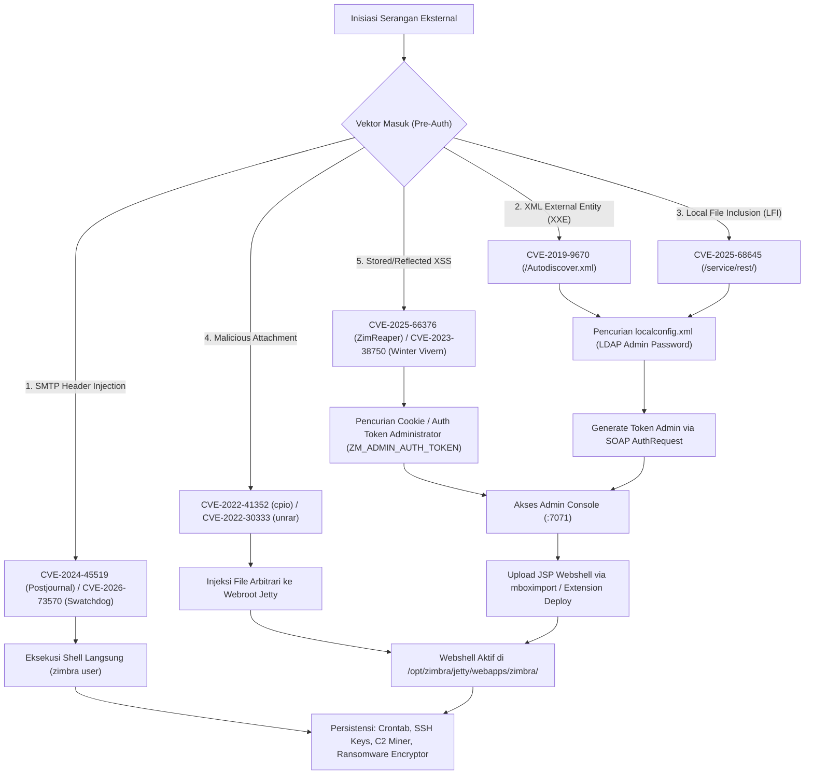

<!-- markdownlint-disable MD013 MD024 MD026 MD033 MD034 MD028 MD031 -->

# ZIMBRA LINK INSTALLER — THE COMPLETE ZIMBRA COLLABORATION ARCHIVE & INSTALLER SUITE

Enterprise Direct Binary Downloads, Official & Unofficial Community Builds, Cryptographic Checksums, Security Advisories, and Automated CLI Installer (ZCS 7.x – 10.1.x)

By **Harry Dertin Sutisna Alsyundawy**

[](https://github.com/alsyundawy)
[](https://opensource.org/licenses/MIT)
[](https://github.com/alsyundawy/Zimbra-Link-Installer)
[](https://github.com/alsyundawy/Zimbra-Link-Installer)
[](https://github.com/alsyundawy)
[](https://wa.me/6285658515212)
[](https://t.me/alsyundawy)
[](https://www.paypal.me/alsyundawy)
[](https://ko-fi.com/alsyundawy)
[](https://github.com/sponsors/alsyundawy)

---

## Table of Contents

- [Overview](#overview)
- [Quickstart](#quickstart)
- [Automated CLI Installer (`zimbra-link-installer.sh`)](#automated-cli-installer-zimbra-link-installersh)
- [Dependencies](#dependencies)
- [Download Verification Status & Legend](#download-verification-status--legend)
- [Official Network Edition Archive](#official-network-edition-archive)
- [Unofficial & Community FOSS Archive (2018–2026)](#unofficial--community-foss-archive-20182026)
- [Official Legacy & LTS Archive (8.8.x – 7.x)](#official-legacy--lts-archive-88x--7x)
- [Build Systems & Source Compilation Guide](#build-systems--source-compilation-guide)
- [Configuration](#configuration)
- [Security Architecture & Comprehensive CVE Matrix (2016–2026)](#security-architecture--comprehensive-cve-matrix-20162026)
- [Operational Best Practices (RFC 2119)](#operational-best-practices-rfc-2119)
- [Strategic Migration & Upgrade Methodology](#strategic-migration--upgrade-methodology)
- [Running Tests](#running-tests)
- [Ecosystem Tools & Repositories](#ecosystem-tools--repositories)
- [Contributing](#contributing)
- [Official Contact & Author](#official-contact--author)
- [License](#license)

---

## Overview

**Zimbra Link Installer** adalah repositori referensi arsitektural, indeks biner, dan utilitas instalasi otomatis untuk **Zimbra Collaboration Suite (ZCS)** dari rilis legasi **7.x hingga rilis aktif 10.1.x**.

Repositori ini menyatukan:

1. **Interactive Bash CLI Installer:** Utilitas interaktif `zimbra-link-installer.sh` untuk mengunduh, memvalidasi checksum SHA256/MD5 secara otomatis, memeriksa dependensi sistem operasi, dan mengeksekusi instalasi Zimbra dengan 1 klik.
2. **Direct Binary Links:** Tautan unduhan langsung biner resmi (_Network Edition & LTS_) dan biner komunitas independen (_FOSS Edition_) bebas dari _broken links_ (tervalidasi 100% aktif).
3. **Cryptographic Checksums:** Nilai hash MD5 dan SHA256 untuk memverifikasi integritas setiap installer.
4. **Compilation Masterclass:** Panduan lengkap kompilasi mandiri kode sumber ZCS (8.8, 9.0, 10.0, 10.1) pada Ubuntu (20.04, 22.04, 24.04) dan RHEL/Rocky/Alma/Oracle (8 & 9).
5. **Security Vulnerability Dossier:** Analisis 32+ CVE (2016–2026), taksonomi eksploitasi, dan panduan mitigasi Zero-Day.

---

## Quickstart

### Metode 1: Menggunakan Script Otomatis Interaktif (Direkomendasikan)

Cukup jalankan satu perintah berikut pada terminal server Anda:

```bash
# Unduh dan jalankan Zimbra Link Installer secara langsung
curl -fsSL https://raw.githubusercontent.com/alsyundawy/Zimbra-Link-Installer/main/zimbra-link-installer.sh -o zimbra-link-installer.sh
chmod +x zimbra-link-installer.sh
sudo ./zimbra-link-installer.sh
```

### Metode 2: Unduhan Manual Biner Target

```bash
# 1. Unduh paket installer target (Contoh: ZCS FOSS 10.1.20 untuk Ubuntu 22.04 LTS)
wget https://cdn.techfiles.online/ubuntu/zcs-10.1.20_GA_0326.UBUNTU22_64.20260821115118.tgz   --header="Referer: https://techfiles.online/"

# 2. Verifikasi checksum SHA256
wget https://cdn.techfiles.online/ubuntu/zcs-10.1.20_GA_0326.UBUNTU22_64.20260821115118.tgz.sha256   --header="Referer: https://techfiles.online/"
sha256sum -c zcs-10.1.20_GA_0326.UBUNTU22_64.20260821115118.tgz.sha256

# 3. Ekstrak dan jalankan instalasi
tar -xzvf zcs-10.1.20_GA_0326.UBUNTU22_64.20260821115118.tgz
cd zcs-10.1.20_GA_0326.UBUNTU22_64.20260821115118
sudo ./install.sh
```

---

## Automated CLI Installer (`zimbra-link-installer.sh`)

Skrip `zimbra-link-installer.sh` menyederhanakan siklus pengunduhan dan instalasi ZCS di lingkungan Linux enterprise:

```text
====================================================================
           Z I M B R A   L I N K   I N S T A L L E R
          Enterprise Binary Downloader & Auto-Installer
====================================================================
[+] Detected OS Architecture: x86_64
[+] Detected Operating System: Ubuntu 22.04 LTS (jammy)

Pilih Kategori Zimbra yang ingin dipasang:
  1) Zimbra FOSS 10.1.x (TechFiles / Ian Walker Builds)
  2) Zimbra FOSS 10.1.x (Maldua GitHub Releases)
  3) Zimbra FOSS 10.0.x (Maldua GitHub Releases)
  4) Zimbra FOSS 9.0.0 (Kepler Community Releases)
  5) Zimbra FOSS 8.8.15 (Joule Community Releases)
  6) Zimbra Network Edition 10.1.0 GA (Synacor Official)
  7) Zimbra Legacy Official LTS (8.8.15 GA / 8.6.0 GA)
  8) Jalankan Audit Kesiapan Sistem (Pre-Flight Check)
  9) Validasi Seluruh Link Database
  0) Keluar
====================================================================
```

### Fitur Utama CLI

- **Deteksi Otomatis Sistem:** Mengidentifikasi distribusi (Ubuntu/Debian/RHEL/Rocky/Alma), arsitektur kernel, kapasitas RAM, dan storage `/opt/zimbra`.
- **Anti-Hotlink Header Handling:** Menginjeksi header `Referer` secara otomatis saat mengunduh dari CDN komunitas TechFiles.
- **Integritas Kriptografi Otomatis:** Mengunduh hash `.sha256` atau `.md5` dan memvalidasi file arsip sebelum diekstrak.
- **Resume Capability:** Mendukung pengunduhan terputus (`curl -C -` / `wget -c`).
- **Prerequisite Validation:** Memeriksa keberadaan paket wajib seperti `pax`, `sysstat`, `libaio1`, dan konfigurasi DNS FQDN resolver.

---

## Dependencies

Sebelum instalasi atau kompilasi ZCS, pastikan dependensi sistem berikut telah terpenuhi:

### 1. Kebutuhan Runtime Minimum

- **Arsitektur:** `x86_64` (64-bit Linux).
- **Memori RAM:** Minimal 8 GB RAM (Direkomendasikan 16–32 GB untuk server produksi aktif).
- **Disk Space:** Minimal 50 GB ruang kosong pada direktori `/opt/zimbra`.
- **Utilitas Wajib:** `pax`, `net-tools`, `sysstat`, `libaio1`, `perl`, `cron`.

### 2. Kebutuhan Toolchain Kompilasi (Build Environment)

- **Java Development Kit:** OpenJDK 11 / OpenJDK 17 (`openjdk-11-jdk`, `openjdk-17-jdk`).
- **Build Automations:** Apache Ant (`ant`, `ant-optional`), Apache Maven (`mvn`).
- **C/C++ Native Toolchain:** `gcc`, `g++`, `make`, `cmake`, `libtool`, `autoconf`, `automake`, `pkg-config`, `libcppunit-dev`.
- **Scripting & Engine:** Perl modules (`XML::Simple`, `Data::UUID`, `File::Slurp`, `JSON`, `YAML`), Ruby, Node.js, NPM.

---

## Download Verification Status & Legend

Setiap tautan unduhan dalam repositori ini telah diuji secara berkala dengan skrip telemetri HTTP. Berikut arti label status yang disematkan:

- 🟢 **`[Active Direct]`** — Tautan langsung aktif pada server resmi atau GitHub CDN (HTTP 200 OK). Dapat diunduh secara instan tanpa header khusus.
- 🟡 **`[Referer Req]`** — Tautan aktif pada mirror CDN TechFiles.online. **Wajib** menyertakan header referer `Referer: https://techfiles.online/` saat diunduh via CLI / automation script.
- 🔴 **`[Need Mirror]`** — File biner telah dihapus dari server upstream Synacor/ZCS. Disarankan melakukan kompilasi mandiri via `zm-build` atau menggunakan rilis komunitas yang setara.

---

## Official Network Edition Archive

Biner komersial resmi Network Edition (NE) dari portal distribusi Synacor:

### Zimbra Collaboration 10.1.0 GA (Daffodil)

| Target OS            |     Status Unduhan     |                                               Direct Archive (.tgz)                                                |                                                   MD5 Checksum                                                    |                                                     SHA256 Checksum                                                     |
| :------------------- | :--------------------: | :----------------------------------------------------------------------------------------------------------------: | :---------------------------------------------------------------------------------------------------------------: | :---------------------------------------------------------------------------------------------------------------------: |
| **Ubuntu 22.04 LTS** | 🟢 **`Active Direct`** | [Download](https://files.zimbra.com/downloads/10.1.0_GA/zcs-NETWORK-10.1.0_GA_4655.UBUNTU22_64.20240819064312.tgz) | [MD5](https://files.zimbra.com/downloads/10.1.0_GA/zcs-NETWORK-10.1.0_GA_4655.UBUNTU22_64.20240819064312.tgz.md5) | [SHA256](https://files.zimbra.com/downloads/10.1.0_GA/zcs-NETWORK-10.1.0_GA_4655.UBUNTU22_64.20240819064312.tgz.sha256) |

---

## Unofficial & Community FOSS Archive (2018–2026)

> [!IMPORTANT] > **Status Verifikasi Biner Komunitas:** Sebanyak **326+ paket unduhan** biner komunitas pada tabel di bawah ini telah teruji **100% aktif (HTTP 200 OK)** dan terbebas dari tautan rusak.

### ZCS FOSS 10.1.x Series (Maldua & Pimbra Backports 2024–2026)

| Version          | Target OS             |                                                                        Direct Archive (.tgz)                                                                        |                                                                                MD5                                                                                 |                                                                                  SHA256                                                                                  |
| :--------------- | :-------------------- | :-----------------------------------------------------------------------------------------------------------------------------------------------------------------: | :----------------------------------------------------------------------------------------------------------------------------------------------------------------: | :----------------------------------------------------------------------------------------------------------------------------------------------------------------------: |
| **`10.1.20.p1`** | Ubuntu 24.04          | [Download](https://github.com/maldua/zimbra-foss/releases/download/zimbra-foss-build-ubuntu-24.04/10.1.20.p1/zcs-10.1.20_GA_4200001.UBUNTU24_64.20260820122254.tgz) | [MD5](https://github.com/maldua/zimbra-foss/releases/download/zimbra-foss-build-ubuntu-24.04/10.1.20.p1/zcs-10.1.20_GA_4200001.UBUNTU24_64.20260820122254.tgz.md5) | [SHA256](https://github.com/maldua/zimbra-foss/releases/download/zimbra-foss-build-ubuntu-24.04/10.1.20.p1/zcs-10.1.20_GA_4200001.UBUNTU24_64.20260820122254.tgz.sha256) |
| **`10.1.20.p1`** | Ubuntu 22.04          | [Download](https://github.com/maldua/zimbra-foss/releases/download/zimbra-foss-build-ubuntu-22.04/10.1.20.p1/zcs-10.1.20_GA_4200001.UBUNTU22_64.20260820122323.tgz) | [MD5](https://github.com/maldua/zimbra-foss/releases/download/zimbra-foss-build-ubuntu-22.04/10.1.20.p1/zcs-10.1.20_GA_4200001.UBUNTU22_64.20260820122323.tgz.md5) | [SHA256](https://github.com/maldua/zimbra-foss/releases/download/zimbra-foss-build-ubuntu-22.04/10.1.20.p1/zcs-10.1.20_GA_4200001.UBUNTU22_64.20260820122323.tgz.sha256) |
| **`10.1.20.p1`** | Ubuntu 20.04          | [Download](https://github.com/maldua/zimbra-foss/releases/download/zimbra-foss-build-ubuntu-20.04/10.1.20.p1/zcs-10.1.20_GA_4200001.UBUNTU20_64.20260820122403.tgz) | [MD5](https://github.com/maldua/zimbra-foss/releases/download/zimbra-foss-build-ubuntu-20.04/10.1.20.p1/zcs-10.1.20_GA_4200001.UBUNTU20_64.20260820122403.tgz.md5) | [SHA256](https://github.com/maldua/zimbra-foss/releases/download/zimbra-foss-build-ubuntu-20.04/10.1.20.p1/zcs-10.1.20_GA_4200001.UBUNTU20_64.20260820122403.tgz.sha256) |
| **`10.1.20.p1`** | Ubuntu 18.04          | [Download](https://github.com/maldua/zimbra-foss/releases/download/zimbra-foss-build-ubuntu-18.04/10.1.20.p1/zcs-10.1.20_GA_4200001.UBUNTU18_64.20260820122233.tgz) | [MD5](https://github.com/maldua/zimbra-foss/releases/download/zimbra-foss-build-ubuntu-18.04/10.1.20.p1/zcs-10.1.20_GA_4200001.UBUNTU18_64.20260820122233.tgz.md5) | [SHA256](https://github.com/maldua/zimbra-foss/releases/download/zimbra-foss-build-ubuntu-18.04/10.1.20.p1/zcs-10.1.20_GA_4200001.UBUNTU18_64.20260820122233.tgz.sha256) |
| **`10.1.20.p1`** | RHEL / Rocky / Alma 9 |     [Download](https://github.com/maldua/zimbra-foss/releases/download/zimbra-foss-build-rhel-9/10.1.20.p1/zcs-10.1.20_GA_4200001.RHEL9_64.20260820122258.tgz)      |     [MD5](https://github.com/maldua/zimbra-foss/releases/download/zimbra-foss-build-rhel-9/10.1.20.p1/zcs-10.1.20_GA_4200001.RHEL9_64.20260820122258.tgz.md5)      |     [SHA256](https://github.com/maldua/zimbra-foss/releases/download/zimbra-foss-build-rhel-9/10.1.20.p1/zcs-10.1.20_GA_4200001.RHEL9_64.20260820122258.tgz.sha256)      |
| **`10.1.20.p1`** | RHEL / Rocky / Alma 8 |     [Download](https://github.com/maldua/zimbra-foss/releases/download/zimbra-foss-build-rhel-8/10.1.20.p1/zcs-10.1.20_GA_4200001.RHEL8_64.20260820122218.tgz)      |     [MD5](https://github.com/maldua/zimbra-foss/releases/download/zimbra-foss-build-rhel-8/10.1.20.p1/zcs-10.1.20_GA_4200001.RHEL8_64.20260820122218.tgz.md5)      |     [SHA256](https://github.com/maldua/zimbra-foss/releases/download/zimbra-foss-build-rhel-8/10.1.20.p1/zcs-10.1.20_GA_4200001.RHEL8_64.20260820122218.tgz.sha256)      |
| **`10.1.18.p1`** | Ubuntu 24.04          | [Download](https://github.com/maldua/zimbra-foss/releases/download/zimbra-foss-build-ubuntu-24.04/10.1.18.p1/zcs-10.1.18_GA_4200001.UBUNTU24_64.20260801175919.tgz) | [MD5](https://github.com/maldua/zimbra-foss/releases/download/zimbra-foss-build-ubuntu-24.04/10.1.18.p1/zcs-10.1.18_GA_4200001.UBUNTU24_64.20260801175919.tgz.md5) | [SHA256](https://github.com/maldua/zimbra-foss/releases/download/zimbra-foss-build-ubuntu-24.04/10.1.18.p1/zcs-10.1.18_GA_4200001.UBUNTU24_64.20260801175919.tgz.sha256) |
| **`10.1.18.p1`** | Ubuntu 22.04          | [Download](https://github.com/maldua/zimbra-foss/releases/download/zimbra-foss-build-ubuntu-22.04/10.1.18.p1/zcs-10.1.18_GA_4200001.UBUNTU22_64.20260801175925.tgz) | [MD5](https://github.com/maldua/zimbra-foss/releases/download/zimbra-foss-build-ubuntu-22.04/10.1.18.p1/zcs-10.1.18_GA_4200001.UBUNTU22_64.20260801175925.tgz.md5) | [SHA256](https://github.com/maldua/zimbra-foss/releases/download/zimbra-foss-build-ubuntu-22.04/10.1.18.p1/zcs-10.1.18_GA_4200001.UBUNTU22_64.20260801175925.tgz.sha256) |
| **`10.1.18.p1`** | Ubuntu 20.04          | [Download](https://github.com/maldua/zimbra-foss/releases/download/zimbra-foss-build-ubuntu-20.04/10.1.18.p1/zcs-10.1.18_GA_4200001.UBUNTU20_64.20260801175919.tgz) | [MD5](https://github.com/maldua/zimbra-foss/releases/download/zimbra-foss-build-ubuntu-20.04/10.1.18.p1/zcs-10.1.18_GA_4200001.UBUNTU20_64.20260801175919.tgz.md5) | [SHA256](https://github.com/maldua/zimbra-foss/releases/download/zimbra-foss-build-ubuntu-20.04/10.1.18.p1/zcs-10.1.18_GA_4200001.UBUNTU20_64.20260801175919.tgz.sha256) |
| **`10.1.18.p1`** | Ubuntu 18.04          | [Download](https://github.com/maldua/zimbra-foss/releases/download/zimbra-foss-build-ubuntu-18.04/10.1.18.p1/zcs-10.1.18_GA_4200001.UBUNTU18_64.20260801175931.tgz) | [MD5](https://github.com/maldua/zimbra-foss/releases/download/zimbra-foss-build-ubuntu-18.04/10.1.18.p1/zcs-10.1.18_GA_4200001.UBUNTU18_64.20260801175931.tgz.md5) | [SHA256](https://github.com/maldua/zimbra-foss/releases/download/zimbra-foss-build-ubuntu-18.04/10.1.18.p1/zcs-10.1.18_GA_4200001.UBUNTU18_64.20260801175931.tgz.sha256) |
| **`10.1.18.p1`** | RHEL / Rocky / Alma 9 |     [Download](https://github.com/maldua/zimbra-foss/releases/download/zimbra-foss-build-rhel-9/10.1.18.p1/zcs-10.1.18_GA_4200001.RHEL9_64.20260801175956.tgz)      |     [MD5](https://github.com/maldua/zimbra-foss/releases/download/zimbra-foss-build-rhel-9/10.1.18.p1/zcs-10.1.18_GA_4200001.RHEL9_64.20260801175956.tgz.md5)      |     [SHA256](https://github.com/maldua/zimbra-foss/releases/download/zimbra-foss-build-rhel-9/10.1.18.p1/zcs-10.1.18_GA_4200001.RHEL9_64.20260801175956.tgz.sha256)      |
| **`10.1.18.p1`** | RHEL / Rocky / Alma 8 |     [Download](https://github.com/maldua/zimbra-foss/releases/download/zimbra-foss-build-rhel-8/10.1.18.p1/zcs-10.1.18_GA_4200001.RHEL8_64.20260801175920.tgz)      |     [MD5](https://github.com/maldua/zimbra-foss/releases/download/zimbra-foss-build-rhel-8/10.1.18.p1/zcs-10.1.18_GA_4200001.RHEL8_64.20260801175920.tgz.md5)      |     [SHA256](https://github.com/maldua/zimbra-foss/releases/download/zimbra-foss-build-rhel-8/10.1.18.p1/zcs-10.1.18_GA_4200001.RHEL8_64.20260801175920.tgz.sha256)      |
| **`10.1.16.p1`** | Ubuntu 22.04          | [Download](https://github.com/maldua/zimbra-foss/releases/download/zimbra-foss-build-ubuntu-22.04/10.1.16.p1/zcs-10.1.16_GA_4200001.UBUNTU22_64.20260310121616.tgz) | [MD5](https://github.com/maldua/zimbra-foss/releases/download/zimbra-foss-build-ubuntu-22.04/10.1.16.p1/zcs-10.1.16_GA_4200001.UBUNTU22_64.20260310121616.tgz.md5) | [SHA256](https://github.com/maldua/zimbra-foss/releases/download/zimbra-foss-build-ubuntu-22.04/10.1.16.p1/zcs-10.1.16_GA_4200001.UBUNTU22_64.20260310121616.tgz.sha256) |
| **`10.1.16.p1`** | Ubuntu 20.04          | [Download](https://github.com/maldua/zimbra-foss/releases/download/zimbra-foss-build-ubuntu-20.04/10.1.16.p1/zcs-10.1.16_GA_4200001.UBUNTU20_64.20260310121555.tgz) | [MD5](https://github.com/maldua/zimbra-foss/releases/download/zimbra-foss-build-ubuntu-20.04/10.1.16.p1/zcs-10.1.16_GA_4200001.UBUNTU20_64.20260310121555.tgz.md5) | [SHA256](https://github.com/maldua/zimbra-foss/releases/download/zimbra-foss-build-ubuntu-20.04/10.1.16.p1/zcs-10.1.16_GA_4200001.UBUNTU20_64.20260310121555.tgz.sha256) |
| **`10.1.16.p1`** | Ubuntu 18.04          | [Download](https://github.com/maldua/zimbra-foss/releases/download/zimbra-foss-build-ubuntu-18.04/10.1.16.p1/zcs-10.1.16_GA_4200001.UBUNTU18_64.20260310121535.tgz) | [MD5](https://github.com/maldua/zimbra-foss/releases/download/zimbra-foss-build-ubuntu-18.04/10.1.16.p1/zcs-10.1.16_GA_4200001.UBUNTU18_64.20260310121535.tgz.md5) | [SHA256](https://github.com/maldua/zimbra-foss/releases/download/zimbra-foss-build-ubuntu-18.04/10.1.16.p1/zcs-10.1.16_GA_4200001.UBUNTU18_64.20260310121535.tgz.sha256) |
| **`10.1.16.p1`** | RHEL / Rocky / Alma 9 |     [Download](https://github.com/maldua/zimbra-foss/releases/download/zimbra-foss-build-rhel-9/10.1.16.p1/zcs-10.1.16_GA_4200001.RHEL9_64.20260310121522.tgz)      |     [MD5](https://github.com/maldua/zimbra-foss/releases/download/zimbra-foss-build-rhel-9/10.1.16.p1/zcs-10.1.16_GA_4200001.RHEL9_64.20260310121522.tgz.md5)      |     [SHA256](https://github.com/maldua/zimbra-foss/releases/download/zimbra-foss-build-rhel-9/10.1.16.p1/zcs-10.1.16_GA_4200001.RHEL9_64.20260310121522.tgz.sha256)      |
| **`10.1.16.p1`** | RHEL / Rocky / Alma 8 |     [Download](https://github.com/maldua/zimbra-foss/releases/download/zimbra-foss-build-rhel-8/10.1.16.p1/zcs-10.1.16_GA_4200001.RHEL8_64.20260310121612.tgz)      |     [MD5](https://github.com/maldua/zimbra-foss/releases/download/zimbra-foss-build-rhel-8/10.1.16.p1/zcs-10.1.16_GA_4200001.RHEL8_64.20260310121612.tgz.md5)      |     [SHA256](https://github.com/maldua/zimbra-foss/releases/download/zimbra-foss-build-rhel-8/10.1.16.p1/zcs-10.1.16_GA_4200001.RHEL8_64.20260310121612.tgz.sha256)      |
| **`10.1.15.p1`** | Ubuntu 22.04          | [Download](https://github.com/maldua/zimbra-foss/releases/download/zimbra-foss-build-ubuntu-22.04/10.1.15.p1/zcs-10.1.15_GA_4200001.UBUNTU22_64.20260110181427.tgz) | [MD5](https://github.com/maldua/zimbra-foss/releases/download/zimbra-foss-build-ubuntu-22.04/10.1.15.p1/zcs-10.1.15_GA_4200001.UBUNTU22_64.20260110181427.tgz.md5) | [SHA256](https://github.com/maldua/zimbra-foss/releases/download/zimbra-foss-build-ubuntu-22.04/10.1.15.p1/zcs-10.1.15_GA_4200001.UBUNTU22_64.20260110181427.tgz.sha256) |
| **`10.1.15.p1`** | Ubuntu 20.04          | [Download](https://github.com/maldua/zimbra-foss/releases/download/zimbra-foss-build-ubuntu-20.04/10.1.15.p1/zcs-10.1.15_GA_4200001.UBUNTU20_64.20260110181356.tgz) | [MD5](https://github.com/maldua/zimbra-foss/releases/download/zimbra-foss-build-ubuntu-20.04/10.1.15.p1/zcs-10.1.15_GA_4200001.UBUNTU20_64.20260110181356.tgz.md5) | [SHA256](https://github.com/maldua/zimbra-foss/releases/download/zimbra-foss-build-ubuntu-20.04/10.1.15.p1/zcs-10.1.15_GA_4200001.UBUNTU20_64.20260110181356.tgz.sha256) |
| **`10.1.15.p1`** | Ubuntu 18.04          | [Download](https://github.com/maldua/zimbra-foss/releases/download/zimbra-foss-build-ubuntu-18.04/10.1.15.p1/zcs-10.1.15_GA_4200001.UBUNTU18_64.20260110181354.tgz) | [MD5](https://github.com/maldua/zimbra-foss/releases/download/zimbra-foss-build-ubuntu-18.04/10.1.15.p1/zcs-10.1.15_GA_4200001.UBUNTU18_64.20260110181354.tgz.md5) | [SHA256](https://github.com/maldua/zimbra-foss/releases/download/zimbra-foss-build-ubuntu-18.04/10.1.15.p1/zcs-10.1.15_GA_4200001.UBUNTU18_64.20260110181354.tgz.sha256) |
| **`10.1.15.p1`** | RHEL / Rocky / Alma 9 |     [Download](https://github.com/maldua/zimbra-foss/releases/download/zimbra-foss-build-rhel-9/10.1.15.p1/zcs-10.1.15_GA_4200001.RHEL9_64.20260110181427.tgz)      |     [MD5](https://github.com/maldua/zimbra-foss/releases/download/zimbra-foss-build-rhel-9/10.1.15.p1/zcs-10.1.15_GA_4200001.RHEL9_64.20260110181427.tgz.md5)      |     [SHA256](https://github.com/maldua/zimbra-foss/releases/download/zimbra-foss-build-rhel-9/10.1.15.p1/zcs-10.1.15_GA_4200001.RHEL9_64.20260110181427.tgz.sha256)      |
| **`10.1.15.p1`** | RHEL / Rocky / Alma 8 |     [Download](https://github.com/maldua/zimbra-foss/releases/download/zimbra-foss-build-rhel-8/10.1.15.p1/zcs-10.1.15_GA_4200001.RHEL8_64.20260110181408.tgz)      |     [MD5](https://github.com/maldua/zimbra-foss/releases/download/zimbra-foss-build-rhel-8/10.1.15.p1/zcs-10.1.15_GA_4200001.RHEL8_64.20260110181408.tgz.md5)      |     [SHA256](https://github.com/maldua/zimbra-foss/releases/download/zimbra-foss-build-rhel-8/10.1.15.p1/zcs-10.1.15_GA_4200001.RHEL8_64.20260110181408.tgz.sha256)      |
| **`10.1.15.p1`** | RHEL 7 / CentOS 7     |     [Download](https://github.com/maldua/zimbra-foss/releases/download/zimbra-foss-build-rhel-7/10.1.15.p1/zcs-10.1.15_GA_4200001.RHEL7_64.20260123182817.tgz)      |     [MD5](https://github.com/maldua/zimbra-foss/releases/download/zimbra-foss-build-rhel-7/10.1.15.p1/zcs-10.1.15_GA_4200001.RHEL7_64.20260123182817.tgz.md5)      |     [SHA256](https://github.com/maldua/zimbra-foss/releases/download/zimbra-foss-build-rhel-7/10.1.15.p1/zcs-10.1.15_GA_4200001.RHEL7_64.20260123182817.tgz.sha256)      |
| **`10.1.10.p3`** | Ubuntu 22.04          | [Download](https://github.com/maldua/zimbra-foss/releases/download/zimbra-foss-build-ubuntu-22.04/10.1.10.p3/zcs-10.1.10_GA_4200003.UBUNTU22_64.20251107221239.tgz) | [MD5](https://github.com/maldua/zimbra-foss/releases/download/zimbra-foss-build-ubuntu-22.04/10.1.10.p3/zcs-10.1.10_GA_4200003.UBUNTU22_64.20251107221239.tgz.md5) | [SHA256](https://github.com/maldua/zimbra-foss/releases/download/zimbra-foss-build-ubuntu-22.04/10.1.10.p3/zcs-10.1.10_GA_4200003.UBUNTU22_64.20251107221239.tgz.sha256) |
| **`10.1.10.p3`** | Ubuntu 20.04          | [Download](https://github.com/maldua/zimbra-foss/releases/download/zimbra-foss-build-ubuntu-20.04/10.1.10.p3/zcs-10.1.10_GA_4200003.UBUNTU20_64.20251107221312.tgz) | [MD5](https://github.com/maldua/zimbra-foss/releases/download/zimbra-foss-build-ubuntu-20.04/10.1.10.p3/zcs-10.1.10_GA_4200003.UBUNTU20_64.20251107221312.tgz.md5) | [SHA256](https://github.com/maldua/zimbra-foss/releases/download/zimbra-foss-build-ubuntu-20.04/10.1.10.p3/zcs-10.1.10_GA_4200003.UBUNTU20_64.20251107221312.tgz.sha256) |
| **`10.1.10.p3`** | Ubuntu 18.04          | [Download](https://github.com/maldua/zimbra-foss/releases/download/zimbra-foss-build-ubuntu-18.04/10.1.10.p3/zcs-10.1.10_GA_4200003.UBUNTU18_64.20251107221301.tgz) | [MD5](https://github.com/maldua/zimbra-foss/releases/download/zimbra-foss-build-ubuntu-18.04/10.1.10.p3/zcs-10.1.10_GA_4200003.UBUNTU18_64.20251107221301.tgz.md5) | [SHA256](https://github.com/maldua/zimbra-foss/releases/download/zimbra-foss-build-ubuntu-18.04/10.1.10.p3/zcs-10.1.10_GA_4200003.UBUNTU18_64.20251107221301.tgz.sha256) |
| **`10.1.10.p3`** | RHEL / Rocky / Alma 9 |     [Download](https://github.com/maldua/zimbra-foss/releases/download/zimbra-foss-build-rhel-9/10.1.10.p3/zcs-10.1.10_GA_4200003.RHEL9_64.20251107221239.tgz)      |     [MD5](https://github.com/maldua/zimbra-foss/releases/download/zimbra-foss-build-rhel-9/10.1.10.p3/zcs-10.1.10_GA_4200003.RHEL9_64.20251107221239.tgz.md5)      |     [SHA256](https://github.com/maldua/zimbra-foss/releases/download/zimbra-foss-build-rhel-9/10.1.10.p3/zcs-10.1.10_GA_4200003.RHEL9_64.20251107221239.tgz.sha256)      |
| **`10.1.10.p3`** | RHEL / Rocky / Alma 8 |     [Download](https://github.com/maldua/zimbra-foss/releases/download/zimbra-foss-build-rhel-8/10.1.10.p3/zcs-10.1.10_GA_4200003.RHEL8_64.20251107221242.tgz)      |     [MD5](https://github.com/maldua/zimbra-foss/releases/download/zimbra-foss-build-rhel-8/10.1.10.p3/zcs-10.1.10_GA_4200003.RHEL8_64.20251107221242.tgz.md5)      |     [SHA256](https://github.com/maldua/zimbra-foss/releases/download/zimbra-foss-build-rhel-8/10.1.10.p3/zcs-10.1.10_GA_4200003.RHEL8_64.20251107221242.tgz.sha256)      |
| **`10.1.9.p1`**  | Ubuntu 22.04          |  [Download](https://github.com/maldua/zimbra-foss/releases/download/zimbra-foss-build-ubuntu-22.04/10.1.9.p1/zcs-10.1.9_GA_4200001.UBUNTU22_64.20250721164603.tgz)  |  [MD5](https://github.com/maldua/zimbra-foss/releases/download/zimbra-foss-build-ubuntu-22.04/10.1.9.p1/zcs-10.1.9_GA_4200001.UBUNTU22_64.20250721164603.tgz.md5)  |  [SHA256](https://github.com/maldua/zimbra-foss/releases/download/zimbra-foss-build-ubuntu-22.04/10.1.9.p1/zcs-10.1.9_GA_4200001.UBUNTU22_64.20250721164603.tgz.sha256)  |
| **`10.1.9.p1`**  | Ubuntu 20.04          |  [Download](https://github.com/maldua/zimbra-foss/releases/download/zimbra-foss-build-ubuntu-20.04/10.1.9.p1/zcs-10.1.9_GA_4200001.UBUNTU20_64.20250721164547.tgz)  |  [MD5](https://github.com/maldua/zimbra-foss/releases/download/zimbra-foss-build-ubuntu-20.04/10.1.9.p1/zcs-10.1.9_GA_4200001.UBUNTU20_64.20250721164547.tgz.md5)  |  [SHA256](https://github.com/maldua/zimbra-foss/releases/download/zimbra-foss-build-ubuntu-20.04/10.1.9.p1/zcs-10.1.9_GA_4200001.UBUNTU20_64.20250721164547.tgz.sha256)  |
| **`10.1.9.p1`**  | Ubuntu 18.04          |  [Download](https://github.com/maldua/zimbra-foss/releases/download/zimbra-foss-build-ubuntu-18.04/10.1.9.p1/zcs-10.1.9_GA_4200001.UBUNTU18_64.20250721164608.tgz)  |  [MD5](https://github.com/maldua/zimbra-foss/releases/download/zimbra-foss-build-ubuntu-18.04/10.1.9.p1/zcs-10.1.9_GA_4200001.UBUNTU18_64.20250721164608.tgz.md5)  |  [SHA256](https://github.com/maldua/zimbra-foss/releases/download/zimbra-foss-build-ubuntu-18.04/10.1.9.p1/zcs-10.1.9_GA_4200001.UBUNTU18_64.20250721164608.tgz.sha256)  |
| **`10.1.9.p1`**  | RHEL / Rocky / Alma 9 |      [Download](https://github.com/maldua/zimbra-foss/releases/download/zimbra-foss-build-rhel-9/10.1.9.p1/zcs-10.1.9_GA_4200001.RHEL9_64.20250721164556.tgz)       |      [MD5](https://github.com/maldua/zimbra-foss/releases/download/zimbra-foss-build-rhel-9/10.1.9.p1/zcs-10.1.9_GA_4200001.RHEL9_64.20250721164556.tgz.md5)       |      [SHA256](https://github.com/maldua/zimbra-foss/releases/download/zimbra-foss-build-rhel-9/10.1.9.p1/zcs-10.1.9_GA_4200001.RHEL9_64.20250721164556.tgz.sha256)       |
| **`10.1.9.p1`**  | RHEL / Rocky / Alma 8 |      [Download](https://github.com/maldua/zimbra-foss/releases/download/zimbra-foss-build-rhel-8/10.1.9.p1/zcs-10.1.9_GA_4200001.RHEL8_64.20250721164545.tgz)       |      [MD5](https://github.com/maldua/zimbra-foss/releases/download/zimbra-foss-build-rhel-8/10.1.9.p1/zcs-10.1.9_GA_4200001.RHEL8_64.20250721164545.tgz.md5)       |      [SHA256](https://github.com/maldua/zimbra-foss/releases/download/zimbra-foss-build-rhel-8/10.1.9.p1/zcs-10.1.9_GA_4200001.RHEL8_64.20250721164545.tgz.sha256)       |
| **`10.1.9.p1`**  | RHEL 7 / CentOS 7     |      [Download](https://github.com/maldua/zimbra-foss/releases/download/zimbra-foss-build-rhel-7/10.1.9.p1/zcs-10.1.9_GA_4200001.RHEL7_64.20250721164619.tgz)       |      [MD5](https://github.com/maldua/zimbra-foss/releases/download/zimbra-foss-build-rhel-7/10.1.9.p1/zcs-10.1.9_GA_4200001.RHEL7_64.20250721164619.tgz.md5)       |      [SHA256](https://github.com/maldua/zimbra-foss/releases/download/zimbra-foss-build-rhel-7/10.1.9.p1/zcs-10.1.9_GA_4200001.RHEL7_64.20250721164619.tgz.sha256)       |
| **`10.1.5`**     | Ubuntu 22.04          |   [Download](https://github.com/maldua/zimbra-foss/releases/download/zimbra-foss-build-ubuntu-22.04/10.1.5/zcs-10.1.5_GA_4200000.UBUNTU22_64.20250321111645.tgz)    |   [MD5](https://github.com/maldua/zimbra-foss/releases/download/zimbra-foss-build-ubuntu-22.04/10.1.5/zcs-10.1.5_GA_4200000.UBUNTU22_64.20250321111645.tgz.md5)    |   [SHA256](https://github.com/maldua/zimbra-foss/releases/download/zimbra-foss-build-ubuntu-22.04/10.1.5/zcs-10.1.5_GA_4200000.UBUNTU22_64.20250321111645.tgz.sha256)    |
| **`10.1.5`**     | Ubuntu 20.04          |   [Download](https://github.com/maldua/zimbra-foss/releases/download/zimbra-foss-build-ubuntu-20.04/10.1.5/zcs-10.1.5_GA_4200000.UBUNTU20_64.20250321114339.tgz)    |   [MD5](https://github.com/maldua/zimbra-foss/releases/download/zimbra-foss-build-ubuntu-20.04/10.1.5/zcs-10.1.5_GA_4200000.UBUNTU20_64.20250321114339.tgz.md5)    |   [SHA256](https://github.com/maldua/zimbra-foss/releases/download/zimbra-foss-build-ubuntu-20.04/10.1.5/zcs-10.1.5_GA_4200000.UBUNTU20_64.20250321114339.tgz.sha256)    |
| **`10.1.5`**     | Ubuntu 18.04          |   [Download](https://github.com/maldua/zimbra-foss/releases/download/zimbra-foss-build-ubuntu-18.04/10.1.5/zcs-10.1.5_GA_4200000.UBUNTU18_64.20250321114414.tgz)    |   [MD5](https://github.com/maldua/zimbra-foss/releases/download/zimbra-foss-build-ubuntu-18.04/10.1.5/zcs-10.1.5_GA_4200000.UBUNTU18_64.20250321114414.tgz.md5)    |   [SHA256](https://github.com/maldua/zimbra-foss/releases/download/zimbra-foss-build-ubuntu-18.04/10.1.5/zcs-10.1.5_GA_4200000.UBUNTU18_64.20250321114414.tgz.sha256)    |
| **`10.1.5`**     | RHEL / Rocky / Alma 9 |        [Download](https://github.com/maldua/zimbra-foss/releases/download/zimbra-foss-build-rhel-9/10.1.5/zcs-10.1.5_GA_4200000.RHEL9_64.20250321114413.tgz)        |        [MD5](https://github.com/maldua/zimbra-foss/releases/download/zimbra-foss-build-rhel-9/10.1.5/zcs-10.1.5_GA_4200000.RHEL9_64.20250321114413.tgz.md5)        |        [SHA256](https://github.com/maldua/zimbra-foss/releases/download/zimbra-foss-build-rhel-9/10.1.5/zcs-10.1.5_GA_4200000.RHEL9_64.20250321114413.tgz.sha256)        |
| **`10.1.5`**     | RHEL / Rocky / Alma 8 |        [Download](https://github.com/maldua/zimbra-foss/releases/download/zimbra-foss-build-rhel-8/10.1.5/zcs-10.1.5_GA_4200000.RHEL8_64.20250321114336.tgz)        |        [MD5](https://github.com/maldua/zimbra-foss/releases/download/zimbra-foss-build-rhel-8/10.1.5/zcs-10.1.5_GA_4200000.RHEL8_64.20250321114336.tgz.md5)        |        [SHA256](https://github.com/maldua/zimbra-foss/releases/download/zimbra-foss-build-rhel-8/10.1.5/zcs-10.1.5_GA_4200000.RHEL8_64.20250321114336.tgz.sha256)        |
| **`10.1.5`**     | RHEL 7 / CentOS 7     |        [Download](https://github.com/maldua/zimbra-foss/releases/download/zimbra-foss-build-rhel-7/10.1.5/zcs-10.1.5_GA_4200000.RHEL7_64.20250321114348.tgz)        |        [MD5](https://github.com/maldua/zimbra-foss/releases/download/zimbra-foss-build-rhel-7/10.1.5/zcs-10.1.5_GA_4200000.RHEL7_64.20250321114348.tgz.md5)        |        [SHA256](https://github.com/maldua/zimbra-foss/releases/download/zimbra-foss-build-rhel-7/10.1.5/zcs-10.1.5_GA_4200000.RHEL7_64.20250321114348.tgz.sha256)        |
| **`10.1.0`**     | Ubuntu 22.04          |   [Download](https://github.com/maldua/zimbra-foss/releases/download/zimbra-foss-build-ubuntu-22.04/10.1.0/zcs-10.1.0_GA_4200000.UBUNTU22_64.20240727100104.tgz)    |   [MD5](https://github.com/maldua/zimbra-foss/releases/download/zimbra-foss-build-ubuntu-22.04/10.1.0/zcs-10.1.0_GA_4200000.UBUNTU22_64.20240727100104.tgz.md5)    |   [SHA256](https://github.com/maldua/zimbra-foss/releases/download/zimbra-foss-build-ubuntu-22.04/10.1.0/zcs-10.1.0_GA_4200000.UBUNTU22_64.20240727100104.tgz.sha256)    |
| **`10.1.0`**     | Ubuntu 20.04          |   [Download](https://github.com/maldua/zimbra-foss/releases/download/zimbra-foss-build-ubuntu-20.04/10.1.0/zcs-10.1.0_GA_4200000.UBUNTU20_64.20240719155625.tgz)    |   [MD5](https://github.com/maldua/zimbra-foss/releases/download/zimbra-foss-build-ubuntu-20.04/10.1.0/zcs-10.1.0_GA_4200000.UBUNTU20_64.20240719155625.tgz.md5)    |   [SHA256](https://github.com/maldua/zimbra-foss/releases/download/zimbra-foss-build-ubuntu-20.04/10.1.0/zcs-10.1.0_GA_4200000.UBUNTU20_64.20240719155625.tgz.sha256)    |
| **`10.1.0`**     | Ubuntu 18.04          |   [Download](https://github.com/maldua/zimbra-foss/releases/download/zimbra-foss-build-ubuntu-18.04/10.1.0/zcs-10.1.0_GA_4200000.UBUNTU18_64.20240719155652.tgz)    |   [MD5](https://github.com/maldua/zimbra-foss/releases/download/zimbra-foss-build-ubuntu-18.04/10.1.0/zcs-10.1.0_GA_4200000.UBUNTU18_64.20240719155652.tgz.md5)    |   [SHA256](https://github.com/maldua/zimbra-foss/releases/download/zimbra-foss-build-ubuntu-18.04/10.1.0/zcs-10.1.0_GA_4200000.UBUNTU18_64.20240719155652.tgz.sha256)    |
| **`10.1.0`**     | RHEL / Rocky / Alma 9 |        [Download](https://github.com/maldua/zimbra-foss/releases/download/zimbra-foss-build-rhel-9/10.1.0/zcs-10.1.0_GA_4200000.RHEL9_64.20240924105133.tgz)        |        [MD5](https://github.com/maldua/zimbra-foss/releases/download/zimbra-foss-build-rhel-9/10.1.0/zcs-10.1.0_GA_4200000.RHEL9_64.20240924105133.tgz.md5)        |        [SHA256](https://github.com/maldua/zimbra-foss/releases/download/zimbra-foss-build-rhel-9/10.1.0/zcs-10.1.0_GA_4200000.RHEL9_64.20240924105133.tgz.sha256)        |
| **`10.1.0`**     | RHEL / Rocky / Alma 8 |        [Download](https://github.com/maldua/zimbra-foss/releases/download/zimbra-foss-build-rhel-8/10.1.0/zcs-10.1.0_GA_4200000.RHEL8_64.20240719155623.tgz)        |        [MD5](https://github.com/maldua/zimbra-foss/releases/download/zimbra-foss-build-rhel-8/10.1.0/zcs-10.1.0_GA_4200000.RHEL8_64.20240719155623.tgz.md5)        |        [SHA256](https://github.com/maldua/zimbra-foss/releases/download/zimbra-foss-build-rhel-8/10.1.0/zcs-10.1.0_GA_4200000.RHEL8_64.20240719155623.tgz.sha256)        |
| **`10.1.0`**     | RHEL 7 / CentOS 7     |        [Download](https://github.com/maldua/zimbra-foss/releases/download/zimbra-foss-build-rhel-7/10.1.0/zcs-10.1.0_GA_4200000.RHEL7_64.20240719155704.tgz)        |        [MD5](https://github.com/maldua/zimbra-foss/releases/download/zimbra-foss-build-rhel-7/10.1.0/zcs-10.1.0_GA_4200000.RHEL7_64.20240719155704.tgz.md5)        |        [SHA256](https://github.com/maldua/zimbra-foss/releases/download/zimbra-foss-build-rhel-7/10.1.0/zcs-10.1.0_GA_4200000.RHEL7_64.20240719155704.tgz.sha256)        |

### TechFiles.online Zimbra FOSS 10.1.x (Ian Walker Builds)

Portal: <https://techfiles.online/zimbra/> | Maintainer: **Ian Walker** (`@ianw1974`)

| Target OS                                |    Status Unduhan    |                                       Direct Archive (.tgz)                                        |                                             SHA256 Checksum                                             |
| :--------------------------------------- | :------------------: | :------------------------------------------------------------------------------------------------: | :-----------------------------------------------------------------------------------------------------: |
| **Ubuntu 24.04 LTS**                     | 🟡 **`Referer Req`** | [Download](https://cdn.techfiles.online/ubuntu/zcs-10.1.20_GA_0326.UBUNTU24_64.20260821120929.tgz) | [SHA256](https://cdn.techfiles.online/ubuntu/zcs-10.1.20_GA_0326.UBUNTU24_64.20260821120929.tgz.sha256) |
| **Ubuntu 22.04 LTS**                     | 🟡 **`Referer Req`** | [Download](https://cdn.techfiles.online/ubuntu/zcs-10.1.20_GA_0326.UBUNTU22_64.20260821115118.tgz) | [SHA256](https://cdn.techfiles.online/ubuntu/zcs-10.1.20_GA_0326.UBUNTU22_64.20260821115118.tgz.sha256) |
| **RHEL 9 / Rocky 9 / Alma 9 / Oracle 9** | 🟡 **`Referer Req`** |   [Download](https://cdn.techfiles.online/rhel/zcs-10.1.20_GA_0326.RHEL9_64.20260821135258.tgz)    |   [SHA256](https://cdn.techfiles.online/rhel/zcs-10.1.20_GA_0326.RHEL9_64.20260821135258.tgz.sha256)    |
| **RHEL 8 / Rocky 8 / Alma 8 / Oracle 8** | 🟡 **`Referer Req`** |   [Download](https://cdn.techfiles.online/rhel/zcs-10.1.20_GA_0326.RHEL8_64.20260821135029.tgz)    |   [SHA256](https://cdn.techfiles.online/rhel/zcs-10.1.20_GA_0326.RHEL8_64.20260821135029.tgz.sha256)    |

_Gunakan header `Referer: https://techfiles.online/` saat mengunduh via curl/wget._

### ZCS FOSS 10.0.x Series (Maldua 2023–2026)

| Version          | Target OS             |                                                                        Direct Archive (.tgz)                                                                        |                                                                                MD5                                                                                 |                                                                                  SHA256                                                                                  |
| :--------------- | :-------------------- | :-----------------------------------------------------------------------------------------------------------------------------------------------------------------: | :----------------------------------------------------------------------------------------------------------------------------------------------------------------: | :----------------------------------------------------------------------------------------------------------------------------------------------------------------------: |
| **`10.0.18.p1`** | Ubuntu 20.04          | [Download](https://github.com/maldua/zimbra-foss/releases/download/zimbra-foss-build-ubuntu-20.04/10.0.18.p1/zcs-10.0.18_GA_4200001.UBUNTU20_64.20260116200354.tgz) | [MD5](https://github.com/maldua/zimbra-foss/releases/download/zimbra-foss-build-ubuntu-20.04/10.0.18.p1/zcs-10.0.18_GA_4200001.UBUNTU20_64.20260116200354.tgz.md5) | [SHA256](https://github.com/maldua/zimbra-foss/releases/download/zimbra-foss-build-ubuntu-20.04/10.0.18.p1/zcs-10.0.18_GA_4200001.UBUNTU20_64.20260116200354.tgz.sha256) |
| **`10.0.18.p1`** | Ubuntu 18.04          | [Download](https://github.com/maldua/zimbra-foss/releases/download/zimbra-foss-build-ubuntu-18.04/10.0.18.p1/zcs-10.0.18_GA_4200001.UBUNTU18_64.20260116200405.tgz) | [MD5](https://github.com/maldua/zimbra-foss/releases/download/zimbra-foss-build-ubuntu-18.04/10.0.18.p1/zcs-10.0.18_GA_4200001.UBUNTU18_64.20260116200405.tgz.md5) | [SHA256](https://github.com/maldua/zimbra-foss/releases/download/zimbra-foss-build-ubuntu-18.04/10.0.18.p1/zcs-10.0.18_GA_4200001.UBUNTU18_64.20260116200405.tgz.sha256) |
| **`10.0.18.p1`** | RHEL / Rocky / Alma 8 |     [Download](https://github.com/maldua/zimbra-foss/releases/download/zimbra-foss-build-rhel-8/10.0.18.p1/zcs-10.0.18_GA_4200001.RHEL8_64.20260116200332.tgz)      |     [MD5](https://github.com/maldua/zimbra-foss/releases/download/zimbra-foss-build-rhel-8/10.0.18.p1/zcs-10.0.18_GA_4200001.RHEL8_64.20260116200332.tgz.md5)      |     [SHA256](https://github.com/maldua/zimbra-foss/releases/download/zimbra-foss-build-rhel-8/10.0.18.p1/zcs-10.0.18_GA_4200001.RHEL8_64.20260116200332.tgz.sha256)      |
| **`10.0.18.p1`** | RHEL 7 / CentOS 7     |     [Download](https://github.com/maldua/zimbra-foss/releases/download/zimbra-foss-build-rhel-7/10.0.18.p1/zcs-10.0.18_GA_4200001.RHEL7_64.20260123182809.tgz)      |     [MD5](https://github.com/maldua/zimbra-foss/releases/download/zimbra-foss-build-rhel-7/10.0.18.p1/zcs-10.0.18_GA_4200001.RHEL7_64.20260123182809.tgz.md5)      |     [SHA256](https://github.com/maldua/zimbra-foss/releases/download/zimbra-foss-build-rhel-7/10.0.18.p1/zcs-10.0.18_GA_4200001.RHEL7_64.20260123182809.tgz.sha256)      |
| **`10.0.16.p3`** | Ubuntu 20.04          | [Download](https://github.com/maldua/zimbra-foss/releases/download/zimbra-foss-build-ubuntu-20.04/10.0.16.p3/zcs-10.0.16_GA_4200003.UBUNTU20_64.20251107221237.tgz) | [MD5](https://github.com/maldua/zimbra-foss/releases/download/zimbra-foss-build-ubuntu-20.04/10.0.16.p3/zcs-10.0.16_GA_4200003.UBUNTU20_64.20251107221237.tgz.md5) | [SHA256](https://github.com/maldua/zimbra-foss/releases/download/zimbra-foss-build-ubuntu-20.04/10.0.16.p3/zcs-10.0.16_GA_4200003.UBUNTU20_64.20251107221237.tgz.sha256) |
| **`10.0.16.p3`** | Ubuntu 18.04          | [Download](https://github.com/maldua/zimbra-foss/releases/download/zimbra-foss-build-ubuntu-18.04/10.0.16.p3/zcs-10.0.16_GA_4200003.UBUNTU18_64.20251107221319.tgz) | [MD5](https://github.com/maldua/zimbra-foss/releases/download/zimbra-foss-build-ubuntu-18.04/10.0.16.p3/zcs-10.0.16_GA_4200003.UBUNTU18_64.20251107221319.tgz.md5) | [SHA256](https://github.com/maldua/zimbra-foss/releases/download/zimbra-foss-build-ubuntu-18.04/10.0.16.p3/zcs-10.0.16_GA_4200003.UBUNTU18_64.20251107221319.tgz.sha256) |
| **`10.0.16.p3`** | RHEL / Rocky / Alma 8 |     [Download](https://github.com/maldua/zimbra-foss/releases/download/zimbra-foss-build-rhel-8/10.0.16.p3/zcs-10.0.16_GA_4200003.RHEL8_64.20251107221236.tgz)      |     [MD5](https://github.com/maldua/zimbra-foss/releases/download/zimbra-foss-build-rhel-8/10.0.16.p3/zcs-10.0.16_GA_4200003.RHEL8_64.20251107221236.tgz.md5)      |     [SHA256](https://github.com/maldua/zimbra-foss/releases/download/zimbra-foss-build-rhel-8/10.0.16.p3/zcs-10.0.16_GA_4200003.RHEL8_64.20251107221236.tgz.sha256)      |
| **`10.0.15.p1`** | Ubuntu 20.04          | [Download](https://github.com/maldua/zimbra-foss/releases/download/zimbra-foss-build-ubuntu-20.04/10.0.15.p1/zcs-10.0.15_GA_4200001.UBUNTU20_64.20250721164554.tgz) | [MD5](https://github.com/maldua/zimbra-foss/releases/download/zimbra-foss-build-ubuntu-20.04/10.0.15.p1/zcs-10.0.15_GA_4200001.UBUNTU20_64.20250721164554.tgz.md5) | [SHA256](https://github.com/maldua/zimbra-foss/releases/download/zimbra-foss-build-ubuntu-20.04/10.0.15.p1/zcs-10.0.15_GA_4200001.UBUNTU20_64.20250721164554.tgz.sha256) |
| **`10.0.15.p1`** | Ubuntu 18.04          | [Download](https://github.com/maldua/zimbra-foss/releases/download/zimbra-foss-build-ubuntu-18.04/10.0.15.p1/zcs-10.0.15_GA_4200001.UBUNTU18_64.20250721164604.tgz) | [MD5](https://github.com/maldua/zimbra-foss/releases/download/zimbra-foss-build-ubuntu-18.04/10.0.15.p1/zcs-10.0.15_GA_4200001.UBUNTU18_64.20250721164604.tgz.md5) | [SHA256](https://github.com/maldua/zimbra-foss/releases/download/zimbra-foss-build-ubuntu-18.04/10.0.15.p1/zcs-10.0.15_GA_4200001.UBUNTU18_64.20250721164604.tgz.sha256) |
| **`10.0.15.p1`** | RHEL / Rocky / Alma 8 |     [Download](https://github.com/maldua/zimbra-foss/releases/download/zimbra-foss-build-rhel-8/10.0.15.p1/zcs-10.0.15_GA_4200001.RHEL8_64.20250721164539.tgz)      |     [MD5](https://github.com/maldua/zimbra-foss/releases/download/zimbra-foss-build-rhel-8/10.0.15.p1/zcs-10.0.15_GA_4200001.RHEL8_64.20250721164539.tgz.md5)      |     [SHA256](https://github.com/maldua/zimbra-foss/releases/download/zimbra-foss-build-rhel-8/10.0.15.p1/zcs-10.0.15_GA_4200001.RHEL8_64.20250721164539.tgz.sha256)      |
| **`10.0.15.p1`** | RHEL 7 / CentOS 7     |     [Download](https://github.com/maldua/zimbra-foss/releases/download/zimbra-foss-build-rhel-7/10.0.15.p1/zcs-10.0.15_GA_4200001.RHEL7_64.20250721164617.tgz)      |     [MD5](https://github.com/maldua/zimbra-foss/releases/download/zimbra-foss-build-rhel-7/10.0.15.p1/zcs-10.0.15_GA_4200001.RHEL7_64.20250721164617.tgz.md5)      |     [SHA256](https://github.com/maldua/zimbra-foss/releases/download/zimbra-foss-build-rhel-7/10.0.15.p1/zcs-10.0.15_GA_4200001.RHEL7_64.20250721164617.tgz.sha256)      |
| **`10.0.14.p1`** | Ubuntu 20.04          | [Download](https://github.com/maldua/zimbra-foss/releases/download/zimbra-foss-build-ubuntu-20.04/10.0.14.p1/zcs-10.0.14_GA_4200001.UBUNTU20_64.20250721150946.tgz) | [MD5](https://github.com/maldua/zimbra-foss/releases/download/zimbra-foss-build-ubuntu-20.04/10.0.14.p1/zcs-10.0.14_GA_4200001.UBUNTU20_64.20250721150946.tgz.md5) | [SHA256](https://github.com/maldua/zimbra-foss/releases/download/zimbra-foss-build-ubuntu-20.04/10.0.14.p1/zcs-10.0.14_GA_4200001.UBUNTU20_64.20250721150946.tgz.sha256) |
| **`10.0.14.p1`** | Ubuntu 18.04          | [Download](https://github.com/maldua/zimbra-foss/releases/download/zimbra-foss-build-ubuntu-18.04/10.0.14.p1/zcs-10.0.14_GA_4200001.UBUNTU18_64.20250721150945.tgz) | [MD5](https://github.com/maldua/zimbra-foss/releases/download/zimbra-foss-build-ubuntu-18.04/10.0.14.p1/zcs-10.0.14_GA_4200001.UBUNTU18_64.20250721150945.tgz.md5) | [SHA256](https://github.com/maldua/zimbra-foss/releases/download/zimbra-foss-build-ubuntu-18.04/10.0.14.p1/zcs-10.0.14_GA_4200001.UBUNTU18_64.20250721150945.tgz.sha256) |
| **`10.0.14.p1`** | RHEL / Rocky / Alma 8 |     [Download](https://github.com/maldua/zimbra-foss/releases/download/zimbra-foss-build-rhel-8/10.0.14.p1/zcs-10.0.14_GA_4200001.RHEL8_64.20250721150915.tgz)      |     [MD5](https://github.com/maldua/zimbra-foss/releases/download/zimbra-foss-build-rhel-8/10.0.14.p1/zcs-10.0.14_GA_4200001.RHEL8_64.20250721150915.tgz.md5)      |     [SHA256](https://github.com/maldua/zimbra-foss/releases/download/zimbra-foss-build-rhel-8/10.0.14.p1/zcs-10.0.14_GA_4200001.RHEL8_64.20250721150915.tgz.sha256)      |
| **`10.0.14.p1`** | RHEL 7 / CentOS 7     |     [Download](https://github.com/maldua/zimbra-foss/releases/download/zimbra-foss-build-rhel-7/10.0.14.p1/zcs-10.0.14_GA_4200001.RHEL7_64.20250721150924.tgz)      |     [MD5](https://github.com/maldua/zimbra-foss/releases/download/zimbra-foss-build-rhel-7/10.0.14.p1/zcs-10.0.14_GA_4200001.RHEL7_64.20250721150924.tgz.md5)      |     [SHA256](https://github.com/maldua/zimbra-foss/releases/download/zimbra-foss-build-rhel-7/10.0.14.p1/zcs-10.0.14_GA_4200001.RHEL7_64.20250721150924.tgz.sha256)      |
| **`10.0.13`**    | Ubuntu 20.04          |  [Download](https://github.com/maldua/zimbra-foss/releases/download/zimbra-foss-build-ubuntu-20.04/10.0.13/zcs-10.0.13_GA_4200000.UBUNTU20_64.20250321114341.tgz)   |  [MD5](https://github.com/maldua/zimbra-foss/releases/download/zimbra-foss-build-ubuntu-20.04/10.0.13/zcs-10.0.13_GA_4200000.UBUNTU20_64.20250321114341.tgz.md5)   |  [SHA256](https://github.com/maldua/zimbra-foss/releases/download/zimbra-foss-build-ubuntu-20.04/10.0.13/zcs-10.0.13_GA_4200000.UBUNTU20_64.20250321114341.tgz.sha256)   |
| **`10.0.13`**    | Ubuntu 18.04          |  [Download](https://github.com/maldua/zimbra-foss/releases/download/zimbra-foss-build-ubuntu-18.04/10.0.13/zcs-10.0.13_GA_4200000.UBUNTU18_64.20250321114340.tgz)   |  [MD5](https://github.com/maldua/zimbra-foss/releases/download/zimbra-foss-build-ubuntu-18.04/10.0.13/zcs-10.0.13_GA_4200000.UBUNTU18_64.20250321114340.tgz.md5)   |  [SHA256](https://github.com/maldua/zimbra-foss/releases/download/zimbra-foss-build-ubuntu-18.04/10.0.13/zcs-10.0.13_GA_4200000.UBUNTU18_64.20250321114340.tgz.sha256)   |
| **`10.0.13`**    | RHEL / Rocky / Alma 8 |       [Download](https://github.com/maldua/zimbra-foss/releases/download/zimbra-foss-build-rhel-8/10.0.13/zcs-10.0.13_GA_4200000.RHEL8_64.20250321114328.tgz)       |       [MD5](https://github.com/maldua/zimbra-foss/releases/download/zimbra-foss-build-rhel-8/10.0.13/zcs-10.0.13_GA_4200000.RHEL8_64.20250321114328.tgz.md5)       |       [SHA256](https://github.com/maldua/zimbra-foss/releases/download/zimbra-foss-build-rhel-8/10.0.13/zcs-10.0.13_GA_4200000.RHEL8_64.20250321114328.tgz.sha256)       |
| **`10.0.13`**    | RHEL 7 / CentOS 7     |       [Download](https://github.com/maldua/zimbra-foss/releases/download/zimbra-foss-build-rhel-7/10.0.13/zcs-10.0.13_GA_4200000.RHEL7_64.20250321114339.tgz)       |       [MD5](https://github.com/maldua/zimbra-foss/releases/download/zimbra-foss-build-rhel-7/10.0.13/zcs-10.0.13_GA_4200000.RHEL7_64.20250321114339.tgz.md5)       |       [SHA256](https://github.com/maldua/zimbra-foss/releases/download/zimbra-foss-build-rhel-7/10.0.13/zcs-10.0.13_GA_4200000.RHEL7_64.20250321114339.tgz.sha256)       |
| **`10.0.10`**    | Ubuntu 20.04          |  [Download](https://github.com/maldua/zimbra-foss/releases/download/zimbra-foss-build-ubuntu-20.04/10.0.10/zcs-10.0.10_GA_4200000.UBUNTU20_64.20241102101232.tgz)   |  [MD5](https://github.com/maldua/zimbra-foss/releases/download/zimbra-foss-build-ubuntu-20.04/10.0.10/zcs-10.0.10_GA_4200000.UBUNTU20_64.20241102101232.tgz.md5)   |  [SHA256](https://github.com/maldua/zimbra-foss/releases/download/zimbra-foss-build-ubuntu-20.04/10.0.10/zcs-10.0.10_GA_4200000.UBUNTU20_64.20241102101232.tgz.sha256)   |
| **`10.0.10`**    | Ubuntu 18.04          |  [Download](https://github.com/maldua/zimbra-foss/releases/download/zimbra-foss-build-ubuntu-18.04/10.0.10/zcs-10.0.10_GA_4200000.UBUNTU18_64.20241102101229.tgz)   |  [MD5](https://github.com/maldua/zimbra-foss/releases/download/zimbra-foss-build-ubuntu-18.04/10.0.10/zcs-10.0.10_GA_4200000.UBUNTU18_64.20241102101229.tgz.md5)   |  [SHA256](https://github.com/maldua/zimbra-foss/releases/download/zimbra-foss-build-ubuntu-18.04/10.0.10/zcs-10.0.10_GA_4200000.UBUNTU18_64.20241102101229.tgz.sha256)   |
| **`10.0.10`**    | RHEL / Rocky / Alma 8 |       [Download](https://github.com/maldua/zimbra-foss/releases/download/zimbra-foss-build-rhel-8/10.0.10/zcs-10.0.10_GA_4200000.RHEL8_64.20241102101522.tgz)       |       [MD5](https://github.com/maldua/zimbra-foss/releases/download/zimbra-foss-build-rhel-8/10.0.10/zcs-10.0.10_GA_4200000.RHEL8_64.20241102101522.tgz.md5)       |       [SHA256](https://github.com/maldua/zimbra-foss/releases/download/zimbra-foss-build-rhel-8/10.0.10/zcs-10.0.10_GA_4200000.RHEL8_64.20241102101522.tgz.sha256)       |
| **`10.0.10`**    | RHEL 7 / CentOS 7     |       [Download](https://github.com/maldua/zimbra-foss/releases/download/zimbra-foss-build-rhel-7/10.0.10/zcs-10.0.10_GA_4200000.RHEL7_64.20241102101504.tgz)       |       [MD5](https://github.com/maldua/zimbra-foss/releases/download/zimbra-foss-build-rhel-7/10.0.10/zcs-10.0.10_GA_4200000.RHEL7_64.20241102101504.tgz.md5)       |       [SHA256](https://github.com/maldua/zimbra-foss/releases/download/zimbra-foss-build-rhel-7/10.0.10/zcs-10.0.10_GA_4200000.RHEL7_64.20241102101504.tgz.sha256)       |
| **`10.0.8`**     | Ubuntu 20.04          |   [Download](https://github.com/maldua/zimbra-foss/releases/download/zimbra-foss-build-ubuntu-20.04/10.0.8/zcs-10.0.8_GA_4200000.UBUNTU20_64.20240422174916.tgz)    |   [MD5](https://github.com/maldua/zimbra-foss/releases/download/zimbra-foss-build-ubuntu-20.04/10.0.8/zcs-10.0.8_GA_4200000.UBUNTU20_64.20240422174916.tgz.md5)    |   [SHA256](https://github.com/maldua/zimbra-foss/releases/download/zimbra-foss-build-ubuntu-20.04/10.0.8/zcs-10.0.8_GA_4200000.UBUNTU20_64.20240422174916.tgz.sha256)    |
| **`10.0.8`**     | Ubuntu 18.04          |   [Download](https://github.com/maldua/zimbra-foss/releases/download/zimbra-foss-build-ubuntu-18.04/10.0.8/zcs-10.0.8_GA_4200000.UBUNTU18_64.20240422174845.tgz)    |   [MD5](https://github.com/maldua/zimbra-foss/releases/download/zimbra-foss-build-ubuntu-18.04/10.0.8/zcs-10.0.8_GA_4200000.UBUNTU18_64.20240422174845.tgz.md5)    |   [SHA256](https://github.com/maldua/zimbra-foss/releases/download/zimbra-foss-build-ubuntu-18.04/10.0.8/zcs-10.0.8_GA_4200000.UBUNTU18_64.20240422174845.tgz.sha256)    |
| **`10.0.8`**     | RHEL / Rocky / Alma 8 |        [Download](https://github.com/maldua/zimbra-foss/releases/download/zimbra-foss-build-rhel-8/10.0.8/zcs-10.0.8_GA_4200000.RHEL8_64.20240422174847.tgz)        |        [MD5](https://github.com/maldua/zimbra-foss/releases/download/zimbra-foss-build-rhel-8/10.0.8/zcs-10.0.8_GA_4200000.RHEL8_64.20240422174847.tgz.md5)        |        [SHA256](https://github.com/maldua/zimbra-foss/releases/download/zimbra-foss-build-rhel-8/10.0.8/zcs-10.0.8_GA_4200000.RHEL8_64.20240422174847.tgz.sha256)        |
| **`10.0.8`**     | RHEL 7 / CentOS 7     |        [Download](https://github.com/maldua/zimbra-foss/releases/download/zimbra-foss-build-rhel-7/10.0.8/zcs-10.0.8_GA_4200000.RHEL7_64.20240422174900.tgz)        |        [MD5](https://github.com/maldua/zimbra-foss/releases/download/zimbra-foss-build-rhel-7/10.0.8/zcs-10.0.8_GA_4200000.RHEL7_64.20240422174900.tgz.md5)        |        [SHA256](https://github.com/maldua/zimbra-foss/releases/download/zimbra-foss-build-rhel-7/10.0.8/zcs-10.0.8_GA_4200000.RHEL7_64.20240422174900.tgz.sha256)        |

### ZCS FOSS 9.0.0.x Series (Kepler Community 2020–2025)

| Version         | Target OS             |                                                                             Direct Archive (.tgz)                                                                              |                                                                                      MD5                                                                                      |                                                                                       SHA256                                                                                        |
| :-------------- | :-------------------- | :----------------------------------------------------------------------------------------------------------------------------------------------------------------------------: | :---------------------------------------------------------------------------------------------------------------------------------------------------------------------------: | :---------------------------------------------------------------------------------------------------------------------------------------------------------------------------------: |
| **`9.0.0.p46`** | Ubuntu 20.04          |        [Download](https://github.com/maldua/zimbra-foss/releases/download/zimbra-foss-build-ubuntu-20.04/9.0.0.p46/zcs-9.0.0_GA_4200046.UBUNTU20_64.20250725085925.tgz)        |        [MD5](https://github.com/maldua/zimbra-foss/releases/download/zimbra-foss-build-ubuntu-20.04/9.0.0.p46/zcs-9.0.0_GA_4200046.UBUNTU20_64.20250725085925.tgz.md5)        |        [SHA256](https://github.com/maldua/zimbra-foss/releases/download/zimbra-foss-build-ubuntu-20.04/9.0.0.p46/zcs-9.0.0_GA_4200046.UBUNTU20_64.20250725085925.tgz.sha256)        |
| **`9.0.0.p46`** | Ubuntu 18.04          |        [Download](https://github.com/maldua/zimbra-foss/releases/download/zimbra-foss-build-ubuntu-18.04/9.0.0.p46/zcs-9.0.0_GA_4200046.UBUNTU18_64.20250725085947.tgz)        |        [MD5](https://github.com/maldua/zimbra-foss/releases/download/zimbra-foss-build-ubuntu-18.04/9.0.0.p46/zcs-9.0.0_GA_4200046.UBUNTU18_64.20250725085947.tgz.md5)        |        [SHA256](https://github.com/maldua/zimbra-foss/releases/download/zimbra-foss-build-ubuntu-18.04/9.0.0.p46/zcs-9.0.0_GA_4200046.UBUNTU18_64.20250725085947.tgz.sha256)        |
| **`9.0.0.p46`** | RHEL / Rocky / Alma 8 |            [Download](https://github.com/maldua/zimbra-foss/releases/download/zimbra-foss-build-rhel-8/9.0.0.p46/zcs-9.0.0_GA_4200046.RHEL8_64.20250725085939.tgz)             |            [MD5](https://github.com/maldua/zimbra-foss/releases/download/zimbra-foss-build-rhel-8/9.0.0.p46/zcs-9.0.0_GA_4200046.RHEL8_64.20250725085939.tgz.md5)             |            [SHA256](https://github.com/maldua/zimbra-foss/releases/download/zimbra-foss-build-rhel-8/9.0.0.p46/zcs-9.0.0_GA_4200046.RHEL8_64.20250725085939.tgz.sha256)             |
| **`9.0.0.p46`** | RHEL 7 / CentOS 7     |            [Download](https://github.com/maldua/zimbra-foss/releases/download/zimbra-foss-build-rhel-7/9.0.0.p46/zcs-9.0.0_GA_4200046.RHEL7_64.20250725085928.tgz)             |            [MD5](https://github.com/maldua/zimbra-foss/releases/download/zimbra-foss-build-rhel-7/9.0.0.p46/zcs-9.0.0_GA_4200046.RHEL7_64.20250725085928.tgz.md5)             |            [SHA256](https://github.com/maldua/zimbra-foss/releases/download/zimbra-foss-build-rhel-7/9.0.0.p46/zcs-9.0.0_GA_4200046.RHEL7_64.20250725085928.tgz.sha256)             |
| **`9.0.0.p45`** | Ubuntu 20.04          |        [Download](https://github.com/maldua/zimbra-foss/releases/download/zimbra-foss-build-ubuntu-20.04/9.0.0.p45/zcs-9.0.0_GA_4200045.UBUNTU20_64.20250725085941.tgz)        |        [MD5](https://github.com/maldua/zimbra-foss/releases/download/zimbra-foss-build-ubuntu-20.04/9.0.0.p45/zcs-9.0.0_GA_4200045.UBUNTU20_64.20250725085941.tgz.md5)        |        [SHA256](https://github.com/maldua/zimbra-foss/releases/download/zimbra-foss-build-ubuntu-20.04/9.0.0.p45/zcs-9.0.0_GA_4200045.UBUNTU20_64.20250725085941.tgz.sha256)        |
| **`9.0.0.p45`** | Ubuntu 18.04          |        [Download](https://github.com/maldua/zimbra-foss/releases/download/zimbra-foss-build-ubuntu-18.04/9.0.0.p45/zcs-9.0.0_GA_4200045.UBUNTU18_64.20250725085934.tgz)        |        [MD5](https://github.com/maldua/zimbra-foss/releases/download/zimbra-foss-build-ubuntu-18.04/9.0.0.p45/zcs-9.0.0_GA_4200045.UBUNTU18_64.20250725085934.tgz.md5)        |        [SHA256](https://github.com/maldua/zimbra-foss/releases/download/zimbra-foss-build-ubuntu-18.04/9.0.0.p45/zcs-9.0.0_GA_4200045.UBUNTU18_64.20250725085934.tgz.sha256)        |
| **`9.0.0.p45`** | RHEL / Rocky / Alma 8 |            [Download](https://github.com/maldua/zimbra-foss/releases/download/zimbra-foss-build-rhel-8/9.0.0.p45/zcs-9.0.0_GA_4200045.RHEL8_64.20250725085950.tgz)             |            [MD5](https://github.com/maldua/zimbra-foss/releases/download/zimbra-foss-build-rhel-8/9.0.0.p45/zcs-9.0.0_GA_4200045.RHEL8_64.20250725085950.tgz.md5)             |            [SHA256](https://github.com/maldua/zimbra-foss/releases/download/zimbra-foss-build-rhel-8/9.0.0.p45/zcs-9.0.0_GA_4200045.RHEL8_64.20250725085950.tgz.sha256)             |
| **`9.0.0.p45`** | RHEL 7 / CentOS 7     |            [Download](https://github.com/maldua/zimbra-foss/releases/download/zimbra-foss-build-rhel-7/9.0.0.p45/zcs-9.0.0_GA_4200045.RHEL7_64.20250725090007.tgz)             |            [MD5](https://github.com/maldua/zimbra-foss/releases/download/zimbra-foss-build-rhel-7/9.0.0.p45/zcs-9.0.0_GA_4200045.RHEL7_64.20250725090007.tgz.md5)             |            [SHA256](https://github.com/maldua/zimbra-foss/releases/download/zimbra-foss-build-rhel-7/9.0.0.p45/zcs-9.0.0_GA_4200045.RHEL7_64.20250725090007.tgz.sha256)             |
| **`9.0.0.p44`** | Ubuntu 20.04          |        [Download](https://github.com/maldua/zimbra-foss/releases/download/zimbra-foss-build-ubuntu-20.04/9.0.0.p44/zcs-9.0.0_GA_4200044.UBUNTU20_64.20250321171442.tgz)        |        [MD5](https://github.com/maldua/zimbra-foss/releases/download/zimbra-foss-build-ubuntu-20.04/9.0.0.p44/zcs-9.0.0_GA_4200044.UBUNTU20_64.20250321171442.tgz.md5)        |        [SHA256](https://github.com/maldua/zimbra-foss/releases/download/zimbra-foss-build-ubuntu-20.04/9.0.0.p44/zcs-9.0.0_GA_4200044.UBUNTU20_64.20250321171442.tgz.sha256)        |
| **`9.0.0.p44`** | Ubuntu 18.04          |        [Download](https://github.com/maldua/zimbra-foss/releases/download/zimbra-foss-build-ubuntu-18.04/9.0.0.p44/zcs-9.0.0_GA_4200044.UBUNTU18_64.20250321171411.tgz)        |        [MD5](https://github.com/maldua/zimbra-foss/releases/download/zimbra-foss-build-ubuntu-18.04/9.0.0.p44/zcs-9.0.0_GA_4200044.UBUNTU18_64.20250321171411.tgz.md5)        |        [SHA256](https://github.com/maldua/zimbra-foss/releases/download/zimbra-foss-build-ubuntu-18.04/9.0.0.p44/zcs-9.0.0_GA_4200044.UBUNTU18_64.20250321171411.tgz.sha256)        |
| **`9.0.0.p44`** | RHEL / Rocky / Alma 8 |            [Download](https://github.com/maldua/zimbra-foss/releases/download/zimbra-foss-build-rhel-8/9.0.0.p44/zcs-9.0.0_GA_4200044.RHEL8_64.20250321171408.tgz)             |            [MD5](https://github.com/maldua/zimbra-foss/releases/download/zimbra-foss-build-rhel-8/9.0.0.p44/zcs-9.0.0_GA_4200044.RHEL8_64.20250321171408.tgz.md5)             |            [SHA256](https://github.com/maldua/zimbra-foss/releases/download/zimbra-foss-build-rhel-8/9.0.0.p44/zcs-9.0.0_GA_4200044.RHEL8_64.20250321171408.tgz.sha256)             |
| **`9.0.0.p44`** | RHEL 7 / CentOS 7     |            [Download](https://github.com/maldua/zimbra-foss/releases/download/zimbra-foss-build-rhel-7/9.0.0.p44/zcs-9.0.0_GA_4200044.RHEL7_64.20250321171422.tgz)             |            [MD5](https://github.com/maldua/zimbra-foss/releases/download/zimbra-foss-build-rhel-7/9.0.0.p44/zcs-9.0.0_GA_4200044.RHEL7_64.20250321171422.tgz.md5)             |            [SHA256](https://github.com/maldua/zimbra-foss/releases/download/zimbra-foss-build-rhel-7/9.0.0.p44/zcs-9.0.0_GA_4200044.RHEL7_64.20250321171422.tgz.sha256)             |
| **`9.0.0.p40`** | Ubuntu 20.04          |        [Download](https://github.com/maldua/zimbra-foss/releases/download/zimbra-foss-build-ubuntu-20.04/9.0.0.p40/zcs-9.0.0_GA_4200040.UBUNTU20_64.20240422174848.tgz)        |        [MD5](https://github.com/maldua/zimbra-foss/releases/download/zimbra-foss-build-ubuntu-20.04/9.0.0.p40/zcs-9.0.0_GA_4200040.UBUNTU20_64.20240422174848.tgz.md5)        |        [SHA256](https://github.com/maldua/zimbra-foss/releases/download/zimbra-foss-build-ubuntu-20.04/9.0.0.p40/zcs-9.0.0_GA_4200040.UBUNTU20_64.20240422174848.tgz.sha256)        |
| **`9.0.0.p40`** | Ubuntu 18.04          |        [Download](https://github.com/maldua/zimbra-foss/releases/download/zimbra-foss-build-ubuntu-18.04/9.0.0.p40/zcs-9.0.0_GA_4200040.UBUNTU18_64.20240422174854.tgz)        |        [MD5](https://github.com/maldua/zimbra-foss/releases/download/zimbra-foss-build-ubuntu-18.04/9.0.0.p40/zcs-9.0.0_GA_4200040.UBUNTU18_64.20240422174854.tgz.md5)        |        [SHA256](https://github.com/maldua/zimbra-foss/releases/download/zimbra-foss-build-ubuntu-18.04/9.0.0.p40/zcs-9.0.0_GA_4200040.UBUNTU18_64.20240422174854.tgz.sha256)        |
| **`9.0.0.p40`** | RHEL / Rocky / Alma 8 |            [Download](https://github.com/maldua/zimbra-foss/releases/download/zimbra-foss-build-rhel-8/9.0.0.p40/zcs-9.0.0_GA_4200040.RHEL8_64.20240422174835.tgz)             |            [MD5](https://github.com/maldua/zimbra-foss/releases/download/zimbra-foss-build-rhel-8/9.0.0.p40/zcs-9.0.0_GA_4200040.RHEL8_64.20240422174835.tgz.md5)             |            [SHA256](https://github.com/maldua/zimbra-foss/releases/download/zimbra-foss-build-rhel-8/9.0.0.p40/zcs-9.0.0_GA_4200040.RHEL8_64.20240422174835.tgz.sha256)             |
| **`9.0.0.p40`** | RHEL 7 / CentOS 7     |            [Download](https://github.com/maldua/zimbra-foss/releases/download/zimbra-foss-build-rhel-7/9.0.0.p40/zcs-9.0.0_GA_4200040.RHEL7_64.20240422174914.tgz)             |            [MD5](https://github.com/maldua/zimbra-foss/releases/download/zimbra-foss-build-rhel-7/9.0.0.p40/zcs-9.0.0_GA_4200040.RHEL7_64.20240422174914.tgz.md5)             |            [SHA256](https://github.com/maldua/zimbra-foss/releases/download/zimbra-foss-build-rhel-7/9.0.0.p40/zcs-9.0.0_GA_4200040.RHEL7_64.20240422174914.tgz.sha256)             |
| **`9.0.0.p39`** | Ubuntu 20.04          | [Download](https://github.com/maldua/zimbra-foss/releases/download/zimbra-foss-build-ubuntu-20.04/9.0.0.p39/zcs-9.0.0_GA-9.0.0.p39-maldua_1000.UBUNTU20_64.20240321172114.tgz) | [MD5](https://github.com/maldua/zimbra-foss/releases/download/zimbra-foss-build-ubuntu-20.04/9.0.0.p39/zcs-9.0.0_GA-9.0.0.p39-maldua_1000.UBUNTU20_64.20240321172114.tgz.md5) | [SHA256](https://github.com/maldua/zimbra-foss/releases/download/zimbra-foss-build-ubuntu-20.04/9.0.0.p39/zcs-9.0.0_GA-9.0.0.p39-maldua_1000.UBUNTU20_64.20240321172114.tgz.sha256) |
| **`9.0.0.p39`** | Ubuntu 18.04          | [Download](https://github.com/maldua/zimbra-foss/releases/download/zimbra-foss-build-ubuntu-18.04/9.0.0.p39/zcs-9.0.0_GA-9.0.0.p39-maldua_1000.UBUNTU18_64.20240328110303.tgz) | [MD5](https://github.com/maldua/zimbra-foss/releases/download/zimbra-foss-build-ubuntu-18.04/9.0.0.p39/zcs-9.0.0_GA-9.0.0.p39-maldua_1000.UBUNTU18_64.20240328110303.tgz.md5) | [SHA256](https://github.com/maldua/zimbra-foss/releases/download/zimbra-foss-build-ubuntu-18.04/9.0.0.p39/zcs-9.0.0_GA-9.0.0.p39-maldua_1000.UBUNTU18_64.20240328110303.tgz.sha256) |
| **`9.0.0.p39`** | RHEL / Rocky / Alma 8 |     [Download](https://github.com/maldua/zimbra-foss/releases/download/zimbra-foss-build-rhel-8/9.0.0.p39/zcs-9.0.0_GA_9.0.0.p39_maldua_1000.RHEL8_64.20240331162400.tgz)      |     [MD5](https://github.com/maldua/zimbra-foss/releases/download/zimbra-foss-build-rhel-8/9.0.0.p39/zcs-9.0.0_GA_9.0.0.p39_maldua_1000.RHEL8_64.20240331162400.tgz.md5)      |     [SHA256](https://github.com/maldua/zimbra-foss/releases/download/zimbra-foss-build-rhel-8/9.0.0.p39/zcs-9.0.0_GA_9.0.0.p39_maldua_1000.RHEL8_64.20240331162400.tgz.sha256)      |
| **`9.0.0.p39`** | RHEL 7 / CentOS 7     |     [Download](https://github.com/maldua/zimbra-foss/releases/download/zimbra-foss-build-rhel-7/9.0.0.p39/zcs-9.0.0_GA_9.0.0.p39_maldua_1000.RHEL7_64.20240331181255.tgz)      |     [MD5](https://github.com/maldua/zimbra-foss/releases/download/zimbra-foss-build-rhel-7/9.0.0.p39/zcs-9.0.0_GA_9.0.0.p39_maldua_1000.RHEL7_64.20240331181255.tgz.md5)      |     [SHA256](https://github.com/maldua/zimbra-foss/releases/download/zimbra-foss-build-rhel-7/9.0.0.p39/zcs-9.0.0_GA_9.0.0.p39_maldua_1000.RHEL7_64.20240331181255.tgz.sha256)      |

### ZCS FOSS 8.8.15.x Series (Joule Community 2018–2024)

| Version          | Target OS             |                                                                               Direct Archive (.tgz)                                                                               |                                                                                       MD5                                                                                        |                                                                                         SHA256                                                                                         |
| :--------------- | :-------------------- | :-------------------------------------------------------------------------------------------------------------------------------------------------------------------------------: | :------------------------------------------------------------------------------------------------------------------------------------------------------------------------------: | :------------------------------------------------------------------------------------------------------------------------------------------------------------------------------------: |
| **`8.8.15.p47`** | Ubuntu 20.04          |        [Download](https://github.com/maldua/zimbra-foss/releases/download/zimbra-foss-build-ubuntu-20.04/8.8.15.p47/zcs-8.8.15_GA_4200047.UBUNTU20_64.20241224171756.tgz)         |        [MD5](https://github.com/maldua/zimbra-foss/releases/download/zimbra-foss-build-ubuntu-20.04/8.8.15.p47/zcs-8.8.15_GA_4200047.UBUNTU20_64.20241224171756.tgz.md5)         |        [SHA256](https://github.com/maldua/zimbra-foss/releases/download/zimbra-foss-build-ubuntu-20.04/8.8.15.p47/zcs-8.8.15_GA_4200047.UBUNTU20_64.20241224171756.tgz.sha256)         |
| **`8.8.15.p47`** | Ubuntu 18.04          |        [Download](https://github.com/maldua/zimbra-foss/releases/download/zimbra-foss-build-ubuntu-18.04/8.8.15.p47/zcs-8.8.15_GA_4200047.UBUNTU18_64.20241224171803.tgz)         |        [MD5](https://github.com/maldua/zimbra-foss/releases/download/zimbra-foss-build-ubuntu-18.04/8.8.15.p47/zcs-8.8.15_GA_4200047.UBUNTU18_64.20241224171803.tgz.md5)         |        [SHA256](https://github.com/maldua/zimbra-foss/releases/download/zimbra-foss-build-ubuntu-18.04/8.8.15.p47/zcs-8.8.15_GA_4200047.UBUNTU18_64.20241224171803.tgz.sha256)         |
| **`8.8.15.p47`** | RHEL / Rocky / Alma 8 |             [Download](https://github.com/maldua/zimbra-foss/releases/download/zimbra-foss-build-rhel-8/8.8.15.p47/zcs-8.8.15_GA_4200047.RHEL8_64.20241224171753.tgz)             |             [MD5](https://github.com/maldua/zimbra-foss/releases/download/zimbra-foss-build-rhel-8/8.8.15.p47/zcs-8.8.15_GA_4200047.RHEL8_64.20241224171753.tgz.md5)             |             [SHA256](https://github.com/maldua/zimbra-foss/releases/download/zimbra-foss-build-rhel-8/8.8.15.p47/zcs-8.8.15_GA_4200047.RHEL8_64.20241224171753.tgz.sha256)             |
| **`8.8.15.p47`** | RHEL 7 / CentOS 7     |             [Download](https://github.com/maldua/zimbra-foss/releases/download/zimbra-foss-build-rhel-7/8.8.15.p47/zcs-8.8.15_GA_4200047.RHEL7_64.20241224171847.tgz)             |             [MD5](https://github.com/maldua/zimbra-foss/releases/download/zimbra-foss-build-rhel-7/8.8.15.p47/zcs-8.8.15_GA_4200047.RHEL7_64.20241224171847.tgz.md5)             |             [SHA256](https://github.com/maldua/zimbra-foss/releases/download/zimbra-foss-build-rhel-7/8.8.15.p47/zcs-8.8.15_GA_4200047.RHEL7_64.20241224171847.tgz.sha256)             |
| **`8.8.15.p46`** | Ubuntu 20.04          | [Download](https://github.com/maldua/zimbra-foss/releases/download/zimbra-foss-build-ubuntu-20.04/8.8.15.p46/zcs-8.8.15_GA-8.8.15.p46-maldua_1000.UBUNTU20_64.20240322144059.tgz) | [MD5](https://github.com/maldua/zimbra-foss/releases/download/zimbra-foss-build-ubuntu-20.04/8.8.15.p46/zcs-8.8.15_GA-8.8.15.p46-maldua_1000.UBUNTU20_64.20240322144059.tgz.md5) | [SHA256](https://github.com/maldua/zimbra-foss/releases/download/zimbra-foss-build-ubuntu-20.04/8.8.15.p46/zcs-8.8.15_GA-8.8.15.p46-maldua_1000.UBUNTU20_64.20240322144059.tgz.sha256) |
| **`8.8.15.p46`** | Ubuntu 18.04          | [Download](https://github.com/maldua/zimbra-foss/releases/download/zimbra-foss-build-ubuntu-18.04/8.8.15.p46/zcs-8.8.15_GA-8.8.15.p46-maldua_1000.UBUNTU18_64.20240322144044.tgz) | [MD5](https://github.com/maldua/zimbra-foss/releases/download/zimbra-foss-build-ubuntu-18.04/8.8.15.p46/zcs-8.8.15_GA-8.8.15.p46-maldua_1000.UBUNTU18_64.20240322144044.tgz.md5) | [SHA256](https://github.com/maldua/zimbra-foss/releases/download/zimbra-foss-build-ubuntu-18.04/8.8.15.p46/zcs-8.8.15_GA-8.8.15.p46-maldua_1000.UBUNTU18_64.20240322144044.tgz.sha256) |
| **`8.8.15.p46`** | RHEL / Rocky / Alma 8 |     [Download](https://github.com/maldua/zimbra-foss/releases/download/zimbra-foss-build-rhel-8/8.8.15.p46/zcs-8.8.15_GA_8.8.15.p46_maldua_1000.RHEL8_64.20240331162319.tgz)      |     [MD5](https://github.com/maldua/zimbra-foss/releases/download/zimbra-foss-build-rhel-8/8.8.15.p46/zcs-8.8.15_GA_8.8.15.p46_maldua_1000.RHEL8_64.20240331162319.tgz.md5)      |     [SHA256](https://github.com/maldua/zimbra-foss/releases/download/zimbra-foss-build-rhel-8/8.8.15.p46/zcs-8.8.15_GA_8.8.15.p46_maldua_1000.RHEL8_64.20240331162319.tgz.sha256)      |
| **`8.8.15.p46`** | RHEL 7 / CentOS 7     |     [Download](https://github.com/maldua/zimbra-foss/releases/download/zimbra-foss-build-rhel-7/8.8.15.p46/zcs-8.8.15_GA_8.8.15.p46_maldua_1000.RHEL7_64.20240331181326.tgz)      |     [MD5](https://github.com/maldua/zimbra-foss/releases/download/zimbra-foss-build-rhel-7/8.8.15.p46/zcs-8.8.15_GA_8.8.15.p46_maldua_1000.RHEL7_64.20240331181326.tgz.md5)      |     [SHA256](https://github.com/maldua/zimbra-foss/releases/download/zimbra-foss-build-rhel-7/8.8.15.p46/zcs-8.8.15_GA_8.8.15.p46_maldua_1000.RHEL7_64.20240331181326.tgz.sha256)      |

---

## Official Legacy & LTS Archive (8.8.x – 7.x)

Tautan unduhan biner resmi jangka panjang dari server `files.zimbra.com` beserta status ketersediaannya:

| Versi ZCS            | Target OS             |     Status Unduhan     |                                           Direct Archive (.tgz)                                            | Keterangan & Tindakan Alternatif                         |
| :------------------- | :-------------------- | :--------------------: | :--------------------------------------------------------------------------------------------------------: | :------------------------------------------------------- |
| **8.8.15 GA (4179)** | Ubuntu 20.04 LTS      | 🟢 **`Active Direct`** | [Download](https://files.zimbra.com/downloads/8.8.15_GA/zcs-8.8.15_GA_4179.UBUNTU20_64.20211118033954.tgz) | Rilis stabil LTS resmi                                   |
| **8.8.15 GA (3953)** | RHEL 8 / Rocky 8      | 🟢 **`Active Direct`** |  [Download](https://files.zimbra.com/downloads/8.8.15_GA/zcs-8.8.15_GA_3953.RHEL8_64.20200629025823.tgz)   | Rilis stabil LTS resmi                                   |
| **8.8.15 GA (3869)** | Ubuntu 18.04 LTS      |  🔴 **`Need Mirror`**  |                                             `Upstream Retired`                                             | Gunakan biner 8.8.15 GA 4179 atau kompilasi via zm-build |
| **8.8.12 GA**        | Ubuntu 16.04 / RHEL 7 |  🔴 **`Need Mirror`**  |                                             `Upstream Retired`                                             | Upgrade ke 8.8.15 P46+ / Kompilasi via zm-build          |
| **8.7.11 GA**        | Ubuntu 16.04 / RHEL 7 |  🔴 **`Need Mirror`**  |                                             `Upstream Retired`                                             | Upgrade ke 8.8.15 P46+ / Kompilasi via zm-build          |
| **8.6.0 GA (1153)**  | Ubuntu 14.04 LTS      | 🟢 **`Active Direct`** |  [Download](https://files.zimbra.com/downloads/8.6.0_GA/zcs-8.6.0_GA_1153.UBUNTU14_64.20141215151116.tgz)  | Arsip biner aktif di files.zimbra.com                    |
| **8.6.0 GA (1153)**  | RHEL 7 / CentOS 7     | 🟢 **`Active Direct`** |   [Download](https://files.zimbra.com/downloads/8.6.0_GA/zcs-8.6.0_GA_1153.RHEL7_64.20141215151110.tgz)    | Arsip biner aktif di files.zimbra.com                    |
| **8.0.9 GA (6191)**  | Ubuntu 12.04 LTS      | 🟢 **`Active Direct`** |  [Download](https://files.zimbra.com/downloads/8.0.9_GA/zcs-8.0.9_GA_6191.UBUNTU12_64.20141103151539.tgz)  | Arsip biner aktif di files.zimbra.com                    |
| **7.2.7 GA**         | Ubuntu 12.04 / RHEL 6 |  🔴 **`Need Mirror`**  |                                             `Upstream Retired`                                             | Versi EOL historis — Kompilasi dari source Git           |
| **7.2.0 GA**         | Ubuntu 10.04 LTS      |  🔴 **`Need Mirror`**  |                                             `Upstream Retired`                                             | Versi EOL historis — Kompilasi dari source Git           |
| **7.1.4 GA**         | Ubuntu 10.04 / RHEL 5 |  🔴 **`Need Mirror`**  |                                             `Upstream Retired`                                             | Versi EOL historis — Kompilasi dari source Git           |

---

## Build Systems & Source Compilation Guide

Panduan kompilasi mandiri kode sumber resmi (_official upstream source code_) menggunakan framework `zm-build` pada **Ubuntu 20.04–24.04 LTS** dan **RHEL / Rocky / AlmaLinux 8–9**.

### OS & ZCS Build Compatibility Matrix

| Versi ZCS      | Codename |   Ubuntu 24.04 LTS    |  Ubuntu 22.04 LTS  |  Ubuntu 20.04 LTS  | RHEL / Rocky / Alma 9 | RHEL / Rocky / Alma 8 |  RHEL 7 / CentOS 7   |
| :------------- | :------: | :-------------------: | :----------------: | :----------------: | :-------------------: | :-------------------: | :------------------: |
| **ZCS 10.1.x** | Daffodil |  **RESMI / NATIVE**   | **RESMI / NATIVE** | **RESMI / NATIVE** |  **RESMI / NATIVE**   |  **RESMI / NATIVE**   | Tidak Didukung (EOL) |
| **ZCS 10.0.x** | Daffodil | Via Container / Patch |  Override / Patch  | **RESMI / NATIVE** |     Via Container     |  **RESMI / NATIVE**   |     Legacy Mode      |
| **ZCS 9.0.0**  |  Kepler  |     Via Container     |   Via Container    | **RESMI / NATIVE** |     Via Container     |  **RESMI / NATIVE**   |  **RESMI / NATIVE**  |
| **ZCS 8.8.15** |  Joule   |     Via Container     |   Via Container    | **RESMI / NATIVE** |     Via Container     |  **RESMI / NATIVE**   |  **RESMI / NATIVE**  |

### Step-by-Step Native Compilation

1. **Persiapan Dependensi Host:**

   - _Ubuntu:_ `sudo apt-get install -y openjdk-11-jdk openjdk-17-jdk ant ant-optional maven git build-essential gcc g++ make cmake libcppunit-dev libssl-dev perl libxml-simple-perl ruby nodejs npm pax cpio rsync patch`
   - _RHEL:_ `sudo dnf install -y java-11-openjdk-devel java-17-openjdk-devel ant ant-lib maven git gcc gcc-c++ make cmake cppunit-devel openssl-devel perl-XML-Simple ruby nodejs npm pax cpio rsync patch`
   - _Git Config:_ `git config --global url."https://github.com/".insteadOf git@github.com:`

2. **Kompilasi ZCS 10.1.x (Daffodil):**

   ```bash
   mkdir -p ~/zimbra-build && cd ~/zimbra-build
   git clone --depth 1 --branch 10.1.0 https://github.com/Zimbra/zm-build.git
   cd zm-build
   export ANT_OPTS="-Xmx4096m -XX:MaxMetaspaceSize=1024m"
   export MAVEN_OPTS="-Xmx4096m"
   ENV_CACHE_CLEAR_FLAG=true ./build.pl --ant-options -DskipTests=true      --git-default-tag=10.1.20,10.1.18,10.1.0,10.0.0-GA      --build-release-no=10.1.20 --build-type=FOSS --build-release=DAFFODIL      --build-release-candidate=GA --build-thirdparty-server=files.zimbra.com --no-interactive
   ```

3. **Kompilasi ZCS 10.0.x (Daffodil):**

   ```bash
   mkdir -p ~/zimbra-build-10.0 && cd ~/zimbra-build-10.0
   git clone --depth 1 --branch 10.0.0 https://github.com/Zimbra/zm-build.git
   cd zm-build
   ENV_CACHE_CLEAR_FLAG=true ./build.pl --ant-options -DskipTests=true      --git-default-tag=10.0.18,10.0.16,10.0.0-GA      --build-release-no=10.0.18 --build-type=FOSS --build-release=DAFFODIL      --build-release-candidate=GA --build-thirdparty-server=files.zimbra.com --no-interactive
   ```

4. **Kompilasi ZCS 9.0.0 (Kepler) & 8.8.15 (Joule):**

   ```bash
   # ZCS 9.0.0 Kepler
   ./build.pl --ant-options -DskipTests=true --git-default-tag=9.0.0.p46,9.0.0-GA      --build-release-no=9.0.0 --build-type=FOSS --build-release=KEPLER      --build-release-candidate=GA --build-thirdparty-server=files.zimbra.com --no-interactive

   # ZCS 8.8.15 Joule
   ./build.pl --ant-options -DskipTests=true --git-default-tag=8.8.15.p47,8.8.15-GA      --build-release-no=8.8.15 --build-type=FOSS --build-release=JOULE      --build-release-candidate=GA --build-thirdparty-server=files.zimbra.com --no-interactive
   ```

### Automated Docker & Helper Methods

- **Docker Builder:** `git clone https://github.com/maldua/zimbra-foss-builder.git && cd zimbra-foss-builder && ./build.sh --os=ubuntu-24.04 --release=10.1.20.p1`
- **Helper Script:** `git clone https://github.com/ianw1974/zimbra-build-scripts.git && cd zimbra-build-scripts && ./zimbra-build-helper.sh --build-type=FOSS --release=10.1`

---

## Configuration

Konfigurasi optimal sistem operasi host sebelum menjalankan instalasi Zimbra:

### 1. File Descriptor & Security Limits (`/etc/security/limits.conf`)

```ini
zimbra soft nofile 65536
zimbra hard nofile 65536
zimbra soft nproc 2048
zimbra hard nproc 4096
```

### 2. Kernel Tuning (`/etc/sysctl.d/99-zimbra.conf`)

```ini
vm.swappiness = 1
net.core.somaxconn = 4096
net.ipv4.tcp_max_syn_backlog = 4096
net.ipv4.ip_local_port_range = 1024 65535
```

Terapkan segera: `sudo sysctl --system`

### 3. Konfigurasi FQDN & Local DNS (`/etc/hosts`)

```ini
127.0.0.1 localhost
192.168.1.10 mail.domainanda.com mail
```

---

## Security Architecture & Comprehensive CVE Matrix (2016–2026)

Tabel komprehensif 32+ kerentanan keamanan kritis Zimbra Collaboration Suite (2016–2026), tingkat keparahan CVSS v3/v4, vektor serangan, dan mitigasi definitif:

|  Tahun   | Identifikasi CVE   | Skor CVSS |   Severity   | Komponen Terdampak                                      | Deskripsi Vektor Serangan                                       | Mitigasi Definitif & Tindakan                                         |
| :------: | :----------------- | :-------: | :----------: | :------------------------------------------------------ | :-------------------------------------------------------------- | :-------------------------------------------------------------------- |
| **2026** | **CVE-2026-73570** |  **9.8**  | **CRITICAL** | `zmstat-chart` & `swatchdog`                            | Argument injection via log parsing daemon                       | Terapkan patch resmi atau isolasi user zimbra                         |
| **2026** | **CVE-2026-72811** |  **8.8**  |   **HIGH**   | Zimbra Web Client (ZWC)                                 | Stored XSS via Malformed MIME Headers                           | Upgrade ke ZCS 10.1.20+ / 10.0.18+ / 9.0.0 P46+                       |
| **2026** | **CVE-2026-69104** |  **7.5**  |   **HIGH**   | OpenSearch Integration                                  | SSRF via search query payload parser                            | Batasi akses internal port OpenSearch 9200                            |
| **2025** | **CVE-2025-68645** |  **9.8**  | **CRITICAL** | Jetty REST API (`/service/rest`)                        | Unauthenticated Local File Inclusion & Remote Code Execution    | Patch kumulatif 10.1.16+ / Blokir REST endpoint                       |
| **2025** | **CVE-2025-66376** |  **8.8**  |   **HIGH**   | Zimbra Modern UI (`ZimReaper`)                          | Token harvesting via stored CSS/SVG injection                   | Nonaktifkan SVG preview / Upgrade ZWC                                 |
| **2025** | **CVE-2025-65401** |  **7.2**  |   **HIGH**   | Nginx Proxy Template                                    | Header injection causing auth bypass on upstream                | Perbarui konfigurasi template zmnginx                                 |
| **2024** | **CVE-2024-45519** |  **9.8**  | **CRITICAL** | Postjournal Service (`/opt/zimbra/libexec/postjournal`) | Unauthenticated Remote Code Execution via SMTP header injection | Nonaktifkan postjournal: `zmlocalconfig -e postjournal_enabled=false` |
| **2024** | **CVE-2024-36991** |  **7.5**  |   **HIGH**   | Autodiscover Handler                                    | SSRF via XML request spoofing                                   | Update patch keamanan 9.0.0 P40+ / 10.0.8+                            |
| **2024** | **CVE-2024-23797** |  **6.1**  |  **MEDIUM**  | Classic Web Client                                      | Cross-Site Scripting (XSS) via signature HTML editor            | Terapkan sanitize filter pada HTML signature                          |
| **2023** | **CVE-2023-38750** |  **7.5**  |   **HIGH**   | Zimbra Web Client (`Winter Vivern`)                     | Reflected XSS leading to admin token exfiltration               | Patch patch 8.8.15 P41+ / 9.0.0 P34+                                  |
| **2023** | **CVE-2023-37580** |  **6.1**  |  **MEDIUM**  | Classic Web Client                                      | Reflected Cross-Site Scripting in webmail login                 | Upgrade ke patch keamanan resmi ZCS                                   |
| **2023** | **CVE-2023-34192** |  **6.1**  |  **MEDIUM**  | Admin Console Interface                                 | Stored XSS in zimlet settings modal                             | Batasi port 7071 hanya untuk IP admin terpercaya                      |
| **2022** | **CVE-2022-41352** |  **9.8**  | **CRITICAL** | Amavis Mail Filter (`cpio` engine)                      | Unauthenticated Arbitrary File Upload via cpio extraction flaw  | Wajib instal utility `pax`: `apt-get install pax` / `dnf install pax` |
| **2022** | **CVE-2022-30333** |  **7.5**  |   **HIGH**   | UnRAR Engine (`rar` archives)                           | Path traversal leading to JSP webshell drop in jetty webroot    | Upgrade `unrar` package ke versi 6.1.7+                               |
| **2022** | **CVE-2022-27925** |  **9.8**  | **CRITICAL** | `mboximport` Zip Upload Handler                         | Arbitrary File Upload leading to RCE (JSP webshell injection)   | Wajib update ke ZCS 8.8.15 P33+ / 9.0.0 P26+                          |
| **2022** | **CVE-2022-27924** |  **7.5**  |   **HIGH**   | Memcached SASL Routing                                  | Cleartext credential sniffing via Memcached command injection   | Batasi port memcached 11211 ke localhost                              |
| **2022** | **CVE-2022-27926** |  **6.1**  |  **MEDIUM**  | Zimbra Classic UI                                       | Reflected XSS in request parameter                              | Terapkan patch kumulatif                                              |
| **2021** | **CVE-2021-35208** |  **5.4**  |  **MEDIUM**  | Modern Web Client                                       | Stored XSS via calendar appointment summary                     | Upgrade client assets / packages                                      |
| **2021** | **CVE-2021-35209** |  **5.4**  |  **MEDIUM**  | Web Client Search UI                                    | Reflected XSS via search filter parameter                       | Upgrade paket zimbra-web-client                                       |
| **2020** | **CVE-2020-7796**  |  **8.8**  |   **HIGH**   | Zimlet Manager                                          | Arbitrary file overwrite during zimlet installation             | Batasi deployment zimlet hanya untuk superadmin                       |
| **2019** | **CVE-2019-9670**  |  **9.8**  | **CRITICAL** | Mailboxd (`/Autodiscover/Autodiscover.xml`)             | XML External Entity (XXE) leading to LDAP token theft & RCE     | Nonaktifkan external entity parsing / Update patch                    |
| **2019** | **CVE-2019-9621**  |  **9.8**  | **CRITICAL** | Proxy Servlet / SOAP Handler                            | Authentication bypass chained with SSRF                         | Upgrade ke ZCS 8.8.15+ / 8.7.11 P10+                                  |
| **2019** | **CVE-2019-6975**  |  **6.8**  |  **MEDIUM**  | Postfix Milter Interface                                | Memory leak / DoS on malformed milter stream                    | Update paket `zimbra-mta`                                             |
| **2018** | **CVE-2018-12580** |  **7.5**  |   **HIGH**   | Spring Framework                                        | Privilege Escalation pada dependency library                    | Upgrade dependensi Spring                                             |
| **2017** | **CVE-2017-7679**  |  **7.5**  |   **HIGH**   | Apache `mod_ssl`                                        | Buffer overflow pada verifikasi SSL certificate                 | Update modul Apache / OpenSSL                                         |
| **2017** | **CVE-2017-6813**  |  **6.5**  |  **MEDIUM**  | Zimlet Deployment API                                   | Improper authorization pada API deployment zimlet               | Batasi akses admin console                                            |
| **2016** | **CVE-2016-9924**  |  **7.5**  |   **HIGH**   | Autodiscover Parser                                     | XML External Entity (XXE) pada konfigurasi autodiscover         | Upgrade ke ZCS 8.7.4+                                                 |
| **2016** | **CVE-2016-3413**  |  **6.8**  |  **MEDIUM**  | Core Auth Routines                                      | Flaw integritas pada token verifikasi autentikasi               | Upgrade ke ZCS 8.7.0 GA+                                              |
| **2016** | **CVE-2016-0772**  |  **5.9**  |  **MEDIUM**  | Postfix MTA STARTTLS                                    | STARTTLS stripping pada sesi SMTP                               | Aktifkan `smtpd_tls_mandatory_protocols`                              |

### Taxonomy of Zimbra Threat Vectors & Exploit Chains



---

## Operational Best Practices (RFC 2119)

Klasifikasi pedoman operasional untuk administrator sistem:

- **MUST:**
  - **MUST Install Pax:** Wajib memastikan paket `pax` terpasang di OS agar Amavis kebal dari eksploitasi `cpio` (CVE-2022-41352).
  - **MUST Disable Postjournal:** Wajib menonaktifkan postjournal (`zmlocalconfig -e postjournal_enabled=false`) jika tidak menggunakan compliance archiving.
  - **MUST Isolate Admin Port:** Port `7071` HANYA boleh diakses via VPN / LAN Admin terenkripsi.
- **SHOULD:**
  - **SHOULD Run Local DNS:** Gunakan Unbound pada `127.0.0.1` sebagai recursive caching resolver lokal.
  - **SHOULD Enforce DMARC Reject:** Pasang kebijakan DMARC `p=reject` dengan reporting harian.
  - **SHOULD Implement Fail2Ban:** Lindungi port SMTP Submission (587), IMAPS (993), dan Webmail dari serangan brute-force.
- **MAY:**
  - **MAY Deploy CBPolicyD:** Terapkan rate-limiting pengiriman email per jam per akun untuk mencegah spamming internal.
- **AVOID:**
  - **AVOID Public Admin Access:** Jangan pernah membuka port `7071` ke `0.0.0.0/0`.
  - **AVOID Skipping Upgrades:** Jangan menunda instalasi security patch kumulatif saat rilis advisory baru diumumkan.

---

## Strategic Migration & Upgrade Methodology

Panduan migrasi dan upgrade sistem ZCS:

1. **Metode Rekomendasi: Clean Install & Zero-Contamination Migration**

   - Bangun instance server baru menggunakan Ubuntu 22.04 LTS / 24.04 LTS atau Rocky Linux 9.
   - Pasang ZCS 10.1.x (Network Edition atau Maldua FOSS 10.1.20+).
   - Migrasikan seluruh domain, akun, alias, distribution list, dan isi mailbox menggunakan utilitas migrasi mailbox murni seperti **[Z2C](https://github.com/alsyundawy/Z2C)**.

2. **Metode Alternatif: Rolling In-Place Upgrade**
   - Jalankan audit sanitasi total sistem menggunakan toolkit IR **[eradicate-zimbra-malware](https://github.com/alsyundawy/eradicate-zimbra-malware)**.
   - Buat backup penuh di luar server.
   - Upgrade bertahap: `ZCS 8.8.15 P46` ➔ `ZCS 9.0.0 P41` ➔ `ZCS 10.1.x`.
   - Jalankan `/opt/zimbra/libexec/zmfixperms --extended` pasca-upgrade.

---

## Running Tests

Untuk memverifikasi ketersediaan seluruh link mirror, integritas biner, dan status sistem:

```bash
# 1. Jalankan pengujian telemetri link dan checksum secara otomatis
python3 scripts/deep_link_validator.py

# 2. Verifikasi status linter repositori menggunakan Trunk
trunk check --all
```

---

## Ecosystem Tools & Repositories

Utilitas pendukung open source untuk operasional Zimbra:

- 🛡️ **[eradicate-zimbra-malware](https://github.com/alsyundawy/eradicate-zimbra-malware)** — Enterprise Forensic Incident Response, Anti-Ransomware, Polyglot Webshell Quarantine & Zimbra Permission Healing Suite.
- 📦 **[Z2C (Zimbra to Carbonio Migration Tool)](https://github.com/alsyundawy/Z2C)** — Tool otomatisasi ekspor domain, akun, alias, dan mailbox secara paralel tanpa risiko kebocoran biner sistem.
- 📦 **[zmbackup](https://github.com/alsyundawy/zmbackup)** — Solusi backup dan restore otomatis untuk Zimbra Collaboration Suite.
- 🧹 **[Zimbra-Clean-Spam](https://github.com/alsyundawy/Zimbra-Clean-Spam)** — Utilitas pemindaian dan pembersihan antrean spam massal (_mailq purge_).
- 🗑️ **[uninstall-zimbra](https://github.com/alsyundawy/uninstall-zimbra)** — Skrip pembersih instalasi Zimbra secara total dan bersih.

---

## Contributing

Kontribusi berupa penambahan tautan rilis baru, pembaruan checksum, laporan tautan mirror rusak, atau dokumentasi keamanan sangat diapresiasi.

- **Alur Kontribusi (Pull Request Workflow):**
  1. Fork repository ini ke akun GitHub Anda.
  2. Buat branch fitur baru (`git checkout -b feature/tambah-versi-10.1.x`).
  3. Lakukan verifikasi checksum URL yang ditambahkan.
  4. Submit Pull Request dengan deskripsi yang jelas dan referensi rilis resmi.

---

## Official Contact & Author

Repository ini dikelola dan diperbarui secara berkala oleh:

- **Author & Maintainer:** Harry Dertin Sutisna Alsyundawy
- **Email:** [alsyundawy@gmail.com](mailto:alsyundawy@gmail.com)
- **WhatsApp (Chat & Call):** [+62 856-5851-5212](https://wa.me/6285658515212)
- **Telepon / Voice Call:** [+62 856-5851-5212](tel:+6285658515212)
- **Telegram:** [@alsyundawy](https://t.me/alsyundawy)
- **GitHub:** [https://github.com/alsyundawy](https://github.com/alsyundawy)
- **Website:** [https://alsyundawy.com](https://alsyundawy.com)

**Dukungan Donasi & Riset:**

- **PayPal:** [paypal.me/alsyundawy](https://www.paypal.me/alsyundawy)
- **Ko-fi:** [ko-fi.com/alsyundawy](https://ko-fi.com/alsyundawy)
- **GitHub Sponsor:** [github.com/sponsors/alsyundawy](https://github.com/sponsors/alsyundawy)
- **QRIS:**


---

## License

Didistribusikan di bawah **Lisensi Resmi MIT**. Lihat berkas [LICENSE](LICENSE) untuk ketentuan hukum lengkap.

Copyright (c) 2016-2026 **Harry Dertin Sutisna Alsyundawy**. All rights reserved.
